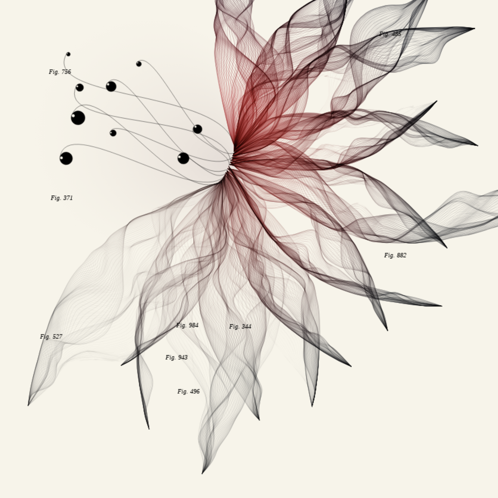
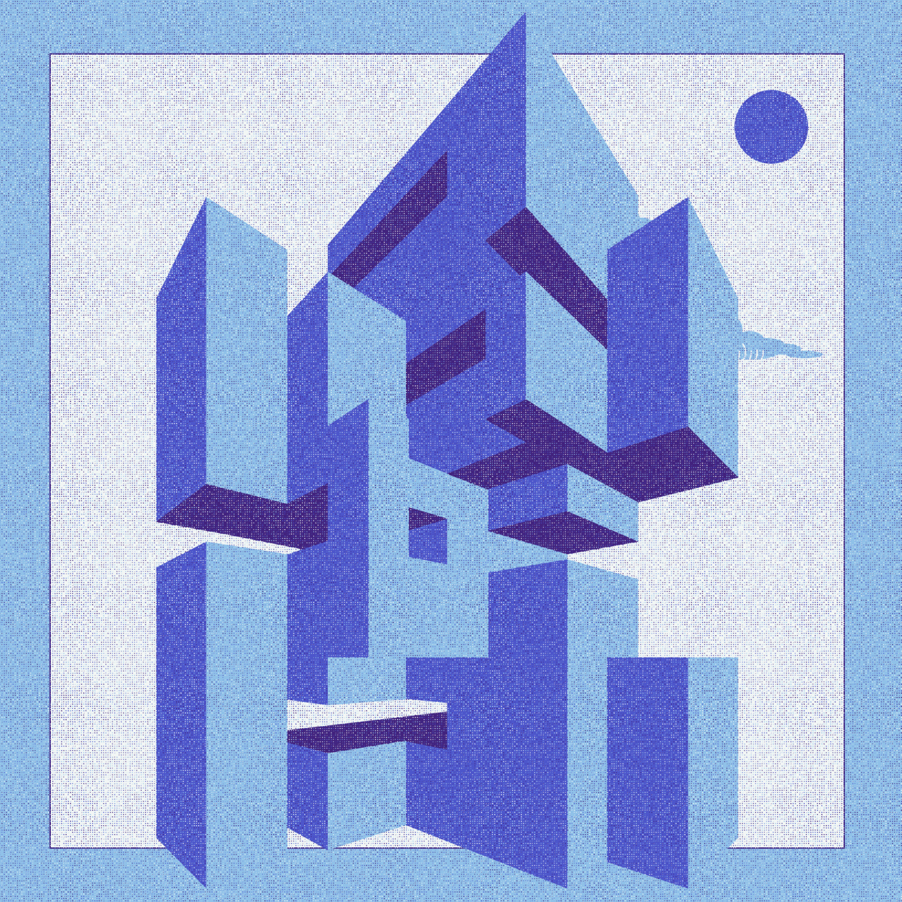

# Creative Coding I

Prof. Dr. Lena Gieseke \| l.gieseke@filmuniversitaet.de  \| Film University Babelsberg KONRAD WOLF
  

# Session 02 - Emergence

## Task 02.01 -  Motivation

Find two p5 sketches that you like from two different sources, e.g., on [p5 examples](https://p5js.org/examples/) (btw., you can also directly access the examples in the online editor under `File -> Examples`), [OpenProcessing](https://www.openprocessing.org/), [Generative Design](http://www.generative-gestaltung.de/2/). 
  
Submit the links and a brief explanation for each why you like the sketch.

## Submissions

### Galina Angelova

The following examples are two *p5 sketches* that I find very inspiring. 
The first one, titled [*Herbarium*](https://www.fxhash.xyz/generative/13480), is from [Aleksandra Jovanić](http://aleksandrajovanic.com/), artist and programmer, who I absolutely admire. In the majority of her work, she is utilizing math in order to achieve fascinating visual forms. Moreover, she always has a nice background story to each piece she creates. This one here, as mentioned by the author, is inspired by two female pioneers in the field of science. [Maria Sibylla Merian](https://en.wikipedia.org/wiki/Maria_Sibylla_Merian), a pioneer in the scientific illustration, and [Anna Atkins](https://en.wikipedia.org/wiki/Anna_Atkins), considered to be the first person to publish a book illustrated with photographic images (botanical cyanotypes).

The second piece is titled [*BRUTALISM*](https://www.fxhash.xyz/generative/22522) and is an example of illustrating with code, which I am very passionate about. Moreover, I am usually weirdly inspired by Brutalist architecture. I find something very appealing in the simple geometric shapes and the unpainted concrete.

</img> </img>

### Anna Ferro

[Link_01](http://www.generative-gestaltung.de/2/sketches/?01_P/P_2_2_5_02)

I like that it gives the user the possibility to draw but it the meantime it would also draw on its own. It felt like a speed game between me and the visual.

[Link_02](http://www.generative-gestaltung.de/2/sketches/?02_M/M_1_5_02)

I find the visual aesthetically pleasing and captivating. I also thought it would have been nice to have the concentration of the lines mapped onto the mouse position. 

### Emilio Gaertner

### Moritz Huson

* "RANDOM GROWTH" (https://editor.p5js.org/san.vanderlinden/sketches/WKUfthG7W): This sketch is a simulation of mycelium growth. I like the simplicity of the code and find this to be a good example of emergence. Watching the animation unfold I feel as if I'm watching mycelium decomposing my screen. It's eerie. 
* "Growing Waves Hover" (https://editor.p5js.org/matheusgwagner99/sketches/S8yevlcBH): I find the waves mesmerizing to watch and like the interactivity. The way the yellow circles appear small and blurry, grow clear as they peak in size, then blur, shrink and disappear, is aesthetically pleasing to me. 

### Lind Maas

https://openprocessing.org/sketch/1961876 by user newyellow. I like this sketch very much because of the analog look. By generating the outlines again and again, a variability is created that can also be found in real clouds. I also think it's very cool that you can watch the creation of the picture, it feels a bit like magic! 

https://openprocessing.org/sketch/1297448 by user aeon. I find this sketch extremely fascinating as it is reminiscent of the organic growth of roots. The creative process is not entirely clear, how the lines grow seems to be random. The size of the line network branching with a mouse click also seems to be random. However, underlying rules can also be recognized: The lines grow from the x/y coordinate of the mouse in one direction, with many (but not all) running at a 45 degree angle. There also seems to be a preference for vertical lines. 

### Marek Plichta

**Sketch 1**

I found this one after I did my 10 Print Pattern. I am saying this because it seems related to my sketch
https://openprocessing.org/sketch/1956769
I like it because of the smooth animated fade ins and outs and of course because it creates a nice optical illusion of a hexagon based grid with fractions of circles (or arcs). On top of that the multilayered circles flow into each other and when the the different circles colors are close enough to each other they visually override the hexagon pattern and form a wave pattern. I really like this back and forth of weight in the elements    

**Sketch 2**

https://p5js.org/examples/motion-morph.html
I like this one because it is visually pleasing to look at but not very difficult to understand conceptually. After watching it twice or three times my brain was bored. It is just an example after all and not meant to be watched for long. But although it didn't look complex I had no idea how to tackle this in code before I looked at the code. I find it interesting how sometimes things seem tremendous complex but are actually easy in code and vice versa, like in this case.  

### Maximilian Rueth

[Crazy Build-up Pattern](https://openprocessing.org/sketch/2001381)
I really like the building up effect of the pattern and the aesthetic of the final artwork. 
Apparently the artist also used particles, so i would be interested in how to use them.

[Dynamic Pattern](http://www.generative-gestaltung.de/2/sketches/?01_P/P_2_3_4_01)
I like the dynamic of the whole thing. The faster you go with your mouse the larger the elements get. Through that you can create a crazy visuals really fast!

### Joel Schaefer

[Link1:](https://p5js.org/examples/simulate-particles.html)
Classic Plexus Style Particle System, i just like the aesthetics of points flowing through space and connecting each other with a line when close enough. 

[Link2:](https://github.com/stihilus/Generated-p5js-Portraits/tree/master)
Really Interesting Patterns emerging from Image Data / Structure. 

### Adam Streicher

[Link1:](http://www.generative-gestaltung.de/2/sketches/?01_P/P_2_1_2_02)
I like how the mouse position transfroms the individual elements. It makes me play around with the mouse. 

[Link2:](http://www.generative-gestaltung.de/2/sketches/?01_P/P_2_2_5_01)
Here I linke how the randomly placed circles get smaller and smaller to avoid intersection with other circles. 

