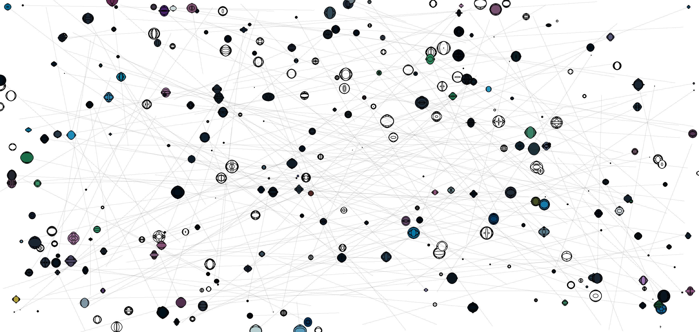

# Creative Coding I

Prof. Dr. Lena Gieseke \| l.gieseke@filmuniversitaet.de  \| Film University Babelsberg KONRAD WOLF
  

# Session 02 - Emergence

## Task 02.03 - The 10 PRINT pattern

1. Write a p5 sketch that generates a pattern with a similar logic as the 10 PRINT example. Your pattern should follow an element-by-element and row-by-row iterative creation process. If you are a beginner, you can use [the code from the slides](https://editor.p5js.org/legie/sketches/nrfQTzxMI) as basis (fully understand it first though!). The overall goal is to create a visual pleasing or interesting pattern. 
2. Make the pattern interactive by mapping at least two changeable visual characteristics to the mouse and / or keys and / or any type of user interaction you want. Look at p5's references for the different interaction possibilities.

You can find information about p5's basic interaction capabilities in [*Creative Coding for Beginners Course: Program Flow*](https://ctechfilmuniversity.github.io/lecture_ss23_creative_coding_for_beginners/02_scripts/ccfb_ss23_04_flow_script.html#interaction).

If you have further ideas about how to design the pattern and interactions but do not manage to implement them, also submit your ideas in text or image form.

## Submissions

### Galina Angelova

</img> </img>

</img> </img>

#### Some other experiments

</img> </img>

### Anna Ferro

[Sketch File](../../04_submissions/ferro/02/cc1_ws2324_02_04_ferro.js)

[Online View](https://editor.p5js.org/tanz.ania/full/LpSVn1VtC)

[Image_01](../../04_submissions/ferro/02/cc1_ws2324_02_04_ferro_01.png)

[Image_02](../../04_submissions/ferro/02/cc1_ws2324_02_04_ferro_02.png)

### Emilio Gaertner

### Moritz Huson

* Images:  

### Lind Maas

Link https://editor.p5js.org/Linmaas/full/FSR8qdRFo
---

* Images:    

### Marek Plichta

## Concept

## Static

## Video
https://www.instagram.com/p/CzCWYL-sqNZ/

## Interactive 

### Maximilian Rueth

[Pattern File](../../04_submissions/rueth/02/cc1_ws2324_02_04_rueth.js)

*Images:        

### Joel Schaefer

[-> Sketch File](../../04_submissions/schaefer/02/main/sketch.js)

#### 1.

#### 2.

### Adam Streicher

[-> Emergence Sketch File](../../04_submissions/streicher/02/cc1_ws2324_02_03_streicher.js)

