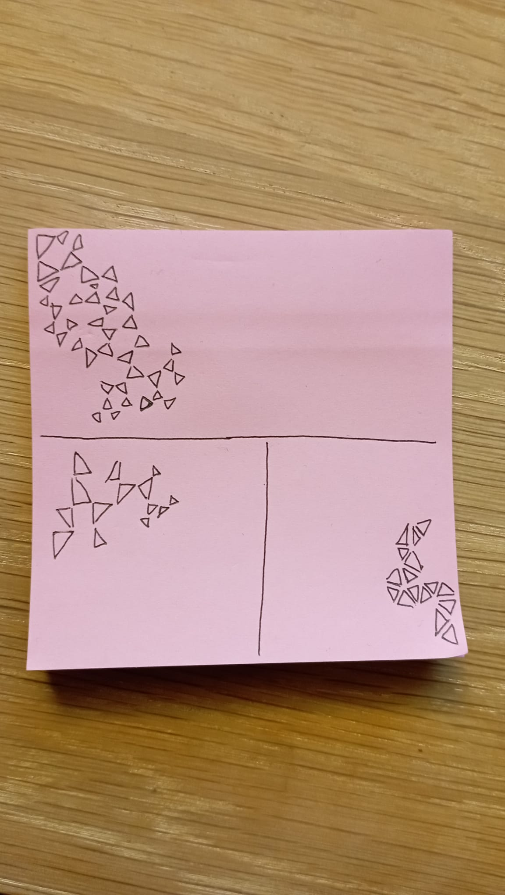
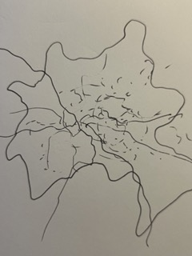
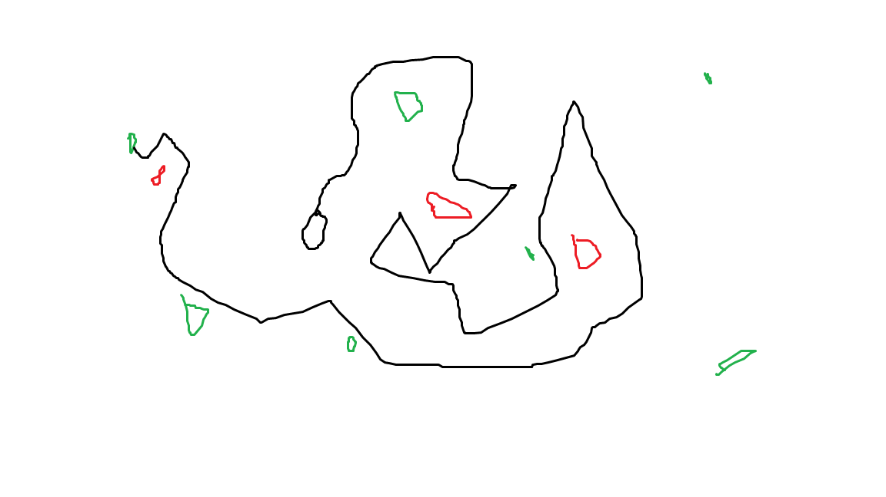

# Creative Coding I

Prof. Dr. Lena Gieseke \| l.gieseke@filmuniversitaet.de  \| Film University Babelsberg KONRAD WOLF
  

# Session 02 - Emergence

## Emergence

### Task 02.04 - Conceptualization

Come up with an idea for a creation that includes emergent behavior, where the sum of its parts creates the overall piece. This can be a visual concept, e.g., once more a repetitive visual pattern, but doesn't have to. You can go beyond visual pattern and you could also consider music, language, performance, social scenarios, etc..

Submit a short description and ideally, if possible, a preview image (this can be drawn by hand).

## Submissions

### Galina Angelova

This is still a very rough concept that I have, so I cannot combine all the ideas and details, in order for them to fully make sense.

A collaborative online game, based on the traditional jigsaw puzzle assembling. However, initially no visuals are shown on the single pieces, therefore they have to be matched only based on their shape - if it is fitting or not. Moreover, there is no predefined picture to be assembled, but players start with some grid that have to be filled, and an initial random *one piece per person*. Following pieces emerge. Some ideas how to emerge are, for instance, kind of randomly generated, based on an algorithm generation, depending on some rules, etc.

Further, only after a certain area of the grid is filled, some visuals (probably pattern-like) start to emerge. The main idea is that the final piece is only fully visible and considered done (cannot change anymore), when the whole initial grid has been filled.

In a nutshell, it should be based on jigsaw puzzles, collaborative problem solving, generative algorithms, math and patterns.

### Anna Ferro

* Starting with a triangle, every corner is the beginning of another triangle. 
* Starting with a right triangle, every corner is the beginning of another right trinagle.
* Starting with a triangle, another one is drawn with a side parallel to one of the previous triangle.

### Emilio Gaertner

### Moritz Huson

Come up with an idea for a creation that includes emergent behavior, where the sum of its parts creates the overall piece. This can be a visual concept, e.g., once more a repetitive visual pattern, but doesn't have to. You can go beyond visual pattern and you could also consider music, language, performance, social scenarios, etc..

Submit a short description and ideally, if possible, a preview image (this can be drawn by hand).

* A simple apreggio is played through multiple times, lapping over the individual plays at different points in time, creating harmonies that go beyond any individual apreggio. Toward the end of the recording it becomes difficult to hear any individual apreggio, as so many are playing in parallel. Instead, an ominous drone rings, which sounds more like one entity than many individual ones. 
* Sketch, coded and recored with SuperCollider: <audio src="../../04_submissions/huson/02/cc1_ws2324_02_05_huson.wav" controls title="Title"></audio> 

### Lind Maas

The arteries of Berlin
  
The movement data of the individual is stored by GPS via the cell phone over the course of a day. These are plotted on a blank map together with the data of as many users as possible. The chaos of the individual routes results in traffic arteries that map the city's roads and public transport. An image of the city results from the movement pattern of the individual. Important hotspots of the city get highlighted in midst of the chaos.

### Marek Plichta

**Copy Cats Dance Performance:**

9 groups of 20 dancers per group are evenly arranged in a large circle (the diameter of a football field). They dance towards a pole in the middle. They dance only accoring to these rules

1. if you are dancer #1, dance towards the pole while respecting the rules below
2. if you are any other dancer just respect the rules below
3. you are assigned two random other dancers, one is `friend`, one is `foe`.
4. keep a max distance to `foe`, but keep as close distance as possible to `friend`. No other dancer can be closer to your `friend` than you
5. Never stay in the same dance position twice in a row (for more than 1 sec)

While Dancing:
Keep improvising dance moves and:
1. Copy the height of your hip of your `friend`
2. Copy the amount of extremities touching the ground of your `foe`
3. Increase the speed of your movements when the distance to the group closest to you is closer to the pole than your group
4. Increase stiff and jittery movements while you broke any rule above for more than 1 sec

### Maximilian Rueth

In an article that I read a long time ago, I learnt that researchers once used a slime mold on a model of Tokyo to simulate the effciency of the traffic network of the city. By letting the mold grow between simulated important points of the city, the researchers were able to identify the most efficent, fastest and shortest routes for the traffic. 

I think that using this principle with dots and trying to imitate the behavior of the mold with code could result in a nice visual concept.

### Joel Schaefer

A User entering a website. The IP is read and passed to the javascript. The IP is represented as set of numbers. These build the DNA for a entity that gets spawned shortly after user entered website. The visual appeareance (size, strokeWeight, Colors) get their value from the DNA (so from the ip), same goes for attributes that determine the behaviour of the entity (Speed, Agility, Life Expectancy). User can give it a name and watch it "grow" / develop through navigating through the environment and gathering food. It paints a path by doing so which creates final, individual pattern. The longer it lives, the more complex the pattern will be. So the complexity of the final pattern is partly determined by the users ip adress with which he/she is entering the website.  

- Food = Green
- Danger = Red
- Entity = Black

### Adam Streicher

A line that skribbles in random directions while not crossing over existing lines. On mouse click the line slplits into two and whenever a line has nowhere left to go it stops. These lines could function as a seed for populating the canvas with e.g. geometrical elements.

