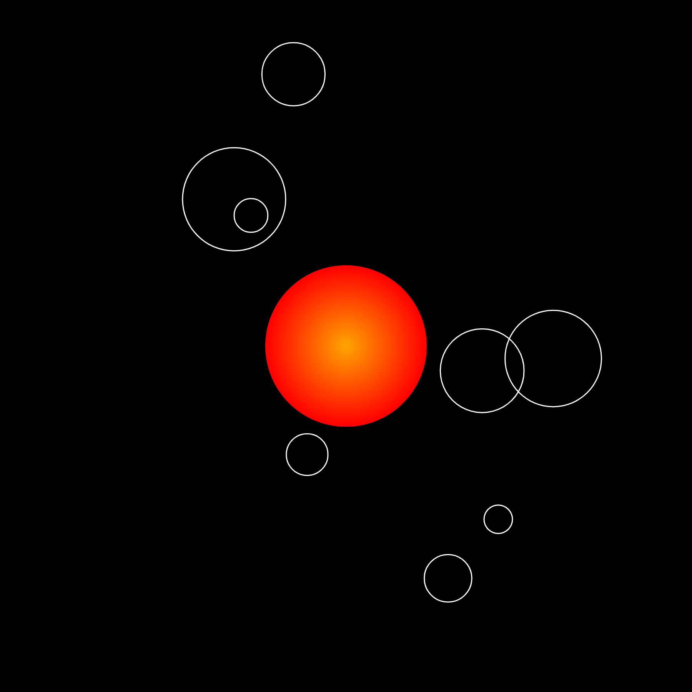
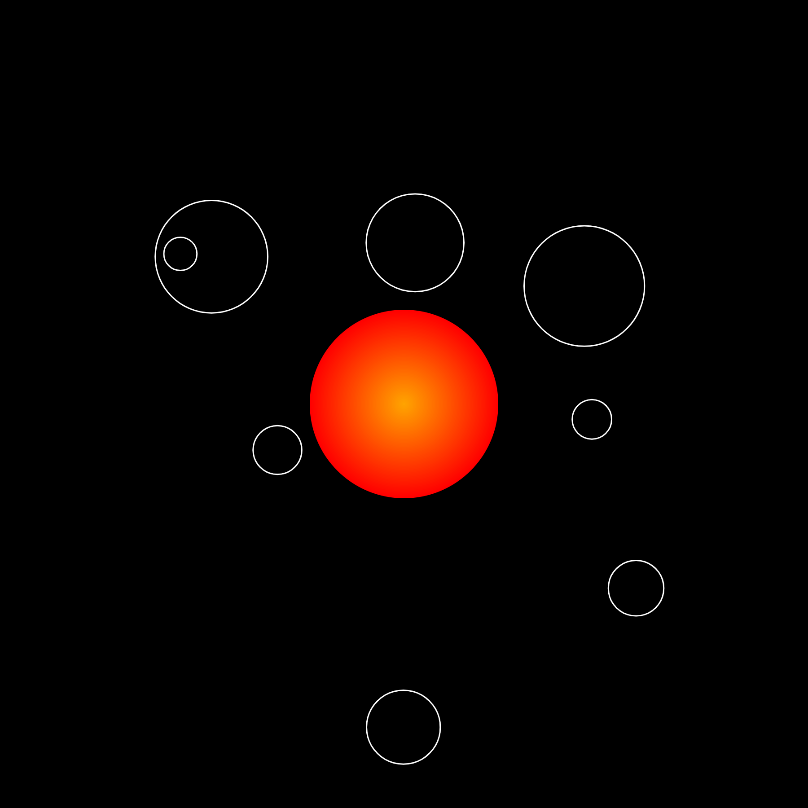

# Creative Coding I

Prof. Dr. Lena Gieseke \| l.gieseke@filmuniversitaet.de  \| Film University Babelsberg KONRAD WOLF
  

# Session 03 - Instructions

## Task 03.01 - *Coding*

> Circles!
  

## Submissions

### Galina Angelova

In the `./src/circle` folder, there is a small mystery for a start. The instructions are very simple - just open the `circle.html` file in your local browser and start *hovering* with the mouse on the canvas. Your goal is to find the hidden circle.

If you do this and are further interested in discovering the hidden easter egg, you have to find out the *instruction* for its appearance on your own... what could this *instruction* be, having in mind the **b**irds topic of my assignment...

Of course, you can also simply see the <i>instructions</i> and results in the hidden section below.

The special <i>instruction</i> for the easter egg is, of course, pressing key <b>B</b>! 🐤 As a result, your circle will transform into a bird's head! If you want to do it again, you can either refresh your browser with the reload button, or click key <b>R</b> to refresh.

</img> </img>

</img>

### Anna Ferro

[p5_webEditor](https://editor.p5js.org/tanz.ania/full/yMUkh6mqG)
  

  

### Emilio Gaertner

### Moritz Huson

### Lind Maas

sketch:  https://editor.p5js.org/Linmaas/full/O4ey13Ngm  
code: https://editor.p5js.org/Linmaas/sketches/O4ey13Ngm  

### Marek Plichta

* preview images missing

### Maximilian Rueth

The approach here was a bit experimental. I really wanted to work with rotating elements in this task, simply because I haven't done this before. I let 8 circles rotate around the center of the canvas and thought they looked like a small solar system. I added a circle with a gradient as the sun in the middle of the canvas and removed the color of the rotating circles and thought that it now looks like an atom. So it's up to you to decide what it is!

sketch: https://editor.p5js.org/mxrueth/full/3vwlPP9I7

### Joel Schaefer

### Adam Streicher

