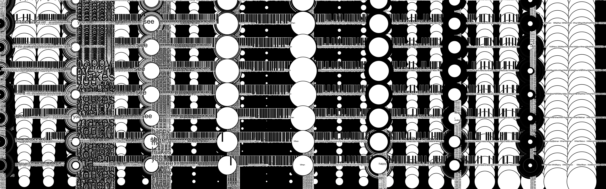
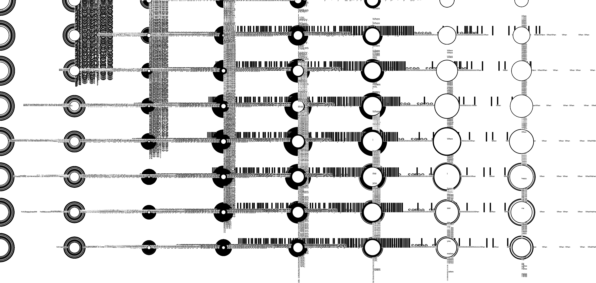

# Creative Coding I

Prof. Dr. Lena Gieseke \| l.gieseke@filmuniversitaet.de  \| Film University Babelsberg KONRAD WOLF
  

# Session 03 - Instructions

## Task 03.02 - *Coding*

> When I see you, it makes me happy.

## Submissions

### Galina Angelova

I wanted to create a simple css illustration of a seagull, because the bird family *Laridae*, to which gulls (or seagulls) belong, is one of my favorite bird families, and in general, I love birds! 

If you want to bother the gull on your own, you can open the `seagull-fren.html` file in the `./src/seagull-fren` folder, and hover over its head. It is not used to many visitors, so don't mind the surprise. However, if you don't feel like it, here are some visuals.

</img>

### Anna Ferro

[p5_webEditor](https://editor.p5js.org/tanz.ania/full/jQhik6_-O)
  

  

### Emilio Gaertner

### Moritz Huson

### Lind Maas

sketch: https://editor.p5js.org/Linmaas/full/0X6k_1Wt8
code: https://editor.p5js.org/Linmaas/sketches/0X6k_1Wt8

### Marek Plichta

* preview images missing

### Maximilian Rueth

#### Laser-Pointer Cat

Since I'm a huge cat lover, I thought it would be fun to play with cats through code! I wanted to create a situation where you play with your cat by using a small laser pointer which can be super funny. It was really interesting to figure out how to implement an image in p5js and make the rotation follow the cursor.

sketch: https://editor.p5js.org/mxrueth/full/ALUTMT1Bx

### Joel Schaefer

 
 
 

### Adam Streicher

