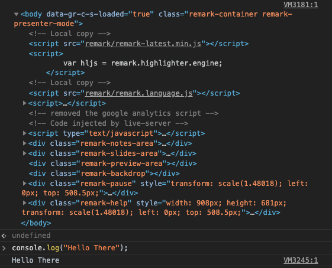
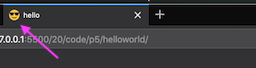

# Creative Coding I: Design & Communication

Prof. Dr. Lena Gieseke \| l.gieseke@filmuniversitaet.de \| Film University Babelsberg KONRAD WOLF

---

# Script 02: Setup

* [Creative Coding I: Design \& Communication](#creative-coding-i-design--communication)
* [Script 02: Setup](#script-02-setup)
    * [Markdown](#markdown)
    * [Development Environment](#development-environment)
        * [Editor](#editor)
        * [Visual Studio Code](#visual-studio-code)
            * [Workspace](#workspace)
            * [Markdown](#markdown-1)
            * [Summary](#summary)
        * [Terminal / Console](#terminal--console)
        * [Basic Commands](#basic-commands)
            * [Navigation](#navigation)
            * [Command Execution](#command-execution)
        * [Visual Studio Code](#visual-studio-code-1)
        * [Git and GitHub](#git-and-github)
        * [Summary](#summary-1)
    * [JavaScript](#javascript)
        * [Webservers](#webservers)
    * [p5.js - Local Setup](#p5js---local-setup)
        * [Step 1 - Getting the Library Files](#step-1---getting-the-library-files)
            * [Local Library Files](#local-library-files)
            * [Online Library Files](#online-library-files)
            * [Minified Library Files](#minified-library-files)
        * [Step 2 - The Sketch File](#step-2---the-sketch-file)
        * [Step 3 - Running a Local Server](#step-3---running-a-local-server)
            * [VSCode](#vscode)
            * [Workflow](#workflow)
            * [Static vs. Interactive Mode](#static-vs-interactive-mode)
        * [Step 4 - Browser](#step-4---browser)
            * [Browser Console](#browser-console)
            * [Print Outs](#print-outs)
            * [Favicons](#favicons)
        * [Paths to Resources](#paths-to-resources)
        * [CSS](#css)
    * [Node.js](#nodejs)
        * [Installation With a Version Manager](#installation-with-a-version-manager)
            * [Windows](#windows)
            * [Unix \& Mac](#unix--mac)
        * [Installing Node with Nvm](#installing-node-with-nvm)
        * [Running JavaScript Code](#running-javascript-code)
        * [npm](#npm)
            * [Changing npm’s Default Directory](#changing-npms-default-directory)
    * [Environment Setup](#environment-setup)
        * [Initializing the Node Environment For a Project](#initializing-the-node-environment-for-a-project)
        * [Package Installations](#package-installations)
            * [Local](#local)
            * [Global](#global)
        * [Built-in Node.js Modules](#built-in-nodejs-modules)

## Markdown

Lecture scripts and assignments are written in [Markdown](https://en.wikipedia.org/wiki/Markdown) (.md). This setup let's you edit the lecture scripts in an editor, e.g. for making notes. You also have to submit markdown files in the assignments.

* Markdown is a popular markup language that converts text to html.
* Markdown allows you to use an easy-to-read, easy-to-write plain text format, then converts it to structurally valid XHTML (or HTML).
* Github can render markdown. Be aware though that there are different markdown parser ("converter") and what you can do e.g. with a Visual Studio Code plugin for setting and displaying formulas might not be the same as what GitHub can display.

  
[[wiki]](https://en.wikipedia.org/wiki/Markdown)

###### Resources

* [Markdown Guide](https://www.markdownguide.org/) 
* [Mastering Markdown](https://guides.github.com/features/mastering-markdown/)

## Development Environment

### Editor

You must have an editor with that you feel comfortable with for writing your code. There are many, many options.


[[xkcd]](https://xkcd.com/378/)

Editors and IDEs ([Integrated Development Environment](https://en.wikipedia.org/wiki/Integrated_development_environment)) differ mainly on the spectrum of how general-purpose to specialized (e.g. for one specific language) they are, how customizable and whether they are freeware or not. Some popular choices are:

* Visual Studio Code
* JetBrains Editors
* Sublime
* Atom
* Notepad++
* Netbeans
* Visual Studio
* Eclipse
* XCode
* Emacs
* Vim

<!-- 
???
Who uses what? Who wants to use VSCode?

Session to set it up?
-->

### Visual Studio Code

My personal recommendation is [Visual Studio Code](https://code.visualstudio.com/) (in short VSCode). I like it because I can write different types of languages with it while still having many language specific features (e.g. through *extensions*). Also, I am totally addicted to customizing my working environments to exactly the way I like it and VSCode let's me do so in a convenient way (also mainly enabled through *extensions*). In summary, it is:

* Free
* Multi-purpose
* Extensively adjustable

*On a side note: For C++ I so far have only used XCode and Visual Studio (not the same to "Visual Studio Code"!) and I don't know yet how well you can setup Visual Studio Code for C++.*

###### Resources

* [Getting started with Visual Studio Code](https://code.visualstudio.com/docs/introvideos/basics) 
* [Introductory Videos](https://code.visualstudio.com/docs/getstarted/introvideos)
* [How to use Visual Studio Code](https://flaviocopes.com/vscode/)

#### Workspace

VSCodes workspaces might be be confusing in the beginning.

You organize your work in VSCode with workspaces. Think of a workspace as a project. Under the hood it is nothing more than telling VSCode which folders to display together in your VSCode Explorer (the sidebar to the left). Also, you can create individual settings for each workspace (yay, colors! 😊). You can for example have a `cc1` workspace and add all files and folders that should be accessible through VSCodes explorer.

I am giving you an example workspace setup, including GitHub, in [Script 3: GitHub -  Working With the Class Repository](cc1_ws2223_03_github_script.md)

#### Markdown

For Visual Studio Code I recommend the extension [Markdown All in One](https://marketplace.visualstudio.com/items?itemName=yzhang.markdown-all-in-one).

Open the .md file in Visual Studio Code and edit it up to your liking. VSCode gives you the option of an interactive preview of the html rendering of the file:

* Open the command palette with `Shift + Option + p` or under `View -> Command Palette...`
* Start typing `Markdown: Open Preview` and select that command (I also have a hotkey for that because I use it so often).

###### Resources

* [Markdown and Visual Studio Code](https://code.visualstudio.com/Docs/languages/markdown)


##### GitHub

VSCode comes with all basic functionality to work with Git and GitHub integrated and there are also various plugins for it. For example, I am using the plugins [GitHistory](https://marketplace.visualstudio.com/items?itemName=donjayamanne.githistory) and [Markdown Preview GitHub Styling](https://marketplace.visualstudio.com/items?itemName=bierner.markdown-preview-github-styles) next to the functionality VSCode comes with. But I am sure that there are plenty of other great plugins, I simply do not know about.

Once again, please refer to [Script 3: GitHub -  Working With the Class Repository](cc1_ws2223_03_github_script.md) for in depth explanations.

###### Resources

* [Working with GitHub in VS Code](https://code.visualstudio.com/docs/editor/github)


#### Summary

When working with VSCode, I recommend that you know

* how to setup and work with a [workspace](https://stackoverflow.com/questions/44629890/what-is-a-workspace-in-visual-studio-code#:~:text=A%20Visual%20Studio%20Code%20workspace,and%20preferences%20of%20a%20workspace.),
* how to adjust [preferences](https://code.visualstudio.com/docs/getstarted/settings),
* how to install [extensions](https://code.visualstudio.com/docs/editor/extension-gallery), and
* how to work with the [command palette](https://code.visualstudio.com/docs/getstarted/userinterface#:~:text=Command%20Palette%23&text=The%20most%20important%20key%20combination,provides%20access%20to%20many%20commands.).

Optionally, depending on your workflow, know:

* how to work with [GitHub](https://code.visualstudio.com/docs/editor/github), and
* using the integrated [terminal](https://code.visualstudio.com/docs/editor/integrated-terminal) (see the following section)
 
within VSCode.

---

### Terminal / Console

(in the following whenever I say *terminal* substitute that word with *console* if on Windows)

We will make use of the terminal at some point!  
  
Start to get familiar with it as soon as possible...   

The terminal is an interface in which you can navigate and access files on your computer and execute text-based commands. There are many programs and functionalities which are only available for the terminal. The terminal has the advantage that you do not need to program a graphical interface for your functionality and that you can use terminal commands as source code and build programs from combined terminal commands.

In general, if you use a computer regularly, I recommend to get familiar with at least the most basic terminal commands. As motivation also keep in mind that when you use the Terminal you look really techy and you can impress friends and family!

* MacOs 
    * Uses a version Unix under the hood, hence all "Mac commands" are actually "Unix commands"
    * I use [iTerm](https://www.iterm2.com/index.html) as command line tool with the [Oh My ZSH](https://ohmyz.sh/) framework and zsh as shell and [powerlevel9k](https://github.com/bhilburn/powerlevel9k) as theme. This gives me some advanced features (remember, I like customization...🙄). But don't bother with adjusting the terminal right now, the regular Terminal is just fine.
* Windows
    *  If you want to get more serious about using the command line in Windows, consider the [PowerShell](https://docs.microsoft.com/en-us/powershell/).

### Basic Commands

At the most basic level, you must be familiar with **navigating** your files and **executing** commands with the terminal.

Let me say it again because it is important:

> You **must** be familiar with **navigating** your files and **executing** commands with the terminal.

(I was considering all caps here for emphasis. But then again, I really dislike using capitalization and screaming at someone in typography - so please understand the importance of this as is...)

#### Navigation

The first thing, you need to understand is:

At all times *you are somewhere* in your folder structure with the terminal.  

The line at or above the curser indicates where you are currently. If you execute commands, they are executed at that folder destination.

##### Change Location

Change current folder
```
cd foldername
```

Sub-folder names must be separated by a backslash in Windows and a slash for a Mac.
```
cd Windows\System32
```
```
cd Documents/filmuni
```

You use `..` to go up one folder
```
cd ..
```

##### Know Where You Are

Unix
```
pwd
```

Windows
```
cd (without any parameters)
```
Example iTerm on Mac:  


#### Command Execution

Next the core terminal commands, such as `cd`, you can use *command line tools* such as `ffmpeg` or `git`. These *command line tools* often accept arguments to further specify their functionality. How to use these arguments can be confusing as they really depend on the specific command/tool and how the developers set it up. If in doubt, check the documentation of the command.

There are several formats for specifying arguments and it depends on the tool and the arguments. Sometimes you simply list arguments separated by a space (with more than one argument the right order of the commands is crucial) but usually you indicate the type of argument with a hyphen plus some characters. A hyphen plus some characters are also used for setting optional specifications for a command.

For example to convert a .tif file to a .jpg file:

`ffmpeg -y -i test.tif out.jpg`

* `ffmpeg`: the name of the command (must be [installed](https://ffmpeg.org/) though)
* `-y`: is an optional setting, which means that you will overwrite the output file if it exists without the system asking again.
* `-i test.tif`: the `-i` stands for input and takes as following string the input file
* `out.jpg`: is the output file and must be the last argument

Often you can give the type of argument for the command in two formats, a short version and an equivalent long one:

* single-letter options are listed with a single hyphen such as `-r`
* word-based options are listed with a a double hyphen such as `--reverse`

Usually command line tools are documented, which you can access with the option `-h` or `--help`:

`ffmpeg -h` or `ffmpeg --help`

Once again, please keep in mind that it is usually highly relevant *where you are* navigated with your terminal. Where ever you are that is where an command is executed.

##### Example Mac


 [[source]](https://s3-us-west-2.amazonaws.com/s.cdpn.io/80625/commands-03.jpg)

Unfortunately for Windows commands slightly differ. For Windows have a look at this basic [introduction](https://iftakharhasan.wordpress.com/2016/07/04/basic-windows-console-commands/).

### Visual Studio Code

VSCode integrates a terminal as well. You can access it under `Terminal -> New Terminal`. All command line commands I am mentioning from now on, you could also execute in the VSCode Terminal.

### Git and GitHub

<!-- 
???
Who can explain Git and GitHub?
-->

For this class you will need to know

* how to regularly get the latest version of the course materials on [GitHub](https://github.com/ctechfilmuniversity/lecture_ws2223_creative_coding_1) (there might be updates to already uploaded files), and
* how to upload your homework.

In the very least, you will need a workflow for these two scenarios. Which means that you should have a basic understanding of git and GitHub and you should know

* the general idea of version control systems,
* the difference between git and GitHub,
* what a repo is, and 
* how to get and upload materials from a repo.

This means specifically, you need to be able to

* clone the [`lecture_creative_coding_1`](https://github.com/ctechfilmuniversity/lecture_ws2223_creative_coding_1) repo to your computer,
* know how to `add` and `commit` files to git locally,
* know how to `pull` and `push` files from the online GitHub repo.

How you do this is up to you. If you have a working setup you can stop reading here. If not or if you want further information, please work through [Chapter 2: GitHub](cc1_ws2223_03_github_script.md).


### Summary

* Know how to write Markdown.
* Decide on a development environment.
* Know how to navigate and execute commands with the terminal.
* Know how to get the course material from GitHub and upload your homework.

## JavaScript

For working with JavaScript locally you need:

* a webserver,
* the JavaScript library files you want to use (in our case the `p5` library), and
* `.html`, `.css` and `.js` file(s).

### Webservers

The main job of a web server is to display website content through storing, processing and delivering webpages to users. A web server is a computer with special web server software. This software controls how a user accesses files that the web server hosts. All computers that host websites must have web server software. 

When developing a website, we want to be able to see dynamic content of a webpage the same way the end user would, while still working on it locally without hosting it online. For that we must imitate the behavior of a web server on our computer. This is called a local webserver.  

Luckily, VSCode make this super simple for us. We can just install a suitable extension and that's it. The extension let's us run a webserver locally. For that install the [Live Server](https://github.com/ritwickdey/vscode-live-server) extension. This will add a "Go Live" button to your VSCode interface and opens automatically a live server at the root of your workspace. Please read through the package's documentation for more explanations.

Once you know about node and npm, there are more options to start a local webserver, see [More On Webservers](#more-on-webservers).

[[whatis]](https://whatis.techtarget.com/definition/Web-server) [maketecheasier](https://www.maketecheasier.com/setup-local-web-server-all-platforms/)


## p5.js - Local Setup

[p5.js](https://p5js.org/) is a JavaScript library that integrates a Processing sketch and its functionalities into a webpage. P5 has around 200 easily [understandable commands](https://p5js.org/reference/). There is a [p5.js web editor](https://editor.p5js.org/), which is under active development. To use it you need to create an account at the website.

For creating a basic p5.js project locally you need a webserver, the p5.js library files and a .html, .css and sketch.js file and a browser to display the result.

### Step 1 - Getting the Library Files

You can download the [`p5.js`](https://p5js.org/download/) library file on the p5 website.

I used to work with the following folder structure for all p5 projects:

```js
- p5
    - lib
        - p5.js
    - proj1
        - index.html
        - sketch.js
    - proj2
        - index.html
        - sketch.js
    - ...
```

This has the disadvantage that it is not clear which project uses which libraries. The alternative is to work as follows:

```js
- p5
    - proj1
        - lib
            - p5.js
        - index.html
        - sketch.js
    - proj2
        - lib
            - p5.js
        - index.html
        - sketch.js
    - ...
```

Ultimately this is up to personal requirements and taste. By now I personally prefer the second folder layout.


*Follow along:* Create a `p5` folder and inside that folder, the folders `lib` and `helloworld`. Download and save the [p5.js](https://p5js.org/download/) library file in the `lib` folder.

#### Local Library Files

*Follow along:* Inside the `helloworld` folder create an empty `index.html` file.

In its most basic setup, in order to work with the p5 library you have to have a basic `html` document structure and a line that points to the p5 library files with the `script` html tag:

```html
<!DOCTYPE html>
<html>
    <head>
        <meta charset="UTF-8">
        <title>Title of the document</title>
    </head>

    <body>
        // Html Elements...
        
        <script src="../lib/p5.js"></script>
        <script src="sketch.js"></script>
    </body>

</html>
```

<!-- You could also include the sketch file in the html header. -->

You can link to the library files with a relative path to any location of your liking.

*On a Side Note:* It is best practice to load JavaScript script files after the html content in the body. The script files might take longer to load and if you put them below the html, the html elements will be displayed first and the user sees already a website even if the scripts are still loading. In my examples I might forget about this order once in a while though, and might have the scripts in the header. Also "on the internet" you will see the lading of the script files in the header a lot.


#### Online Library Files

You can also point the script path to an online repository. If you chose an online file, obviously you have to be online when working on the project.

For an online version of the library you can use the an absolute path under  

https://cdnjs.com/libraries/p5.js  

with  

```html
<script src="https://cdnjs.cloudflare.com/ajax/libs/p5.js/1.1.9/p5.js"></script>
```

For online library access could also use the [codepen](https://codepen.io/p5js/pen/wreBKy) template project file, which is not using the latest version of the library though.

#### Minified Library Files

For javascript libraries you usually also have a minified version `.min.js`. For p5 it is `p5.min.js`. It has absolutely the same functionality as `p5.js` but it is minified, meaning it is made smaller. Minified versions have all unnecessary characters removed in order to reduce the file size and make it faster to load. It is recommended to use this compressed version in a production environment.

If you are still developing your site, work with the `p5.js` as you can read the source code when necessary.

### Step 2 - The Sketch File

*Follow along:* Inside the `helloworld` folder create an empty `sketch.js` file.

Traditionally p5 work files are called `sketch.js` but you can also name it any way you like. You also have to include this file in your `index.html` **after** loading the library as you are using commands from the p5.js library in the sketch.js.

```html
<!DOCTYPE html>
<html>
    <head>
        <meta charset="UTF-8">
        <title>Title of the document</title>
    </head>

    <body>
        <script src="../lib/p5.js"></script>
        <script src="sketch.js"></script>
    </body>

</html>
```

A basic `sketch.js` could look like

```js
//called once upon loading the site
function setup()
{
    createCanvas(windowWidth, windowHeight);
    background(200);
}

//called by default 60 times per second
function draw()
{
    //Add the drawing of a frame here
}
```

This creates a canvas of the size of the innerWidth browser property (system variables from p5) with a gray background.

I have a template folder with those two files in my p5 folder in order to copy those file when starting a new project.

### Step 3 - Running a Local Server

<!-- #### Terminal

Now you can start the `live-server`, with the terminal navigated to the `p5` folder. This will open a browser window with the root as the `p5` folder in which you can navigate to you `helloworld` folder. The `index.html` will be automatically loaded in your default browser at port 8080 (some form of address, not that relevant for us at this point). -->

#### VSCode

  
[[vscode-live-server]](https://github.com/ritwickdey/vscode-live-server)

Pushing the button will open a browser, navigated to the folder that is the root of your VSCode workspace. From there navigate to the `helloworld` folder (containing the `index.html`) and your sktech should be displayed automatically.

#### Workflow

With the above setup in place you can now work on the source code, e.g. in the `sketch.js` file, in VSCode, which is much more comfortable. To see your results make sure that your webserver is running and take a look at the open page in the browser (you might need to refresh the page, but usually that is done automatically).

#### Static vs. Interactive Mode

If you would open the `index.html` file with the `Open File...` command in your browser, you will see exactly the same page for this example as there is no complex interaction (the files are static). However this file loading is very different from working with an actual web server (which is ultimately the goal), which enables sending data back and forth between server and browser. This will become apparent in more sophisticated examples. In general, for best results, ensure that your development environment matches your deployment environment. That means doing your development using a web server process rather than simply opening static files.

[[Steck Overflow: Difference between Localhost and opening html file]](https://stackoverflow.com/questions/40204913/difference-between-localhost-and-opening-html-file)


### Step 4 - Browser

For this class I am using the [Firefox Browser](https://www.mozilla.org/en-US/firefox/new/) ([#unfcktheinternet](https://www.mozilla.org/en-US/firefox/unfck/)). However, [Google's Chrome](https://www.google.com/chrome/) is as of now the most powerful and reliable browser in my opinion but I do not agree with Google's business model and try to avoid using their products. However, at some point I might use Chrome and I recommend to have it on your machine just in case. Also, feel free to use any browser you like, but commands and behaviors are different in different browsers. If you want to make your life easier, use Firefox as well for this class.

Generating content, which runs reliably across all standard browsers is a complicated tasks. We are not getting into that in this class. This class aims at giving you the basics of web development and the goal of prototyping.

#### Browser Console

Remember that the browser is running our JavaScript code. Hence possible error messages are given from the browser. The browser is telling us errors through the browser Console. 

Most browser Consoles are REPL, which stands for Read, Evaluate, Print, and Loop. This means that you can also type in JavaScript directly into the Console, it evaluates your code, prints out the result of your expression, and then loops back to the first step.

The Console is part of the Development Tools and you can access the Development Tools in Firefox by pressing `Command+Option+I` (Mac) or `Control+Shift+I` (Windows, Linux). You can do proper debugging with the Development Tools but for now we are only interested in reading any error messages we might get from the Console.

Usually, I just keep the console open while developing JavaScript.

You can see an example error message in your console when opening the [bug.html](https://javascript.info/article/devtools/bug.html) page.


[[javascript.info]](https://javascript.info/article/devtools/bug.html)


##### Resources

* [Firefox Developer Tools](https://developer.mozilla.org/en-US/docs/Tools)


#### Print Outs

You can print to the Console of the browser with the Console method [`log()`](https://developer.mozilla.org/en-US/docs/Web/API/Console/log). The message may be a single string or it may be any one or more JavaScript objects.



Alternatively you can use [`alert()`](https://developer.mozilla.org/en-US/docs/Web/API/Window/alert), which prints to a newly opened message window.


#### Favicons

Your browser might give you the following error message
> GET http://127.0.0.1:8080/favicon.ico 404 (Not Found)

E.g., Chrome expects a favicon for every webpage. 

A favicon is a small image or collection of small images that are associated with a website or webpage. Favicons are displayed by a web browser next to the title of the website or webpage in the address bar, the browser tab, and the bookmarks bar.



The easiest solution is to put an icon file `favicon.ico` in the p5 folder (or wherever the root of your webpage is, meaning where you start your server), adding this line to the `index.html`:

```html
<link rel="shortcut icon" type="image/x-icon" href="../favicon.ico">
```
You can get icons from the [https://favicon.io/](https://favicon.io/). You can also generate icons from image files with the following line:

```html
<link rel="icon" type="image/png" sizes="32x32" href="/favicon-32x32.png">
```


### Paths to Resources

**🚨 This is important to understand 🚨**

You can link to a resource such as a library or images with *absolute* or *relative* paths.

An absolute path is built starting from the system root, e.g.  

```html
`
```

 or

```bash
/Users/legie/Documents/filmuni/teaching/class/creative_coding_I/ws1819/workspace/code/p5_collection/data/img/kitten.png
```

When pointing to online resources, which are not hosted by you on your webserver you need absolute paths.

However, if it is your own resource locally and maybe belonging to a specific project, you should always use relative paths in relation to your project. How to specify paths is relevant for all assets and library files. Relative path take as reference for example a working directory or a project root. If you are working with a webserver, the location where you start the server will be root for the relative paths, however if you access files from other files, e.g. the `index.html`, your must create a path in relation to that file.

For relative path you need to know the following syntax. For this example, let's say you have the root of a project under  

`/Users/legie/projects/myproject/`  

and have a html file under  

`/Users/legie/projects/myproject/index.html`

Now you want to show an image on your webpage and the question is how do you create a path to that image file? This of course depends also on the location of the image.

```html

```

* The image file is in the same folder as the file containing this line of code.
* E.g. `/Users/legie/projects/myproject/kitten.png`

```html

or

```

* The image file is inside a 'img' same folder as the file containing this line of code.
* `./` means that it is the same folder
* E.g. `/Users/legie/projects/myproject/img/kitten.png`

```html

```

* The image file is inside an 'img' folder one folder higher than the file containing this line of code.
* `../` means to go up one folder
* E.g. `/Users/legie/projects/img/kitten.png`

For my original p5 setup, I used one image folder for all projects as I was using the same images over and over again in different projects:

```js
- p5
    - lib
        - p5.js
        - p5.min.js
        - p5.sound.js
    - img
        - kitten.png
    - proj1
        - index.html
        - sketch.js
    - proj2
        - index.html
        - sketch.js
    - ...
```

Again, please feel free to use your own brain to come up with the best setup for you.

The above means in `sketch.js`, we need to access the image file `kitten.png` with, e.g.:

```js
let img;

function preload()
{
    img = loadImage("../img/kitten.png");
}

function setup()
{
    createCanvas(img.width, img.height);

    noLoop();
}

function draw()
{
    image(img, 0, 0);
}
```

Also, it is important to understand that whenever you use a webserver, the server will be the root of a webpage and you can never go further up than where you started the local webserver.

Let's say you have the projects `/Users/legie/projects/myproject1/` and `/Users/legie/projects/myproject2/`. Now you started the webserver under `/Users/legie/projects/myproject1/`. From there you will not be able to go to `/Users/legie/projects/myproject2/`. You can only access what is under `/Users/legie/projects/myproject1/`.

I recommend that you come up with a file structure once and stick with it.

Please keep in mind that for the actual deployment of a real-world website a slightly different folder and file structure will be needed. This is not relevant as this point but be already aware of it. For a project, which should be deployed online, you will probably have a structure as the following (we will come back to this):

* `page/myproject1/`
* `page/myproject1/server.js`
* `page/myproject1/package.js`
* `page/myproject1/public`
* `page/myproject1/public/index.html`
* `page/myproject1/public/sketch.js`
* `page/myproject1/public/lib/`
* `page/myproject1/public/data` etc.

Then starting locally the [node](https://nodejs.org/en/about/) server under `myproject1` for the correct behavior.


### CSS

Not necessarily needed at this point but for the sake of completeness, let's also add a .css stylesheet to our project. Here, I am also using one common .css for all my projects and only change that for specific needs.

*Follow along*: Inside the `p5` folder create `css` folder and inside of that an empty `style.css` file. Add the following code to it:

```css
html, body
{
    margin: 0;
    padding: 0;
}

canvas
{
    display: block;
}
```

* `margin`: space around elements, outside of any defined borders.
* `padding`: space around an element's content, inside of any defined borders.
* `display`: sets or returns the element's display type.
    * Elements in HTML are mostly `inline` or `block` elements: An inline element has floating content on its left and right side. A block element fills the entire line, and nothing can be displayed on its left or right side.

Now you should have a folder structure related to the following:

```js
- p5
    - lib
        - p5.js
    - css
        - style.css
    - proj1
        - index.html
        - sketch.js
    - proj2
        - index.html
        - sketch.js
    - ...
```


Add to the header of the `index.html`

```html
<link rel="stylesheet" type="text/css" href="../css/style.css">
```


## Node.js


Node.js is a JavaScript framework for writing *custom* servers. This is also called back-end developing, meaning the 'engine' of your application in contrast to its front-end interface and interactions. Node is very powerful and you can build with node scalable, data-intensive and real-time apps.

[Node.js](https://nodejs.org/en/) is open-source, cross-platform, and allows developers to create all kinds of server-side tools and applications in JavaScript. It is intended to be used outside of a browser context (i.e. running directly on a computer or server).

From a web server development perspective Node has a number of benefits:

* Great performance
* Code is written in "plain old JavaScript", which means that less time is spent dealing with "context shift" between languages when you're writing both client-side and server-side code.
* The node package manager (npm) provides access to hundreds of thousands of reusable packages.
* Node.js is portable. It is available on Microsoft Windows, macOS, Linux, Solaris, FreeBSD, OpenBSD, WebOS, and NonStop OS. Furthermore, it is well-supported by many web hosting providers, that often provide specific infrastructure and documentation for hosting Node sites.
* It has a very active third party ecosystem and developer community, with lots of people who are willing to help.

### Installation With a Version Manager

You could install node easily on your computer by installing directly the latest version. However, node.js is constantly developed and changes quite significantly from version to version. Which specific version you are using or is required by a framework matters a lot! Different projects will be using different versions of Node. 

So, instead of potentially installing and uninstalling Node versions for your different projects, you can use the version managing tool, which helps you to manage your node versions for each project.
  
There are [several package manager](https://nodejs.org/en/download/package-manager/) that help you with organizing node versions.
  
I personally like nvm as it is simple and straight-forward to use (it is actually just a bash script).

[NVM](https://github.com/nvm-sh/nvm/blob/master/README.md) allows you to **install different versions** of Node, **and switch** between these versions via the command line depending on the project that you're working on.

Hence, for getting Node.js, we 

1. Install NVM (or any node version manager of your choice)
2. With NVM install node

Once we have installed Node.js, we are just going to work with its latest version. But keep in mind that if you are ever running into version issues with Node.js, you can switch versions with nvm.  


#### Windows

On Windows nvm's installation should be straight-forward. As I am on a Mac, I don't know though. Please ask the Internet, e.g.:

* [How to Install and Use NVM on Windows?](https://www.geeksforgeeks.org/how-to-install-and-use-nvm-on-windows/)
* [NVM for Windows – How to Download and Install Node Version Manager in Windows 10](https://www.freecodecamp.org/news/nvm-for-windows-how-to-download-and-install-node-version-manager-in-windows-10/)
* [Install NodeJS on Windows](https://learn.microsoft.com/en-us/windows/dev-environment/javascript/nodejs-on-windows)

#### Unix & Mac

*On a side note: If you are on a Mac I recommend [Homebrew](https://brew.sh/) as general package manager and an installation of [nvm](https://formulae.brew.sh/formula/nvm) with `'brew install nvm'`* (or for more details [How to Install NVM on Mac with Brew](https://fedingo.com/how-to-install-nvm-on-mac-with-brew/)).

If you are not using a package manager such as Homebrew, you can aks the internet and follow, e.g., this setup:

* [Node Version Manager – nvm Install Guide](https://www.freecodecamp.org/news/node-version-manager-nvm-install-guide/)

Ideally, pick one tutorial or set of instructions and follow it from start to end.

##### Update Your Profile Configuration

For using nvm under unix and mac, you might need to adjust your profile configuration after you have installed nvm.

Execute

```bash
nvm --version
```
or in short

```bash
nvm -v
```

This will print out the current version of your nvm installation or gives an error if you don't have `nvm` installed. If it gives you an error even though you followed all installation steps carefully, most likely you have to **configure your environment variables in your `~/.bash_profile` to point to NVM**. This highly depends on how you installed nvm and node and I can not give you generalized instructions. If you get stuck with this, please do not hesitate to get in touch with me and I help you with the installation.

##### Resources

* [freecodecamp - Node Version Manager – nvm Install Guide](https://www.freecodecamp.org/news/node-version-manager-nvm-install-guide/)


### Installing Node with Nvm

The last step is now to install node with nvm. You can install the latest version of node as follows:

```bash
nvm install node
```

For more information on installing and using specific node.js versions, see [nvm's readme](https://github.com/nvm-sh/nvm/blob/master/README.md#usage).


### Running JavaScript Code

At the point, we are only taking the very first baby steps and are simply running JavaScript code with our node server. For that create the following `node_test.js` file:

```js
// node_test.js

console.log('Hello World');
```

* `console.log()` displays the message on console.

In a terminal (e.g. the one in VSCode) navigate to the folder of that file and execute with node the javascript code by:

```js
node node_test.js
```

This should print `Hello World` in your terminal. You have run JavaScript code with node successfully! 🥳


### npm


With node comes the command-line tool (meaning only being accessible through the terminal) [npm](https://www.npmjs.com/).

npm is the *node package manager* for JavaScript and the world’s largest software registry. It manages and lets lets you install, share, and distribute all kind of node packages of reusable code. The term "package" is used to describe code that's been made publicly available. A package can contain a single file or many files of code. Generally speaking, a package helps you to add some functionality to your application. Npm is for JavaScript libraries, what nvm is for node. 

Check that you have npm up and running, again with printing its version:

```bash
npm --version
```

##### Resources

* [Glover, R. What are JavaScript packages and dependencies? Clever Beagle.](https://cleverbeagle.com/blog/articles/what-are-javascript-packages-and-dependencies)


#### Changing npm’s Default Directory

*The following section does not apply to Windows!*

If you are trying to install a JavaScript package with npm and it is asking you for super-user permissions, you might want to further adjust your npm installation.

With the basic installation of npm you might be required to install packages with super-user permissions only. This is the `sudo` (super-user do) command and you can think of this as playing god on your computer who can do anything but also can break anything along the way... . You should avoid using `sudo` whenever possible.

  
[[xkcd]]( https://xkcd.com/149/)

To minimize the chance of permissions errors, you can configure npm to use a different directory (one which you can access without `sudo`) for installing packages globally. In this example, you will create and use a hidden directory in your home directory:

*On a Side Note:* `'~'` *stands in the terminal for your home directory, in my case for example  for* `/Users/legie`*. Many hidden configuration files live in that folder. You can have a look at them with* `'ls -a ~'` *in the terminal. We will now add such a hidden configuration file for npm.*

1. On the command line create a directory for global installations in your home directory:

```bash
mkdir ~/.npm-global
```

2. Configure npm to use the new directory path:

```bash
npm config set prefix '~/.npm-global'
```

3. Open your ~/.profile file:
```bash
open ~/.profile
```

* If that file does not exist create a new file in a text editor and save it in your home directory with the name `.profile`.

*On a Side Note: The `.profile` file configures your terminal.*

1. Add this line to the `.profile` file:

```bash
export PATH=~/.npm-global/bin:$PATH
```

5. On the command line, update your system variables (or restart your terminal):

```bash
source ~/.profile
```

[[Manually change npm’s default directory]](https://docs.npmjs.com/resolving-eacces-permissions-errors-when-installing-packages-globally)

Now we are ready to install javascript packages with npm and setting up a specific project environment.


## Environment Setup

Many common web-development tasks are not directly supported by Node itself. You want to avoid reinventing the wheel as much as you can and use existing web framework and additional packages you whenever possible. As stated above [npm](https://www.npmjs.com/) is the tool we are using to manage additional packages (beyond JavaScript and node). Packages are also often called *modules*.
  
As stated above [npm](https://www.npmjs.com/) is the tool we are using to manage additional packages (beyond JavaScript and node).
  
For each project you have to initialize the npm environment and install the packages you want to use.  

[[3]](#3-mdn-web-docs-moza-expressnode-introduction)

### Initializing the Node Environment For a Project

To configure the development environment execute the following command inside your project folder.

```node
npm init
```

This command fires off a bunch of questions that npm wants to know about your project so that it can set it up as fitting as possible. All answers you give, you can later on still edit. Alternatively, if you know that you are going with a standard setup (which is usually the case for now), you can also use

```node
npm init -y
```

The `-y` flag means that npm will use default values instead of going through the interactive process asking questions in regard to the configuration settings.


##### Example Moo - Part 1

Create a folder for your project, e.g. in the terminal with 

```bash
mkdir moo
```

Move into your folder, e.g. in the terminal with 

```bash
cd moo
```

Now, initialize the project with

```node
npm init
```

* Walk through the questions - you don't have to give any input. This gives you an idea about the information that configures npm.

Now we have a `package.json` file in our project folder, which tracks which packages we install for the project. The file's content should look something like the following:

```json
{
  "name": "moo",
  "version": "1.0.0",
  "description": "",
  "main": "index.js",
  "scripts": {
    "test": "echo \"Error: no test specified\" && exit 1"
  },
  "author": "",
  "license": "ISC"
}
```

### Package Installations

Packages can be installed *globally* or *locally*.

#### Local 

In general, packages should always be installed *locally*. These will then only be available in the folder you are working in and are put into a `node_modules` there. This makes sure that you can have different version of each package for different applications and that you can easily share and transfer your project setup. For a local installation do the following inside of your project folder:

```node
npm install --save packagename
```

For this to work properly, you have to have initialized the npm environment with `npm init` already!

The `--save` or in short `-s` option tells npm to include the package inside of the dependencies section of your `package.json`. This you want if a package is needed for running your project (meaning, if you project *depends* on it). If you are installing a package that, e.g., helps you with the development of your program but that is not needed beyond that, do not save it as dependency.

#### Global

If the package provides an executable command that we run from the terminal and that command should be available across projects in which ever folder on your computer, the package should be installed *globally*. For a global installation do the following:

```bash
npm install -g packagename
```

For example, the [live-server](https://github.com/tapio/live-server) package runs a local webserver for you (similar to the VSCode extension). As I need a local webserver across projects, for me this is not a project-specific package and I have it installed globally (the `-g` option of `npm install`). 

```bash
npm install -g live-server
```

I can start a live-server now with the command `live-server` in the terminal. Keep in mind that this will launch the server at the folder location where you are with the terminal when starting the command.


##### Example Moo - Part 2

Inside of the `moo` folder, do

```node
npm install -s cowsay
```

As we have used the `-s` option, the package is saved as dependency in our `package.json` file in our project folder:

```json
{
  "name": "moo",
  "version": "1.0.0",
  "description": "",
  "main": "index.js",
  "scripts": {
    "test": "echo \"Error: no test specified\" && exit 1"
  },
  "author": "",
  "license": "ISC",
  "dependencies": {
    "cowsay": "^1.5.0"
  }
}
```

Also, there is a new folder `node_modules` in your project folder. In that folder all files for the packages that you are using are collected. Do not touch it!

Now, we have in our moo project all functionality available that comes from the [cowsay package](https://github.com/piuccio/cowsay). With the cowsay package you can print a talking cow, such as:

```bash
 __________________
< srsly dude, why? >
 ------------------
        \   ^__^
         \  (oo)\_______
            (__)\       )\/\
                ||----w |
                ||     ||
```

Now, create a new index.js file in your moo folder with the following code:

```js
//index.js

let cowsay = require("cowsay");

console.log(cowsay.say({
    text : "Hello, my name is Henry. I am cow. Love me!",
    e : "oo",
    T : "u"
}));
```

The `require()` function makes the code of the cowsay module available in our `index.js` file.

Run the file with

```bash
node index.js
```

If you think you need the cowsay project as terminal command and across project, you could also install it globally with

```bash
npm install -g cowsay
```

If you do so, you could then also use the package directly in the terminal with

```bash
cowsay Hello World!
```

### Built-in Node.js Modules


Node.js has a set of built-in modules which you can use without any further installation. Look at this [Built-in Modules Reference](https://www.w3schools.com/nodejs/ref_modules.asp) for a complete list of modules.

[[w3schools]](https://www.w3schools.com/nodejs/nodejs_modules.asp)


---

The End  

🛠 🧰 ⚙️
