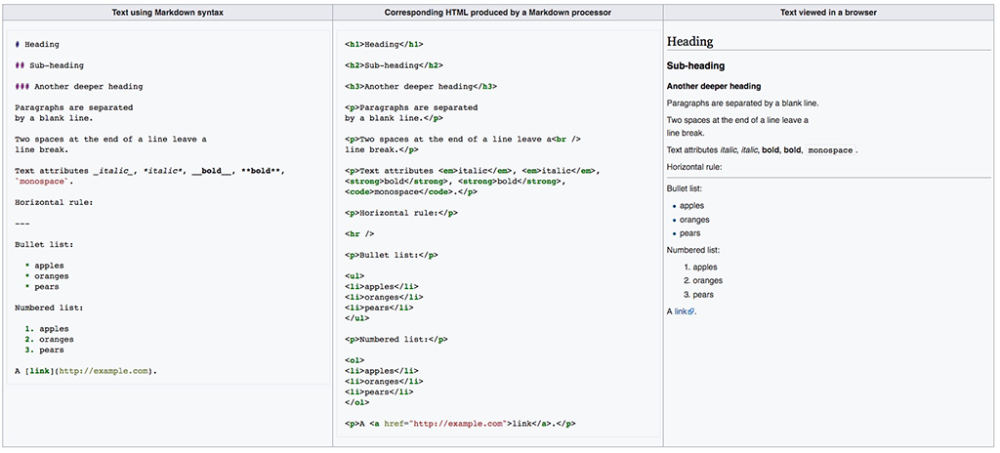

# Creative Coding I: Design & Communication

Prof. Dr. Lena Gieseke \| l.gieseke@filmuniversitaet.de \| Film University Babelsberg KONRAD WOLF

---

# Script 02: Setup

* [Creative Coding I: Design \& Communication](#creative-coding-i-design--communication)
* [Script 02: Setup](#script-02-setup)
    * [Markdown](#markdown)
    * [Development Environment](#development-environment)
        * [Editor](#editor)
        * [Visual Studio Code](#visual-studio-code)
            * [Markdown](#markdown-1)
            * [Summary](#summary)
        * [Terminal / Console](#terminal--console)
        * [Basic Commands](#basic-commands)
            * [Navigation](#navigation)
            * [Command Execution](#command-execution)
        * [Visual Studio Code](#visual-studio-code-1)
        * [Git and GitHub](#git-and-github)
        * [Summary](#summary-1)

## Markdown

Lecture scripts and assignments are written in [Markdown](https://en.wikipedia.org/wiki/Markdown) (.md). This setup let's you edit the lecture scripts in an editor, e.g. for making notes. You also have to submit markdown files in the assignments.

* Markdown is a popular markup language that converts text to html.
* Markdown allows you to use an easy-to-read, easy-to-write plain text format, then converts it to structurally valid XHTML (or HTML).
* Github can render markdown. Be aware though that there are different markdown parser ("converter") and what you can do e.g. with a Visual Studio Code plugin for setting and displaying formulas might not be the same as what GitHub can display.

  
[[wiki]](https://en.wikipedia.org/wiki/Markdown)

###### Resources

* [Markdown Guide](https://www.markdownguide.org/) 
* [Mastering Markdown](https://guides.github.com/features/mastering-markdown/)

## Development Environment

### Editor

You must have an editor with that you feel comfortable with for writing code and text (Word will not work 🙃). There are many, many options.


[[xkcd]](https://xkcd.com/378/)

Editors and IDEs ([Integrated Development Environment](https://en.wikipedia.org/wiki/Integrated_development_environment)) differ mainly on the spectrum of how general-purpose to specialized (e.g. for one specific language) they are, how customizable and whether they are freeware or not. Some popular choices are:

* Visual Studio Code
* JetBrains Editors
* Sublime
* Atom
* Notepad++
* Netbeans
* Visual Studio
* Eclipse
* XCode
* Emacs
* Vim

<!-- 
???
Who uses what? Who wants to use VSCode?

Session to set it up?
-->

### Visual Studio Code

My personal recommendation is [Visual Studio Code](https://code.visualstudio.com/) (in short VSCode). I like it because I can write different types of languages with it while still having many language specific features (e.g. through *extensions*). Also, I am totally addicted to customizing my working environments to exactly the way I like it and VSCode let's me do so in a convenient way (also mainly enabled through *extensions*). In summary, it is:

* Free
* Multi-purpose
* Extensively adjustable

*On a side note: For C++ I so far have only used XCode and Visual Studio (not the same to "Visual Studio Code"!) and I don't know yet how well you can setup Visual Studio Code for C++.*

You can ignore the following section if you work with a different development environments.


###### Resources

* [Getting started with Visual Studio Code](https://code.visualstudio.com/docs/introvideos/basics) 
* [Introductory Videos](https://code.visualstudio.com/docs/getstarted/introvideos)
* [How to use Visual Studio Code](https://flaviocopes.com/vscode/)


##### Workspace

VSCodes workspaces might be be confusing in the beginning.

You organize your work in VSCode with workspaces. Think of a workspace as a project. Under the hood it is nothing more than telling VSCode which folders to display together in your VSCode Explorer (the sidebar to the left). Also, you can create individual settings for each workspace (yay, colors! 😊). You can for example have a `cc1` workspace and add all files and folders that should be accessible through VSCodes explorer.

I am giving you an example workspace setup, including GitHub, in [Script 3: GitHub -  Working With the Class Repository](cc1_ws2324_03_github_script.md)

#### Markdown

For Visual Studio Code I recommend the extension [Markdown All in One](https://marketplace.visualstudio.com/items?itemName=yzhang.markdown-all-in-one).

Open the .md file in Visual Studio Code and edit it up to your liking. VSCode gives you the option of an interactive preview of the html rendering of the file:

* Open the command palette with `Shift + Option + p` or under `View -> Command Palette...`
* Start typing `Markdown: Open Preview` and select that command (I also have a hotkey for that because I use it so often).

###### Resources

* [Markdown and Visual Studio Code](https://code.visualstudio.com/Docs/languages/markdown)


##### GitHub

VSCode comes with all basic functionality to work with Git and GitHub integrated and there are also various plugins for it. For example, I am using the plugins [GitHistory](https://marketplace.visualstudio.com/items?itemName=donjayamanne.githistory) and [Markdown Preview GitHub Styling](https://marketplace.visualstudio.com/items?itemName=bierner.markdown-preview-github-styles) next to the functionality VSCode comes with. But I am sure that there are plenty of other great plugins, I simply do not know about.

Once again, please refer to [Script 3: GitHub -  Working With the Class Repository](cc1_ws2324_03_github_script.md) for in depth explanations.

###### Resources

* [Working with GitHub in VS Code](https://code.visualstudio.com/docs/editor/github)


#### Summary

When working with VSCode, I recommend that you know

* how to setup and work with a [workspace](https://stackoverflow.com/questions/44629890/what-is-a-workspace-in-visual-studio-code#:~:text=A%20Visual%20Studio%20Code%20workspace,and%20preferences%20of%20a%20workspace.),
* how to adjust [preferences](https://code.visualstudio.com/docs/getstarted/settings),
* how to install [extensions](https://code.visualstudio.com/docs/editor/extension-gallery), and
* how to work with the [command palette](https://code.visualstudio.com/docs/getstarted/userinterface#:~:text=Command%20Palette%23&text=The%20most%20important%20key%20combination,provides%20access%20to%20many%20commands.).

Optionally, depending on your workflow, know:

* how to work with [GitHub](https://code.visualstudio.com/docs/editor/github), and
* using the integrated [terminal](https://code.visualstudio.com/docs/editor/integrated-terminal) (see the following section)
 
within VSCode.

---

### Terminal / Console

(in the following whenever I say *terminal* substitute that word with *console* if on Windows)

We will make use of the terminal at some point!  
  
Start to get familiar with it as soon as possible...   

The terminal is an interface in which you can navigate and access files on your computer and execute text-based commands. There are many programs and functionalities which are only available for the terminal. The terminal has the advantage that you do not need to program a graphical interface for your functionality and that you can use terminal commands as source code and build programs from combined terminal commands.

In general, if you use a computer regularly, I recommend to get familiar with at least the most basic terminal commands. As motivation also keep in mind that when you use the Terminal you look really techy and you can impress friends and family!

* MacOs 
    * Uses a version Unix under the hood, hence all "Mac commands" are actually "Unix commands"
    * I use [iTerm](https://www.iterm2.com/index.html) as command line tool with the [Oh My ZSH](https://ohmyz.sh/) framework and zsh as shell and [powerlevel9k](https://github.com/bhilburn/powerlevel9k) as theme. This gives me some advanced features (remember, I like customization...🙄). But don't bother with adjusting the terminal right now, the regular Terminal is just fine.
* Windows
    *  If you want to get more serious about using the command line in Windows, consider the [PowerShell](https://docs.microsoft.com/en-us/powershell/).

### Basic Commands

At the most basic level, you must be familiar with **navigating** your files and **executing** commands with the terminal.

Let me say it again because it is important:

> You **must** be familiar with **navigating** your files and **executing** commands with the terminal.

(I was considering all caps here for emphasis. But then again, I really dislike using capitalization and screaming at someone in typography - so please understand the importance of this as is...)

#### Navigation

The first thing, you need to understand is:

At all times *you are somewhere* in your folder structure with the terminal.  

The line at or above the curser indicates where you are currently. If you execute commands, they are executed at that folder destination.

##### Change Location

Change current folder
```
cd foldername
```

Sub-folder names must be separated by a backslash in Windows and a slash for a Mac.
```
cd Windows\System32
```
```
cd Documents/filmuni
```

You use `..` to go up one folder
```
cd ..
```

##### Know Where You Are

Unix
```
pwd
```

Windows
```
cd (without any parameters)
```
Example iTerm on Mac:  


#### Command Execution

Next the core terminal commands, such as `cd`, you can use *command line tools* such as `ffmpeg` or `git`. These *command line tools* often accept arguments to further specify their functionality. How to use these arguments can be confusing as they really depend on the specific command/tool and how the developers set it up. If in doubt, check the documentation of the command.

There are several formats for specifying arguments and it depends on the tool and the arguments. Sometimes you simply list arguments separated by a space (with more than one argument the right order of the commands is crucial) but usually you indicate the type of argument with a hyphen plus some characters. A hyphen plus some characters are also used for setting optional specifications for a command.

For example to convert a .tif file to a .jpg file:

`ffmpeg -y -i test.tif out.jpg`

* `ffmpeg`: the name of the command (must be [installed](https://ffmpeg.org/) though)
* `-y`: is an optional setting, which means that you will overwrite the output file if it exists without the system asking again.
* `-i test.tif`: the `-i` stands for input and takes as following string the input file
* `out.jpg`: is the output file and must be the last argument

Often you can give the type of argument for the command in two formats, a short version and an equivalent long one:

* single-letter options are listed with a single hyphen such as `-r`
* word-based options are listed with a a double hyphen such as `--reverse`

Usually command line tools are documented, which you can access with the option `-h` or `--help`:

`ffmpeg -h` or `ffmpeg --help`

Once again, please keep in mind that it is usually highly relevant *where you are* navigated with your terminal. Where ever you are that is where an command is executed.

##### Example Mac


 [[source]](https://s3-us-west-2.amazonaws.com/s.cdpn.io/80625/commands-03.jpg)

Unfortunately for Windows commands slightly differ. For Windows have a look at this basic [introduction](https://iftakharhasan.wordpress.com/2016/07/04/basic-windows-console-commands/).

### Visual Studio Code

VSCode integrates a terminal as well. You can access it under `Terminal -> New Terminal`. All command line commands I am mentioning from now on, you could also execute in the VSCode Terminal.

### Git and GitHub

<!-- 
???
Who can explain Git and GitHub?
-->

For this class you will need to know

* how to regularly get the latest version of the course materials on [GitHub](https://github.com/ctechfilmuniversity/lecture_ws2324_creative_coding_1) (there might be updates to already uploaded files), and
* how to upload your homework.

In the very least, you will need a workflow for these two scenarios. Which means that you should have a basic understanding of git and GitHub and you should know

* the general idea of version control systems,
* the difference between git and GitHub,
* what a repo is, and 
* how to get and upload materials from a repo.

This means specifically, you need to be able to

* clone the [`lecture_creative_coding_1`](https://github.com/ctechfilmuniversity/lecture_ws2324_creative_coding_1) repo to your computer,
* know how to `add` and `commit` files to git locally,
* know how to `pull` and `push` files from the online GitHub repo.

How you do this is up to you. If you have a working setup you can stop reading here. If not or if you want further information, please work through [Chapter 2: GitHub](cc1_ws2324_03_github_script.md).


### Summary

* Know how to write Markdown.
* Decide on a development environment.
* Know how to navigate and execute commands with the terminal.
* Know how to get the course material from GitHub and upload your homework.


---

The End  

🛠 🧰 ⚙️
