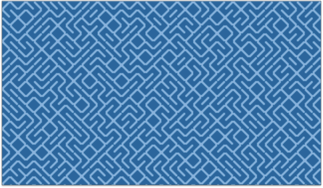
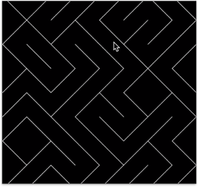
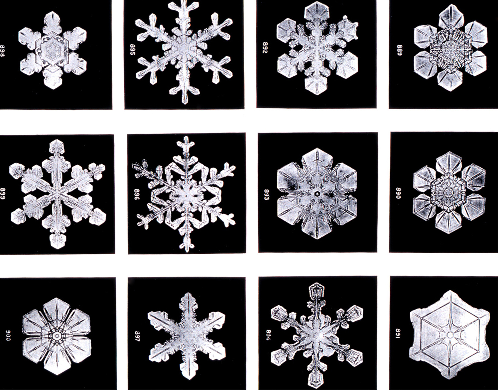
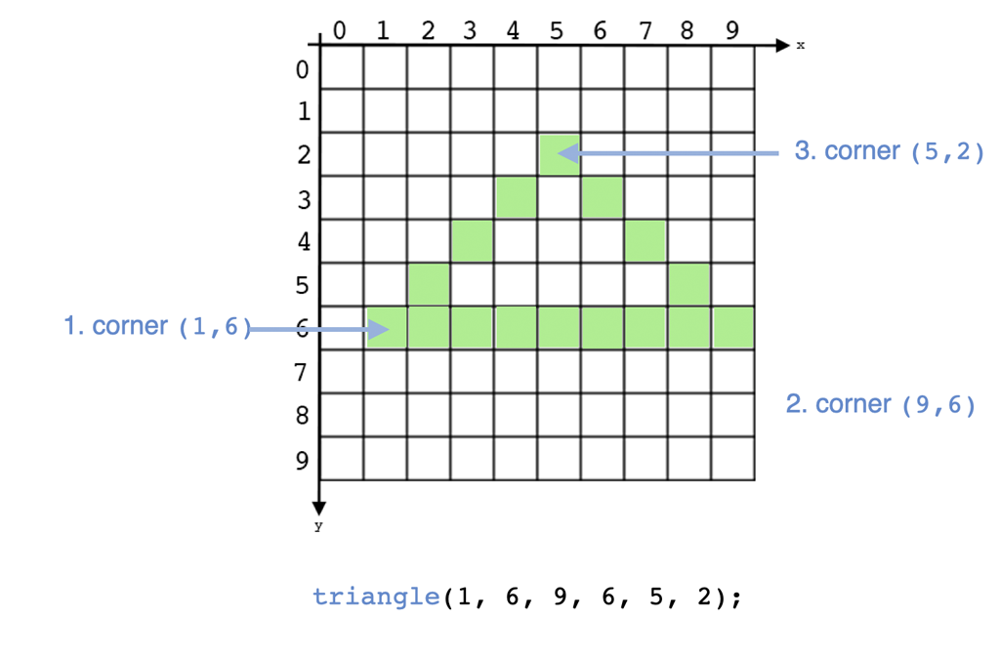
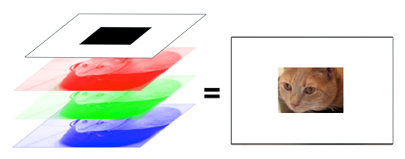
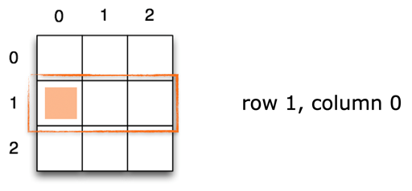
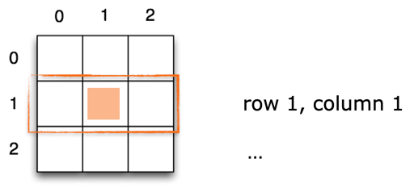
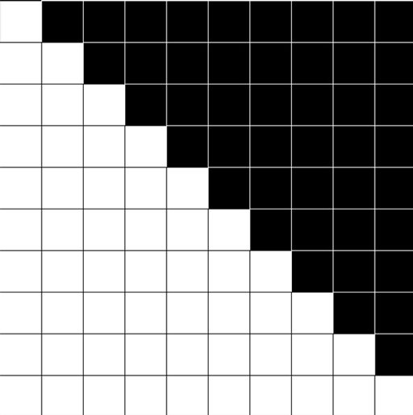
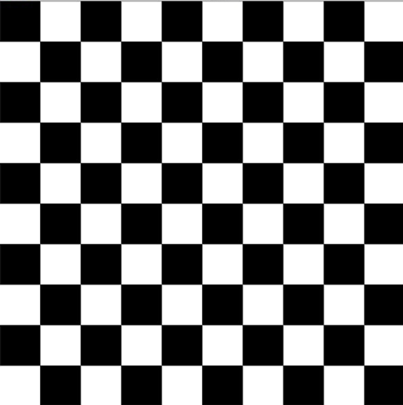
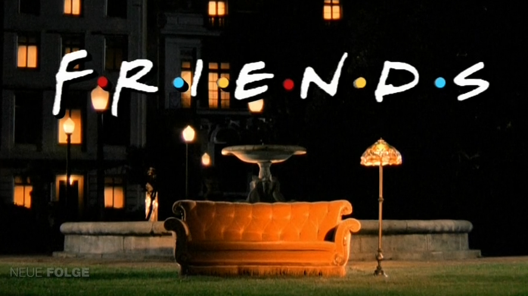

name: inverse
layout: true
class: center, middle, inverse
---


# Creative Coding I

### Prof. Dr. Lena Gieseke | l.gieseke@filmuniversitaet.de  

#### Film University Babelsberg KONRAD WOLF


---
layout: false

.header[Last Week]

## Lecture 1: Introduction


---
.header[Last Week | Lecture 1: Introduction]

## Technical Skills

--

* Overall, how would you rate your skill level of programming?
    * [2] Never done it
    * [5] Novice
    * [2] Intermediate
    * [ ] Advanced
    * [ ] God-like

---
.header[Last Week | Lecture 1: Introduction]

## Technical Skills

* Have you used object oriented programming before?
    * [4] I don't know what that is 
    * [ ] I know the concept but I have never implemented it
    * [5] Yes

---
.header[Last Week | Lecture 1: Introduction]

## Technical Skills

* Overall, how would you rate your skill level of using web technologies, such as JavaScript?
    * [4] Never done it
    * [4] Novice
    * [ ] Intermediate
    * [1] Advanced
    * [ ] God-like

---
.header[Last Week | Lecture 1: Introduction]

## Technical Skills

* How would you rate your skill level of working with Git and GitHub?
    * [4] Never done it
    * [3] Novice
    * [2] Intermediate
    * [ ] Advanced
    * [ ] God-like


---
.header[Last Week | Lecture 1: Introduction]

## Creative Coding Environments

Are there any languages, tools or environments for creative coding that you know of and which are not included in the script? *If not, you can skip this question.*

- Vex in Houdini
- Glsl (in TouchDesigner)
- Javascript in MaxMSP 


???
.task[COMMENT:]  

- (not really something not included in the script as its just normal javascript. but thought of in the combination with audio programming in max, it might be a interesting environment for the generation of audiovisual contents (tho the audio coding site in max isn't necessarily textbased)))


---
.header[Last Week | Lecture 1: Introduction]

## Technical Setup


* Markdown

???
.task[COMMENT:]  

* What is Markdown and how do you work with it?
    * Markdown is a popular markup language that converts text to html.
    * Markdown allows you to use an easy-to-read, easy-to-write plain text format, then converts it to structurally valid XHTML (or HTML).
    * Github can render markdown. Be aware though that there are different markdown parser ("converter") and what you can do e.g. with a Visual Studio Code plugin for setting and displaying formulas might not be the same as what GitHub can display.

--
* GitHub

???
.task[COMMENT:]  

* GitHub
    * What is Git and what is GitHub?
    * How do you work with Git? 

The *most basic* git workflow for versioning your files locally looks like the following:
* `Initialize` a directory as git directory (this needs to be done only once)
* Work on files...
* `Add` the files that you want to commit to the stage
* `Commit` the staged files to the repository
* Work on files...


    * How do you work with GitHub

#### Pull

When your local repository is connected to an online one on GitHub, you *pull* the recent version from the online repository into your local one.

#### Push

When your local repository is connected to an online one on GitHub, you *push* your recent commits from your local repository into the online one.


--

> Which environments are you going to use?


--
Further Questions? 🤔

---
.header[Last Week | Lecture 1: Introduction]

## Creative Coding

???
.task[COMMENT:]  

* What took you with you last time in terms of what we understand as creative coding?

--

Please share:

* Personal Motivation
* Projects or your own project idea


---
template: inverse

### Lecture 2:  
# Emergence


---
layout: false

## Today

* Topic *emergence*
* Programming languages & algorithms
* p5

---

.center[]

???

.task[TASK:]  

* What do we see? Can you find the underlying algorithm? (If you already know it please don't answer)

---


The original BASIC program for the Commodore 64:

```bash
10 PRINT CHR$(205.5+RND(1)); : GOTO 10
```
<!-- ??? BASIC had its own character indices (not ASCII) -->

---


Bash:

```bash
f="╱╲";while :;do print -n ${f[(RANDOM % 2) + 1]};done
```

???
.task[TASK:]  

* Show terminal version

---

## 10 PRINT


* BASIC program from the 1980s
* Considered a phenomenon of creative coding through its simplicity and visual appeal
* There is a whole [book](http://10print.org/) dedicated to this line of code
* Representing the history of creative coding
* You can watch the author talk about his work on [youtube](https://www.youtube.com/watch?v=34CXQr5OLas)


---

## 10 PRINT


*How to modify?*

--
<br>

*Which parameters could we define?*

--
* The spacing and size of the elements

--
* The probability for an element

---
.header[10 PRINT | Parametrization]

## The Spacing





---
.header[10 PRINT | Parametrization]

## The Probability


E.g., 90% probability for a backslash

---
template: inverse


## What Does Emergence Mean?

???
.task[COMMENT:]  

* Wikipedia: emergence occurs when an entity is observed to have properties its parts do not have on their own, properties or behaviors which emerge only when the parts interact in a wider whole

---
## Emergence

> In philosophy, systems theory, science, and art, emergence occurs when a complex entity has properties or behaviors that its parts do not have on their own, and emerge only when they interact in a wider whole. 
  

.footnote[[Wikipedia. 2023. [*Emergence*](https://en.wikipedia.org/wiki/Emergence).]]


???
.task[COMMENT:]  

* For instance, the phenomenon of life as studied in biology is an emergent property of chemistry.
* In philosophy: An emergent property of a system, in this context, is one that is not a property of any component of that system, but is still a feature of the system as a whole. Nicolai Hartmann (1882–1950), one of the first modern philosophers to write on emergence, termed this a categorial novum (new category). 

---
## Emergence

> In philosophy, systems theory, science, and art, emergence occurs when a complex entity has properties or behaviors that its parts do not have on their own, and emerge only when they interact in a wider whole. 
  
<br >
> The remarkable simplicity of complexity...


.footnote[[Wikipedia. 2023. [*Emergence*](https://en.wikipedia.org/wiki/Emergence). | A. Martin and K. Helmerson. 2014. [*Emergence: the remarkable simplicity of complexity*](https://theconversation.com/emergence-the-remarkable-simplicity-of-complexity-30973). The Conversation.]]


---
.header[Emergence]

## Snowflakes



.footnote[[Wikipedia. 2023. [*Emergence*](https://en.wikipedia.org/wiki/Emergence).]]


???
.task[COMMENT:]  

* The formation of complex symmetrical and fractal patterns in snowflakes exemplifies emergence in a physical system.
* Water droplets freeze to form ice molecules (also crystals) in the upper reaches of Earth’s atmosphere, which act as aggregates for crystallization. As the crystals grow in size, they gain mass and begin falling through the atmosphere. The differing temperatures and pressures acting on the crystal structure as it falls causes new patterns to emerge systematically that exhibit near-perfect radial symmetry. https://discover.hubpages.com/education/Self-Organization-in-Natural-Systems
* A snowflake is a single ice crystal that has achieved a sufficient size, and may have amalgamated with others, which falls through the Earth's atmosphere as snow.[1][2][3] Each flake nucleates around a tiny particle in supersaturated air masses by attracting supercooled cloud water droplets, which freeze and accrete in crystal form. Complex shapes emerge as the flake moves through differing temperature and humidity zones in the atmosphere, such that individual snowflakes differ in detail from one another, but may be categorized in eight broad classifications and at least 80 individual variants. The main constituent shapes for ice crystals, from which combinations may occur, are needle, column, plate, and rime. Snow appears white in color despite being made of clear ice. This is due to diffuse reflection of the whole spectrum of light by the small crystal facets of the snowflakes.[4]

---
.header[Emergence]

## Snowflakes

  
.caption[An early classification of snowflakes by Israel Perkins Warren.]

.footnote[[Wikipedia. 2023. [*Snowflake*](https://en.wikipedia.org/wiki/Snowflake).]]


---
.header[Emergence]

## Termites

  


.footnote[[Wikipedia. 2023. [*Emergence*](https://en.wikipedia.org/wiki/Emergence).]]


???
.task[COMMENT:]  

* A termite "cathedral" mound produced by a termite colony offers a classic example of emergence in nature.

---
.header[Emergence]

## Birds

  


.footnote[[B. Yirka. 2015. [*Researchers use wave theories to understand flocks of birds*](https://www.sott.net/article/297335-Researchers-use-wave-theories-to-understand-flocks-of-birds). Sign of the times.]]


---
template: inverse

## What Does Emergence Mean in the Context of Creative Coding?

---

.center[]


---

## Emergence


[Casey Reas - On Emergence ](https://www.youtube.com/watch?v=_8DMEHxOLQE)
  


???
.task[COMMENT:]  

[Generative Art - Generative Art Summer School at School of Architecture, Southeast University, 2019 ](https://www.youtube.com/watch?v=qtPi0JvmWbs)


---
.header[Emergence]

## Implementation


*What do we need to implement a visual pattern such as the 10 PRINT pattern?*
  
--
  
→ Graphical output
  


???
.task[COMMENT:]  


p5.js 🥳

* whenever I say Processing in the following, the term is pretty much interchangeable with p5


---
template:inverse

## *What Are Programming Languages?*

---
.header[What Are Programming Languages?]

## Wikipedia says…

*A programming language is a **formal language**, which comprises a set of instructions that produce various kinds of output.*  
  
--
<br >

*Programming languages are used in computer programming to implement **algorithms.***
  
--
  
<br >

*A programming language's surface form is known as its **syntax.***


???
.task[COMMENT:]  

*[…] the syntax of a computer language is the set of rules that defines the **combinations of symbols** that are considered to be a **correctly structured** document or fragment in that language.*


* There are hundreds of programming languages


A library performs specific, well-defined operations.

A framework is a skeleton where the application defines the "meat" of the operation by filling out the skeleton. The skeleton still has code to link up the parts but the most important work is done by the application.

Examples of libraries: Network protocols, compression, image manipulation, string utilities, regular expression evaluation, math. Operations are self-contained.

Examples of frameworks: Web application system, Plug-in manager, GUI system. The framework defines the concept but the application defines the fundamental functionality that end-users care about.
https://stackoverflow.com/questions/148747/what-is-the-difference-between-a-framework-and-a-library


* A library is essentially a set of functions that you can call, these days usually organized into classes. Each call does some work and returns control to the client.
* A framework embodies some abstract design, with more behavior built in. In order to use it you need to insert your behavior into various places in the framework either by subclassing or by plugging in your own classes. The framework's code then calls your code at these points.


We are using [JavaScript](https://developer.mozilla.org/en-US/docs/Web/javascript) in the class, which is the language for dynamic websites.


You can imagine p5 as an extension for JavaScript.


---
.header[What Are Programming Languages?]

## Algorithm

--


*[…] an algorithm is a set of instructions, **typically to solve a class of problems** or perform a computation.*

--

<br >

*Algorithms are **unambiguous** specifications for performing calculation, data processing, automated reasoning, and other tasks.*


---
.header[What Are Programming Languages?]

## Algorithm

.left-even[
*Give instructions for cleaning the dishes.*
  
<br >
  
 [⬀](https://www.montessoriprivateacademy.com/wp-content/uploads/2015/11/montessori-washing-dishes.png)

]

--

.right-even[
* With what are we working?
    * Inputs, data
    * Given functions

  
* What is the process?
]

???
.task[COMMENT:]  

* (plate, sponge, water, tap, soap, dirt)

---
.header[What Are Programming Languages?]

## Algorithm

.left-even[
*Give instructions for cleaning the dishes.*
  
<br >
  
 [⬀](https://bocghewasu.github.io/post/smart-cartoon-characters-male/)

]

???
.task[COMMENT:]  

* (plate, sponge, water, tap, soap, dirt)

---
.header[What Are Programming Languages?]

## Algorithm

> With what are we working?

* Different programming languages have different prerequisites and capabilities

---
.header[What Are Programming Languages?]

## Hello World 👋🏻

--

* Established as first “sanity check” for a programming language

--
* Text in- and output
    * Input: Program Code
    * Output: "Hello World"


???
.task[COMMENT:]  

* Show terminal

---
.header[What Are Programming Languages?]

## Hello World 👋🏻

[⬀](https://de.wikipedia.org/wiki/Liste_von_Hallo-Welt-Programmen/Höhere_Programmiersprachen#Java)

---
.header[What Are Programming Languages?]

## Hello World 👋🏻

### But Why?

* Tradition
* First used by Brian Kernighan, 1974 in the Bell Laboratories
* http://helloworldcollection.de
    * 567 Hello World programs

???


[[wikipedia]](https://de.wikipedia.org/wiki/Liste_von_Hallo-Welt-Programmen/H%C3%B6here_Programmiersprachen)

---
.header[What Are Programming Languages?]


## Hello World but Different?

We need a different kind of sanity check.

--

* Input: Program Code
* Output: Graphics

--

```js
function draw() {

    point(50, 50);
}
```


???
.task[COMMENT:]  


Show [Sketch](https://editor.p5js.org/)

```js

function setup() {
    createCanvas(100, 100);
    background(255);
}

function draw() {
    point(50, 50);
}
```


[[1]](https://de.wikipedia.org/wiki/Liste_von_Hallo-Welt-Programmen/H%C3%B6here_Programmiersprachen)


--

p5.js is optimized for designer and artists to develop graphics, sound and interaction.


---
.header[What Are Programming Languages?]


## Shouldn’t We Rather Learn ___?

--
* The friend of my friend of my friend says…

--
* The choice of a programming language is also somewhat of a religion and highly depends on what you are used to

--
* There is always the next *hot topic*

--
* The one programming language to learn doesn’t exists
    * They all have advantages and disadvantages
    * It depends on specific application scenarios

--
* p5.js is a good introduction
    * Especially for designer, artists, etc.
    * Everything you learn with p5.js, you can transfer to another programming language


---
template:inverse

# p5.js

---
## p5.js

* [p5](https://p5js.org/) is a library for JavaScript
    * You write JavaScript code but you have additional commands from p5.
--
* p5 is based on the Java framework Processing
    * Processing came first
    * p5 is Processing running in a webbrowser
    * p5 and Processing are very similar


???
.task[COMMENT:]  

Processing

* 2001 developed in the research group Aesthetics and Computation of the Technology Media Labs at the Massachusetts Institute of Technology by the students Ben Fry and Casey Reas.
* 2012 the Processing Foundation (a non-profit corporation) was established


>Our mission is to promote software literacy within the visual arts, and visual literacy within technology-related fields — and to make these fields accessible to diverse communities. Our goal is to empower people of all interests and backgrounds to learn how to program and make creative work with code, especially those who might not otherwise have access to these tools and resources.


---
.header[p5.js]

## Resources & Community

One of the aspects that made Processing, and now p5, so popular is its community and the vast amount of resources.

* [p5 Reference](https://p5js.org/reference/)
* [Open Processing](https://www.openprocessing.org)
* [Happy Coding](https://happycoding.io)
* [Generative Gestaltung](http://www.generative-gestaltung.de)
* [Creative Applications](https://www.creativeapplications.net/category/processing/)
* The fairest of them all: [Daniel Shiffmann](https://thecodingtrain.com/) 🤴🏻
    * [The Coding Train Intro](https://www.youtube.com/watch?v=_t0ZBAk72K8)


???
.task[COMMENT:]  

* Show coding train intro
* [procssing.org](https://processing.org)

---
.header[p5.js]

## Editor

--
p5 comes with a programming environment the [p5.js Editor](https://editor.p5js.org/):

  
<br >

[](https://editor.p5js.org/)


???
.task[COMMENT:]  

* The environment enables you to write and to execute code  
* For this week, we are going to do all coding in the online editor 
* This is where you’ll be writing your code. Similar to how Microsoft Word and Google Docs help you edit text, code editors like this help you write code. The p5.js editor includes some handy features like syntax highlighting (coloring the text) to make it easier to read your code, and a play button (the triangular button in the upper-left corner) to make it easier to run your code. https://happycoding.io/tutorials/p5js/welcome-to-coding


* Normally, you would need to some installation and setup steps before you can do any coding.

https://editor.p5js.org

Go over the following aspects in the editor together:

* The environment
* Working with sketches
* Errors
* Saving
* Sharing

---

## p5.js

--

<iframe src="https://editor.p5js.org/legie/full/0lByVe-mH" width="500" height="520" ></iframe>  
  
--
  
<iframe src="https://editor.p5js.org/legie/full/LyTHREIeS" width="500" height="520" ></iframe>


---
template: inverse

### p5.js
# The System Loop


---
.header[p5.js]

## System Loop

.left-even[

```javascript
function setup() {

    [HERE YOU WRITE YOUR CODE]
}

function draw() {

    [HERE YOU WRITE YOUR CODE]
}
```
]

???

.task[COMMENT:]  

* In p5 a sketch **must** include the following base structure:

---
.header[p5.js]

## System Loop

.left-even[

```javascript
function setup() {

    [HERE YOU WRITE YOUR CODE]
}

function draw() {

    [HERE YOU WRITE YOUR CODE]
}
```
]

.right-even[
`setup()`

* Executed once when the program is started
]
--

.right-even[
`draw()`

* Executed as soon as setup() is done
* Executed again and again until the execution is stopped
* By default 60 frames in a second
]

???

.task[COMMENT:]  

* You have to accept the structure as given from the p5 gods for now. You must not change it and use it exactly as is, with all words and parenthesis.

---
.header[p5.js]

## System Loop

.left-even[

```javascript
function setup() {

    [HERE YOU WRITE YOUR CODE]
}

function draw() {

    [HERE YOU WRITE YOUR CODE]
}
```
]

.right-even[
> Use this structure in every sketch!  
]


---
template: inverse

### p5.js
# Drawing

---
.header[p5.js | Drawing]

## Create Canvas

.left-even[
```javascript
function setup() {

    createCanvas(100, 100);

}

function draw() {

}
```
]

???
.task[COMMENT:]  

* The values change the size of the canvas.
* You can use the variables `windowWidth` and `windowHeight` for automatically detecting the current size of the display window.

* For being able to display something, you have to create a canvas. You must do that inside the {} of `setup()`:

--
.right-even[


]


???
.task[COMMENT:]  

* The canvas is a grid of small rectangles that combined make up the image. These rectangles are called pixel (picture element). To create an image you have to assign a color to each pixel.


Thankfully, p5 give us many convenient drawing functions so that we don't have to color each pixel individually.

---
.header[p5.js | Drawing | Canvas]

## Coordinate (x,y)

.center[]


???
.task[COMMENT:]  

* A point on the canvas is identified by a (x, y) coordinate based on the following coordinate system


### Coordinate (x,y)

> Where is the following point drawn?

```js
function setup() {

    createCanvas(300, 300);
}

function draw() {

    point(100, 200);
}
```

.center[]

---
.header[p5.js | Drawing]

## Drawing Function Calls

<script type="text/p5" data-p5-version="1.6.0" data-height="400" data-preview-width="400" >
function setup() {

    createCanvas(300, 300);
}

function draw() {

    ellipse(110, 250, 200, 50);
}
</script>


???
.task[COMMENT:]  

CODE!

---
.header[p5.js | Drawing]

## Drawing Function Calls

A typical drawing function call could look for example as follows:

<br >


**The order of the parameters is fixed and must be followed!**


---
.header[p5.js | Drawing]

## Triangle

.left-even[

```js
triangle(x1, y1, x2, y2, x3, y3)
```

Arguments:

1. corner `(x1, y1)`
2. corner `(x2, y2)`
3. corner `(x3, y3)`
]
.right-even[

]

---
.header[p5.js | Drawing]

## Triangle

<script type="text/p5" data-p5-version="1.6.0" data-height="400" data-preview-width="400" >
function setup() {

    createCanvas(300, 300);
}

function draw() {

    triangle(50, 50, 250, 250, 50, 250);
}
</script>

???
.task[COMMENT:]  

CODE!


---
.header[p5.js | Drawing]

## 2D Primitives


* `arc()`
* `ellipse()`
* `circle()`
* `line()`
* `point()`
* `quad()`
* `rect()`
* `square()`
* `triangle()`


---
.header[p5.js | Drawing]

## Polygon

A number of given vertices are connected with a line:

.center[]


???
.task[COMMENT:]  

CODE!  
  
A number of given vertices are connected with a line:

.center[]

* `beginShape` tells Processing that we are giving vertices for a polygon now
* Corners are added with the `vertex` command
* `endShape` ends the definition
    * `CLOSE` tells Processing to close the shape
    * If not given the last and first vertices of the poly are not connected


A number of given vertices are connected with a line:

.center[]

---
.header[p5.js | Drawing]

## Polygon

<script type="text/p5" data-p5-version="1.6.0" data-autoplay data-height="400" data-preview-width="360" >
function setup() {
    createCanvas(300, 300);
}

function draw() {

    beginShape();

    vertex(270, 10);
    vertex(20, 150);
    vertex(240, 280);
    vertex(290, 240);

    endShape();
}
</script>


---
template: inverse

# Colors

???

.task[ASK:]  

* What is a color system?

---
.header[Colors]

## RGB

--

.left-even[
By default Processing uses RGBA-color space with

* red, green, blue, alpha
* 0 … 255
* 0 = no color, 255 = full saturation
]
--
.right-even[
[⬀](http://cdn.tutsplus.com/active/uploads/legacy/tuts/076_rgbShift/Tutorial/1.jpg)
]

???
.task[COMMENT:]  

* 1 byte = 8 bits = 2^8 = 256 values
* `0,0,0` is black, `255, 255, 255` white


---
.header[Colors | RGBA]

## Alpha

.left-even[
Alpha describes the transparency of the, e.g., filling:

* red, green, blue, **alpha**
* 0 … 255
* 0 = fully transparent
* 255 = fully opaque
]

.right-even[
[⬀](http://cdn.tutsplus.com/active/uploads/legacy/tuts/076_rgbShift/Tutorial/1.jpg)
]

---
.header[Colors]

## Color Function Calls

Setting the background color:

```js
background(r, g, b);
```

--
<script type="text/p5" data-p5-version="1.6.0" data-autoplay data-height="300" data-preview-width="360" >
function setup() {
    createCanvas(200, 200);
}

function draw() {
    background(0, 255, 0);
}
</script>


???
.task[COMMENT:]  

CODE!


---
.header[Colors]

## Color Function Calls

Changing attributes of the drawing commands:

```js
fill(r, g, b);
stroke(r, g, b);
strokeWeight(w);
```


???
.task[COMMENT:]  

function setup() {
    createCanvas(300, 300);
}

function draw() {
    background(0, 255, 0);

    fill(0, 0, 255);
    stroke(255, 0, 0);
    strokeWeight(5);

    circle(150, 150, 150);
}


--

```js
noFill(); 
noStroke();
```


???
.task[COMMENT:]  


function setup() {
    createCanvas(300, 400);
    // Background color of the canvas
    background(0, 0, 0);
}

function draw() {
    // Rectangle left
    fill(0, 0, 255); 
    noStroke();
    rect(10, 10, 150, 200);

    // Ellipse
    fill(255, 0, 0);
    stroke(255, 255, 255);
    strokeWeight(10);
    ellipse(150, 150, 150, 200);

    // Rectangle right
    fill(255,168,233);
    strokeWeight(20);
    rect(150, 150, 120, 200);
}

---
.header[Colors]

## Example

<script type="text/p5" data-p5-version="1.6.0" data-autoplay data-height="500" data-preview-width="380" >
function setup() {
    createCanvas(300, 400);
    // Background color of the canvas
    background(255, 200, 10);
}

function draw() {
    // Ellipse
    fill(255, 150, 0);
    noStroke();
    ellipse(150, 240, 200, 200);

    // Rectangle ground
    fill(255, 255, 0); 
    rect(0, 250, 500, 250);
}
</script>

???
.task[COMMENT:]  

CODE!

---
.header[Colors]

## Example

<script type="text/p5" data-p5-version="1.6.0" data-autoplay data-height="500" data-preview-width="380" >

// https://happycoding.io/tutorials/p5js/calling-functions/rainbow

function setup() {
    createCanvas(400, 420);
    noStroke();
}

function draw() {
    // red
    fill(255, 0, 0);
    rect(0, 0, 400, 60);

    // orange
    fill(255, 165, 0);
    rect(0, 60, 400, 60);

    // yellow
    fill(255, 255, 0);
    rect(0, 120, 400, 60);

    // green
    fill(0, 255, 0);
    rect(0, 180, 400, 60);

    // blue
    fill(0, 0, 255);
    rect(0, 240, 400, 60);

    // indigo
    fill(75, 0, 130);
    rect(0, 300, 400, 60);

    // violet
    fill(148, 0, 211);
    rect(0, 360, 400, 60);
}
</script>

???
.task[COMMENT:]  

CODE!


---
template:inverse

## *How is one supposed to remember this?*

---
.header[The Reference]

## Getting Help 🚒

Look it up in the reference: https://p5js.org/reference/

* The reference is like a dictionary of the programming language.  
* Learning to work with the reference is as important as learning the programming syntax.
* I recommend to bookmark this page as you will come back to is many, many times.

---
.header[Emergence]

## Implementation


*What do we need to implement a visual pattern such as the 10 PRINT pattern?*
  

  

## p5.js 🥳

---
.header[Emergence]

## Implementation


Algorithm

* Go row by row
* Place a `/` or a `\`...
* ...randomly

---
.header[Emergence]

## Implementation


Algorithm

* Go row by row?
* Place a `/` or a `\` ✓ 
* Randomly?

---
.header[Emergence | Implementation | 10 PRINT]

## Place a `/` or a `\`

```js
line(x, y, x + SPACING, y + SPACING);

// OR

line(x, y + SPACING, x + SPACING, y);
```

--

.center[]


---
.header[Emergence | Implementation | 10 PRINT]

## Go Row by Row


--
> Repeatedly place a circle...

---
.header[Emergence | Implementation | 10 PRINT]

## Repeatedly Do...

```js
for(let i = 0; i < numberOfTimes; i++)
{

    // code

}
```


???

.task[COMMENT:]  

* You can chose any variable name as iterator
    * `i` as short for iterator is just typical
* You can chose any start value
    * Most times it will be `0` though
* You can chose any end value `numberOfTimes`
    * This can be a direct value or a variable
* `i++` is a shortcut for `i=i+1` and represents the step size, meaning how the value of the iterator changes from iteration to iteration
    * You can chose any step size you want, e.g. `i+=12`


--

```js
for(let i = 0; i < 3; i++){
    print('wow');
}
```


???
.task[COMMENT:]  

Show: https://editor.p5js.org/legie/sketches/98D_XyBFp

---
.header[Emergence | Implementation | 10 PRINT]

## *On a Side Note...*

What is the scope of the iteration variable?  
  
--
<br >
  
The scope is **local** within the loop code block, meaning it is only visible inside the loop:

```js
// Pseudo Code

for(let i = 0; i < numberOfTimes; i++)
{

    // i only exists here

}
print(i); //gives an error
```


---
.header[Emergence | Implementation | 10 PRINT]

## Go Row by Row


--

→ 2D Loops


???
.task[COMMENT:]  

As we are working on a 2D canvas in x and y, often times a 2D loop is used to fill a space, for example the canvas. You can imagine this as the filling of a grid.

---
.header[Emergence | Implementation | 10 PRINT]

## 2D Loops

**For every row, look at every element…**

--

  

---
.header[Emergence | Implementation | 10 PRINT]

## 2D Loops

**For every row, look at every element…**

  

---
.header[Emergence | Implementation | 10 PRINT]

## 2D Loops

**For every row, look at every element…**

  

---
.header[Emergence | Implementation | 10 PRINT]


## 2D Loops

**For every row, look at every element…**

  

---
.header[Emergence | Implementation | 10 PRINT]


## 2D Loops

**For every row, look at every element…**

  

---
.header[Emergence | Implementation | 10 PRINT]

## 2D Loops

For implementing this, we **nest** two loop as follows

```js
// Pseudo Code

For every row {
    For every column {

    }
}
```

???
.task[COMMENT:]  

* https://editor.p5js.org/legie/sketches/Me8yU-bYb
* Change to circles
* Show smilies


---
.header[Emergence]

## Implementation


Algorithm

* Go row by row  **✓** 
* Place a `/` or a `\` **✓** 
* Randomly?


---
.header[Emergence | Implementation | 10 PRINT]

## 50-50 Decision Maker?

--

* `random(1);` → gives random numbers between 0..0.99
* `let probability = 0.5;`

--

```js
let probability = 0.5;

if (random(1) < probability) { //all random numbers between 0..0.49

    //...
}
else { //all random numbers between 0.5..0.99

    //...
}
```

---
.header[Emergence]

## Implementation


Algorithm

* Go row by row  **✓** 
* Place a `/` or a `\` **✓** 
* Randomly  **✓** 


---
.header[Emergence | Implementation]

## 10 Print Pattern

```javascript
// https://editor.p5js.org/legie/sketches/VDfxWIEAL

function draw()
{
    // Go row by row
    for (let y = 0; y < width; y += SPACING)
    {
        for (let x = 0; x < height; x += SPACING)
        {
            // Switch which "character"
            if (random(1) < PROBABILITY)
            {
                line(x, y, x + SPACING, y + SPACING);
            }
            else
            {
                line(x, y + SPACING, x + SPACING, y);
            }
        }
    }
}
```


---
template:inverse

### 2D Loops
## Examples


???
.task[COMMENT:]  

* For a better understanding of the grid structure and also of operators, here a couple of examples.

---
.header[2D Loops]

## Examples

*How do you need to control the fill command to create the following examples?*

.left-even[

]

--
.right-even[
```js
// https://editor.p5js.org/legie/sketches/lWJGIhhtI
// Grid Examples

function draw() {

    // Nested loop to run over
    // all pixels of the canvas
    for (let y = 0; y < height; y+=stepSize) {
        for (let x = 0; x < width; x+=stepSize) {

            fill(255);
            // Changing the fill color
            // only for the cells on the
            // diagonal
            if ( y == x) {
                fill(0);
            }

            rect(x, y, stepSize, stepSize);
        }
    }
}
```
]

---
.header[2D Loops]

## Examples

.left-even[

]

--
.right-even[
```js
// https://editor.p5js.org/legie/sketches/5x1bAs66K
// Grid Examples

function draw() {

    // Nested loop to run over
    // all pixels of the canvas
    for (let y = 0; y < height; y+=stepSize) {
        for (let x = 0; x < width; x+=stepSize) {

            stroke(0);
            fill(255);

            if (x > y) {
                stroke(255);
                fill(0);
            }

            rect(x, y, stepSize, stepSize);
        }
    }
}
```
]

---
.header[2D Loops]

## Examples

.left-even[

]


???
.task[COMMENT:]  

* The overall logic to create a checkerboard is to fill every other cell black and to shift that every other row. 

* You could also say that in the even rows (meaning the 0., 2., 4. row...), the even columns (meaning the 0., 2., 4. column...) should be black, and in the uneven rows, the uneven cells should be black.

* You can identify even numbers with the modulo operator.

--
.right-even[
```js
// https://editor.p5js.org/legie/sketches/_NHk4arDR
// Grid Examples


if ((row % 2 == 0) && (column % 2 == 0)) {
    fill(0);
} 
else if ((row % 2 != 0) && (column % 2 != 0)) {
    fill(0);
}
```


]

---
.header[2D Loops | Examples]

## The Modulo Operator?

--

The [modulo](https://www.computerhope.com/jargon/m/modulo.htm) operator returns for a division with a whole number the rest of that division:

```js
// Pseudo Code

5 / 2 is 2 (the quotient) with rest 1
7 / 5 is 1 with rest 2

x / y is quotient q with rest r
x = q * y + r
```

--

This comes in handy when testing for even numbers:

```js
if (number % 2 == 0) 
{
    print("even");
}
```


---
template:inverse

# Interaction


???
.task[COMMENT:]  

* User Interaction is heavily influencing the flow of a program...


---
## Interaction

As the `draw()` function is continuously called, we can make changes to it over time.

Such changes could be based on **user interaction**

--

```js

function mousePressed() {

    // Define what should happen
}
```

With the above function definition we can control what should happen if the mouse was pressed. 

---
.header[Interaction]

## Mouse Interaction


*If the mouse was pressed, change the color of the circle.*  

--
```js
function setup() {
    createCanvas(360, 360);
    background (255);
    fill(255, 0, 0);
    noStroke();
}

function draw() {
    ellipse(180, 180, 100, 100);
}

function mousePressed() {
    fill(random(255), random(255), random(255));
}
```


???
.task[COMMENT:]  

The random function generates a random number 😁.

```js
random(-50, 50);
```

When we call this function, it *returns* a value, the random number.  


Some where in p5 we have a function definition similar to:

```js
function random(rangeStart, rangeEnd) {
    
    //generate a random number within the range

    return value;
}
```

We are directly piping the return value of the random function as argument into the `fill(r, g, b)` function call: 

```js
fill(random(255), random(255), random(255));
```


Functions can be nested. As of now, this should remain an exception for us!


```js
let myRed = random(255);
let myGreen = random(255);
let myBlue = random(255);

fill(myRed, myGreen, myBlue);
```


Each time the `random()` function is called, it returns a value within the specified range.


* `random(-5, 5)` returns values between -5 and 5 (starting at -5, and up to, but not including, 5)
  

  
If only one argument is passed to the function, it will return a float between zero and the value of the argument.


* `random(5)` returns values between 0 and 5 (starting at zero, and up to, but not including, 5)
  
--
  
https://p5js.org/reference/#/p5/random 🚑 🚨


???
.task[COMMENT:]  

https://editor.p5js.org/legie/sketches/MLHMKFHa5


*Why does the following not work?*


---
.header[Interaction]

## Mouse Position

```js
mouseX
mouseY
```

--
* This specific type of variable is called *system variable*.  


???
.task[COMMENT:]  

* System variable are the variables that are given from the system in contrast to the variables that you are going to define yourself. We will come back to this.

--
* They are given to us by p5 🎁


--

For now you can just remember that "inside" of `mouseX` we can access the current mouse position in x at all times, and in `mouseY` the current mouse position in y.


???
.task[COMMENT:]  

* Where should I put mouseX and mouseY? ellipse(mouseX, mouseY, 100, 100);
* https://editor.p5js.org/legie/sketches/0n3f4l4LX


---
.header[Interaction]

## Keyboard Interaction

--

```js
function keyPressed() {

    ...
}
```

```js
key
keyCode
```


???
.task[COMMENT:]  

* https://p5js.org/reference/


---
template: inverse

# Programming Overview


---
.header[Programming Overview]

## Commands

--

Commands are *function calls*. A function is defined as:

```javascript
function functionname([parameter1,...]) {

    // Code that is executed when we call the function

    [return value;]
}
```
--
* You can write your own functions and call them

--
* You can define what should happen in given functions, e.g., `setup()`


---
.header[Programming Overview]

## Program Flow

* p5's environment
    * `preload()`
    * `setup()`
    * `draw()`
--
* Structuring the program flow
    * `if(condition is true)`
    * Loops

---
.header[Programming Overview | Program Flow]

## User Input

* User Input from
    * `keyPressed()`
    * `mouseX`, `mouseY`

---
.header[Programming Overview]

## Variables

--

We use variables to save and access data

--
* `let hue = 0;`

--
    * Variables have a data type
    * Variables live inside `{}` and have a scope


---
.header[Programming Overview]

## Operators

* Arithmetic
    * `+`, `-`, `*`, `/`, `--`, `++`
* Comparison
    * `>`, `>=`, `<`, `<=`, `==`, `!=`
* Logical Operators
    * `&&`, `||`, `!`

---
.header[Programming Overview]

## Color Systems

* Color systems available
    * RGBA

--
    * HSB
    * `colorMode(HSB);`
    * `colorMode(HSB, windowWidth, 100, 100);`

---
.header[Programming Overview]

## Loops

```js
while(i < numberOfTimes)…
```

```js
for(int i = 0; i < numberOfTimes; i++)…
```

--

2D Loop

*For every row look at every element…*

```js
for (let y = 0; y < numberRows; y++)
{
    for (let x = 0; x < numberColumns; x++)
    {
        print("Row: " + y + " Column: " + x);
    }
}
```

---
.header[Programming Overview]

## Objects

--

* Have properties and functions that *belong to* them

--
* You access those properties and functions with the `.` notation
    * `myImage.width`
    * `myImage.resize(100, 100);`
--
* p5.Image, p5.sound, arrays


---
.header[Programming Overview]

## Arrays

--

With arrays we can save multiple values in one variable.

--

```js
let myArray = [2, 4, 6, 8, 'done']

myArray.push(100) // -> [2, 4, 6, 8, 'done', 100]
myArray[1] = 'hello' // -> [2, 'hello', 6, 8, 'done', 100]
```

--

Arrays are accessed with `[]` and an index, starting at `0`.

--

```js
print(myArray[2]) // 6
```

---
.header[Programming Overview]

## Arrays

You can use loops to access all elements of an array.

```js
for (let i = 0; i < myArray.length; i++) {
    print('Element', i, ': ', myArray[i]);
}

//or

for (let element of myArray) {
    print(element);
}
```

---
.header[Programming Overview]

## Code Organization

Good layout matters!!

--

* One line per function call.
* Opening curly brackets come after the title line (or in the next line - just be consistent).
* Closing curly brackets get their own line.
* Indent the content between two brackets.


---
.header[Programming Overview]


# Errors Are Our...


--




---
template: inverse

## The End  

‍🎨 💥 💻 


