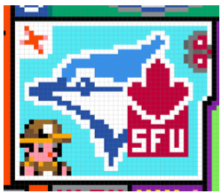
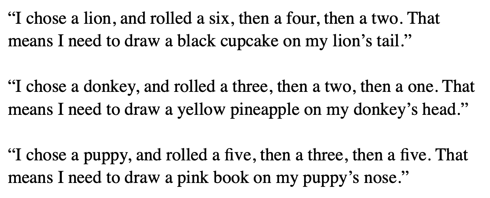
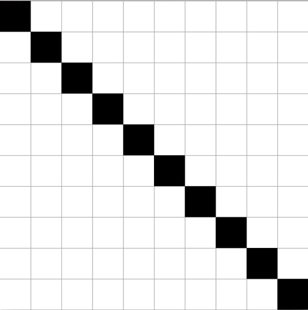
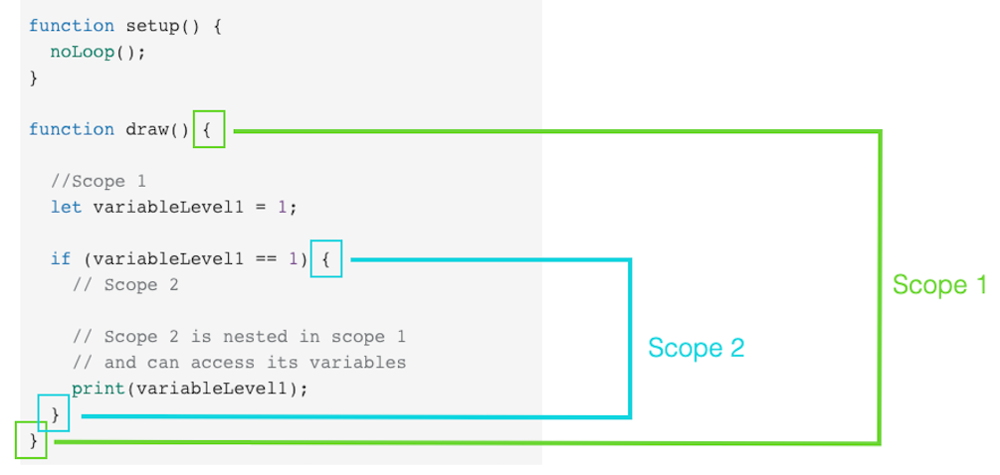
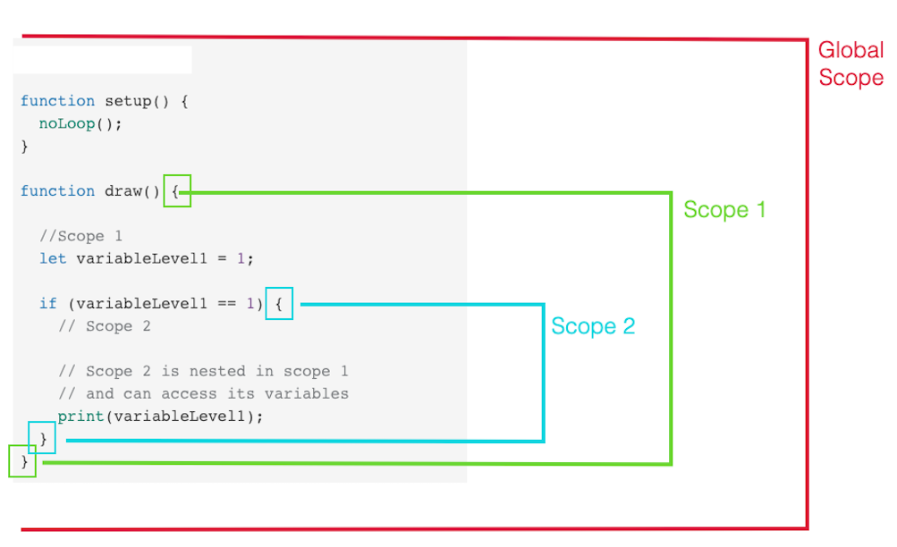

name: inverse
layout: true
class: center, middle, inverse
---


# Creative Coding I

### Prof. Dr. Lena Gieseke | l.gieseke@filmuniversitaet.de  

#### Film University Babelsberg KONRAD WOLF


---
layout: false

.header[Lecture 1: Introduction]

## Creative Coding

Please share:

* Personal Motivation
* Projects or your own project idea


---
## Today

* Re-cap and Add-on to Last Week
    * Emergence
    * Algorithms
    * p5

--
* p5 Programming Overview


???
.task[COMMENT:]  

* Lecture 3: Instructions

    

---


.header[Last Week]

## Lecture 2: Emergence

--

> In philosophy, systems theory, science, and art, emergence occurs when a complex entity has properties or behaviors that its parts do not have on their own, and emerge only when they interact in a wider whole. 
  
<br >
> The remarkable simplicity of complexity...


.footnote[[Wikipedia. 2023. [*Emergence*](https://en.wikipedia.org/wiki/Emergence). | A. Martin and K. Helmerson. 2014. [*Emergence: the remarkable simplicity of complexity*](https://theconversation.com/emergence-the-remarkable-simplicity-of-complexity-30973). The Conversation.]]


???
.task[COMMENT:]  

* For instance, the phenomenon of life as studied in biology is an emergent property of chemistry.
* In philosophy: An emergent property of a system, in this context, is one that is not a property of any component of that system, but is still a feature of the system as a whole. Nicolai Hartmann (1882–1950), one of the first modern philosophers to write on emergence, termed this a categorial novum (new category). 

---

.header[Last Week]

## Lecture 2: Emergence

  


.footnote[[B. Yirka. 2015. [*Researchers use wave theories to understand flocks of birds*](https://www.sott.net/article/297335-Researchers-use-wave-theories-to-understand-flocks-of-birds). Sign of the times.]]


---


.header[Last Week]

## Lecture 2: Emergence


---
.header[Last Week | Emergence]

## Reddit’s r/place


.left-even[
>There is an empty canvas. You may place a tile upon it, but you must wait to place another. Individually you can create something. Together you can create something more.

.footnote[[J. Ho. 2022. *Our Place: On the Emergence of Visual Artifacts in Collaborative Art in Reddit’s r/place*. Academic Conference Simulation at FUB 2022.]]
]


???
.task[COMMENT:]  

* https://en.wikipedia.org/wiki/The_Million_Dollar_Homepage
* 

--
.right-even[]


---
.header[Last Week | Emergence]

## Reddit’s r/place

> The communal co-creation of an artistic artifact.
  
.footnote[[J. Ho. 2022. *Our Place: On the Emergence of Visual Artifacts in Collaborative Art in Reddit’s r/place*. Academic Conference Simulation at FUB 2022.]]

  
--
* 72-hour social experiment, 2017 & 2022
  
???
.task[COMMENT:]  

* In the original 72-hour pe- riod, 16.4 million tiles were placed. In 2022, that number increased almost 10x, to 160.4 million tiles (Fig. 3).
At its peak, the 2017 experiment saw nearly 128k active hourly participants (placed at least 1 tile during an hour). In 2022, that number grew to 1.7 million participants an hour (Fig. 4).
  
--
* 1000 x 1000-pixel canvas
  
--
* Set the color of a single pixel, every 5 to 20 minutes


???
.task[COMMENT:]  

* This collaborative composi- tion of flags, memes, icons, logos and recreations of famous paint- ings seemed like a snapshot of collective internet culture in 2017 [Lor]. The rules of the experiment were simple: during the 3-day event, anyone with an anonymous Reddit account could place a single, colored pixel on the canvas every 5 minutes [sim], even on previously colored pixels. At times, the engineering team extended the cooldown period to 20 minutes to mitigate technical issues on the backend [sim]. Users were given a palette of 16 colors from which to choose.

---
.header[Last Week | Emergence]

## Reddit’s r/place

<video controls autoplay width="450">
  <source src="../02_scripts/img/05/r_place_2017_trimmed.mp4" type="video/mp4" />
</video>

.right-even[
.footnote[[J. Ho. 2022. *Our Place: On the Emergence of Visual Artifacts in Collaborative Art in Reddit’s r/place*. Academic Conference Simulation at FUB 2022.]]]


---
.header[Last Week | Emergence]

## Reddit’s r/place


* Users had to collaborate to create larger artifacts
    * Subreddits, interest-based subforums on Reddit
    * Discord channels

???
.task[COMMENT:]  

* Over 100?
--
* On-going battles and coalition-forming regarding space


.footnote[[J. Ho. 2022. *Our Place: On the Emergence of Visual Artifacts in Collaborative Art in Reddit’s r/place*. Academic Conference Simulation at FUB 2022.]]


???
.task[COMMENT:]  

* On several Subreddits, or interest-based subforums on Reddit, groups of users began to co- ordinate and construct larger artworks. Given a 5-minute cooldown period, a single user could at most place an artwork of only 864 pixels, or 36 x 24 pixels, which forced users to collaborate to create any larger artifacts. When Reddit locked the ability to place tiles around hour 72, the resulting artwork was frozen in place, locking in the last pixel that had been placed (Fig. 2).

---
.header[Last Week | Emergence]

## Reddit’s r/place



.footnote[[J. Ho. 2022. *Our Place: On the Emergence of Visual Artifacts in Collaborative Art in Reddit’s r/place*. Academic Conference Simulation at FUB 2022.]]

???
.task[COMMENT:]  

* SFU and /r/UBC, University of Victoria
* Members of Staropa joined the Spelunky Discord server

---
.header[Last Week | Emergence]

## Reddit’s r/place


.footnote[[J. Ho. 2022. *Our Place: On the Emergence of Visual Artifacts in Collaborative Art in Reddit’s r/place*. Academic Conference Simulation at FUB 2022.]]


???
.task[COMMENT:]  

* Streamers Attack
* 4.04.22 07:20 GMT: a Spanish speaking streamer named SkyshockTV instructed his viewers to attack the area.


---
.header[Last Week | Emergence]

## Reddit’s r/place


  


.footnote[[J. Ho. 2022. *Our Place: On the Emergence of Visual Artifacts in Collaborative Art in Reddit’s r/place*. Academic Conference Simulation at FUB 2022.]]


???
.task[COMMENT:]  

* 4.04.22 07:45 GMT: after an alliance member donated to the stream, the attack is called off

---
.header[Last Week | Emergence]

## Reddit’s r/place


???
.task[COMMENT:]  

* Several academic research projects about r/place

--

> What were the driving forces behind the creation of coherent artworks and visual artifacts?
  

.footnote[[K.T. Litherland and A. I. Mørch. 2021. [*Instruction vs. emergence on r/place: Understanding the growth and control of evolving artifacts in mass collaboration*](https://linkinghub.elsevier.com/retrieve/pii/S0747563221001680). Computers in Human Behavior][J. Ho. 2022. *Our Place: On the Emergence of Visual Artifacts in Collaborative Art in Reddit’s r/place*. Academic Conference Simulation at FUB 2022.]]

--
K.T. Litherland and A. I. Mørch:

### Instructions (top down) vs. Emergence (bottom up)


???
.task[COMMENT:]  

* We examined in detail one visual artifact (Mona Lisa painting with the Swiss flag) and its related discussion board and suggest a conceptual framework for the analysis of the evolution. The framework takes inspiration from two metaphors of human intervention in natural evolution (plant growth and a disturbed anthill). At the end, we apply the framework to other objects on the canvas and discuss the tradeoff between instruction and emergence.


---


  

.footnote[[K.T. Litherland and A. I. Mørch. 2021. [*Instruction vs. emergence on r/place: Understanding the growth and control of evolving artifacts in mass collaboration*](https://linkinghub.elsevier.com/retrieve/pii/S0747563221001680). Computers in Human Behavior][J. Ho. 2022. *Our Place: On the Emergence of Visual Artifacts in Collaborative Art in Reddit’s r/place*. Academic Conference Simulation at FUB 2022.]]


---
.header[Last Week]

## Algorithm

--


*[…] an algorithm is a set of instructions, **typically to solve a class of problems** or perform a computation.*

<br >

*Algorithms are **unambiguous** specifications for performing calculation, data processing, automated reasoning, and other tasks.*


---
.header[Last Week]

## Algorithm

*Give instructions for cleaning the dishes.*
  
.left-even[
 [⬀](https://www.montessoriprivateacademy.com/wp-content/uploads/2015/11/montessori-washing-dishes.png)]

--

.right-even[
 [⬀](https://bocghewasu.github.io/post/smart-cartoon-characters-male/)]

???
.task[COMMENT:]  

* (plate, sponge, water, tap, soap, dirt)
* With what are we working?
    * Inputs, data
    * Given functions
* What is the process?

---
.header[Last Week | Algorithm ]

## 10 PRINT Pattern


--

Parameterization makes the implementation a *template for multiple pattern designs*.


---
.header[Last Week | Algorithm ]

## 10 PRINT Pattern

.left-even[]


???
.task[COMMENT:]  

* What is the algorithm?

--

.right-even[
Algorithm:

1. Go row by row,
2. place a `/` or a `\`
3. with a 50-50 chance for each.
]


---
.header[Algorithm]

## Implementation

> Divide and conquer!  
  
--
  
Into which parts can we subdivide the problem?

--
1. What do we see?

--
2. Which sub-problems can we derive?

--
3. How can we implement each sub-problem?


???
.task[COMMENT:]  

* Go from the easiest to the hardest 

---
.header[Algorithm]

## What do we see?

<iframe src="https://editor.p5js.org/legie/full/-HB6nto44" width="900" height="450" ></iframe>


???
.task[COMMENT:]  

* https://editor.p5js.org/legie/full/-HB6nto44

---
.header[Algorithm | What do we see?]

## Lines

.left-even[
<iframe src="https://editor.p5js.org/legie/full/-HB6nto44" width="450" height="450" ></iframe>
]
.right-even[
* Each frame (?) a line is drawn
* The first line is randomly placed
* The next start and end points are random but "close" (in a certain range) to the ones of the previous line and follow a direction
* Start and end points remain within the canvas
* If the start or end point hits the border of the canvas, it changes direction
]

---
.header[Algorithm | What do we see?]

## Color

.left-even[
<iframe src="https://editor.p5js.org/legie/full/-HB6nto44" width="450" height="450" ></iframe>
]
.right-even[
* The start color is randomly chosen
* The start color is slowly changed over time
]

---
.header[Algorithm]

## Sub-Problems

--
1. *Line Drawing*: Each frame draw a line with start and end point in a certain range to the previous ones

--
2. *Movement*: The placement of the new start and end points follows each a direction

--
3. *Border collision*: Change direction if a start or end point hits a border

--
4. *Color*: Slowly change the line's color over time

--

### Implementation follows...

---
template:inverse

### Lecture 03

# Instructions


???
.task[COMMENT:]  

* Which algorithms in the analog world can you think of?
* Cooking, Knitting, Sawing

> A system of rules to convert information from one form into another one.
  

.footnote[R. Eperjesi. 2023. Decode - A friendly introduction to creative coding.]


---

## Algorithmic Thinking


--
The goal is an **algorithm**:

* Define a list of steps to finish a task

.footnote[[[code.org]](https://code.org/curriculum/course3/1/Teacher)]

  
--
For defining an algorithm, you might need:

--
  
* **Decomposition**: Break a problem down into smaller pieces

--
* **Pattern Matching**: Find similarities

--
* **Abstraction**: Reduce specific differences and make one solution work for multiple cases


---
.header[Algorithmic Thinking]

## How To Play This Game?




???
.task[COMMENT:]  

* Using pattern matching and abstraction!

--
> Which parts are matching and which differ from player to player? 

---
.header[Algorithmic Thinking]

## How To Play This Game?


> Using pattern matching and abstraction!


---
.header[Algorithmic Thinking]

## How To Play This Game?


  
Color:
1) Red
2) Blue
3) Yellow
4) Green
5) Pink
6) Black
  
Items:
1) Cell Phone
2) Pineapple
3) Book
4) Cupcake
5) Tentacle
6) Bow
  
Bodypart:
1) Head
2) Tail
3) Foot
4) Belly
5) Nose
6) Back


???
.task[COMMENT:]  

Figure out how to play this game by looking at the players’ phrases below. Circle the matching parts and underline words that are different from player to player. The first matching section has been circled for you.

* What kind of cloth do you put on in the morning?


---
.header[Algorithmic Thinking]

## Instructions

> Draw a line, pick a new color, move a bit
  
--
  
<iframe src="https://editor.p5js.org/legie/full/-HB6nto44" width="330" height="330" ></iframe>
<iframe src="https://editor.p5js.org/legie/full/WWsJj-V0D" width="330" height="330" ></iframe>
<iframe src="https://editor.p5js.org/legie/full/AYPVipmgS" width="330" height="330" ></iframe>

---
.header[Algorithmic Thinking]

## Sol LeWitt - Wall Drawing #122, 1972

> ...all combinations of two lines crossing, placed at random, using arcs from corners and sides, straight, not straight and broken lines.
  
.footnote[[R. Eperjesi. 2023. Decode - A friendly introduction to creative coding.]]


---
.header[Algorithmic Thinking]

## Sol LeWitt - Wall Drawing #122, 1972

.center[]


.footnote[[A. Adler. 2017. [*Sol LeWitt: 'Arcs and Lines' At Paula Cooper Gallery, NYC.*](https://www.huffpost.com/entry/sol-lewitt-arcs-and-lines_b_870641). Huffpost.]]


???
.task[COMMENT:]  

https://www.youtube.com/watch?v=VnSMIgsPj5M
https://www.huffpost.com/entry/sol-lewitt-arcs-and-lines_b_870641
https://www.youtube.com/watch?v=fyxIfw_VZWA

* https://www.ecosia.org/images?q=lewitt%20Wall%20Drawing%20%23122,&addon=firefox&addonversion=4.1.0
* Solomon "Sol" LeWitt (September 9, 1928 – April 8, 2007) was an American artist linked to various movements, including conceptual art and minimalism.[1] 
* In Wall Drawing #122, first installed in 1972 at the Massachusetts Institute of Technology in Cambridge, the work contains "all combinations of two lines crossing, placed at random, using arcs from corners and sides, straight, not straight and broken lines" resulting in 150 unique pairings that unfold on the gallery walls. LeWitt further expanded on this theme, creating variations such as Wall Drawing #260 at the Museum of Modern Art, New York, which systematically runs through all possible two-part combinations of arcs and lines.[23] Conceived in 1995, Wall Drawing #792: Black rectangles and squares underscores LeWitt's early interest in the intersections between art and architecture. Spanning the two floors of the Barbara Gladstone Gallery, Brussels, this work consists of varying combinations of black rectangles, creating an irregular grid-like pattern.[24]

---
.header[Algorithmic Thinking | Sol LeWitt - Wall Drawing #122, 1972]

.center[]

.footnote[[A. Adler. 2017. [*Sol LeWitt: 'Arcs and Lines' At Paula Cooper Gallery, NYC.*](https://www.huffpost.com/entry/sol-lewitt-arcs-and-lines_b_870641). Huffpost.]]

---
.header[Algorithmic Thinking | Sol LeWitt - Wall Drawing #122, 1972]

.center[]

.footnote[[A. Adler. 2017. [*Sol LeWitt: 'Arcs and Lines' At Paula Cooper Gallery, NYC.*](https://www.huffpost.com/entry/sol-lewitt-arcs-and-lines_b_870641). Huffpost.]]

---
.header[Algorithmic Thinking | Sol LeWitt - Wall Drawing #122, 1972]

.center[]

.footnote[[A. Adler. 2017. [*Sol LeWitt: 'Arcs and Lines' At Paula Cooper Gallery, NYC.*](https://www.huffpost.com/entry/sol-lewitt-arcs-and-lines_b_870641). Huffpost.]]

---
.header[Algorithmic Thinking | Sol LeWitt]

<br >
.center[<iframe width="860" height="550" src="https://www.youtube.com/embed/fyxIfw_VZWA?si=Z94BwAnC0cli_3mi" title="YouTube video player" frameborder="0" allow="accelerometer; autoplay; clipboard-write; encrypted-media; gyroscope; picture-in-picture; web-share" allowfullscreen></iframe>]

---
.header[Algorithmic Thinking]

## Yoko Ono - Grapefruit, 1964

> ...an early example of conceptual art, containing a series of "event scores" that replace the physical work of art – the traditional stock-in-trade of artists – with instructions that an individual may, or may not, wish to enact. 
  
.footnote[[Wikipedia. 2023. [*Grapefruit (book)*](https://en.wikipedia.org/wiki/Grapefruit_(book)).]]
  
---
.header[Algorithmic Thinking]

## Yoko Ono - Grapefruit, 1964

.left-even[]

--
.right-even[
> Grapefruit is one of the monuments of conceptual art of the early 1960s. She has a lyrical, poetic dimension that sets her apart from the other conceptual artists.
  
— David Bourdon
]
.footnote[[Wikipedia. 2023. [*Grapefruit (book)*](https://en.wikipedia.org/wiki/Grapefruit_(book)).]]
  
---
.header[Algorithmic Thinking | Yoko Ono - Grapefruit, 1964]

## Painting To Be Constructed In Your Head

> Go on transforming a square canvas in your head until it becomes a circle. Pick out any shape in the process and pin up or place on the canvas an object, a smell, a sound or a colour that came to your mind in association with the shape. 
  
  
— 1962 Spring Sogetsu

  
.footnote[[Wikipedia. 2023. [*Grapefruit (book)*](https://en.wikipedia.org/wiki/Grapefruit_(book)).]]
  
---
.header[Algorithmic Thinking | Yoko Ono - Grapefruit, 1964]

## Cloud Piece

>Imagine the clouds dripping.
> Dig a hole in your garden to
> put them in.

  
— 1963 Spring

  
.footnote[[Wikipedia. 2023. [*Grapefruit (book)*](https://en.wikipedia.org/wiki/Grapefruit_(book)).]]
  
---
.header[Algorithmic Thinking | Yoko Ono - Grapefruit, 1964]

## Snow Piece

>Think that snow is falling. Think that snow is falling everywhere all the time. When you talk with a person, think that snow is falling between you and on the person. Stop conversing when you think the person is covered by snow. 

  
— 1963

  
.footnote[[Wikipedia. 2023. [*Grapefruit (book)*](https://en.wikipedia.org/wiki/Grapefruit_(book)).]]
  
---
.header[Algorithmic Thinking | Yoko Ono - Grapefruit, 1964]

## Tuna Sandwich Piece

>Imagine one thousand suns in the sky at the same time. Let them shine for one hour. Then, let them gradually melt into the sky. Make one tunafish sandwich and eat. 

  
— 1964 Spring

.footnote[[Wikipedia. 2023. [*Grapefruit (book)*](https://en.wikipedia.org/wiki/Grapefruit_(book)).]]
  
---
template:inverse

## p5.js


---

## p5.js

<iframe src="https://editor.p5js.org/legie/full/0lByVe-mH" width="500" height="500" ></iframe>  
  
<iframe src="https://editor.p5js.org/legie/full/LyTHREIeS" width="500" height="500" ></iframe>


???
.task[COMMENT:]  

* Why is p5 a good choice for us?


---
## p5.js

.left-even[
```javascript
function setup() {

    [HERE YOU WRITE YOUR CODE]
}

function draw() {

    [HERE YOU WRITE YOUR CODE]
}
```
]


---
.header[p5.js]

## System Loop

.left-even[

```javascript
function setup() {

    [HERE YOU WRITE YOUR CODE]
}

function draw() {

    [HERE YOU WRITE YOUR CODE]
}
```
]

.right-even[
`setup()`

* Executed once when the program is started
]

.right-even[
`draw()`

* Executed as soon as setup() is done
* Executed again and again until the execution is stopped
* By default 60 frames in a second
]

???

.task[COMMENT:]  

* What are we doing here in terms of function definition?
* What is repeated, when: https://editor.p5js.org/legie/sketches/98D_XyBFp ?

---
.header[p5.js]

## Creating a Grid

.left-even[

]
.right-even[
```js
// Pseudo Code

For every row {
    For every column {

    }
}
```
]


???
.task[COMMENT:]  

* https://editor.p5js.org/legie/sketches/s4-JzGEtQ

1. explain variables
2. 2d loop to 1d loop -> what about x?

```
  for (let y = 0; y <= canvasSize; y += cellSize) {
    
    circle(0 * cellSize, y, circleDiameter);
    circle(1 * cellSize, y, circleDiameter);
    circle(2 * cellSize, y, circleDiameter);
    circle(3 * cellSize, y, circleDiameter);
    circle(4 * cellSize, y, circleDiameter);
    
  }
```
3. make circle to rectangles
```
rect(x, y, cellSize);
```

4. smileys

* https://editor.p5js.org/legie/sketches/_5AIeq1cu
* Show that cellSize is not working

Optional: 1d loop to iterate 2d structure (on the board?)

```
  // Iterate over the range 0...rows*columns
  let range = canvasSize / cellSize;
  range++;
  
  for (let i = 0; i < range*range; i++) {
    
    let y = floor(i / range);
    let x = i % range;

    circle(x*cellSize, y*cellSize, circleDiameter);
  }
```


---
.header[Emergence | Implementation | 10 Print Pattern]

```javascript
// https://editor.p5js.org/legie/sketches/VDfxWIEAL

function draw()
{
    // Go row by row
    for (let y = 0; y < width; y += SPACING)
    {
        for (let x = 0; x < height; x += SPACING)
        {
            // Switch which "character"
            if (random(1) < PROBABILITY)
            {
                line(x, y, x + SPACING, y + SPACING);
            }
            else
            {
                line(x, y + SPACING, x + SPACING, y);
            }
        }
    }
}
```


---
template:inverse

### 2D Loops
## Examples


???
.task[COMMENT:]  

* For a better understanding of the grid structure and also of operators, here a couple of examples.

---
.header[2D Loops]

## Examples


```js
function draw() {

    for (let y = 0; y < height; y+=cellSize) {
        for (let x = 0; x < width; x+=cellSize) {

            fill(255);
            rect(x, y, cellSize, cellSize);
        }
    }
}
```


???
.task[COMMENT:]  

* https://editor.p5js.org/legie/sketches/-WvKYxepm

---
.header[2D Loops]

## Examples

*How do you need to control the fill command to create the following examples?*

.left-even[

]

--
.right-even[
```js
// https://editor.p5js.org/legie/sketches/lWJGIhhtI
// Grid Examples

...

    fill(255);
    // Changing the fill color
    // only for the cells on the
    // diagonal
    if ( y == x) {
        fill(0);
    }

    rect(x, y, cellSize, cellSize);

```
]

---
.header[2D Loops]

## Examples

.left-even[

]

--
.right-even[
```js
// https://editor.p5js.org/legie/sketches/5x1bAs66K
// Grid Examples

...
    stroke(0);
    fill(255);

    if (x > y) {
        stroke(255);
        fill(0);
    }

    rect(x, y, cellSize, cellSize);

```
]

---
.header[2D Loops]

## Examples

.left-even[

]


???
.task[COMMENT:]  

* The overall logic to create a checkerboard is to fill every other cell black and to shift that every other row. 

* You could also say that in the even rows (meaning the 0., 2., 4. row...), the even columns (meaning the 0., 2., 4. column...) should be black, and in the uneven rows, the uneven cells should be black.

* You can identify even numbers with the modulo operator.


---
.header[2D Loops]

## Examples

.left-quarter[

]


.right-quarter[
```js
// https://editor.p5js.org/legie/sketches/_NHk4arDR
// Grid Examples


if ((row % 2 == 0) && (column % 2 == 0)) {
    fill(0);
} 
else if ((row % 2 != 0) && (column % 2 != 0)) {
    fill(0);
}
```
]

---
.header[2D Loops | Examples]

## The Modulo Operator?

--

The [modulo](https://www.computerhope.com/jargon/m/modulo.htm) operator returns for a division with a whole number the rest of that division:

```js
// Pseudo Code

5 / 2 is 2 (the quotient) with rest 1
7 / 5 is 1 with rest 2

x / y is quotient q with rest r
x = q * y + r
```

--

This comes in handy when testing for even numbers:

```js
if (number % 2 == 0) 
{
    print("even");
}
```


---
.header[2D Loops]

## Examples

.left-even[

]


.right-even[
```js
// https://editor.p5js.org/legie/sketches/_NHk4arDR
// Grid Examples


    if ((row + column) % 2 == 0) {
        fill(0);
    } 
```
]


???
.task[COMMENT:]  

* odd + odd is even

---
.header[2D Loops]

## Examples

.left-even[

]

.right-even[
```js
    if ((row + column) % 2 == 0) {
        fill(0);
    } 
```
* b and d are odd
* a is the even number before b
* c is the even number before d 

`b + d = (a+1) + (c+1) = a + c + 2`

]


---
template:inverse

# Interaction


???
.task[COMMENT:]  

* User Interaction is heavily influencing the flow of a program...


---
## Interaction

As the `draw()` function is continuously called, we can make changes to it over time.

Such changes could be based on **user interaction**

--

```js

function mousePressed() {

    // Define what should happen
}
```

With the above function definition we can control what should happen if the mouse was pressed. 

---
.header[Interaction]

## Mouse Interaction


*If the mouse was pressed, change the color of the circle.*  

--
```js
function setup() {
    createCanvas(360, 360);
    background (255);
    fill(255, 0, 0);
    noStroke();
}

function draw() {
    ellipse(180, 180, 100, 100);
}

function mousePressed() {
    fill(random(255), random(255), random(255));
}
```


???
.task[COMMENT:]  

The random function generates a random number 😁.

```js
random(-50, 50);
```

When we call this function, it *returns* a value, the random number.  


Some where in p5 we have a function definition similar to:

```js
function random(rangeStart, rangeEnd) {
    
    //generate a random number within the range

    return value;
}
```

We are directly piping the return value of the random function as argument into the `fill(r, g, b)` function call: 

```js
fill(random(255), random(255), random(255));
```


Functions can be nested. As of now, this should remain an exception for us!


```js
let myRed = random(255);
let myGreen = random(255);
let myBlue = random(255);

fill(myRed, myGreen, myBlue);
```


Each time the `random()` function is called, it returns a value within the specified range.


* `random(-5, 5)` returns values between -5 and 5 (starting at -5, and up to, but not including, 5)
  

  
If only one argument is passed to the function, it will return a float between zero and the value of the argument.


* `random(5)` returns values between 0 and 5 (starting at zero, and up to, but not including, 5)
  
--
  
https://p5js.org/reference 🚑 🚨


???
.task[COMMENT:]  

https://editor.p5js.org/legie/sketches/MLHMKFHa5


*Why does the following not work?*


---
.header[Interaction]

## Mouse Position

```js
mouseX
mouseY
```

--
* This specific type of variable is called *system variable*.  


???
.task[COMMENT:]  

* System variable are the variables that are given from the system in contrast to the variables that you are going to define yourself. We will come back to this.
* For now you can just remember that "inside" of `mouseX` we can access the current mouse position in x at all times, and in `mouseY` the current mouse position in y.

--
* They are given to us by p5 🎁
  
--
  
    * `windowWidth / windowHeight` → size of the window
    * `width / height`  → size of the canvas


???
.task[COMMENT:]  

* https://editor.p5js.org/legie/sketches/MLHMKFHa5
    * Where should I put mouseX and mouseY? ellipse(mouseX, mouseY, 100, 100);
* https://editor.p5js.org/legie/sketches/0n3f4l4LX


---
.header[Interaction]

## Keyboard Interaction

--

```js
function keyPressed() {

    ...
}
```

```js
key
keyCode
```


???
.task[COMMENT:]  

* https://editor.p5js.org/legie/sketches/MLHMKFHa5
```
function keyPressed(){
    if(key == 'c'){
        background (255);
    }
}
```
* https://p5js.org/reference/


---
template: inverse

p5.js
# Programming Overview

---
.header[Programming Overview]

## Program Flow

Program flow refers to the order in which commands and function calls are executed.

--
```js
function setup() {
    createCanvas(360, 360);
    background (255);
    fill(255, 0, 0);
    noStroke();
}

function draw() {
    ellipse(180, 180, 100, 100);
}

function mousePressed() {
    fill(random(255), random(255), random(255));
}
```

*What is happening when?*

---
.header[Programming Overview]

## Program Flow

Program flow refers to the order in which commands and function calls are executed.


> How you arrange the source code has little to do with the order in which commands are executed.
  
--
  
Execution order depends on constructs such as **functions**, **conditionals**, **loops** and **user interaction**.

--

> Look for the {}!


---
template:inverse

Program Flow 

## Curly Brackets { }


???
.task[COMMENT:]  

* The most important component for understanding program flow are `{}`. 

---
.header[Program Flow]

## Curly Brackets `{}`

* The brackets create *one block of code*. 
* Code inside of the `{}` is executed line by line. 

---
.header[Program Flow]

## Curly Brackets `{}`

`{}` are attached to different types of *program flow entities*, such as functions.


```js
function draw() { // "title line" + open bracket 

    // Code block 
}
```


???
.task[COMMENT:]  

* These entities have a "title line" indicating, what is defined in the following code block, followed by the `{}` for the actual code.

--

```js
function myFunction() {...}

...

myFunction();
```

---
.header[Program Flow | Curly Brackets `{}`]

## The `if` Statement

We check for a condition to be true:

.left-even[
```js
// Pseudo code

if(condition is true) {

    // do this…
}
```
]

---
.header[Program Flow | Curly Brackets `{}`]

## The `if` Statement

We check for a condition to be true:

.left-even[
```js
// Pseudo code

if(condition is true) {

    // do this…
}
```

```js
let points = 75;

if (points >= 50) {
    print("you won");
}
```
]
--

.right-even[

]


---
.header[Program Flow]

## Curly Brackets `{}`


Get in the habit of directly after writing the opening `{`, to also write the closing `}`.  

???
.task[COMMENT:]  

* textThey are BFFs and always, always appear together. Hence, write them together and then fill in the code inside of the brackets in the next step.

--
```js
function draw() {}
```
--
```js
function draw() {

    ellipse();
}
```
--
```js
function draw() {

    ellipse(10, 10, 10, 10);
}
```
--

There is NEVER the case that you have only one of the brackets. 

---
.header[Program Flow]

## Curly Brackets `{}`

> When trying to understand the flow of a program, look for the brackets first.  
  

They give you an understanding of the different code blocks.

---
.header[Program Flow]

## Curly Brackets `{}`

Within `{}` code is indented, meaning the layout of the code represents the logic of "code inside of a block":

```js
{
    // CODE PUT AFTER x SPACES OR x TABS
}
```


---
template:inverse

Program Flow 

## Functions

---
.header[Program Flow]

## Commands are Function Calls


```js
line(10, 10, 50, 50);
```

* `line()` is a pre-defined function, which we don't have to make from scratch but that we can simply use. 
* It is defined [inside the p5 library](https://github.com/processing/p5.js/blob/main/src/core/shape/2d_primitives.js). 


???
.task[COMMENT:]  

* Similar to if we were baking a pizza and we are using a can of pre-made tomato sauce. `line` is the tomato sauce. We can just use it and do not need to worry about how it is defined.


---
.header[Program Flow]

## Function Definition

We can define our own functions:

```js
function theBestLineEverDrawn(x1, y1, x2, y2) {
    beginShape();
    vertex(x1, y1);
    vertex(x2, y2);
    endShape();
}

…

theBestLineEverDrawn(10, 10, 20, 20); // Calling the function somewhere in the code
```

---
## Program Flow

```js
function setup() {
    createCanvas(500, 500);
    background(255, 255, 0);
    strokeWeight(10);
    stroke(0, 0, 255);
}

// Here the function is only defined, not yet called
function theBestLineEverDrawn(x1, y1, x2, y2) {
    beginShape();
    vertex(x1, y1);
    vertex(x2, y2);
    endShape();
}

function draw() {
    // Here, we actually call the function
    //  and it is executed.
    theBestLineEverDrawn(100,100,400,400);
}
```


---
.header[Program Flow]

## Function Definition

A function can return a value:

```js
function theBestLineEverDrawn(x1, y1, x2, y2) {
    beginShape();
    vertex(x1, y1);
    vertex(x2, y2);
    endShape();

    // Compute length of the line

    return lineLength;
}

…
let l = theBestLineEverDrawn(10, 10, 20, 20); 
```
--
```
let value = random(10, 20);
```


---
.header[Programming Overview]

## Functions


```javascript
function functionname([parameter1,...]) {

    // Code that is executed when we call the function

    [return value;]
}
```
--
* You can write your own functions and call them

--
* You can define what should happen in given functions, e.g., `setup()`, that are then called by p5


---
.header[Programming Overview]

## Variables

--

We use variables to save and access data.

--

.left-even[]

--

.right-even[]
  
  
---
.header[Programming Overview]

## Variables
  
`let hue = 0;`

--
* Variables have a data type but JavaScript does not care

--

```js
let myVariable = 42;        // a number
myVariable     = 'hello';   // a string
myVariable     = true;      // a boolean

print(myVariable);
```

--
* Variables live inside `{}` and have a scope


---
.header[Programming Overview]

## Variable Scope

Scope refers to the area in the code where you can access the variable, meaning *where it exists*.
  
--
  
The scope of a variable is defined by in which `{}` we create it:

```js
{
    // Variable only exists inside the brackets
    let myDiameter = 10;
}
```

--

**Variables only exist within the scope that we created the variable in!**

---
.header[Programming Overview]

## Variable Scope

```js
function setup() {

    // VARIABLE CREATION
    let myVariable = 10;

    print('1. print: ' + myVariable); 

}

function draw() {

    print('2. print: ' + myVariable); 
}
```


???
.task[COMMENT:]  

* What will happen in the following [example](https://editor.p5js.org/legie/sketches/yG1r_Epfe)?
* myVariable is out of scope here, meaning we can not access it


---
.header[Programming Overview]

## Variable Scope

```js
function setup() {

    // SCOPE 1
}

function draw() {

    // SCOPE 2
}
```


???
.task[COMMENT:]  

* For all curly brackets scope applies in the same way.
* Here it does not matter to what kind of code construct the curly brackets belong to. 
  
--

```js
if (name == 'ernie') {

    // SCOPE 1
} 
else {

    // SCOPE 2
}
```


---
.header[Programming Overview | Variable Scope]

## Nesting Scopes

--

Variables are visible from the [inside of the nested brackets](https://editor.p5js.org/legie/sketches/BGp6te8CY):

```js
function setup() {
    noLoop();
}

function draw() {

    // SCOPE 1
    let variableLevel1 = 1;

    if (variableLevel1 == 1) {
        // SCOPE 2

        // SCOPE 2 is nested in SCOPE 1
        // and we can access SCOPE 1's variables here:
        print(variableLevel1); // No error
    }
}
```

---
.header[Programming Overview | Variable Scope]

## Nesting Scopes

.center[]

---
.header[Programming Overview | Variable Scope]

## Nesting Scopes

```js
function draw() {

    let variableLevel1 = 1;

    if (variableLevel1 == 1) {

        print('1. print: ' + variableLevel1);

        let variableLevel2 = 2;
    }

    print('2. print: ' + variableLevel2); 
}
```


???
.task[COMMENT:]  

* Why does [the following](https://editor.p5js.org/legie/sketches/wRFErPBr5) throw an error?
* SCOPE 2 is nested in SCOPE 1 and can access SCOPE 1's variables
* We are back in SCOPE 1 variableLevel2 is out of scope here, meaning we can not access it

---
.header[Programming Overview | Variable Scope]

## Global Scope

--

The **global scope** is one pair of `{}` around everything by default.

---
.header[Programming Overview | Variable Scope]


.center[]


---
.header[Variable Scope]

## Global Scope

```js
//SCOPE 0 - this variable visible everywhere!
let variableLevel0 = 1;

function setup() {
    noLoop();
}

function draw() {
    // SCOPE 1

    print('1. print: ' + variableLevel0);
    if (variableLevel0 == 1) {
        // SCOPE 2
        print('2. print: ' + variableLevel0)
    }
    print('3. print: ' + variableLevel0);
}
```

---
.header[Variable Scope]

## Global Scope

Global scope comes with many problems, 

--
e.g., it is difficult to keep track where the variable is changed in the code. 

--

<br >

**However, for beginners it is perfectly fine to use global variables.**


???
.task[COMMENT:]  

* In the upcoming weeks, we will most likely very often use variables that we define before any other code. Those variable we can use anywhere in the code and we do not need to worry about their scope, as they are in global scope.

We used global scope already in our very first example:

```js
let myDiameter = 10; //variable is visible everywhere

function setup() {
    createCanvas(400, 400);


    fill(0,0,255);
    noStroke();
}

function draw() {
  
    background(255);
    circle(mouseX, mouseY, myDiameter);

    print(myDiameter);
}


function mousePressed(){
  
    myDiameter = myDiameter + 1;
}
```


---
.header[Variables]

## Naming Conventions

Again, for programming, upper and lower case spelling matters!

```js
thisName != thisname
```


???
.task[COMMENT:]  
You must not use

* Umlaute, ß, or accents,
* names the p5 syntax is using, such as `let`, `function`,
* spaces and hyphen, or
* start with a number.

--

You should

* start with a small letter, and
* separate different words with camel case.

```js
thisNameIsAwesome
```

--

**Use sensible names!**


---
.header[Programming Overview]

## Operators

* Arithmetic
    * `+`, `-`, `*`, `/`, `--`, `++`
* Comparison
    * `>`, `>=`, `<`, `<=`, `==`, `!=`
* Logical Operators
    * `&&`, `||`, `!`

---
.header[Programming Overview]

## Color Systems

* Color systems available
    * RGBA

--
    * HSB
    * `colorMode(HSB);`
    * `colorMode(HSB, windowWidth, 100, 100);`

---
.header[Programming Overview]

## Loops

--

```js
while(i < numberOfTimes)…
```

```js
for(int i = 0; i < numberOfTimes; i++)…
```

--

2D Loop

*For every row look at every element…*

```js
for (let y = 0; y < numberRows; y++)
{
    for (let x = 0; x < numberColumns; x++)
    {
        print("Row: " + y + " Column: " + x);
    }
}
```

---
.header[Programming Overview]

## Arrays

--

With arrays we can save multiple values in one variable.

--

```js
let myArray = [2, 4, 6, 8, 'done']
```

--

Arrays are accessed with `[]` and an index, starting at `0`.


```
myArray[1] = 'hello' // -> [2, 'hello', 6, 8, 'done', 100]
print(myArray[2]) // 6
```

---
.header[Programming Overview]

## Arrays

Arrays are *objects*.

--
* Objects have properties and functions that *belong to* them

--
* You access those properties and functions with the `.` notation

--
    * `myArray.push(100) // -> [2, 4, 6, 8, 'done', 100]`
    * `myArray.length // -> 6;`

---
.header[Programming Overview]

## Arrays

You can use loops to access all elements of an array.

```js
for (let i = 0; i < myArray.length; i++) {
    print('Element', i, ': ', myArray[i]);
}
```

--

```js
//or

for (let element of myArray) {
    print(element);
}
```

---
.header[Programming Overview]

## Objects

There are various objects in p5 that we might work with. E.g.,

* p5.Image
* p5.Vector
* p5.sound

--

Objects have properties and functions that *belong to* them. You access those properties and functions with the `.` notation:

* `myImage.width`
* `myImage.resize(100, 100);`


---
.header[Programming Overview]

## Images

```js
let imgPanda;

function preload() {
    imgPanda = loadImage("panda.jpg");
}

function draw() {
    image(imgPanda, 50, 50);
}
```


???
.task[COMMENT:]  

* https://editor.p5js.org/legie/sketches/foUu9HUyH
* https://editor.p5js.org/legie/sketches/GN4wMPz4x

* Animate images e.g. by changing their position like any other shape
* Store images in arrays and display them sequentially to animate image series
* Use `get(x, y)` and `set(x, y, color)` to return or set the color of the image at a specific pixel


## Libraries

* https://p5js.org/libraries/


* Libraries extend the p5 library in regard to one specific topic.
* You have to activate a library for a sketch in openProcessing.  
* For knowing how to use a library you have to refer to the library's given documentation, it is not necessarily on the p5 page.  
  
[p5.sound](https://p5js.org/reference/#/libraries/p5.sound)

---
.header[Programming Overview]

## Sound

```js 
let song;

function preload() {
    song = loadSound('song.mp3');
}
```

--

```js
song.playMode('restart');
song.setVolume(0.1);
song.play();

...

song.stop();
```


---
.header[Programming Overview]

## Code Organization

Good layout matters!!

--

* One line per function call.
* Opening curly brackets come after the title line (or in the next line - just be consistent).
* Closing curly brackets get their own line.
* Indent the content between two brackets.


---
.header[Programming Overview]


# Errors Are Our...


--


---

<iframe src="https://editor.p5js.org/legie/full/-HB6nto44" width="900" height="600" ></iframe>


???
.task[COMMENT:]  

* https://editor.p5js.org/legie/full/-HB6nto44

---
template: inverse

## The End  

‍🎨 💥 💻 


