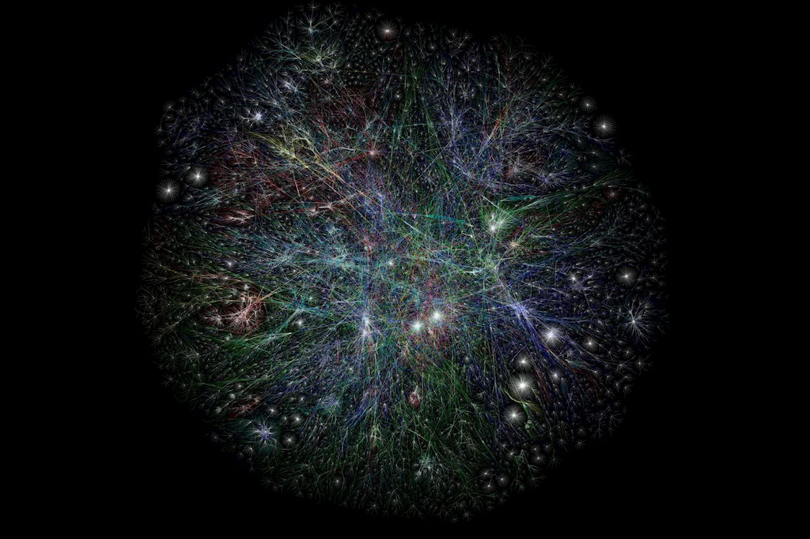
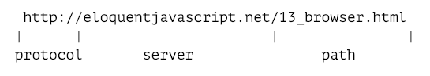
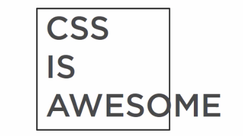

name: inverse
layout: true
class: center, middle, inverse
---


# Creative Coding I

### Prof. Dr. Lena Gieseke | l.gieseke@filmuniversitaet.de  

#### Film University Babelsberg KONRAD WOLF


---
layout: false

## Last Week 

### Session 02: Emergence

* p5 inspiration
* 10PRINT pattern
* Emergence


---
layout: false

## Last Week 

### Session 03: Instructions

--

>Imagine the clouds dripping. Dig a hole in your garden to put them in.  
  

  
--
  
.blockquote[
>Draw a line, pick a new color, move a bit.
]

  
--
  


???
.task[COMMENT:]  

* https://conditionaldesign.org/manifesto/

---

## Algorithmic Thinking

--
For defining an algorithm, you might need:

--
  
* **Decomposition**: Break a problem down into smaller pieces

--
* **Abstraction**: Reduce specific differences and make one solution work for multiple cases

--
* **Pattern Matching**: Find similarities


---
.header[Algorithmic Thinking]

## Example

> Sum up all numbers between 1-200. 

---
.header[Algorithmic Thinking | Example]

## Sum Up All Numbers Between 1-200 

### Decomposition

--

.left-even[
Let's start at the two ends:

* 1 + 200
* 2 + 199
* 3 + 198
* 4 + 197
* ...
]


---
.header[Algorithmic Thinking | Example]

## Sum Up All Numbers Between 1-200 

### Decomposition


.left-even[
Let's start at the two ends:

* 1 + 200
* 2 + 199
* 3 + 198
* 4 + 197
* ...
  

Each pair results in the sum of 201!
]


  
--
.right-even[
How many of these pairs will we have? 
]

---
.header[Algorithmic Thinking | Example]

## Sum Up All Numbers Between 1-200 

### Decomposition


.left-even[
Let's start at the two ends:

* 1 + 200
* 2 + 199
* 3 + 198
* 4 + 197
* ...
  

Each pair results in the sum of 201!
]

.right-even[
How many of these pairs will we have? 

* The last pair, we can create is 100 + 101

]

---
.header[Algorithmic Thinking | Example]

## Sum Up All Numbers Between 1-200 

### Decomposition


.left-even[
Let's start at the two ends:

* 1 + 200
* 2 + 199
* 3 + 198
* 4 + 197
* ...
  

Each pair results in the sum of 201!
]

.right-even[
How many of these pairs will we have? 

* The last pair, we can create is 100 + 101
* We have **100 pairs in total**

]


---
.header[Algorithmic Thinking | Example]

## Sum Up All Numbers Between 1-200 

### Solution

--
* We have 100 pairs
* Each pair's sum is 201
  
--
  
> **100 * 201 = 20.100**

---
.header[Algorithmic Thinking | Example]

## Sum Up All Numbers Between 1-200 

**100 * 201 = 20.100**
  
--
  
.blockquote[
> How about the sum of all numbers between 1-20.000?  
]
  
--
  
> Or rather between 1-n?

---
.header[Algorithmic Thinking | Example]

## Sum Up All Numbers Between 1-n 

### Abstraction

--
  
*Solution n=200*:  ** 100 * 201 = 20.100**   

--
*Solution n=20.000*:** 10.000 * 20.001 = 200.010.000**   

--
*Solution n=10*:** 5 * 11 = 55**   
  
  
--
<br >
  
*Solution n*: **(n \* 0.5) \* (n + 1)**  

  
???
.task[COMMENT:]  

---
.header[Algorithmic Thinking | Example]

## Sum Up All Numbers Between 1-n 

If you want to practice your algorithmic thinking, have a look at the different [Techniques for Adding the Numbers 1 to 100](https://betterexplained.com/articles/techniques-for-adding-the-numbers-1-to-100/).

---
.header[Algorithm]

## What do we see?

<iframe src="https://editor.p5js.org/legie/full/-HB6nto44" width="900" height="450" ></iframe>


???
.task[COMMENT:]  

* https://editor.p5js.org/legie/full/-HB6nto44

---
.header[Algorithm]

## Sub-Problems

1. *Line Drawing*: Each frame draw a line with start and end point in a certain range to the previous ones
2. *Movement*: The placement of the new start and end points follows each a direction
3. *Border collision*: Change direction if a start or end point hits a border
4. *Color*: Slowly change the line's color over time


???
.task[COMMENT:]  

A. https://editor.p5js.org/legie/sketches/PwBLEu8pn7  
B. https://editor.p5js.org/legie/sketches/9i2kF3Be6  
C. https://editor.p5js.org/legie/sketches/H-2RPs_jN  
D. https://editor.p5js.org/legie/sketches/LjBZTapQa  

---

## Programming Overview


---
.header[Programming Overview]

## Images

```js
let imgPanda;

function preload() {
    imgPanda = loadImage("panda.jpg");
}

function draw() {
    image(imgPanda, 50, 50);
}
```


???
.task[COMMENT:]  

* https://editor.p5js.org/legie/sketches/foUu9HUyH
* https://editor.p5js.org/legie/sketches/iWvfAz3Is
* https://editor.p5js.org/legie/sketches/5XhKQYG90
* https://editor.p5js.org/legie/sketches/GN4wMPz4x

* Animate images e.g. by changing their position like any other shape
* Store images in arrays and display them sequentially to animate image series
* Use `get(x, y)` and `set(x, y, color)` to return or set the color of the image at a specific pixel

---
.header[Programming Overview]

## Sound?


---

## Libraries

* p5 extends JavaScript

???
.task[COMMENT:]  

* The same way p5 is written to extend the base functionality of JavaScript, we can write code that further extends p5.  

--
* Additional libraries extend p5, e.g., for sound

???

* A library is code in regard to a certain topic, e.g. sound, that is somewhat generalized and of use in various contexts.
* Libraries should be compact and also as small as possible. That is one of the reasons why additional libraries are not simply added to p5 itself. 
 
--
* Written by different people


???
.task[COMMENT:]  

* Libraries are mostly written by other people or teams and it is easier to manage to keep the development of an additional library separated.


---

## Libraries

### Examples

Use the [ml5](https://learn.ml5js.org) for machine learning in an accessible and easy way.

.center[[[ml5]](https://learn.ml5js.org)]

---

## Libraries

### Examples

A library to create a [scribble effect](https://github.com/generative-light/p5.scribble.js):

 [[p5.scribble]](https://github.com/generative-light/p5.scribble.js)


???
.task[COMMENT:]  

* https://editor.p5js.org/legie/sketches/PtoiQsgKr


---

## Libraries

### Examples

A library to create a [a touch gui](https://github.com/L05/p5.touchgui):

.center[]  [[p5.touchgui]](https://github.com/L05/p5.touchgui)

---

## Libraries

You can find a list of the currently supported p5 libraries [on the p5 website](https://p5js.org/libraries/).

--

> Depending on your tasks, using a library can make your life much easier.

--

Keep in mind 

* The quality of the code and its documentation might vary

--
* If a library is listed on the official p5 website, it is probably ok

---

## Libraries

For loading libraries we have to take a look behind the scenes...

---
.header[Programming Overview]

## Sound

[p5.sound](https://p5js.org/reference/#/libraries/p5.sound)

```js 
let song;

function preload() {
    song = loadSound('song.mp3');
}
```

```js
song.playMode('restart');
song.setVolume(0.1);
song.play();

...

song.stop();
```


---
template: inverse

### Session 04:  
# Connection


---
layout: false

## Session 04: Connection

--
* The Web

--
* A Local Web

--
* A Basic Modern Website

---

## Learning Objectives

With this session you

--
* understand how content is rendered and accessed on a web page, and

--
* have a working local setup for developing a dynamic webpage.


???
.task[COMMENT:]  

* have an understanding of working with web page elements,
* have some practical experiences setting up a responsive website.

---
template:inverse

# The Web

???

.task[ASK:]  

* How would you explain to an alien what the internet is?
* How would you explain to an alien what the internet technically is?

---

## The Web

The World Wide Web is 

--
* a set of protocols and files that 

--
* allow us to visit web pages in a browser. 

--

The *web* part in the name refers to the fact that such **pages can easily link to each other**, thus connecting into a huge mesh that users can move through.

???


--
  
<br >
  
The internet is the underlying networking infrastructure, a massive network of networks.


???
.task[COMMENT:]  

* When we talk about the Internet, we are talking about the hardware, the computers, the routers, cables, etc. that make up this network. In the physical world, different protocols are used to distribute a sea of information around the world.

https://www.differkinome.com/articles/internet/difference-between-www-world-wide-web-and-internet.html

--

The World Wide Web is not to be confused with the Internet as a whole. 


???
.task[COMMENT:]  

'www' is a way of accessing the information available on the Internet. It is a model for the exchange of information on the Internet. The World Wide Web (www) uses the HTTP protocol, one of the languages used to transmit information over the network. The web uses browsers such as Chrome, Internet Explorer and Firefox to access millions of web pages. These pages are connected in amazing ways via hyperlinks. It's not just text. Web pages are full of graphics, images and videos.

Web or www is just one of the many ways information is distributed on the Internet. It is the Internet and not the web that people use to send and receive emails. These emails depend on the SMTP, Instant Messaging, FTP and Usenet message groups.

It is therefore clear that the Web is only a subset of the Internet and not a synonym for the Internet. Although the two are closely related, the two terms cannot be used interchangeably.

https://www.differkinome.com/articles/internet/difference-between-www-world-wide-web-and-internet.html
  

---

## The Web

Based on this functionalities the www became a mysterious place, almost beyond our capabilities of comprehension.

--
  
<br >
  
*Remember emergence?*


---
template:inverse

## Portraits of The Web

---

.center[  
[[Extreme Tech]](https://www.extremetech.com/extreme/172099-beautiful-internet-maps-visualize-the-striking-interconnectedness-of-the-web)]

---

## Portraits of The Web

> If Google were an artist, what would it paint?  
  
--
  
The Google eye view of the world would be of a vast landscape of connections; in the words of William Gibson in [Neuromancer](https://en.wikipedia.org/wiki/Neuromancer), a world of:

--

> Cyberspace: A consensual hallucination experienced daily by billions of legitimate operators, in every nation, by children being taught mathematical concepts...A graphical representation of data abstracted from the banks of every computer in the human system. Unthinkable complexity. Lines of light ranged in the non-space of the mind, clusters and constellations of data. Like city lights, receding...
  

???
.task[COMMENT:]  

Cyberspace: A consensual hallucination experienced daily by billions of legitimate operators, in every nation, by children being taught mathematical concepts...A graphical representation of data abstracted from the banks of every computer in the human system. Unthinkable complexity. Lines of light ranged in the non-space of the mind, clusters and constellations of data. Like city lights, receding...
  	 
William Gibson, Neuromancer (New York: Berkley Publishing Group, 1989), pp. 128.
  
---

## Portraits of The Web

> The world wide web is a world we never see other than in fleeting glimpses through the narrow portal of our web browser's window...until now.

[[Data Portraits]](http://www.dataportraits.co.uk/)

---
.center[  
[[wired]](https://www.wired.co.uk/article/internet-artworks)]


---
.center[  
[[Extreme Tech]](https://www.extremetech.com/extreme/172099-beautiful-internet-maps-visualize-the-striking-interconnectedness-of-the-web)]


???
.task[COMMENT:]  

* https://www.wired.co.uk/article/internet-artworks

---

## Portraits of The Web

A research project “that sort of went wrong”...

--
* Created by Martin Dade-Robertson

--
* Intended to explore how various resources on a website are linked together
  
--
  
* The end result turned out to be of little scientific use — but, as luck would have it, incredibly beautiful

.footnote[[[Sebastian Anthony - Beautiful internet maps [...]]](https://www.extremetech.com/extreme/172099-beautiful-internet-maps-visualize-the-striking-interconnectedness-of-the-web)]

---

## Portraits of The Web

* Special software analyzes a single web page
    * It sounds like a text parser combined with a web crawler
    * Scans a web page for the various resources contained therein (text, images, JavaScript), and also for links out to other pages/resources
* Links between various elements on a page, and to external resources, are then visualized
* Details are secret

.footnote[[[Sebastian Anthony - Beautiful internet maps [...]]](https://www.extremetech.com/extreme/172099-beautiful-internet-maps-visualize-the-striking-interconnectedness-of-the-web)]

???

The exact details of how the maps area drawn — where the dots are placed relative to each other — is somewhat secret. Dade-Robertson says that pages that are linked together tend to be closer together, with relatively unrelated pages finding their way to the edge of the map.

---
.center[  
[[Extreme Tech]](https://www.extremetech.com/extreme/172099-beautiful-internet-maps-visualize-the-striking-interconnectedness-of-the-web)]

---
.center[  
[[Extreme Tech]](https://www.extremetech.com/extreme/172099-beautiful-internet-maps-visualize-the-striking-interconnectedness-of-the-web)]

---

## The Map of The Internet

---
.center[  
[[Internet Map]](http://internet-map.net/)]

---

## The Map of The Internet

In [The Map of the Internet](http://internet-map.net/) every site is a circle on the map, and its size is determined by website traffic, the larger the amount of traffic, the bigger the circle.  

<br >

Users’ switching between websites forms links, and the stronger the link, the closer the websites tend to arrange themselves to each other.

---
.center[  
[[Internet Map]](http://internet-map.net/)]

---

.center[  
[[Internet Map]](http://internet-map.net/)]

---
## The Opte Internet Map

.center[  
[[Nab amplify](https://amplify.nabshow.com/articles/a-trippy-visualization-charts-the-internets-growth-since-1997-source-wired/), [Opte](https://www.opte.org/)]]

???
.task[COMMENT:]  

* a visualization of the web that used his proprietary network mapping tool to map the entire internet.
* working full time as a penetration tester — a hacker companies hire to find weaknesses in their own digital systems

---
## The Opte Internet Map

<iframe width="860" height="512" src="https://www.youtube.com/embed/-L1Zs_1VPXA?si=hGSt8RnbUFdd5qch" title="YouTube video player" frameborder="0" allow="accelerometer; autoplay; clipboard-write; encrypted-media; gyroscope; picture-in-picture; web-share" allowfullscreen></iframe> [[Opte]](https://www.opte.org/)

---
## The Opte Internet Map

<iframe width="860" height="512" src="https://www.youtube.com/embed/BUtlP1kVo-4?si=o0wJNu7AulAGsKPb" title="YouTube video player" frameborder="0" allow="accelerometer; autoplay; clipboard-write; encrypted-media; gyroscope; picture-in-picture; web-share" allowfullscreen></iframe>

---
## The Opte Internet Map

<iframe width="860" height="512" src="https://www.youtube.com/embed/BUtlP1kVo-4?si=o0wJNu7AulAGsKPb" title="YouTube video player" frameborder="0" allow="accelerometer; autoplay; clipboard-write; encrypted-media; gyroscope; picture-in-picture; web-share" allowfullscreen></iframe> [[Opte]](https://www.opte.org/)

---
## The Opte Internet Map

<iframe width="860" height="512" src="https://www.youtube.com/embed/DdaElt6oP6w?si=ftyF4TON9EQjLMqz" title="YouTube video player" frameborder="0" allow="accelerometer; autoplay; clipboard-write; encrypted-media; gyroscope; picture-in-picture; web-share" allowfullscreen></iframe> [[Opte]](https://www.opte.org/)


---
template:inverse

### *How did the omnipresence of the world wide web change us?*


???
.task[COMMENT:]  

* E.g., how we think, feel and live, and society?


---
template:inverse


# Ingredients For The Web

---

## Ingredients For The Web


 

.footnote[[B. Luijbregts. 2020. [*HTML, CSS, and JavaScript: The Big Picture*](https://www.pluralsight.com/courses/html-css-javascript-big-picture). Pluralsight]]


???

* Resources, like HTML documents, images, or other files are the content that we want to use, websites that we want to browse, images to look at, files that we want to share.
* At the most basic level, whenever a browser needs a file that is hosted on a web server, the browser requests the file via HTTP. HTTP is basically a set of rules for transferring files (text, graphic images, sound, video, and other multimedia files) within the world wide web. When the request reaches the correct (hardware) web server, the (software) HTTP server accepts the request, finds the requested document, and sends it back to the browser, also through HTTP. (If the server doesn't find the requested document, it returns a 404 response instead.)

---
.header[Ingredients For The Web]

## URL (Uniform Resource Locator)

--

Unique identification of the resources, used by the browser to access files:


???
.task[COMMENT:]  

URLs uniquely identify the resources so that your web browser can show them to you or download them. Every resource on the web has a unique URL.  

--
<br >
  


.footnote[[M. Haverbeke. 2018. [*HTTP and Forms*](https://eloquentjavascript.net/18_http.html). Eloquent Javascript.]]

???

* If you type this URL into your browser’s address bar, the browser will try to retrieve and display the document at that URL. 


---
.header[Ingredients For The Web]

## URL (Uniform Resource Locator)


.footnote[[M. Haverbeke. 2018. [*HTTP and Forms*](https://eloquentjavascript.net/18_http.html). Eloquent Javascript.]]

--

The browser

--
1. Identifies the server address and converts the URL into a request message

--
2. Makes a connection, using the HTTP protocol, to the server at that address 

--
3. Ask for the resource `13_browser.html`  

--
4. Displays the document, the server has responded with (if all goes well)


???

* Machines connected to the Internet get an IP address, which is a number that can be used to send messages to that machine, and looks something like 149.210.142.219 or 2001:4860:4860::8888. But lists of more or less random numbers are hard to remember and awkward to type, so you can instead register a domain name for a specific address or set of addresses.  

---
.header[Ingredients For The Web]

## HTTP

* For the world wide web a set of rules for transferring files, e.g., text, graphic images, sound, video, and other multimedia files

???

.task[COMMENT:]  

* The Hypertext Transfer Protocol, or HTTP, is the magic that can retrieve documents and communicate them to your web browser.
* I'm not going to go into HTTP in this course, you just need to know what it is for.


The HTTP protocol is basically a set of rules for transferring files (text, graphic images, sound, video, and other multimedia files) within the world wide web.

--


---
.header[Ingredients For The Web]

## Server


???
.task[COMMENT:]  

* What is a server?

--

> A server is a computer program or device that provides a service to another computer program and its user, also known as the client.
  

.footnote[[[techtarget](https://www.techtarget.com/whatis/definition/server)]]
  
???
.task[COMMENT:]  

* In the client/server programming model, a server program awaits and fulfills requests from client programs, which might be running in the same, or other computers

  
  
--

* Client/server programming model

???
.task[COMMENT:]  

* In the client/server programming model, a server program awaits and fulfills requests from client programs, which might be running in the same, or other computers
* The term server can refer to a physical machine, a virtual machine or to software that is performing server services. The way that a server works varies considerably depending on how the word server is being used. 

--
* Can refer to a physical machine, a virtual machine or to software that is performing server services

???
.task[COMMENT:]  

* The term server can refer to a physical machine, a virtual machine or to software that is performing server services. The way that a server works varies considerably depending on how the word server is being used. 


One more time, a server is a computer program or device that provides a service to another computer program and its user, also known as the client. In a data center, the physical computer that a server program runs on is also frequently referred to as a server. That machine might be a dedicated server or it might be used for other purposes.

In the client/server programming model, a server program awaits and fulfills requests from client programs, which might be running in the same, or other computers. A given application in a computer might function as a client with requests for services from other programs and as a server of requests from other programs.

The term server can refer to a physical machine, a virtual machine or to software that is performing server services. The way that a server works varies considerably depending on how the word server is being used.  

---
.header[Ingredients For The Web]

## Webserver

A server that serves up the HTML documents and other resources upon request from a browser.

--

* Hardware: a computer that stores web server software and a website's component files


???
.task[COMMENT:]  

* Hardware: a computer that stores web server software and a website's component files (for example, HTML documents, images, CSS stylesheets, and JavaScript files). A web server connects to the Internet and supports physical data interchange with other devices connected to the web.

--
* Software: controls how web users access hosted files; at a minimum, this is an HTTP server


???
.task[COMMENT:]  
* Software: control how web users access hosted files. At a minimum, this is an HTTP server. An HTTP server is software that understands URLs (web addresses) and HTTP (the protocol your browser uses to view webpages). An HTTP server can be accessed through the domain names of the websites it stores, and it delivers the content of these hosted websites to the end user's device.


---
.header[Ingredients For The Web]

## Webserver


.center[[[⬀]](https://developer.mozilla.org/en-US/docs/Learn/Common_questions/What_is_a_web_server)]

???
.task[COMMENT:]  


At the most basic level, whenever a browser needs a file that is hosted on a web server, the browser requests the file via HTTP. HTTP is basically a set of rules for transferring files (text, graphic images, sound, video, and other multimedia files) within the world wide web. When the request reaches the correct (hardware) web server, the (software) HTTP server accepts the request, finds the requested document, and sends it back to the browser, also through HTTP. (If the server doesn't find the requested document, it returns a 404 response instead.)

[[7]](https://developer.mozilla.org/en-US/docs/Learn/Common_questions/What_is_a_web_server)

--

<br >

Each webserver has an unique address on the internet, a URL.


???


 

.footnote[[B. Luijbregts. 2020. [*HTML, CSS, and JavaScript: The Big Picture*](https://www.pluralsight.com/courses/html-css-javascript-big-picture). Pluralsight]]


* Resources, like HTML documents, images, or other files are the content that we want to use, websites that we want to browse, images to look at, files that we want to share.


---
template:inverse


# Ingredients For A Webpage

---

## Ingredients For A Webpage

### Document Types

???

.task[ASK:]  


What are the three main components of the web?

--
* *Displaying* with HTML

--
* *Styling* with CSS

--
* *Interacting* with JavaScript

---
.header[Ingredients For A Webpage]

## HTML

* A standard markup language for creating web pages
* Controls the structure of the pages  

???

.task[COMMENT:]  

* a markup language is a system for annotating a document in a way that is syntactically distinguishable from the text
* The things that you see in websites and web applications are rendered by the web browser from HTML documents.
* These are documents with the HTM or HTML extension that are served by web servers on unique URLs.

--

> Certain HTML elements can be understood by all web browsers.


 
???


---
.header[Ingredients For A Webpage | HTML]

## Document Structure

.left-even[
```html
<!doctype html>
<html>
    <head>
        <title>My home page</title>
    </head>
    <body>
        <h1>My home page</h1>
        <p>Hello, I am Marijn and this is my home page.</p>
        <p>I also wrote a book! Read it
            <a href="http://eloquentjavascript.net">here</a>.
        </p>
    </body>
</html>
```

.footnote[[B. Luijbregts. 2020. [*HTML, CSS, and JavaScript: The Big Picture*](https://www.pluralsight.com/courses/html-css-javascript-big-picture). Pluralsight] [M. Haverbeke. 2018. [*HTTP and Forms*](https://eloquentjavascript.net/18_http.html). Eloquent Javascript.]]
]


???

* The first element in any HTML document is the DOCTYPE element. This is strictly not an element that is part of the HTML standard, but it does tell the browser that this is an HTML document and tells it which version of HTML it is written in. The DOCTYPE element here is for HTML5.
* Next are the HTML elements. Every element has an open and a close element. This tells the browser that everything in here is HTML.
  * Then there is the head element. This can include a title for the document, scripts, styles, metainformation, and more.
  * And finally, there is the body element that contains everything that you want to be displayed on the screen.
  * These are all the elements that are necessary in an HTML document. All web browsers understand these elements and use them to display content on the screen.

You can imagine an HTML document as a nested set of boxes. Tags such as `<body>` and `</body>` enclose other tags, which in turn contain other tags or text:

--
.right-even[
Imagine an HTML document as a nested set of boxes:
* Tags such as `<body>` and `</body>` enclose other tags, which in turn contain other tags or text...
]

---
.header[Ingredients For A Webpage | HTML]

## Document Structure


.left-even[
```html
<!doctype html>
<html>
    <head>
        <title>My home page</title>
    </head>
    <body>
        <h1>My home page</h1>
        <p>Hello, I am Marijn and this is my home page.</p>
        <p>I also wrote a book! Read it
            <a href="http://eloquentjavascript.net">here</a>.
        </p>
    </body>
</html>
```
]

.right-even[

]


---
.header[Ingredients For A Webpage | HTML]

## Document Object Model

--

* Created by the browser, when a web page is loaded
* DOM for short

> For each box, there is an object, which we can interact with. 

???
.task[COMMENT:]  

* When a web page is loaded, the browser creates a ***Document Object Model*** of the page, or DOM for short.


---
.header[Ingredients For A Webpage | HTML]

## Document Object Model


.left-even[
```html
<!doctype html>
<html>
    <head>
        <title>My home page</title>
    </head>
    <body>
        <h1>My home page</h1>
        <p>Hello, I am Marijn and this is my home page.</p>
        <p>I also wrote a book! Read it
            <a href="http://eloquentjavascript.net">here</a>.
        </p>
    </body>
</html>
```
.footnote[[B. Luijbregts. 2020. [*HTML, CSS, and JavaScript: The Big Picture*](https://www.pluralsight.com/courses/html-css-javascript-big-picture). Pluralsight] [M. Haverbeke. 2018. [*HTTP and Forms*](https://eloquentjavascript.net/18_http.html). Eloquent Javascript.]]
]

.right-even[

]

---
.header[Ingredients For A Webpage | HTML]

## Document Object Model


.left-even[
```html
<!doctype html>
<html>
    <head>
        <title>My home page</title>
    </head>
    <body>
        <h1>My home page</h1>
        <p>Hello, I am Marijn and this is my home page.</p>
        <p>I also wrote a book! Read it
            <a href="http://eloquentjavascript.net">here</a>.
        </p>
    </body>
</html>
```
.footnote[[B. Luijbregts. 2020. [*HTML, CSS, and JavaScript: The Big Picture*](https://www.pluralsight.com/courses/html-css-javascript-big-picture). Pluralsight] [M. Haverbeke. 2018. [*HTTP and Forms*](https://eloquentjavascript.net/18_http.html). Eloquent Javascript.]]
]

.right-even[

]


???

.task[ASK:]  

* What is a tree structure

* We call this data structure a tree as it has a branching structure, has no cycles (a node may not contain itself, directly or indirectly), and has a single, well-defined root. 
* Yes, moving through the tree and finding elements can be cumbersome...
* The global binding `document` gives us access to these objects through `documentElement` properties. This means that `document.documentElement` is the root of the above tree. Its `documentElement` property refers to the object representing the `<html>` tag.  
* The nodes have properties such as parentNode and childNodes, which can be used to navigate through this tree.


---
.header[Ingredients For A Webpage | HTML]

## HTML5

--

.left-even[
* A new version of HTML with new elements
* Elements have become much more expressive 

.footnote[[B. Luijbregts. 2020. [*HTML, CSS, and JavaScript: The Big Picture*](https://www.pluralsight.com/courses/html-css-javascript-big-picture). Pluralsight] [M. Haverbeke. 2018. [*HTTP and Forms*](https://eloquentjavascript.net/18_http.html). Eloquent Javascript.]]
]

???

.task[COMMENT:]   

* HTML5 elements explain what they are used for so that the browser can understand them better and search engines know better which parts of the document are actual data and which parts are metainformation. 


--

.right-even[
    
]

.footnote[]

???
.task[COMMENT:]  

* A header element, which represents a container for introductory content or a set of navigational links. This can contain a nav tag that defines a set of navigation links. 
* There is the main tag that specifies the main content of a document, and inside the main tag you can find things like an article tag that specifies independent, self-contained content, and an aside tag that defines some content aside from the content it is placed in. 
* And finally, just like there is a header element, there is also a footer tag that contains things like copyright or the address of your company. 
* These types of tags are geared towards providing more nuance to the HTML markup language.  
 

---
.header[Ingredients For A Webpage ]

## CSS

* Describes the presentation of a HTML document

???

* Displaying text and images on the web is nice, but we need to be able to style the content so that it is readable and useable.

--

* Enables the separation of content and style

???

* Using CSS like this in external style sheet files provides maximum maintainability and reusability. 

--

* In the html file, we indicate with css file to use (which must also be hosted by the webserver)


???
.task[COMMENT:]  

* To work with CSS, we need to indicate in the HTML which CSS or .css file to use (and also host that CSS document on a web server)

---
.header[Ingredients For A Webpage]
  
## CSS


???
.task[COMMENT:]  

* To work with CSS, all we need to do is to indicate in the HTML which CSS file to use and to host that file on a web server. 


---
.header[Ingredients For A Webpage | CSS]
  
.center[]

???

* Styling HTML in a web browser is still difficult
* It is important to keep in mind is that it is the web browser that does all the work when it styles HTML! It takes the HTML file, interprets it, and applies the styles to it that are described in the CSS document. 


---
.header[Ingredients For A Webpage]
  
## CSS

> Keep in mind is that it is the web browser that does all the work when it styles HTML!  

--

The browser

* interprets the HTML file
* applies the styles that are described in the CSS document


---
.header[Ingredients For A Webpage | CSS]
  
## Syntax Selectors

--

* Indicate to what html elements a property should be applied to
* There are different types of selectors 

---
.header[Ingredients For A Webpage | CSS]
  
## Syntax Selectors

.center[]


???
.task[COMMENT:]  

* You can find all possible selector in this [CSS Selector Reference](https://www.w3schools.com/cssref/css_selectors.php). However, we are only going to have a look at the most common selectors to get started.


---
.header[Ingredients For A Webpage | CSS | Syntax Selectors]
  
##  Element Selector

The element selector selects HTML elements based on the element name.

<br >
  
Example: all `<p>` elements on the page will be center-aligned, with a red text color: 
```css
p {
    text-align: center;
    color: red;
}
```

[https://www.w3schools.com/CSS/tryit.asp?filename=trycss_syntax_element](https://www.w3schools.com/CSS/tryit.asp?filename=trycss_syntax_element)

---
.header[Ingredients For A Webpage | CSS | Syntax Selectors]
  
## ID Selector

The id of an element is unique within a page, so with the id selector you can identify  unique elements.


???
.task[COMMENT:]  

* The id selector uses the id attribute of an HTML element to identify specific elements 

--

<br >
  
Example: the CSS rule below will be applied to the HTML element with id="para1": 

```css
#para1 
{
    text-align: center;
    color: red;
}
```

[https://www.w3schools.com/CSS/tryit.asp?filename=trycss_syntax_id](https://www.w3schools.com/CSS/tryit.asp?filename=trycss_syntax_id)


???
.task[COMMENT:]  

* To select an element with a specific id, write a hash (#) character, followed by the id of the element.

---
.header[Ingredients For A Webpage | CSS | Syntax Selectors]
  
## Class Selector

The class selector selects HTML elements with a specific class attribute.
  
<br >
  
--
Example: in this example all HTML elements with class="center" will be red and center-aligned: 

```css
.center 
{
    text-align: center;
    color: red;
}
```

[https://www.w3schools.com/CSS/tryit.asp?filename=trycss_syntax_class](https://www.w3schools.com/CSS/tryit.asp?filename=trycss_syntax_class)


???
.task[COMMENT:]  

* To select elements with a specific class, write a period (.) character, followed by the class name.

---
.header[Ingredients For A Webpage | CSS | Syntax Selectors]
  
## Class Selector

You can specify that only specific HTML elements should be affected by a class.  

--
<br >
  

Example: in this example only `<p>` elements with class="center" will be red and center-aligned: 

```css
p.center 
{
  text-align: center;
  color: red;
}
```
[https://www.w3schools.com/CSS/tryit.asp?filename=trycss_syntax_element_class](https://www.w3schools.com/CSS/tryit.asp?filename=trycss_syntax_element_class)

---
.header[Ingredients For A Webpage | CSS | Syntax Selectors]
  
## Class Selector
 
HTML elements can also refer to more than one class.
   
--
  
<br >
  
Example: in this example the `<p>` element will be styled according to class="center" and to class="large": 

```html
<p class="center large">This paragraph refers to two classes.</p>
```
[https://www.w3schools.com/CSS/tryit.asp?filename=trycss_syntax_element_class2](https://www.w3schools.com/CSS/tryit.asp?filename=trycss_syntax_element_class2)

???
.task[COMMENT:]  

* ID's are unique Each element can have only one ID. Each page can have only one element with that ID Classes are NOT unique You can use the same class on multiple elements. You can use multiple classes on the same element.
* The id selector is used to specify a style for a single, unique element. on other hand The class selector is used to specify a style for a group of elements. Unlike the id selector, the class selector is most often used on several elements.and this allows you to set a particular style for many HTML elements with the same class.


Reference: [W3 Schools - CSS Selectors](https://www.w3schools.com/CSS/css_selectors.asp)

---
.header[Ingredients For A Webpage | CSS | Syntax Selectors]
  
## Priorities

--

* CSS is called cascading, as in Cascading Style Sheets
* Properties are applied in a specific order based on priorities


???
.task[COMMENT:]  

* CSS is called cascading, as in Cascading Style Sheets, because properties are applied in a specific order based on priority.

--

This is the ascending order of priorities:

* Element selectors
* Class attributes
* ID attributes
* The important tag

---
.header[Ingredients For A Webpage | CSS | Syntax Selectors]
  
## Priorities

.left-even[]

???
.task[COMMENT:]  

How will the following look like?

* Element selectors
* Class attributes
* ID attributes
* The important tag


--
.right-even[

<br >
    
]


???
.task[COMMENT:]  

* You can create large and complex hierarchies within CSS, which can be very useful and can also make your CSS difficult to read and maintain.

---
.header[Ingredients For A Webpage | CSS]
  
## Responsive Design

--

* A webpage adapts itself to any device the user may use
* Tries to be as accessible and easy to navigate as possible for each device

--

.center[[[uxplanet]](https://uxplanet.org/what-is-responsive-design-an-introduction-5fe1775aa9ec)]

--
<br >
  
Responsive web design is also often described as *fluid* design.


???
.task[COMMENT:]  

* This means that a webpage might look quite differently depending on the device with which it is looked at. 
* Responsive web design is also often described as *fluid* design as "it is like transforming the content into water, mimicking the liquid’s ability to fill any type of glass" ([uxplanet](https://uxplanet.org/what-is-responsive-design-an-introduction-5fe1775aa9ec)). 
* Hence, a responsive webpage can be viewed on anything from a large screen to a smart phone to an watch and might look slightly different on each device:
* With the requirement of responsivenss there are many, many aspects to consider for the development of a web page (e.g., navigation, layout, sizings and the visual hierarchy, images). We will practice setting up a responsive site a litte in the exercise. For now, keep in mind that responsiveness is crucial for modern web development and you will need to look into it further if you ever want to develop a professional webpage.

---
.header[Ingredients For A Webpage | CSS | Responsive Design]
  
## Mobile-First

--

> We start with the development of the mobile webpage, make it the default and derive all other versions from the mobile layout.

???
.task[COMMENT:]  

* Hand in hand with the idea of responsiveness came a paradigm shift in webdesign. Even if you want to develop a webpage that looks good on any device you have to start somewhere. In the old days, the development would start with the desktop version, as that would be the most viewed layout. However, nowadays most web traffic comes from mobile devices (e.g., see [Mobile vs Desktop Usage Statistics for 2021/2022](https://research.com/software/mobile-vs-desktop-usage)) and with that the mobile layout is the most viewed version! Hence, web development shifted to a *mobile-first* paradigm. This means that one starts with the development of the mobile page and then derives all other versions from the mobile layout.

---
.header[Ingredients For A Webpage | CSS | Responsive Design]
  
## Media Queries

* CSS3
* Detect the capabilities of the used display device
* Define different style rules for the different devices

???
.task[COMMENT:]  

* Modern media queries (CSS3) let you detect the capabilities of the display device and let you define different style rules for the different capabilities of devices. 

--

Media queries can be used to check, e.g.:

* width and height of the viewport
* width and height of the device
* orientation (is the tablet/phone in landscape or portrait mode?)
* resolution


???
.task[COMMENT:]  

* As first step, you should always adjust the look of a webpage depending on the device it is view at. For that you adjust the  css of the page, for example with the help of css *media queries*. 

#### Syntax

A media query consists of a media type and can contain one or more expressions, which resolve to either true or false.

```css
@media not|only mediatype and (expressions) 
{
    CSS-Code;
}
```

The result of the query is true if the specified media type matches the type of device the document is being displayed on and all expressions in the media query are true. When a media query is true, the corresponding style sheet or style rules are applied, following the normal cascading rules.

---
.header[Ingredients For A Webpage | CSS | Responsive Design]
  
## Media Queries


```css
body
{
    background-color: pink;
}

@media screen and (min-width: 480px) 
{
    body 
    {
        background-color: lightgreen;
    }
}
```
[Test it online!](https://www.w3schools.com/Css/tryit.asp?filename=trycss3_media_queries1)


???
.task[COMMENT:]  

* The following example changes the background-color to lightgreen if the viewport is 480 pixels wide or wider (if the viewport is less than 480 pixels, the background-color will be pink):


---
.header[Ingredients For A Webpage | CSS | Responsive Design]
  
## Media Queries

.left-even[
```css
/* Set the background color of body to tan */
body {
    background-color: tan;
}
/* On screens that are 992px or less, set the background color to blue */
@media screen and (max-width: 992px) {
    body {
        background-color: blue;
    }
}
/* On screens that are 600px or less, set the background color to olive */
@media screen and (max-width: 600px) {
    body {
        background-color: olive;
    }
}
```
]

.right-even[  

[Test it online!](https://www.w3schools.com/Css/tryit.asp?filename=trycss_mediaqueries_ex1)
]


???
.task[COMMENT:]  

* Hence, for different layouts for different devices, you define multiple media queries:
* Reference: [[CSS Media Queries]](https://www.w3schools.com/css/css3_mediaqueries.asp)

#### Breakpoints

So called CSS *breakpoints* help you to divide your webpage into manageable elements and establish common sizes:

  
[[uxplanet]](https://uxplanet.org/what-is-responsive-design-an-introduction-5fe1775aa9ec)

Breakpoints are a topic to investigate further if you continue your web development journey beyond this class.


---
.header[Ingredients For A Webpage]

## JavaScript

--

* Interpreted programming language

???

* interpreted programming language means it runs as is and you don't need to compile it to execute your code

--
* Needed for anything beyond the structure and style of a web page
* Can manipulate HTML, CSS and talk to servers

???

* Every time a web page does more than just sit there and display static information for you to look at — displaying timely content updates, interactive maps, animated 2D/3D graphics, scrolling video jukeboxes, etc. — you can bet that JavaScript is probably involved. 

--
* Dominant choice for *non-static* content as all major web browsers have a dedicated JavaScript engine

???

* All major web browsers have a dedicated JavaScript engine to execute it
* As a multi-paradigm language, JavaScript supports event-driven, functional, object-oriented and prototype-based programming styles (we will come back to programming paradigms later). Although there are strong outward similarities between JavaScript and Java, including language name, syntax, and respective standard libraries, they are two distinct languages are and differ greatly in design.

--


> *Dynamic* refers here to an application that can change its content, appearance, and functionality in response to user input, system or external events, and information, e.g., from a databases.

.footnote[[[ramotion](https://www.ramotion.com/blog/dynamic-web-application-development/)]]

???
.task[COMMENT:]  

* As a multi-paradigm language, JavaScript supports event-driven, functional, object-oriented and prototype-based programming styles


---
.header[Ingredients For A Webpage]

## JavaScript


.center[]  
[[W3 Schools]](https://www.w3schools.com/Js/tryit.asp?filename=tryjs_intro_inner_html)

???

.task[COMMENT:]  

* **Go to link**
* JavaScript is used here to select an HTML element and alter one of its properties.
* When you click the button, the onclick event will execute, and that executes this line of code, which is JavaScript.
    * This is inline JavaScript. You can basically write it anywhere in HTML, just like you can have inline CSS.
* This particular JavaScript code first selects an element with the ID of demo, and that is this paragraph element here, and it then sets the innerHTML property of that element to the given new value.

---

## Ingredients For The Web


.center[] 

.footnote[[B. Luijbregts. 2020. [*HTML, CSS, and JavaScript: The Big Picture*](https://www.pluralsight.com/courses/html-css-javascript-big-picture). Pluralsight]]


---

## Ingredients For A Webpage

.center[] 

.footnote[[B. Luijbregts. 2020. [*HTML, CSS, and JavaScript: The Big Picture*](https://www.pluralsight.com/courses/html-css-javascript-big-picture). Pluralsight]]


???

* Show p5 setup https://editor.p5js.org/
  
* Any web page or application consists out of three main documents, HTML that contains content like text and images, CSS to style the HTML, and JavaScript to make it interactive. 


* These documents are hosted on a web server that exposes them to the internet using unique URLs.
* Then, web browsers that are used from client computers can access these documents through the HTTP, or Hypertext Transfer Protocol.
* As a frontend developer, you just need to worry about creating the documents and putting them on the web server. Once the documents are on the client machine, the web browser interprets them and styles the HTML with CSS and loads the JavaScript to be executed.


---
template:inverse

# Fontend vs. Backend

???

TASK: What is the difference?
There is - as far as I know it - no common and clear definition of font- and backend development. I agree with the following.

.center[[[ref]]()]

---
## Fontend vs. Backend

> Client/server or better bowser/server model

  
* Frontend: client
* Backend: server

???
.task[COMMENT:]  

This means that we have changed programmatically only what the client, in our case a browser, can computer and execute. Specifically, we have done DOM-manipulations (e.g., we created and changed elements from a website) - but that is about it.

The most common frontend and back-end scenario is based on a client-server model, which describes the relationship of cooperating programs in an application. In such a relationship, the server provides a function or service to one or many clients, which initiate requests for such services [[1]](https://en.wikipedia.org/wiki/Client%E2%80%93server_model). The client-server model is not limited to the context of web development but has many different application scenarios.

In the web development context, the client is usually considered the frontend and the server the backend [[9]](https://en.wikipedia.org/wiki/Frontend_and_backend). For a bit more information on servers and web server, read the section [A Dynamic Web Application - Server](#server).

<!-- Here, client and servers talk to each other through the World Wide Web, most often via Http requests. The client will, for example, send to the server (or better *requests from the server*) a character string called uniform resource locator (URL), which identifies specific data, e.g. .html & .css, which the server sends back to the client as response. The data is transferred using the Hypertext Transfer Protocol (HTTP).  -->


---
  
[[evertop]](https://www.evertop.pl/en/frontend-vs-backend/) 


---
.header[Ingredients For A Webpage | Fontend vs. Backend Development]

## Frontend

* Manages everything that users visually see in their browser or application
* Responsible for the look and feel of a site

.footnote[[[Team Tree House]](https://blog.teamtreehouse.com/i-dont-speak-your-language-frontend-vs-backend) [[Course Report]]([#4-front-end-vs-back-end-development](https://www.coursereport.com/blog/front-end-development-vs-back-end-development-where-to-start)]


???
.task[COMMENT:]  

The “frontend” of the web is the part of the web that you can see and interact with. The frontend usually consists of two parts: the web design and front end web development. Hence, the task can range from work done in Photoshop to coding using HTML, CSS, JavaScript.

Definition: Front end development manages everything that users visually see first in their browser or application. Front end developers are responsible for the look and feel of a site. 

* If you book a flight or buy concert tickets, you usually open a website and interact with the frontend. Once you’ve entered that information, the application stores it in a database that was created on a server. 

--

Fontend development can mean two aspects:

1. The design of a webpage
2. The development of what you see of a webpage

--
  
...or both!


---
.header[Ingredients For A Webpage | Fontend vs. Backend Development]

## Backend

* The server side of an application 
* Everything that communicates, e.g., between a database and the browser

.footnote[[[Team Tree House]](https://blog.teamtreehouse.com/i-dont-speak-your-language-frontend-vs-backend) [[Course Report]]([#4-front-end-vs-back-end-development](https://www.coursereport.com/blog/front-end-development-vs-back-end-development-where-to-start)]


???
.task[COMMENT:]  

Backend technologies usually consist of languages like PHP, Ruby, Python, etc but you can also used pure JavaScript. Frameworks make backend development easier and faster. 

Definition: Back end development refers to the server side of an application and everything that communicates between the database and the browser.

[[Team Tree House]](https://blog.teamtreehouse.com/i-dont-speak-your-language-frontend-vs-backend) [[Course Report]]([#4-front-end-vs-back-end-development](https://www.coursereport.com/blog/front-end-development-vs-back-end-development-where-to-start)

--

The backend usually consists of three parts:

* Server 
* Application 
* Database 


???

* If you book a flight or buy concert tickets, you usually open a website and interact with the frontend. Once you’ve entered that information, the application stores it in a database that was created on a server. 
* Many web professionals that are just getting into the field may have heard a lot of people talking about WordPress. WordPress is a good example of the frontend and backend working together because WordPress is an open-sourced framework built on PHP that you have to install on your server with a database.


Turns out, the internet has quite some fun describing visually the differences between front- and back-end...

---

.center[ [[bluecoders]](https://twitter.com/bluecoders/status/966624401172123649)]
  

???
.task[COMMENT:]  

* Keep in mind that this frontend vs. backend structure is highly dynamic and it is constantly changing where what is done by whom...


---
template:inverse

### Webserver & JavaScript

# Local Setup

---
.header[Local Setup]

## JavaScript

For working with JavaScript locally you need:

--
* a webserver,

--
* the JavaScript library files you want to use (in our case the `p5` library), and

--
* `.html`, `.css` and `.js` file(s).


---
.header[Local Setup | JavaScript]

## Webservers

VSCode's extension [Live Server](https://github.com/ritwickdey/vscode-live-server)!


???
.task[COMMENT:]  

* Luckily, VSCode make this super simple for us. We can just install a suitable extension and that's it. The extension let's us run a webserver locally. For that install the [Live Server](https://github.com/ritwickdey/vscode-live-server) extension.

--
* Adds a "Go Live" button to your VSCode interface

--
* Opens automatically a live server at the root of your workspace


???
.task[COMMENT:]  

* Show p5 example

* Please read through the package's documentation for more explanations.
* Once you know about node and npm, there are more options to start a local webserver, see [More On Webservers](#more-on-webservers).

[[whatis]](https://whatis.techtarget.com/definition/Web-server) [maketecheasier](https://www.maketecheasier.com/setup-local-web-server-all-platforms/)


* The main job of a web server is to display website content through storing, processing and delivering webpages to users. A web server is a computer with special web server software. This software controls how a user accesses files that the web server hosts. All computers that host websites must have web server software. 

When developing a website, we want to be able to see dynamic content of a webpage the same way the end user would, while still working on it locally without hosting it online. For that we must imitate the behavior of a web server on our computer. This is called a local webserver.  

---
.header[Local Setup | JavaScript]

## p5.js


1. Get the library files

--
2. Have the `.html`, (`.css`,) `.js` files

--
3. Run a local server


---
.header[Local Setup | JavaScript | p5.js]

## Library Files

* Local
* Online


---
.header[Local Setup | JavaScript | p5.js]

## Local Library Files

--

* Download the [`p5.js`](https://p5js.org/download/) library file

--

.left-even[
```js
- projects
    - lib
        - p5.js
    - proj1
        - index.html
        - sketch.js
    - proj2
        - index.html
        - sketch.js
    - ...
```
]

--
.right-even[

```js
- projects
    - proj1
        - lib
            - p5.js
        - index.html
        - sketch.js
    - proj2
        - lib
            - p5.js
        - index.html
        - sketch.js
    - ...
```
]


???
.task[COMMENT:]  

Ultimately this is up to personal requirements and taste. By now I personally prefer the second folder layout.


*Follow along:* Create a `p5` folder and inside that folder, the folders `lib` and `helloworld`. Download and save the [p5.js](https://p5js.org/download/) library file in the `lib` folder.

---
.header[Local Setup | JavaScript | p5.js]

## Online Library Files

* Link an online version of the library in your `.html`


???
.task[COMMENT:]  

If you chose an online file, obviously you have to be online when working on the project.

--
* https://cdnjs.com/libraries/p5.js 

---
.header[Local Setup | JavaScript | p5.js | Online Library Files]

## Minified Library Files

--
All JavaScript libraries have a minified version `.min.js`.

--
* Same functionally but the file size is smaller and make it faster to load

--
* All unnecessary characters are removed


???
.task[COMMENT:]  

* For javascript libraries you usually also have a minified version `.min.js`. For p5 it is `p5.min.js`. It has absolutely the same functionality as `p5.js` but it is minified, meaning it is made smaller. Minified versions have all unnecessary characters removed in order to reduce the file size and make it faster to load. It is recommended to use this compressed version in a production environment.

--

If you are still developing your site, work with the non-minified version, as you can read the source code when necessary.


---
.header[Local Setup | JavaScript | p5.js ]

## The `.html` File

.left-even[
```html
<!DOCTYPE html>
<html>
    <head>
        <meta charset="UTF-8">
        <title>Title of the document</title>
    </head>

    <body>
        <!-- Html Elements... -->
        
        <script src="../lib/p5.js"></script>
        <script src="sketch.js"></script>
    </body>

</html>
```
]

--
.right-even[
```html
<!DOCTYPE html>
<html>
    <head>
        <meta charset="UTF-8">
        <title>Title of the document</title>
    </head>

    <body>
        <!-- Html Elements... -->
        
        <script src="https://cdnjs.cloudflare.com/ajax/libs/p5.js/1.1.9/p5.js"></script>
        <script src="sketch.js"></script>
    </body>

</html>
```
]


???
.task[COMMENT:]  

You can link to the library files with a relative path to any location of your liking.

*On a Side Note:* It is best practice to load JavaScript script files after the html content in the body. The script files might take longer to load and if you put them below the html, the html elements will be displayed first and the user sees already a website even if the scripts are still loading. In my examples I might forget about this order once in a while though, and might have the scripts in the header. Also "on the internet" you will see the lading of the script files in the header a lot.

---
.header[Local Setup | JavaScript | p5.js ]

## The `.html` File

.left-even[
    
```html
<!DOCTYPE html>
<html>
    <head>
        <meta charset="UTF-8">
        <title>Title of the document</title>
    </head>

    <body>
        <!-- Html Elements... -->
        
        <script src="../lib/p5.js"></script>
        <script src="../lib/p5.sound.min.js"></script>

        <script src="sketch.js"></script>
    </body>

</html>
```
]
.right-even[
    Here you also link additional libraries, e.g. from the p5 cosmos.
]

---
.header[Local Setup | JavaScript | p5.js ]

## The `.js` File


A basic `sketch.js` could look like

```js
function setup()
{
    createCanvas(windowWidth, windowHeight);
    background(200);
}


function draw()
{
    //Add the drawing of a frame here
}
```


???
.task[COMMENT:]  

This creates a canvas of the size of the innerWidth browser property (system variables from p5) with a gray background.

I have a template folder with those two files in my p5 folder in order to copy those file when starting a new project.

---
.header[Local Setup | JavaScript | p5.js ]

## Run a Local Server

.center[]  
[[vscode-live-server]](https://github.com/ritwickdey/vscode-live-server)

--
* Opens a browser, navigated to the folder that is the root of your workspace
* Navigate to your project folder
* The sketch is automatically displayed


???
.task[COMMENT:]  

Pushing the button will open a browser, navigated to the folder that is the root of your VSCode workspace. From there navigate to the `helloworld` folder (containing the `index.html`) and your sktech should be displayed automatically.


#### Terminal

Now you can start the `live-server`, with the terminal navigated to the `p5` folder. This will open a browser window with the root as the `p5` folder in which you can navigate to you `helloworld` folder. The `index.html` will be automatically loaded in your default browser at port 8080 (some form of address, not that relevant for us at this point).

---
.header[Local Setup | JavaScript | p5.js | Run a Local Server]

## Localhost


The URLs that is started locally, when the app is not hosted with, e.g., an external service, is set from express to `http://127.0.0.1`, which is also called `localhost`.


???
.task[COMMENT:]  

`localhost` is the name given to the local machine that you are working on. Usually its Internet protocol (IP) address is `127.0.0.1`. However you can define your IP to be anything, so it might be a different address. The address is used to establish an connection to the same machine or computer being used by the client.  

--
  
<br >

`127.0.0.1` and `localhost` are the same thing. You can imagine these addresses as meaning *this computer*.  

--
  
<br >

You add a port number by adding a `:` followed by the number, e.g., `localhost:3000`.

---
.header[Local Setup | JavaScript | p5.js | Run a Local Server | Localhost]

## Ports

Ports are communication endpoints on a particular IP address (in the case of localhost - 127.0.0.1). 


???
.task[COMMENT:]  

* The :3000 part is the [TCP](https://en.wikipedia.org/wiki/Transmission_Control_Protocol) port. 

--
  
<br >

Ports enable you to run several servers from the same machine (one single IP address).


???
.task[COMMENT:]  

Ports enable you to run several servers (for example for different purposes such as file sharing, web serving, printing, etc) from the same machine (one single IP address).

--

> You can imagine it as the following: In an apartment building, there is one address for multiple apartments. The address is a host, e.g. the localhost. Each apartment has its own mailbox, hence each mailbox is a port.

[[5]](#5-stackoverflow-whats-the-whole-point-of-localhost-hosts-and-ports-at-all)


---
.header[Local Setup | JavaScript | p5.js]

## Workflow

* Work on the source code, e.g. in the `sketch.js` file, in VSCode

???
.task[COMMENT:]  

With the above setup in place you can now work on the source code, e.g. in the `sketch.js` file, in VSCode, which is much more comfortable. To see your results make sure that your webserver is running and take a look at the open page in the browser (you might need to refresh the page, but usually that is done automatically).

--
* Make sure the webserver is running

--
* See the result ind the browser

---
.header[Local Setup | JavaScript | p5.js]

## Static vs. Interactive Mode

* Do not use the `Open File...` command in your browser


???
.task[COMMENT:]  

If you would open the `index.html` file with the `Open File...` command in your browser, you will see exactly the same page for this example as there is no complex interaction (the files are static). However this file loading is very different from working with an actual web server (which is ultimately the goal), which enables sending data back and forth between server and browser. This will become apparent in more sophisticated examples. In general, for best results, ensure that your development environment matches your deployment environment. That means doing your development using a web server process rather than simply opening static files.

[[Steck Overflow: Difference between Localhost and opening html file]](https://stackoverflow.com/questions/40204913/difference-between-localhost-and-opening-html-file)

--
* It might look the same but it is not!

--
* No data is going back and forth between server and browser

???
.task[COMMENT:]  


### Step 4 - Browser

For this class I am using the [Firefox Browser](https://www.mozilla.org/en-US/firefox/new/) ([#unfcktheinternet](https://www.mozilla.org/en-US/firefox/unfck/)). However, [Google's Chrome](https://www.google.com/chrome/) is as of now the most powerful and reliable browser in my opinion but I do not agree with Google's business model and try to avoid using their products. However, at some point I might use Chrome and I recommend to have it on your machine just in case. Also, feel free to use any browser you like, but commands and behaviors are different in different browsers. If you want to make your life easier, use Firefox as well for this class.

Generating content, which runs reliably across all standard browsers is a complicated tasks. We are not getting into that in this class. This class aims at giving you the basics of web development and the goal of prototyping.

---
.header[Local Setup | JavaScript | p5.js]

## Browser Console

* The browser is running our JavaScript code

???
.task[COMMENT:]  

Remember that the browser is running our JavaScript code. Hence possible error messages are given from the browser. The browser is telling us errors through the browser Console. 

You can see an example error message in your console when opening the [bug.html](https://javascript.info/article/devtools/bug.html) page.

--
* Possible error messages are given from the browser through the browser **Console**

???
.task[COMMENT:]  

Most browser Consoles are REPL, which stands for Read, Evaluate, Print, and Loop. This means that you can also type in JavaScript directly into the Console, it evaluates your code, prints out the result of your expression, and then loops back to the first step.

--
* The Console is part of the **Development Tools** 
    * Firefox: `Command+Option+I` (Mac) or `Control+Shift+I` (Windows, Linux)
    * [Firefox Developer Tools](https://developer.mozilla.org/en-US/docs/Tools)


???
.task[COMMENT:]  

The Console is part of the Development Tools and you can access the Development Tools in Firefox by pressing `Command+Option+I` (Mac) or `Control+Shift+I` (Windows, Linux). You can do proper debugging with the Development Tools but for now we are only interested in reading any error messages we might get from the Console.

--
* Usually, I just keep the console open while developing JavaScript

---
.header[Local Setup | JavaScript | p5.js]

## Browser Console

.center[]  
[[javascript.info]](https://javascript.info/article/devtools/bug.html)


???
.task[COMMENT:]  

You can see an example error message in your console when opening the [bug.html](https://javascript.info/article/devtools/bug.html) page.

TODO:


#### Print Outs

You can print to the Console of the browser with the Console method [`log()`](https://developer.mozilla.org/en-US/docs/Web/API/Console/log). The message may be a single string or it may be any one or more JavaScript objects.


Alternatively you can use [`alert()`](https://developer.mozilla.org/en-US/docs/Web/API/Window/alert), which prints to a newly opened message window.


## Learning Objectives

With this session you

--
* understand how content is rendered and accessed on a web page, and

--
* have a working local setup for developing a dynamic webpage.


---
template: inverse

## The End  

💻  🕸  🕷


