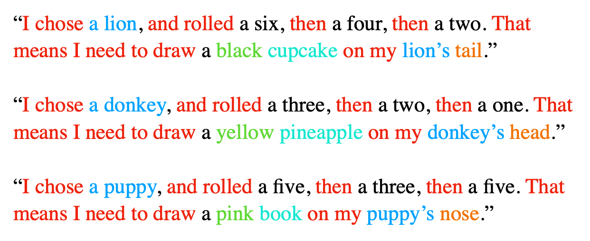
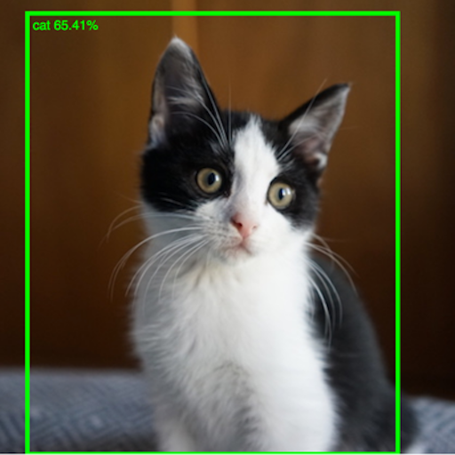
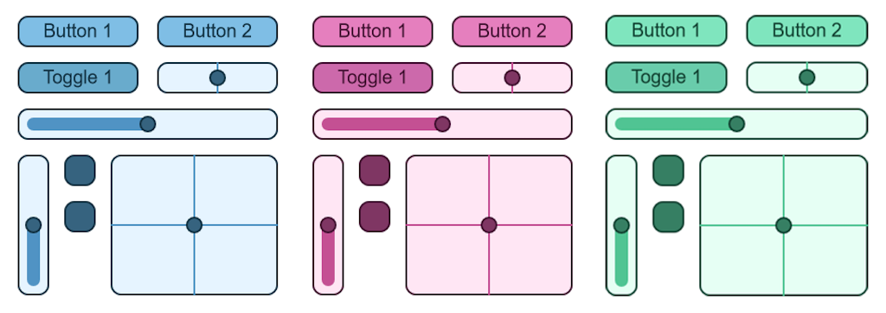
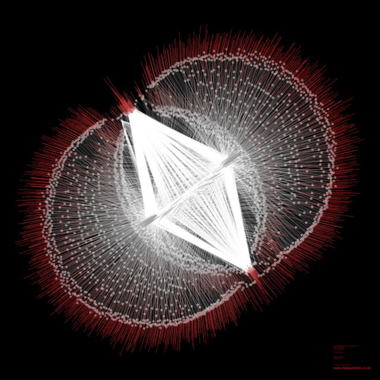
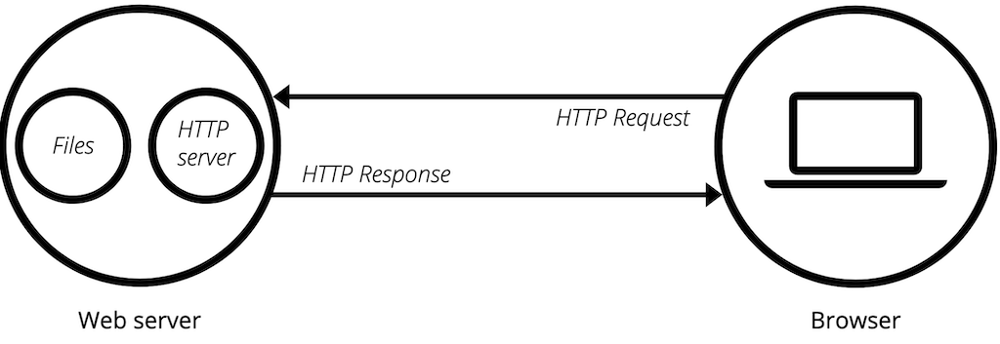
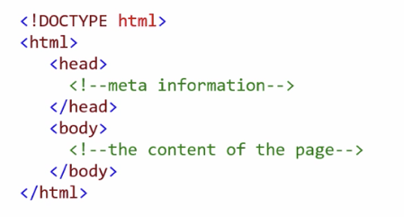
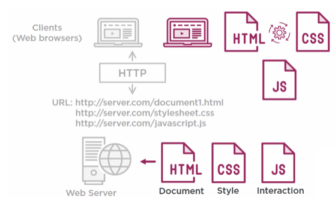

name: inverse
layout: true
class: center, middle, inverse
---


# Creative Coding I

### Prof. Dr. Lena Gieseke | l.gieseke@filmuniversitaet.de  

#### Film University Babelsberg KONRAD WOLF


---
layout: false

## Last Week 

### Session 02: Emergence

* p5 inspiration
* 10PRINT pattern
* Emergence


---
layout: false

## Last Week 

### Session 03: Instructions

--

>Imagine the clouds dripping. Dig a hole in your garden to put them in.  
  

  
--
  
.blockquote[
>Draw a line, pick a new color, move a bit.
]

  
--
  



???
.task[COMMENT:]  

* https://conditionaldesign.org/manifesto/

---

## Algorithmic Thinking

--
For defining an algorithm, you might need:

--
  
* **Decomposition**: Break a problem down into smaller pieces

--
* **Abstraction**: Reduce specific differences and make one solution work for multiple cases

--
* **Pattern Matching**: Find similarities


---
.header[Algorithmic Thinking]

## Example

> Sum up all numbers between 1-200. 

---
.header[Algorithmic Thinking | Example]

## Sum Up All Numbers Between 1-200 

### Decomposition

--

.left-even[
Let's start at the two ends:

* 1 + 200
* 2 + 199
* 3 + 198
* 4 + 197
* ...
]


---
.header[Algorithmic Thinking | Example]

## Sum Up All Numbers Between 1-200 

### Decomposition


.left-even[
Let's start at the two ends:

* 1 + 200
* 2 + 199
* 3 + 198
* 4 + 197
* ...
  

Each pair results in the sum of 201!
]


  
--
.right-even[
How many of these pairs will we have? 
]

---
.header[Algorithmic Thinking | Example]

## Sum Up All Numbers Between 1-200 

### Decomposition


.left-even[
Let's start at the two ends:

* 1 + 200
* 2 + 199
* 3 + 198
* 4 + 197
* ...
  

Each pair results in the sum of 201!
]

.right-even[
How many of these pairs will we have? 

* The last pair, we can create is 100 + 101

]

---
.header[Algorithmic Thinking | Example]

## Sum Up All Numbers Between 1-200 

### Decomposition


.left-even[
Let's start at the two ends:

* 1 + 200
* 2 + 199
* 3 + 198
* 4 + 197
* ...
  

Each pair results in the sum of 201!
]

.right-even[
How many of these pairs will we have? 

* The last pair, we can create is 100 + 101
* We have **100 pairs in total**

]


---
.header[Algorithmic Thinking | Example]

## Sum Up All Numbers Between 1-200 

### Solution

--
* We have 100 pairs
* Each pair's sum is 201
  
--
  
> **100 * 201 = 20.100**

---
.header[Algorithmic Thinking | Example]

## Sum Up All Numbers Between 1-200 

**100 * 201 = 20.100**
  
--
  
.blockquote[
> How about the sum of all numbers between 1-20.000?  
]
  
--
  
> Or rather between 1-n?

---
.header[Algorithmic Thinking | Example]

## Sum Up All Numbers Between 1-n 

### Abstraction

--
  
*Solution n=200*:  ** 100 * 201 = 20.100**   

--
*Solution n=20.000*:** 10.000 * 20.001 = 200.010.000**   

--
*Solution n=10*:** 5 * 11 = 55**   
  
  
--
<br >
  
*Solution n*: **(n \* 0.5) \* (n + 1)**  

  
???
.task[COMMENT:]  

---
.header[Algorithmic Thinking | Example]

## Sum Up All Numbers Between 1-n 

If you want to practice your algorithmic thinking, have a look at the different [Techniques for Adding the Numbers 1 to 100](https://betterexplained.com/articles/techniques-for-adding-the-numbers-1-to-100/).

---
.header[Algorithm]

## What do we see?

<iframe src="https://editor.p5js.org/legie/full/-HB6nto44" width="900" height="450" ></iframe>


???
.task[COMMENT:]  

* https://editor.p5js.org/legie/full/-HB6nto44

---
.header[Algorithm]

## Sub-Problems

1. *Line Drawing*: Each frame draw a line with start and end point in a certain range to the previous ones
2. *Movement*: The placement of the new start and end points follows each a direction
3. *Border collision*: Change direction if a start or end point hits a border
4. *Color*: Slowly change the line's color over time


???
.task[COMMENT:]  

A. https://editor.p5js.org/legie/sketches/PwBLEu8pn7  
B. https://editor.p5js.org/legie/sketches/9i2kF3Be6  
C. https://editor.p5js.org/legie/sketches/H-2RPs_jN  
D. https://editor.p5js.org/legie/sketches/LjBZTapQa  

---

## Programming Overview


---
.header[Programming Overview]

## Images

```js
let imgPanda;

function preload() {
    imgPanda = loadImage("panda.jpg");
}

function draw() {
    image(imgPanda, 50, 50);
}
```


???
.task[COMMENT:]  

* https://editor.p5js.org/legie/sketches/foUu9HUyH
* https://editor.p5js.org/legie/sketches/iWvfAz3Is
* https://editor.p5js.org/legie/sketches/5XhKQYG90
* https://editor.p5js.org/legie/sketches/GN4wMPz4x

* Animate images e.g. by changing their position like any other shape
* Store images in arrays and display them sequentially to animate image series
* Use `get(x, y)` and `set(x, y, color)` to return or set the color of the image at a specific pixel

---
.header[Programming Overview]

## Sound?


---

## Libraries

* p5 extends JavaScript

???
.task[COMMENT:]  

* The same way p5 is written to extend the base functionality of JavaScript, we can write code that further extends p5.  

--
* Additional libraries extend p5, e.g., for sound

???

* A library is code in regard to a certain topic, e.g. sound, that is somewhat generalized and of use in various contexts.
* Libraries should be compact and also as small as possible. That is one of the reasons why additional libraries are not simply added to p5 itself. 
 
--
* Written by different people


???
.task[COMMENT:]  

* Libraries are mostly written by other people or teams and it is easier to manage to keep the development of an additional library separated.


---

## Libraries

### Examples

Use the [ml5](https://learn.ml5js.org) for machine learning in an accessible and easy way.

.center[[[ml5]](https://learn.ml5js.org)]

---

## Libraries

### Examples

A library to create a [scribble effect](https://github.com/generative-light/p5.scribble.js):

 [[p5.scribble]](https://github.com/generative-light/p5.scribble.js)


???
.task[COMMENT:]  

* https://editor.p5js.org/legie/sketches/PtoiQsgKr


---

## Libraries

### Examples

A library to create a [a touch gui](https://github.com/L05/p5.touchgui):

.center[]  [[p5.touchgui]](https://github.com/L05/p5.touchgui)

---

## Libraries

You can find a list of the currently supported p5 libraries [on the p5 website](https://p5js.org/libraries/).

--

> Depending on your tasks, using a library can make your life much easier.

--

Keep in mind 

* The quality of the code and its documentation might vary

--
* If a library is listed on the official p5 website, it is probably ok

---

## Libraries

For loading libraries we have to take a look behind the scenes...

---
.header[Programming Overview]

## Sound

[p5.sound](https://p5js.org/reference/#/libraries/p5.sound)

```js 
let song;

function preload() {
    song = loadSound('song.mp3');
}
```

```js
song.playMode('restart');
song.setVolume(0.1);
song.play();

...

song.stop();
```


---
template: inverse

### Session 04:  
# Connection


---
layout: false

## Session 04: Connection

--
* The Web

--
* A Local Web

--
* A Basic Modern Website

---

## Learning Objectives

With this session you

--
* understand how content is rendered and accessed on a web page, and

--
* have a working local setup for developing a dynamic webpage.


???
.task[COMMENT:]  

* have an understanding of working with web page elements,
* have some practical experiences setting up a responsive website.

---
template:inverse

# The Web

???

.task[ASK:]  

* How would you explain to an alien what the internet is?
* How would you explain to an alien what the internet technically is?

---

## The Web

The World Wide Web is 

--
* a set of protocols and files that 

--
* allow us to visit web pages in a browser. 

--

The *web* part in the name refers to the fact that such **pages can easily link to each other**, thus connecting into a huge mesh that users can move through.

???


--
  
<br >
  
The internet is the underlying networking infrastructure, a massive network of networks.


???
.task[COMMENT:]  

* When we talk about the Internet, we are talking about the hardware, the computers, the routers, cables, etc. that make up this network. In the physical world, different protocols are used to distribute a sea of information around the world.

https://www.differkinome.com/articles/internet/difference-between-www-world-wide-web-and-internet.html

--

The World Wide Web is not to be confused with the Internet as a whole. 


???
.task[COMMENT:]  

'www' is a way of accessing the information available on the Internet. It is a model for the exchange of information on the Internet. The World Wide Web (www) uses the HTTP protocol, one of the languages used to transmit information over the network. The web uses browsers such as Chrome, Internet Explorer and Firefox to access millions of web pages. These pages are connected in amazing ways via hyperlinks. It's not just text. Web pages are full of graphics, images and videos.

Web or www is just one of the many ways information is distributed on the Internet. It is the Internet and not the web that people use to send and receive emails. These emails depend on the SMTP, Instant Messaging, FTP and Usenet message groups.

It is therefore clear that the Web is only a subset of the Internet and not a synonym for the Internet. Although the two are closely related, the two terms cannot be used interchangeably.

https://www.differkinome.com/articles/internet/difference-between-www-world-wide-web-and-internet.html
  

---

## The Web

Based on this functionalities the www became a mysterious place, almost beyond our capabilities of comprehension.

--
  
<br >
  
*Remember emergence?*


---
template:inverse

## Portraits of The Web

---

.center[  
[[Extreme Tech]](https://www.extremetech.com/extreme/172099-beautiful-internet-maps-visualize-the-striking-interconnectedness-of-the-web)]

---

## Portraits of The Web

> If Google were an artist, what would it paint?  
  
--
  
The Google eye view of the world would be of a vast landscape of connections; in the words of William Gibson in [Neuromancer](https://en.wikipedia.org/wiki/Neuromancer), a world of:

--

> Cyberspace: A consensual hallucination experienced daily by billions of legitimate operators, in every nation, by children being taught mathematical concepts...A graphical representation of data abstracted from the banks of every computer in the human system. Unthinkable complexity. Lines of light ranged in the non-space of the mind, clusters and constellations of data. Like city lights, receding...
  

???
.task[COMMENT:]  

Cyberspace: A consensual hallucination experienced daily by billions of legitimate operators, in every nation, by children being taught mathematical concepts...A graphical representation of data abstracted from the banks of every computer in the human system. Unthinkable complexity. Lines of light ranged in the non-space of the mind, clusters and constellations of data. Like city lights, receding...
  	 
William Gibson, Neuromancer (New York: Berkley Publishing Group, 1989), pp. 128.
  
---

## Portraits of The Web

> The world wide web is a world we never see other than in fleeting glimpses through the narrow portal of our web browser's window...until now.

[[Data Portraits]](http://www.dataportraits.co.uk/)

---
.center[  
[[wired]](https://www.wired.co.uk/article/internet-artworks)]


---
.center[  
[[Extreme Tech]](https://www.extremetech.com/extreme/172099-beautiful-internet-maps-visualize-the-striking-interconnectedness-of-the-web)]


???
.task[COMMENT:]  

* https://www.wired.co.uk/article/internet-artworks

---

## Portraits of The Web

A research project “that sort of went wrong”...

--
* Created by Martin Dade-Robertson

--
* Intended to explore how various resources on a website are linked together
  
--
  
* The end result turned out to be of little scientific use — but, as luck would have it, incredibly beautiful

.footnote[[[Sebastian Anthony - Beautiful internet maps [...]]](https://www.extremetech.com/extreme/172099-beautiful-internet-maps-visualize-the-striking-interconnectedness-of-the-web)]

---

## Portraits of The Web

* Special software analyzes a single web page
    * It sounds like a text parser combined with a web crawler
    * Scans a web page for the various resources contained therein (text, images, JavaScript), and also for links out to other pages/resources
* Links between various elements on a page, and to external resources, are then visualized
* Details are secret

.footnote[[[Sebastian Anthony - Beautiful internet maps [...]]](https://www.extremetech.com/extreme/172099-beautiful-internet-maps-visualize-the-striking-interconnectedness-of-the-web)]

???

The exact details of how the maps area drawn — where the dots are placed relative to each other — is somewhat secret. Dade-Robertson says that pages that are linked together tend to be closer together, with relatively unrelated pages finding their way to the edge of the map.

---
.center[  
[[Extreme Tech]](https://www.extremetech.com/extreme/172099-beautiful-internet-maps-visualize-the-striking-interconnectedness-of-the-web)]

---
.center[  
[[Extreme Tech]](https://www.extremetech.com/extreme/172099-beautiful-internet-maps-visualize-the-striking-interconnectedness-of-the-web)]

---

## The Map of The Internet

---
.center[  
[[Internet Map]](http://internet-map.net/)]

---

## The Map of The Internet

In [The Map of the Internet](http://internet-map.net/) every site is a circle on the map, and its size is determined by website traffic, the larger the amount of traffic, the bigger the circle.  

<br >

Users’ switching between websites forms links, and the stronger the link, the closer the websites tend to arrange themselves to each other.

---
.center[  
[[Internet Map]](http://internet-map.net/)]

---

.center[  
[[Internet Map]](http://internet-map.net/)]

---
## The Opte Internet Map

.center[  
[[Nab amplify](https://amplify.nabshow.com/articles/a-trippy-visualization-charts-the-internets-growth-since-1997-source-wired/), [Opte](https://www.opte.org/)]]

???
.task[COMMENT:]  

* a visualization of the web that used his proprietary network mapping tool to map the entire internet.
* working full time as a penetration tester — a hacker companies hire to find weaknesses in their own digital systems

---
## The Opte Internet Map

<iframe width="860" height="512" src="https://www.youtube.com/embed/-L1Zs_1VPXA?si=hGSt8RnbUFdd5qch" title="YouTube video player" frameborder="0" allow="accelerometer; autoplay; clipboard-write; encrypted-media; gyroscope; picture-in-picture; web-share" allowfullscreen></iframe> [[Opte]](https://www.opte.org/)

---
## The Opte Internet Map

<iframe width="860" height="512" src="https://www.youtube.com/embed/BUtlP1kVo-4?si=o0wJNu7AulAGsKPb" title="YouTube video player" frameborder="0" allow="accelerometer; autoplay; clipboard-write; encrypted-media; gyroscope; picture-in-picture; web-share" allowfullscreen></iframe> [[Opte]](https://www.opte.org/)

---
## The Opte Internet Map

<iframe width="860" height="512" src="https://www.youtube.com/embed/DdaElt6oP6w?si=ftyF4TON9EQjLMqz" title="YouTube video player" frameborder="0" allow="accelerometer; autoplay; clipboard-write; encrypted-media; gyroscope; picture-in-picture; web-share" allowfullscreen></iframe> [[Opte]](https://www.opte.org/)


---
template:inverse

### *How did the omnipresence of the world wide web change us?*


???
.task[COMMENT:]  

* E.g., how we think, feel and live, and society?


---
template:inverse


# Ingredients For The Web

---

## Ingredients For The Web


 

.footnote[[B. Luijbregts. 2020. [*HTML, CSS, and JavaScript: The Big Picture*](https://www.pluralsight.com/courses/html-css-javascript-big-picture). Pluralsight]]


???

* Resources, like HTML documents, images, or other files are the content that we want to use, websites that we want to browse, images to look at, files that we want to share.
* At the most basic level, whenever a browser needs a file that is hosted on a web server, the browser requests the file via HTTP. HTTP is basically a set of rules for transferring files (text, graphic images, sound, video, and other multimedia files) within the world wide web. When the request reaches the correct (hardware) web server, the (software) HTTP server accepts the request, finds the requested document, and sends it back to the browser, also through HTTP. (If the server doesn't find the requested document, it returns a 404 response instead.)

---
.header[Ingredients For The Web]

## URL (Uniform Resource Locator)

--

Unique identification of the resources, used by the browser to access files:


???
.task[COMMENT:]  

URLs uniquely identify the resources so that your web browser can show them to you or download them. Every resource on the web has a unique URL.  

--
<br >
  


.footnote[[M. Haverbeke. 2018. [*HTTP and Forms*](https://eloquentjavascript.net/18_http.html). Eloquent Javascript.]]

???

* If you type this URL into your browser’s address bar, the browser will try to retrieve and display the document at that URL. 


---
.header[Ingredients For The Web]

## URL (Uniform Resource Locator)


.footnote[[M. Haverbeke. 2018. [*HTTP and Forms*](https://eloquentjavascript.net/18_http.html). Eloquent Javascript.]]

--

The browser

--
1. Identifies the server address and converts the URL into a request message

--
2. Makes a connection, using the HTTP protocol, to the server at that address 

--
3. Ask for the resource `13_browser.html`  

--
4. Displays the document, the server has responded with (if all goes well)


???

* Machines connected to the Internet get an IP address, which is a number that can be used to send messages to that machine, and looks something like 149.210.142.219 or 2001:4860:4860::8888. But lists of more or less random numbers are hard to remember and awkward to type, so you can instead register a domain name for a specific address or set of addresses.  

---
.header[Ingredients For The Web]

## HTTP

* For the world wide web a set of rules for transferring files, e.g., text, graphic images, sound, video, and other multimedia files

???

.task[COMMENT:]  

* The Hypertext Transfer Protocol, or HTTP, is the magic that can retrieve documents and communicate them to your web browser.
* I'm not going to go into HTTP in this course, you just need to know what it is for.


The HTTP protocol is basically a set of rules for transferring files (text, graphic images, sound, video, and other multimedia files) within the world wide web.

--


---
.header[Ingredients For The Web]

## Server


???
.task[COMMENT:]  

* What is a server?

--

> A server is a computer program or device that provides a service to another computer program and its user, also known as the client.
  

.footnote[[[techtarget](https://www.techtarget.com/whatis/definition/server)]]
  
???
.task[COMMENT:]  

* In the client/server programming model, a server program awaits and fulfills requests from client programs, which might be running in the same, or other computers

  
  
--

* Client/server programming model

???
.task[COMMENT:]  

* In the client/server programming model, a server program awaits and fulfills requests from client programs, which might be running in the same, or other computers
* The term server can refer to a physical machine, a virtual machine or to software that is performing server services. The way that a server works varies considerably depending on how the word server is being used. 

--
* Can refer to a physical machine, a virtual machine or to software that is performing server services

???
.task[COMMENT:]  

* The term server can refer to a physical machine, a virtual machine or to software that is performing server services. The way that a server works varies considerably depending on how the word server is being used. 


One more time, a server is a computer program or device that provides a service to another computer program and its user, also known as the client. In a data center, the physical computer that a server program runs on is also frequently referred to as a server. That machine might be a dedicated server or it might be used for other purposes.

In the client/server programming model, a server program awaits and fulfills requests from client programs, which might be running in the same, or other computers. A given application in a computer might function as a client with requests for services from other programs and as a server of requests from other programs.

The term server can refer to a physical machine, a virtual machine or to software that is performing server services. The way that a server works varies considerably depending on how the word server is being used.  

---
.header[Ingredients For The Web]

## Webserver

A server that serves up the HTML documents and other resources upon request from a browser.

--

* Hardware: a computer that stores web server software and a website's component files


???
.task[COMMENT:]  

* Hardware: a computer that stores web server software and a website's component files (for example, HTML documents, images, CSS stylesheets, and JavaScript files). A web server connects to the Internet and supports physical data interchange with other devices connected to the web.

--
* Software: controls how web users access hosted files; at a minimum, this is an HTTP server


???
.task[COMMENT:]  
* Software: control how web users access hosted files. At a minimum, this is an HTTP server. An HTTP server is software that understands URLs (web addresses) and HTTP (the protocol your browser uses to view webpages). An HTTP server can be accessed through the domain names of the websites it stores, and it delivers the content of these hosted websites to the end user's device.


---
.header[Ingredients For The Web]

## Webserver


.center[[[⬀]](https://developer.mozilla.org/en-US/docs/Learn/Common_questions/What_is_a_web_server)]

???
.task[COMMENT:]  


At the most basic level, whenever a browser needs a file that is hosted on a web server, the browser requests the file via HTTP. HTTP is basically a set of rules for transferring files (text, graphic images, sound, video, and other multimedia files) within the world wide web. When the request reaches the correct (hardware) web server, the (software) HTTP server accepts the request, finds the requested document, and sends it back to the browser, also through HTTP. (If the server doesn't find the requested document, it returns a 404 response instead.)

[[7]](https://developer.mozilla.org/en-US/docs/Learn/Common_questions/What_is_a_web_server)

--

<br >

Each webserver has an unique address on the internet, a URL.


???


 

.footnote[[B. Luijbregts. 2020. [*HTML, CSS, and JavaScript: The Big Picture*](https://www.pluralsight.com/courses/html-css-javascript-big-picture). Pluralsight]]


* Resources, like HTML documents, images, or other files are the content that we want to use, websites that we want to browse, images to look at, files that we want to share.


---
template:inverse


# Ingredients For A Webpage

---

## Ingredients For A Webpage

### Document Types

???

.task[ASK:]  


What are the three main components of the web?

--
* *Displaying* with HTML

--
* *Styling* with CSS

--
* *Interacting* with JavaScript

---
.header[Ingredients For A Webpage]

## HTML

* A standard markup language for creating web pages
* Controls the structure of the pages  

???

.task[COMMENT:]  

* a markup language is a system for annotating a document in a way that is syntactically distinguishable from the text
* The things that you see in websites and web applications are rendered by the web browser from HTML documents.
* These are documents with the HTM or HTML extension that are served by web servers on unique URLs.

--

> Certain HTML elements can be understood by all web browsers.


 
???




---
.header[Ingredients For A Webpage | HTML]

## Document Structure

.left-even[
```html
<!doctype html>
<html>
    <head>
        <title>My home page</title>
    </head>
    <body>
        <h1>My home page</h1>
        <p>Hello, I am Marijn and this is my home page.</p>
        <p>I also wrote a book! Read it
            <a href="http://eloquentjavascript.net">here</a>.
        </p>
    </body>
</html>
```

.footnote[[B. Luijbregts. 2020. [*HTML, CSS, and JavaScript: The Big Picture*](https://www.pluralsight.com/courses/html-css-javascript-big-picture). Pluralsight] [M. Haverbeke. 2018. [*HTTP and Forms*](https://eloquentjavascript.net/18_http.html). Eloquent Javascript.]]
]


???

* The first element in any HTML document is the DOCTYPE element. This is strictly not an element that is part of the HTML standard, but it does tell the browser that this is an HTML document and tells it which version of HTML it is written in. The DOCTYPE element here is for HTML5.
* Next are the HTML elements. Every element has an open and a close element. This tells the browser that everything in here is HTML.
  * Then there is the head element. This can include a title for the document, scripts, styles, metainformation, and more.
  * And finally, there is the body element that contains everything that you want to be displayed on the screen.
  * These are all the elements that are necessary in an HTML document. All web browsers understand these elements and use them to display content on the screen.

You can imagine an HTML document as a nested set of boxes. Tags such as `<body>` and `</body>` enclose other tags, which in turn contain other tags or text:

--
.right-even[
Imagine an HTML document as a nested set of boxes:
* Tags such as `<body>` and `</body>` enclose other tags, which in turn contain other tags or text...
]

---
.header[Ingredients For A Webpage | HTML]

## Document Structure


.left-even[
```html
<!doctype html>
<html>
    <head>
        <title>My home page</title>
    </head>
    <body>
        <h1>My home page</h1>
        <p>Hello, I am Marijn and this is my home page.</p>
        <p>I also wrote a book! Read it
            <a href="http://eloquentjavascript.net">here</a>.
        </p>
    </body>
</html>
```
]

.right-even[

]


---
.header[Ingredients For A Webpage | HTML]

## Document Object Model

--

* Created by the browser, when a web page is loaded
* DOM for short

> For each box, there is an object, which we can interact with. 

???
.task[COMMENT:]  

* When a web page is loaded, the browser creates a ***Document Object Model*** of the page, or DOM for short.


---
.header[Ingredients For A Webpage | HTML]

## Document Object Model


.left-even[
```html
<!doctype html>
<html>
    <head>
        <title>My home page</title>
    </head>
    <body>
        <h1>My home page</h1>
        <p>Hello, I am Marijn and this is my home page.</p>
        <p>I also wrote a book! Read it
            <a href="http://eloquentjavascript.net">here</a>.
        </p>
    </body>
</html>
```
.footnote[[B. Luijbregts. 2020. [*HTML, CSS, and JavaScript: The Big Picture*](https://www.pluralsight.com/courses/html-css-javascript-big-picture). Pluralsight] [M. Haverbeke. 2018. [*HTTP and Forms*](https://eloquentjavascript.net/18_http.html). Eloquent Javascript.]]
]

.right-even[

]

---
.header[Ingredients For A Webpage | HTML]

## Document Object Model


.left-even[
```html
<!doctype html>
<html>
    <head>
        <title>My home page</title>
    </head>
    <body>
        <h1>My home page</h1>
        <p>Hello, I am Marijn and this is my home page.</p>
        <p>I also wrote a book! Read it
            <a href="http://eloquentjavascript.net">here</a>.
        </p>
    </body>
</html>
```
.footnote[[B. Luijbregts. 2020. [*HTML, CSS, and JavaScript: The Big Picture*](https://www.pluralsight.com/courses/html-css-javascript-big-picture). Pluralsight] [M. Haverbeke. 2018. [*HTTP and Forms*](https://eloquentjavascript.net/18_http.html). Eloquent Javascript.]]
]

.right-even[

]


???

.task[ASK:]  

* What is a tree structure

* We call this data structure a tree as it has a branching structure, has no cycles (a node may not contain itself, directly or indirectly), and has a single, well-defined root. 
* Yes, moving through the tree and finding elements can be cumbersome...
* The global binding `document` gives us access to these objects through `documentElement` properties. This means that `document.documentElement` is the root of the above tree. Its `documentElement` property refers to the object representing the `<html>` tag.  
* The nodes have properties such as parentNode and childNodes, which can be used to navigate through this tree.


---
.header[Ingredients For A Webpage | HTML]

## HTML5

--

.left-even[
* A new version of HTML with new elements
* Elements have become much more expressive 

.footnote[[B. Luijbregts. 2020. [*HTML, CSS, and JavaScript: The Big Picture*](https://www.pluralsight.com/courses/html-css-javascript-big-picture). Pluralsight] [M. Haverbeke. 2018. [*HTTP and Forms*](https://eloquentjavascript.net/18_http.html). Eloquent Javascript.]]
]

???

.task[COMMENT:]   

* HTML5 elements explain what they are used for so that the browser can understand them better and search engines know better which parts of the document are actual data and which parts are metainformation. 


--

.right-even[
    
]

.footnote[]

???
.task[COMMENT:]  

* A header element, which represents a container for introductory content or a set of navigational links. This can contain a nav tag that defines a set of navigation links. 
* There is the main tag that specifies the main content of a document, and inside the main tag you can find things like an article tag that specifies independent, self-contained content, and an aside tag that defines some content aside from the content it is placed in. 
* And finally, just like there is a header element, there is also a footer tag that contains things like copyright or the address of your company. 
* These types of tags are geared towards providing more nuance to the HTML markup language.  
 

---
.header[Ingredients For A Webpage ]

## CSS

* Describes the presentation of a HTML document

???

* Displaying text and images on the web is nice, but we need to be able to style the content so that it is readable and useable.

--

* Enables the separation of content and style

???

* Using CSS like this in external style sheet files provides maximum maintainability and reusability. 

--

* In the html file, we indicate with css file to use (which must also be hosted by the webserver)


???
.task[COMMENT:]  

* To work with CSS, we need to indicate in the HTML which CSS or .css file to use (and also host that CSS document on a web server)

---
.header[Ingredients For A Webpage]
  
## CSS


???
.task[COMMENT:]  

* To work with CSS, all we need to do is to indicate in the HTML which CSS file to use and to host that file on a web server. 


---
.header[Ingredients For A Webpage | CSS]
  
.center[]

???

* Styling HTML in a web browser is still difficult
* It is important to keep in mind is that it is the web browser that does all the work when it styles HTML! It takes the HTML file, interprets it, and applies the styles to it that are described in the CSS document. 


---
.header[Ingredients For A Webpage]
  
## CSS

> Keep in mind is that it is the web browser that does all the work when it styles HTML!  

--

The browser

* interprets the HTML file
* applies the styles that are described in the CSS document


---
.header[Ingredients For A Webpage | CSS]
  
## Syntax Selectors

--

* Indicate to what html elements a property should be applied to
* There are different types of selectors 

---
.header[Ingredients For A Webpage | CSS]
  
## Syntax Selectors

.center[]


???
.task[COMMENT:]  

* You can find all possible selector in this [CSS Selector Reference](https://www.w3schools.com/cssref/css_selectors.php). However, we are only going to have a look at the most common selectors to get started.


## Priorities


* CSS is called cascading, as in Cascading Style Sheets
* Properties are applied in a specific order based on priorities


* CSS is called cascading, as in Cascading Style Sheets, because properties are applied in a specific order based on priority.


This is the ascending order of priorities:

* Element selectors
* Class attributes
* ID attributes
* The important tag


.left-even[]


How will the following look like?

* Element selectors
* Class attributes
* ID attributes
* The important tag


<br >
    
]


---
.header[Ingredients For A Webpage]

## JavaScript

--

* Interpreted programming language

???

* interpreted programming language means it runs as is and you don't need to compile it to execute your code

--
* Needed for anything beyond the structure and style of a web page
* Can manipulate HTML, CSS and talk to servers

???

* Every time a web page does more than just sit there and display static information for you to look at — displaying timely content updates, interactive maps, animated 2D/3D graphics, scrolling video jukeboxes, etc. — you can bet that JavaScript is probably involved. 

--
* Dominant choice for *non-static* content as all major web browsers have a dedicated JavaScript engine

???

* All major web browsers have a dedicated JavaScript engine to execute it
* As a multi-paradigm language, JavaScript supports event-driven, functional, object-oriented and prototype-based programming styles (we will come back to programming paradigms later). Although there are strong outward similarities between JavaScript and Java, including language name, syntax, and respective standard libraries, they are two distinct languages are and differ greatly in design.

--


> *Dynamic* refers here to an application that can change its content, appearance, and functionality in response to user input, system or external events, and information, e.g., from a databases.

.footnote[[[ramotion](https://www.ramotion.com/blog/dynamic-web-application-development/)]]

???
.task[COMMENT:]  

* As a multi-paradigm language, JavaScript supports event-driven, functional, object-oriented and prototype-based programming styles


---
.header[Ingredients For A Webpage]

## JavaScript


.center[]  
[[W3 Schools]](https://www.w3schools.com/Js/tryit.asp?filename=tryjs_intro_inner_html)

???

.task[COMMENT:]  

* **Go to link**
* JavaScript is used here to select an HTML element and alter one of its properties.
* When you click the button, the onclick event will execute, and that executes this line of code, which is JavaScript.
    * This is inline JavaScript. You can basically write it anywhere in HTML, just like you can have inline CSS.
* This particular JavaScript code first selects an element with the ID of demo, and that is this paragraph element here, and it then sets the innerHTML property of that element to the given new value.

---

## Ingredients For The Web


.center[] 

.footnote[[B. Luijbregts. 2020. [*HTML, CSS, and JavaScript: The Big Picture*](https://www.pluralsight.com/courses/html-css-javascript-big-picture). Pluralsight]]


---

## Ingredients For A Webpage

.center[] 

.footnote[[B. Luijbregts. 2020. [*HTML, CSS, and JavaScript: The Big Picture*](https://www.pluralsight.com/courses/html-css-javascript-big-picture). Pluralsight]]


???

* Show p5 setup https://editor.p5js.org/
  
* Any web page or application consists out of three main documents, HTML that contains content like text and images, CSS to style the HTML, and JavaScript to make it interactive. 


* These documents are hosted on a web server that exposes them to the internet using unique URLs.
* Then, web browsers that are used from client computers can access these documents through the HTTP, or Hypertext Transfer Protocol.
* As a frontend developer, you just need to worry about creating the documents and putting them on the web server. Once the documents are on the client machine, the web browser interprets them and styles the HTML with CSS and loads the JavaScript to be executed.


---
template: inverse

## The End  

💻  🕸  🕷


