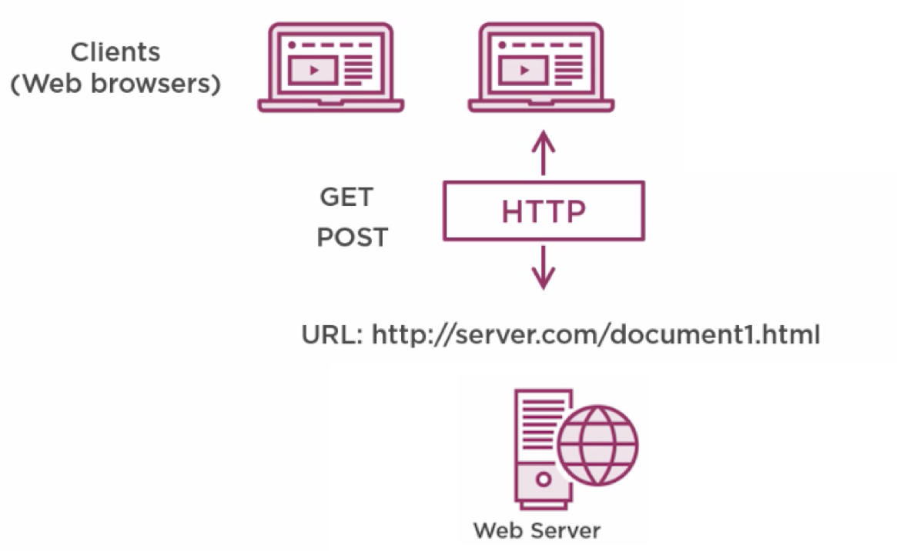
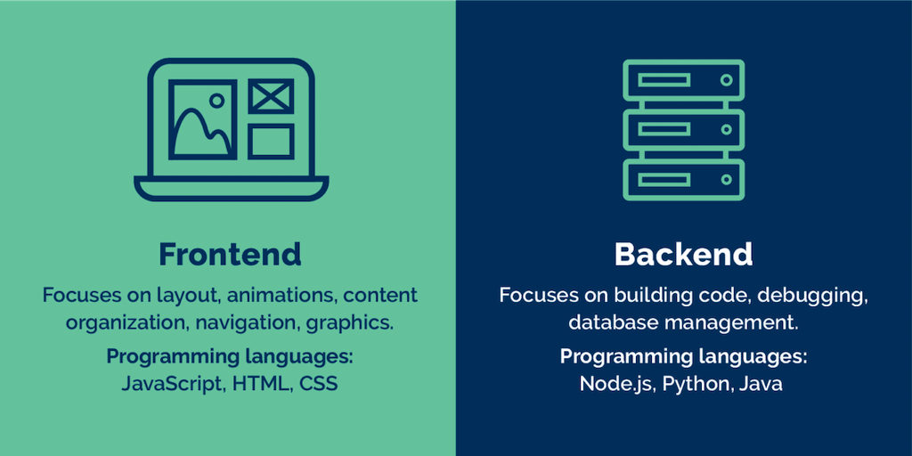

name: inverse
layout: true
class: center, middle, inverse
---


# Creative Coding I

### Prof. Dr. Lena Gieseke | l.gieseke@filmuniversitaet.de  

#### Film University Babelsberg KONRAD WOLF


---
layout: false

# Today

--
* Re-cap

--
* A local webserver

--
* Development workflow

--
* Exercise

--
* Coding time 👩🏽‍💻 🧑🏼‍💻 👨🏾‍💻

---

## Last Week 

### Session 04: Connection


--

> What is the internet?

???

.task[ASK:]  

* How would you explain what the internet is?
* The “Web” part in the name refers to the fact that such pages can easily link to each other, thus connecting into a huge mesh that users can move through.
* Example of emergence
    * Based on this functionalities the www became a mysterious place, almost beyond our capabilities of comprehension.

--


---
.header[Last Week]

## Ingredients For The Web

--

.center[]  
[[Barry Luijbregts, Pluralsight]](https://www.pluralsight.com/courses/html-css-javascript-big-picture)


???
.task[COMMENT:]  


The World Wide Web is a set of protocols and formats...that allow us to visit web pages in a browser. 

* Resources, like HTML documents, images, or other files are the content that we want to use, websites that we want to browse, images to look at, files that we want to share.


---
.header[Last Week]

## Ingredients For A Webpage

### Document Types

--

* *Displaying* with HTML
* *Styling* with CSS
* *Interacting* with JavaScript

--

### Webserver

--

* This is special software that enables the serving up of requested documents.


???
.task[COMMENT:]  

* Hence documents, like HTML documents and other resources like images, are hosted by it.
* It provide the files that form web pages for users, in response to their requests.
* Each web server has a unique address on the internet, a URL.  


---
.header[Last Week]

## Ingredients For A Webpage


### Url

--

* URLs uniquely identify the resources so that your web browser can ultimately show them to you or download them.

--

### A Browser


---
.header[Last Week | Ingredients For A Webpage]

## HTML

.left-even[
```html
<!doctype html>
<html>
    <head>
        <title>My home page</title>
    </head>
    <body>
        <h1>My home page</h1>
        <p>Hello, I am Marijn and this is my home page.</p>
        <p>I also wrote a book! Read it
            <a href="http://eloquentjavascript.net">here</a>.
        </p>
    </body>
</html>
```
.footnote[[B. Luijbregts. 2020. [*HTML, CSS, and JavaScript: The Big Picture*](https://www.pluralsight.com/courses/html-css-javascript-big-picture). Pluralsight] [M. Haverbeke. 2018. [*HTTP and Forms*](https://eloquentjavascript.net/18_http.html). Eloquent Javascript.]]
]

--

.right-even[

]

???

* The first element in any HTML document is the DOCTYPE element. This is strictly not an element that is part of the HTML standard, but it does tell the browser that this is an HTML document and tells it which version of HTML it is written in. The DOCTYPE element here is for HTML5.
* Next are the HTML elements. Every element has an open and a close element. This tells the browser that everything in here is HTML.
  * Then there is the head element. This can include a title for the document, scripts, styles, metainformation, and more.
  * And finally, there is the body element that contains everything that you want to be displayed on the screen.
  * These are all the elements that are necessary in an HTML document. All web browsers understand these elements and use them to display content on the screen.


---
.header[Last Week | Ingredients For A Webpage | HTML]

## Document Object Model

When a web page is loaded, the browser creates a ***Document Object Model*** of the page, or DOM for short:  
  


???

For each box, there is an object, which we can interact with. 

The underlying data structure is a tree:  


* What is a tree structure

* We call this data structure a tree as it has a branching structure, has no cycles (a node may not contain itself, directly or indirectly), and has a single, well-defined root. 
* Yes, moving through the tree and finding elements can be cumbersome...
* The global binding `document` gives us access to these objects through `documentElement` properties. This means that `document.documentElement` is the root of the above tree. Its `documentElement` property refers to the object representing the `<html>` tag.  
* The nodes have properties such as parentNode and childNodes, which can be used to navigate through this tree.

---
.header[Last Week | Ingredients For A Webpage]

## CSS

E.g., `style.css`:

```css
html, body {
    margin: 0; 
    padding: 0; 
}
canvas {
    display: block; 
}
```

--

*  margin: the space around elements
*  padding: the space around an element's content, inside of any defined borders
*  display: how is the element is displayed 
    *  block: full width available
    *  inline element does not start on a new line and only takes up as much width 


???
.task[COMMENT:]  

* https://www.w3schools.com/Css/css_margin.asp
* https://www.w3schools.com/Css/css_padding.asp
* https://www.w3schools.com/Css/css_display_visibility.asp


---
.header[Last Week | Ingredients For A Webpage]

## JavaScript

```js
// sketch.js

function setup() {
  createCanvas(400, 400);
  background(255);
  fill(255, 0, 255, 40);
  noStroke();
}


function draw() {
        
        let randX = random(0, windowWidth);
        let randY = random(0, windowHeight);
     
        circle(randX, randY, 40);

}
```


---
template:inverse

### Webserver & JavaScript

# Local Setup

---
## Local Setup

For imitating the www locally you need:
  
--
* `.html`, `.css` and `.js` file(s), and
  
--
* the JavaScript library files you want to use (p5, three.js, etc.), 
  
--
* a webserver.


???
.task[COMMENT:]  

* Create html, css, js

```html
<!DOCTYPE html>
<html>
    <head>
        <meta charset="UTF-8">
        <title>Hello World!</title>
    </head>

    <body>
        <!-- Html Elements... -->

        <script src="./sketch.js"></script>
    </body>

</html>
```

```css
body {
    background-color: blue;
}

h1 {
    color: aquamarine;
}
```

<link rel="stylesheet" type="text/css" href="style.css">

```js
// sketch.js

function setup() {
  createCanvas(400, 400);
  background(255);
  fill(255, 0, 255, 40);
  noStroke();
}


function draw() {
        
        let randX = random(0, windowWidth);
        let randY = random(0, windowHeight);
     
        circle(randX, randY, 40);

}
```

<script src="./sketch.js"></script>


---
.header[Local Setup]

## Library Files

--

* Local
* Online


---
.header[Local Setup]

## Local Library Files

--

* Download the [`p5.js`](https://p5js.org/download/) library file

--

.left-even[
```js
- projects
    - lib
        - p5.js
    - proj1
        - index.html
        - sketch.js
    - proj2
        - index.html
        - sketch.js
    - ...
```
]

--
.right-even[

```js
- projects
    - proj1
        - lib
            - p5.js
        - index.html
        - sketch.js
    - proj2
        - lib
            - p5.js
        - index.html
        - sketch.js
    - ...
```
]


???
.task[COMMENT:]  

Ultimately this is up to personal requirements and taste. By now I personally prefer the second folder layout.


*Follow along:* Create a `p5` folder and inside that folder, the folders `lib` and `helloworld`. Download and save the [p5.js](https://p5js.org/download/) library file in the `lib` folder.

---
.header[Local Setup]

## Local Library Files

```html
<!DOCTYPE html>
<html>
    <head>
        <meta charset="UTF-8">
        <link rel="stylesheet" type="text/css" href="style.css">
        <title>Hello World!</title>
    </head>

    <body>
        <!-- Html Elements... -->

        <script src="../lib/p5.js"></script>
        <script src="./sketch.js"></script>
    </body>

</html>
```

---
template:inverse

### Quick Detour

## Paths to Resources

---
.header[Local Setup]

## Paths to Resources

You can link to a resource such as a library or images with *absolute* or *relative* paths.

---
.header[Local Setup]

## Paths to Resources


An absolute path is built starting from the system root, e.g.  


```html
`
```
  
```bash
/Users/legie/projects/myproject/kitten.png
```

--
When pointing to online resources, which are not hosted by you on your webserver you need absolute paths.

---
.header[Local Setup]

## Paths to Resources

Relative path are in reference to a given location:


???
.task[COMMENT:]  

(what this is can differ)

However, if it is your own resource locally and maybe belonging to a specific project, you should always use relative paths in relation to your project. How to specify paths is relevant for all assets and library files. Relative path take as reference for example a working directory or a project root. If you are working with a webserver, the location where you start the server will be root for the relative paths, however if you access files from other files, e.g. the `index.html`, your must create a path in relation to that file.

--
* relative to the file that contains the reference

--
* relative to the server root

---
.header[Local Setup | Paths to Resources]

## Relative To The Referencing File

```html

```
--

* `/Users/legie/projects/myproject/index.html`
* `/Users/legie/projects/myproject/kitten.png`

--

```html

```

--

* `./` means that it is the same folder


---
.header[Local Setup | Paths to Resources]

## Relative To The Referencing File

```html

```

--

* `../` means to go up one folder


???
.task[COMMENT:]  

* The image file is inside an 'img' folder one folder higher than the file containing this line of code.

--

* `/Users/legie/projects/myproject/index.html`
* `/Users/legie/projects/img/kitten.png`


---
.header[Local Setup | Paths to Resources]

## Relative To The Referencing File

With a webserver you can never go higher or out of the root of your webserver.


???
.task[COMMENT:]  

Also, it is important to understand that whenever you use a webserver, the server will be the root of a webpage and you can never go further up than where you started the local webserver.
  
--
  
* You have the projects   
  `/Users/legie/projects/myproject1/`  
  `/Users/legie/projects/myproject2/`
* You started the webserver under  
  `/Users/legie/projects/myproject1/`

--
* Within that connection you will not be able to access  
  `/Users/legie/projects/myproject2/` 


???
.task[COMMENT:]  

You can only access what is under `/Users/legie/projects/myproject1/`.

I recommend that you come up with a file structure once and stick with it.

Please keep in mind that for the actual deployment of a real-world website a slightly different folder and file structure will be needed. This is not relevant as this point but be already aware of it. For a project, which should be deployed online, you will probably have a structure as the following:


---
.header[Local Setup]

## Local Library Files

--


.left-even[
```html
<!DOCTYPE html>
<html>
    <head>
        <meta charset="UTF-8">
        <link rel="stylesheet" type="text/css" href="style.css">
        <title>Hello World!</title>
    </head>

    <body>
        <!-- Html Elements... -->

        <script src="../lib/p5.js"></script>
        <script src="./sketch.js"></script>
    </body>

</html>
```
]
.right-even[
```js
- projects
    - lib
        - p5.js
        - p5.min.js
        - p5.sound.js
    - img
        - kitten.png
    - proj1
        - index.html
        - sketch.js
    - ...
```
]


---
.header[Local Setup]

## Online Library Files

You can also link to an online version of the library in your `.html`


???
.task[COMMENT:]  

If you chose an online file, obviously you have to be online when working on the project.

--
* https://cdnjs.com/libraries/p5.js 

---
.header[Local Setup]

## Online Library Files

```html
<!DOCTYPE html>
<html>
    <head>
        <meta charset="UTF-8">
        <link rel="stylesheet" type="text/css" href="style.css">
        <title>Hello World!</title>
    </head>

    <body>
        <!-- Html Elements... -->

        <script src="https://cdnjs.cloudflare.com/ajax/libs/p5.js/1.1.9/p5.js"></script>
        <script src="./sketch.js"></script>
    </body>

</html>
```

---
.header[Local Setup | JavaScript | p5.js | Online Library Files]

## Minified Library Files

--
Most JavaScript libraries have a minified version `.min.js`.

--
* Same functionally but the file size is smaller and make it faster to load

--
* All unnecessary characters are removed


???
.task[COMMENT:]  

* For javascript libraries you usually also have a minified version `.min.js`. For p5 it is `p5.min.js`. It has absolutely the same functionality as `p5.js` but it is minified, meaning it is made smaller. Minified versions have all unnecessary characters removed in order to reduce the file size and make it faster to load. It is recommended to use this compressed version in a production environment.

--

If you are still developing your site, work with the non-minified version, as you can read the source code when necessary.


---
.header[Local Setup | JavaScript | p5.js ]

## The `.html` File

.left-even[
    
```html
<!DOCTYPE html>
<html>
    <head>
        <meta charset="UTF-8">
        <link rel="stylesheet" type="text/css" href="style.css">
        <title>Hello World!</title>
    </head>

    <body>
        <!-- Html Elements... -->
        
        <script src="../lib/p5.js"></script>
        <script src="../lib/p5.sound.min.js"></script>

        <script src="./sketch.js"></script>
    </body>

</html>
```
]
.right-even[
    Here you also link additional libraries, e.g. from the p5 cosmos.
]


???
.task[COMMENT:]  

You can link to the library files with a relative path to any location of your liking.

*On a Side Note:* It is best practice to load JavaScript script files after the html content in the body. The script files might take longer to load and if you put them below the html, the html elements will be displayed first and the user sees already a website even if the scripts are still loading. In my examples I might forget about this order once in a while though, and might have the scripts in the header. Also "on the internet" you will see the lading of the script files in the header a lot.


---
.header[Local Setup]

## Webservers

VSCode's extension [Live Server](https://github.com/ritwickdey/vscode-live-server) or [Live Server (Five Server)](https://marketplace.visualstudio.com/items?itemName=yandeu.five-server)!

???
.task[COMMENT:]  

* Luckily, VSCode make this super simple for us. We can just install a suitable extension and that's it. The extension let's us run a webserver locally. For that install the [Live Server](https://github.com/ritwickdey/vscode-live-server) extension.

--
* Adds a "Go Live" button to your VSCode interface

--
  
[[vscode-live-server]](https://github.com/ritwickdey/vscode-live-server)

--
* Hitting that button opens automatically a live server at the root of your workspace

--
* Navigate to your project folder
* The sketch is automatically displayed


???
.task[COMMENT:]  

* Show p5 example

* Please read through the package's documentation for more explanations.
* Once you know about node and npm, there are more options to start a local webserver, see [More On Webservers](#more-on-webservers).

[[whatis]](https://whatis.techtarget.com/definition/Web-server) [maketecheasier](https://www.maketecheasier.com/setup-local-web-server-all-platforms/)


* The main job of a web server is to display website content through storing, processing and delivering webpages to users. A web server is a computer with special web server software. This software controls how a user accesses files that the web server hosts. All computers that host websites must have web server software. 

When developing a website, we want to be able to see dynamic content of a webpage the same way the end user would, while still working on it locally without hosting it online. For that we must imitate the behavior of a web server on our computer. This is called a local webserver.  


Pushing the button will open a browser, navigated to the folder that is the root of your VSCode workspace. From there navigate to the `helloworld` folder (containing the `index.html`) and your sktech should be displayed automatically.


#### Terminal

Now you can start the `live-server`, with the terminal navigated to the `p5` folder. This will open a browser window with the root as the `p5` folder in which you can navigate to you `helloworld` folder. The `index.html` will be automatically loaded in your default browser at port 8080 (some form of address, not that relevant for us at this point).

---
.header[Local Setup | JavaScript | p5.js | Run a Local Server]

## Localhost


The URL that is started locally is set to the `localhost`, which is `http://127.0.0.1` usually.


???
.task[COMMENT:]  

* when the app is not hosted with, e.g., an external service,
`localhost` is the name given to the local machine that you are working on. Usually its Internet protocol (IP) address is `127.0.0.1`. However you can define your IP to be anything, so it might be a different address. The address is used to establish an connection to the same machine or computer being used by the client.  

--
  
<br >

`127.0.0.1` and `localhost` are the same thing. You can imagine these addresses as meaning *this computer*.  

--
  
<br >

You add a port number by adding a `:` followed by the number, e.g., `localhost:3000`.

---
.header[Local Setup | JavaScript | p5.js | Run a Local Server | Localhost]

## Ports

Ports are communication endpoints on a particular IP address (in the case of localhost - 127.0.0.1). 


???
.task[COMMENT:]  

* The :3000 part is the [TCP](https://en.wikipedia.org/wiki/Transmission_Control_Protocol) port. 

--
  
<br >

Ports enable you to run several servers from the same machine (one single IP address).


???
.task[COMMENT:]  

Ports enable you to run several servers (for example for different purposes such as file sharing, web serving, printing, etc) from the same machine (one single IP address).

--

> You can imagine it as the following: In an apartment building, there is one address for multiple apartments. The address is a host, e.g. the localhost. Each apartment has its own mailbox, hence each mailbox is a port.

[[5]](#5-stackoverflow-whats-the-whole-point-of-localhost-hosts-and-ports-at-all)


---
.header[Local Setup]

## Workflow

* Work on the source code, e.g., in the `sketch.js` file, in VSCode

???
.task[COMMENT:]  

With the above setup in place you can now work on the source code, e.g. in the `sketch.js` file, in VSCode, which is much more comfortable. To see your results make sure that your webserver is running and take a look at the open page in the browser (you might need to refresh the page, but usually that is done automatically).

--
* Make sure the webserver is running

--
* See the result in the browser

---
.header[Local Setup]

## Static vs. Interactive Mode

* Do not use the `Open File...` command in your browser


???
.task[COMMENT:]  

If you would open the `index.html` file with the `Open File...` command in your browser, you will see exactly the same page for this example as there is no complex interaction (the files are static). However this file loading is very different from working with an actual web server (which is ultimately the goal), which enables sending data back and forth between server and browser. This will become apparent in more sophisticated examples. In general, for best results, ensure that your development environment matches your deployment environment. That means doing your development using a web server process rather than simply opening static files.

[[Steck Overflow: Difference between Localhost and opening html file]](https://stackoverflow.com/questions/40204913/difference-between-localhost-and-opening-html-file)

--
* It might look the same but it is not! 

--
* No data is going back and forth between server and browser

???
.task[COMMENT:]  

* When you retrieve a file from a web server, the process of determine what encoding the data is in is different from opening a local file.
* Cross-Origin Resource Sharing (CORS), deutsch: "Ursprungsübergreifende Ressourcenfreigabe", ist ein Mechanismus, der Webbrowsern oder auch anderen Webclients Cross-Origin-Requests ermöglicht.[1] Zugriffe dieser Art sind normalerweise durch die Same-Origin-Policy (SOP) untersagt. CORS ist ein Kompromiss zugunsten größerer Flexibilität im Internet unter Berücksichtigung möglichst hoher Sicherheitsmaßnahmen. 
* Die Same-Origin-Policy (SOP; deutsch „Gleiche-Herkunft-Richtlinie“) ist ein Sicherheitskonzept, das clientseitigen Skriptsprachen wie JavaScript und ActionScript, aber auch Cascading Style Sheets untersagt, auf Objekte (zum Beispiel Grafiken) zuzugreifen, die von einer anderen Webseite stammen oder deren Speicherort nicht der Origin entspricht. Sie stellt ein wesentliches Sicherheitselement in allen modernen Browsern und Webanwendungen zum Schutz vor Angriffen dar. 

TODO: Build in an error in sketch.js
* Where do we see errors?


---
.header[Local Setup]

## Browser Console

* The browser is running our JavaScript code

???
.task[COMMENT:]  

Remember that the browser is running our JavaScript code. Hence possible error messages are given from the browser. The browser is telling us errors through the browser Console. 

You can see an example error message in your console when opening the [bug.html](https://javascript.info/article/devtools/bug.html) page.

--
* Possible error messages are given from the browser through the browser **console**

???
.task[COMMENT:]  

Most browser Consoles are REPL, which stands for Read, Evaluate, Print, and Loop. This means that you can also type in JavaScript directly into the Console, it evaluates your code, prints out the result of your expression, and then loops back to the first step.

--
* The console is part of the **development tools** 
    * Firefox: `Command+Option+I` (Mac) or `Control+Shift+I` (Windows, Linux)
    * [Firefox Developer Tools](https://developer.mozilla.org/en-US/docs/Tools)


???
.task[COMMENT:]  

The Console is part of the Development Tools and you can access the Development Tools in Firefox by pressing `Command+Option+I` (Mac) or `Control+Shift+I` (Windows, Linux). You can do proper debugging with the Development Tools but for now we are only interested in reading any error messages we might get from the Console.

--

> Usually, I just keep the console open while developing a web application.

---
.header[Local Setup]

## Browser Console

.center[]  
[[javascript.info]](https://javascript.info/article/devtools/bug.html)


???
.task[COMMENT:]  

You can see an example error message in your console when opening the [bug.html](https://javascript.info/article/devtools/bug.html) page.

---
.header[Local Setup | JavaScript | Browser Console]

## Print Outs

* [`log()`](https://developer.mozilla.org/en-US/docs/Web/API/Console/log) prints to the console

???
.task[COMMENT:]  

TODO: show

You can print to the Console of the browser with the Console method [`log()`](https://developer.mozilla.org/en-US/docs/Web/API/Console/log). The message may be a single string or it may be any one or more JavaScript objects.

--

* [`alert()`](https://developer.mozilla.org/en-US/docs/Web/API/Window/alert) prints to a newly opened message window


???
.task[COMMENT:]  

Alternatively you can use [`alert()`](https://developer.mozilla.org/en-US/docs/Web/API/Window/alert), which prints to a newly opened message window.

TODO: show


---
template:inverse

# Fontend vs. Backend

???

TASK: What is the difference?
There is - as far as I know it - no common and clear definition of font- and backend development. I agree with the following.

.center[[[ref]]()]

---
## Fontend vs. Backend

> Client/server or better bowser/server model

  
* Frontend: client
* Backend: server

???
.task[COMMENT:]  

This means that we have changed programmatically only what the client, in our case a browser, can computer and execute. Specifically, we have done DOM-manipulations (e.g., we created and changed elements from a website) - but that is about it.

The most common frontend and back-end scenario is based on a client-server model, which describes the relationship of cooperating programs in an application. In such a relationship, the server provides a function or service to one or many clients, which initiate requests for such services [[1]](https://en.wikipedia.org/wiki/Client%E2%80%93server_model). The client-server model is not limited to the context of web development but has many different application scenarios.

In the web development context, the client is usually considered the frontend and the server the backend [[9]](https://en.wikipedia.org/wiki/Frontend_and_backend). For a bit more information on servers and web server, read the section [A Dynamic Web Application - Server](#server).

<!-- Here, client and servers talk to each other through the World Wide Web, most often via Http requests. The client will, for example, send to the server (or better *requests from the server*) a character string called uniform resource locator (URL), which identifies specific data, e.g. .html & .css, which the server sends back to the client as response. The data is transferred using the Hypertext Transfer Protocol (HTTP).  -->


---
  
[[evertop]](https://www.evertop.pl/en/frontend-vs-backend/) 


---
.header[Ingredients For A Webpage | Fontend vs. Backend Development]

## Frontend

* Manages everything that users visually see in their browser or application
* Responsible for the look and feel of a site

.footnote[[[Team Tree House]](https://blog.teamtreehouse.com/i-dont-speak-your-language-frontend-vs-backend) [[Course Report]]([#4-front-end-vs-back-end-development](https://www.coursereport.com/blog/front-end-development-vs-back-end-development-where-to-start)]


???
.task[COMMENT:]  

The “frontend” of the web is the part of the web that you can see and interact with. The frontend usually consists of two parts: the web design and front end web development. Hence, the task can range from work done in Photoshop to coding using HTML, CSS, JavaScript.

Definition: Front end development manages everything that users visually see first in their browser or application. Front end developers are responsible for the look and feel of a site. 

* If you book a flight or buy concert tickets, you usually open a website and interact with the frontend. Once you’ve entered that information, the application stores it in a database that was created on a server. 

--

Fontend development can mean two aspects:

1. The design of a webpage
2. The development of what you see of a webpage

--
  
...or both!


---
.header[Ingredients For A Webpage | Fontend vs. Backend Development]

## Backend

* The server side of an application 
* Everything that communicates, e.g., between a database and the browser

.footnote[[[Team Tree House]](https://blog.teamtreehouse.com/i-dont-speak-your-language-frontend-vs-backend) [[Course Report]]([#4-front-end-vs-back-end-development](https://www.coursereport.com/blog/front-end-development-vs-back-end-development-where-to-start)]


???
.task[COMMENT:]  

Backend technologies usually consist of languages like PHP, Ruby, Python, etc but you can also used pure JavaScript. Frameworks make backend development easier and faster. 

Definition: Back end development refers to the server side of an application and everything that communicates between the database and the browser.

[[Team Tree House]](https://blog.teamtreehouse.com/i-dont-speak-your-language-frontend-vs-backend) [[Course Report]]([#4-front-end-vs-back-end-development](https://www.coursereport.com/blog/front-end-development-vs-back-end-development-where-to-start)

--

The backend usually consists of three parts:

* Server 
* Application 
* Database 


???

* If you book a flight or buy concert tickets, you usually open a website and interact with the frontend. Once you’ve entered that information, the application stores it in a database that was created on a server. 
* Many web professionals that are just getting into the field may have heard a lot of people talking about WordPress. WordPress is a good example of the frontend and backend working together because WordPress is an open-sourced framework built on PHP that you have to install on your server with a database.


Turns out, the internet has quite some fun describing visually the differences between front- and back-end...

---

.center[ [[bluecoders]](https://twitter.com/bluecoders/status/966624401172123649)]
  

???
.task[COMMENT:]  

* Keep in mind that this frontend vs. backend structure is highly dynamic and it is constantly changing where what is done by whom...


---
template: inverse

## The End  

💻  🕸  🕷


