name: inverse
layout: true
class: center, middle, inverse
---


# Creative Coding I


### Prof. Dr. Lena Gieseke | l.gieseke@filmuniversitaet.de  

#### Film University Babelsberg KONRAD WOLF


---
layout:false

## Connection

### Task 04.02 - Connection to the Outside

---
template:inverse

### Session 06:  

# Space


???
.task[COMMENT:]  

* What do we understand as space?

---


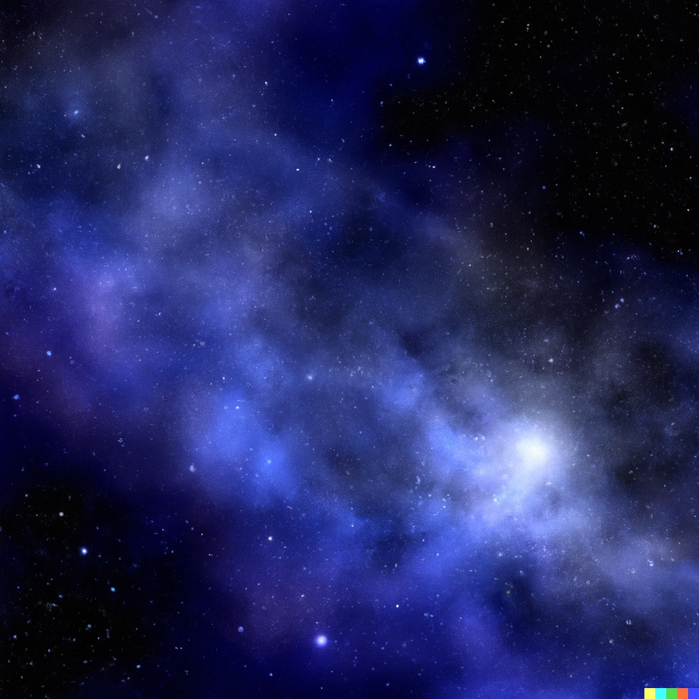  Dall-E: *Space*


---
## What is Space?

--
* [Merriam-Webster: Space](https://www.merriam-webster.com/dictionary/space)

--
* ChatGPT
    * Outer Space
    * Physical Space
    * Cosmos
    * Space as a Concept


???
.task[COMMENT:]  

* ChatGPT
    * Outer Space: This is the vast, seemingly infinite expanse that exists beyond Earth's atmosphere. It is where stars, planets, galaxies, and other celestial bodies are located. Space is characterized by a near-vacuum environment, microgravity, and extreme conditions.
    * Physical Space: In a broader sense, "space" can also refer to the three-dimensional expanse in which all physical objects exist. It is the container in which everything in the universe is located and can be measured in terms of length, width, and height.
    * Cosmos: Space is often used synonymously with the term "cosmos," representing the entirety of the universe, including all matter, energy, planets, stars, galaxies, and the voids between them.
    * Space as a Concept: In a more abstract sense, "space" can also refer to an interval or gap between objects, or a conceptual framework. For example, the space between two buildings, or the conceptual space in an art piece or a design.


---
template: inverse


### *What Are The Spatial Properties Of The Virtual Spaces We Use?*  


???
.task[COMMENT:]  


* Dimensionality
    * Virtual spaces can exist in two, three, or even higher dimensions. Most commonly, virtual environments aim to replicate three-dimensional space to provide a more immersive experience.
* Scale
    * Virtual spaces can simulate various scales, from microscopic to cosmic. For example, a virtual environment might represent the interior of a building, an entire city, or an imaginary world.
* Interactivity
    * Users often have the ability to interact with objects and elements within virtual space. This can include manipulation of virtual objects, navigation through the environment, and engagement with other users (in the case of social virtual spaces).
* Perspective
    * Virtual space can be experienced from different perspectives. In virtual reality, for instance, users can look around in all directions and interact with the environment based on their head and body movements.
* Physics
    * Virtual spaces often simulate some aspects of physics, including gravity, collision detection, and object behavior. This contributes to a more realistic and immersive experience.
* Navigation
    * Users can navigate through virtual space using various means, such as walking, flying, teleporting, or using controllers. The navigation mechanisms depend on the type of virtual environment and the technology used (e.g., VR headsets, computer screens).
* Immersiveness
    * The goal of many virtual spaces is to create a sense of immersion, making users feel like they are present in the simulated environment. This is achieved through realistic graphics, sound, and interactive elements.
* Connectivity
    * Virtual spaces can be connected, allowing users to move seamlessly between different environments. This is common in virtual worlds, games, and collaborative virtual environments.


---

  Dall-E: *Space Virtual*

---

  [[ignitingbusiness]](https://www.ignitingbusiness.com/blog/deciding-on-a-device-tablet-vs-laptop-vs-desktop)


---
template: inverse


### *How Do Analog And Virtual Spatial Spaces Relate To Each Other?*  


???
.task[COMMENT:]  

Analog and virtual spatial spaces are distinct concepts, but they can be related in various ways, especially when considering the representation and interaction with physical and digital environments. Here are some ways in which analog and virtual spatial spaces relate to each other:

* Representation of Physical Space:
    * Analog Space: Refers to the physical space we experience in the real world. It includes the three-dimensional environment around us, encompassing everything from our immediate surroundings to vast landscapes.
    * Virtual Space: A digital representation of space created through computer technology. Virtual spaces can aim to simulate and replicate aspects of analog space, providing a digital counterpart.
* Simulation and Modeling:
    * Analog Space: Represents the actual, tangible world with real physical objects and natural laws governing their behavior.
    * Virtual Space: Involves the creation of a simulated or modeled environment. Virtual spaces often attempt to emulate the properties of analog space, including visual appearance, physics, and interactivity.
* Interaction and Engagement:
    * Analog Space: Involves direct, physical interaction with the environment. Our interactions in the real world are governed by the laws of physics and the properties of tangible objects.
    * Virtual Space: Provides opportunities for interaction through digital interfaces. Users can manipulate virtual objects, navigate through environments, and engage with the digital space using input devices or even through immersive technologies like virtual reality.
* Extension of Reality:
    * Analog Space: The physical world we inhabit and perceive through our senses.
    * Virtual Space: Extends the possibilities of reality by introducing elements that may not exist in the physical world. This could include fantastical landscapes, fictional scenarios, or simulations of environments that are difficult to access in reality.
* Spatial Design and Architecture:
    * Analog Space: The field of physical architecture and spatial design involves creating structures and environments in the real world.
    * Virtual Space: Architects and designers use virtual spaces to visualize and plan structures before they are built. Virtual environments allow for experimentation with designs and concepts.
* Communication and Collaboration:
    * Analog Space: Involves face-to-face communication and collaboration in physical settings.
    * Virtual Space: Facilitates online communication, collaboration, and social interaction. Virtual spaces, including virtual worlds and meeting platforms, allow people to connect in a digital environment.

While analog and virtual spatial spaces have their unique characteristics, the relationship between them is often complementary. Virtual spaces can draw inspiration from, simulate, or enhance aspects of analog space, providing new opportunities for exploration, creativity, and interaction. Additionally, technologies like augmented reality seek to blend analog and virtual elements, creating mixed or augmented spatial experiences.

---

.center[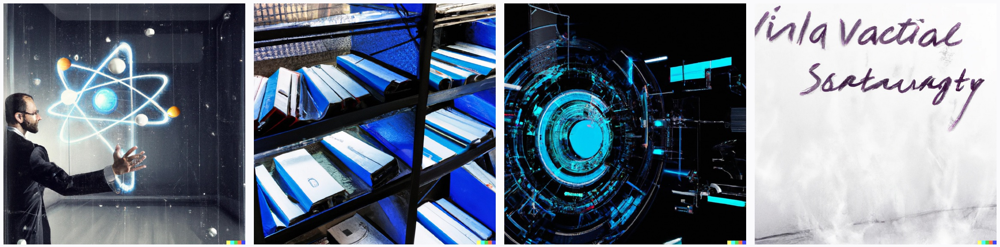  Dall-E: *Analog Virtual Space*]


---

.center[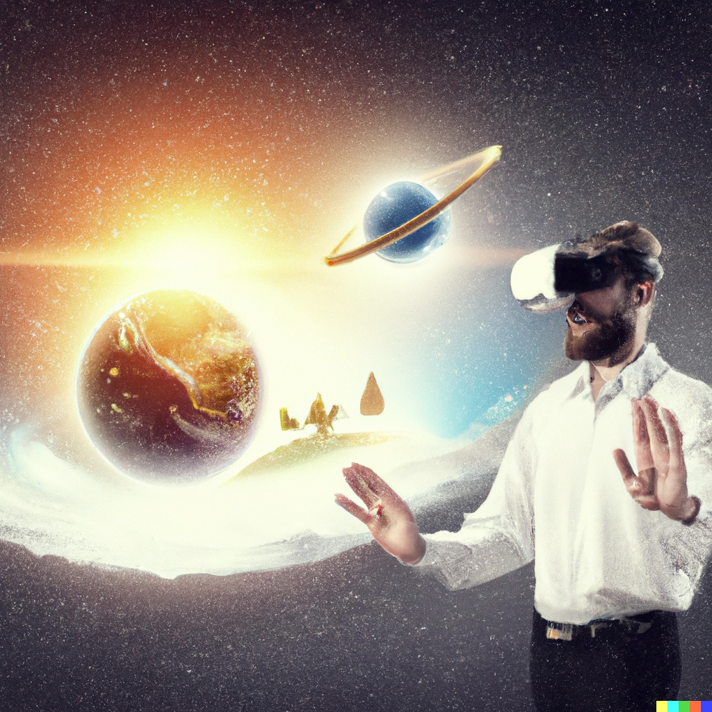  Dall-E: *Connection Analog Virtual Space*]


---
template: inverse


### *What Makes Analog Space Unique?*


???
.task[COMMENT:]  


1. **Tangibility:** Analog space consists of tangible, physical entities. Objects in the analog world have mass, occupy space, and can be directly perceived through our senses. This tangible nature distinguishes analog space from the abstract and digital representations found in virtual environments.

2. **Physical Laws:** Analog space is governed by the laws of physics, including gravity, motion, and thermodynamics. Objects in the real world interact with each other based on these fundamental principles, contributing to the predictability and stability of the analog environment.

3. **Sensory Experience:** In analog space, individuals experience the environment through their senses, including sight, sound, touch, taste, and smell. The richness and complexity of sensory experiences contribute to the uniqueness of the analog world.

4. **Spontaneity:** Analog interactions often involve spontaneity and unpredictability. In face-to-face conversations, for example, people respond to each other in real-time, and the flow of communication is dynamic and unscripted. This spontaneity adds a layer of complexity and authenticity to analog interactions.

5. **Social and Cultural Context:** Analog space is deeply embedded in social and cultural contexts. Physical spaces, such as homes, neighborhoods, and cities, carry cultural significance, and human interactions in analog space are shaped by social norms, traditions, and shared experiences.

6. **Limitations and Constraints:** Analog space has inherent limitations and constraints. Physical distances, the constraints of time and resources, and the laws of physics impose boundaries on what is possible in the real world. Overcoming these limitations often requires practical solutions and compromises.

7. **Biological Presence:** Analog space is intimately tied to the presence of living organisms, including humans, animals, and plants. Biological entities contribute to the diversity, complexity, and dynamism of the analog environment.

8. **Ephemeral Nature:** Analog space is characterized by its impermanence and ephemerality. Seasons change, landscapes evolve, and the physical world undergoes constant transformation. This transience contributes to the uniqueness of analog space at different points in time.

9. **Multisensory Integration:** Analog space provides a multisensory experience, where information is processed through a combination of sensory inputs. This integration of sensory information contributes to a holistic understanding of the environment.

10. **Causal Relationships:** Events and interactions in analog space often have clear cause-and-effect relationships. Actions result in tangible consequences, and the interconnectedness of elements in the physical world is a fundamental aspect of analog space.

These characteristics collectively make analog space a rich, dynamic, and diverse environment that serves as the foundation for human existence, interaction, and experience. While virtual and digital spaces offer unique opportunities, analog space remains irreplaceable in its authenticity and complexity.


---
.header[Space]

## Today

* An Introduction to three.js


--

With this session you will

--
* understand what the three.js library can be used for and how to use it, and

--
* know how to build a basic 3D scene.

---
.header[Space]

## Today

.center[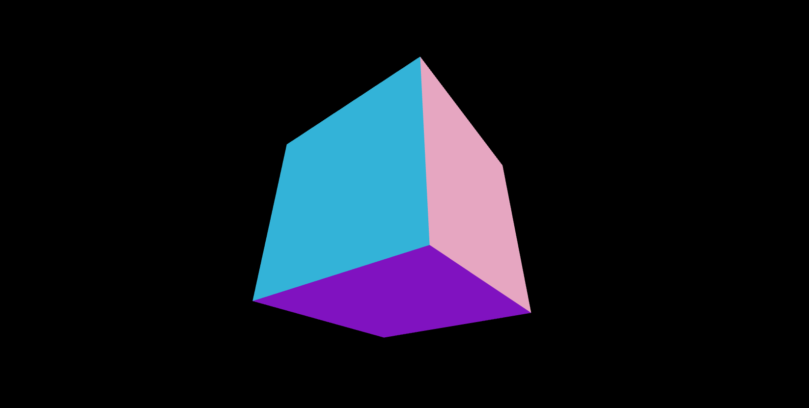]

---
.header[Space]

## Today

.center[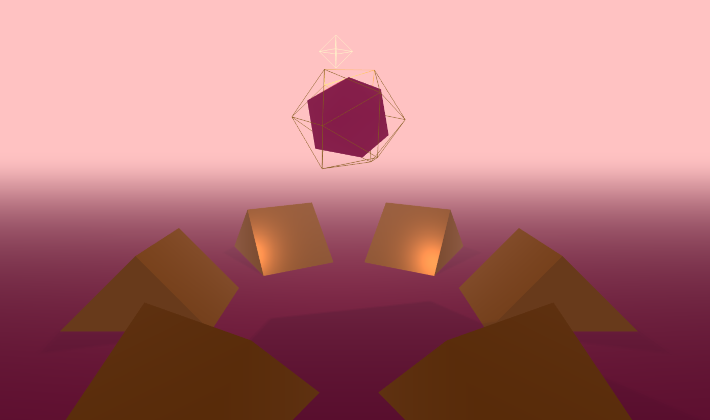]


???
.task[COMMENT:]  

* https://ctechfilmuniversity.github.io/lecture_ws2324_creative_coding_1/01_sessions/06_space/code/


---
template:inverse

# three.js

---

## What is three.js ?

--
* Goal: enable 3D graphics in a web browser

--
* Open-source library for JavaScript using WebGL

--
* Simplifies WebGL tools and environments, e.g.,  geometries, materials, lighting, audio

--

> Alternatively, you could write everything in WebGL, but that is much more complicated.


---
.header[three.js]

## Web Graphics Library (WebGL)

--
* JavaScript API 


???
.task[COMMENT:]  

WebGL is a JavaScript API for rendering interactive 2D and 3D graphics. It is executed on a computer's GPU. It consists of control code written in JavaScript and shader code which is written in OpenGL ES Shading Language (GLSL ES), a language similar to C or C++. [[1]](https://developer.mozilla.org/en-US/docs/Web/API/WebGL_API)
  

* An application programming interface (API) is a way for two or more computer programs to communicate with each other. It is a type of software interface, offering a service to other pieces of software
* An API, or application programming interface, is a set of defined rules that enable different applications to communicate with each other. It acts as an intermediary layer that processes data transfers between systems, letting companies open their application data and functionality to external third-party developers, business partners, and internal departments within their companies.

--
* Rendering interactive 2D and 3D graphics

--
* Executed on a computer's GPU

--
* JavaScript + shader code (GLSL ES)


---
.header[three.js]

## WebGL Example Code

.left-even[
[webgl_triangle.html ↗︎](../01_sessions/06_space/webgl_triangle.html)
  
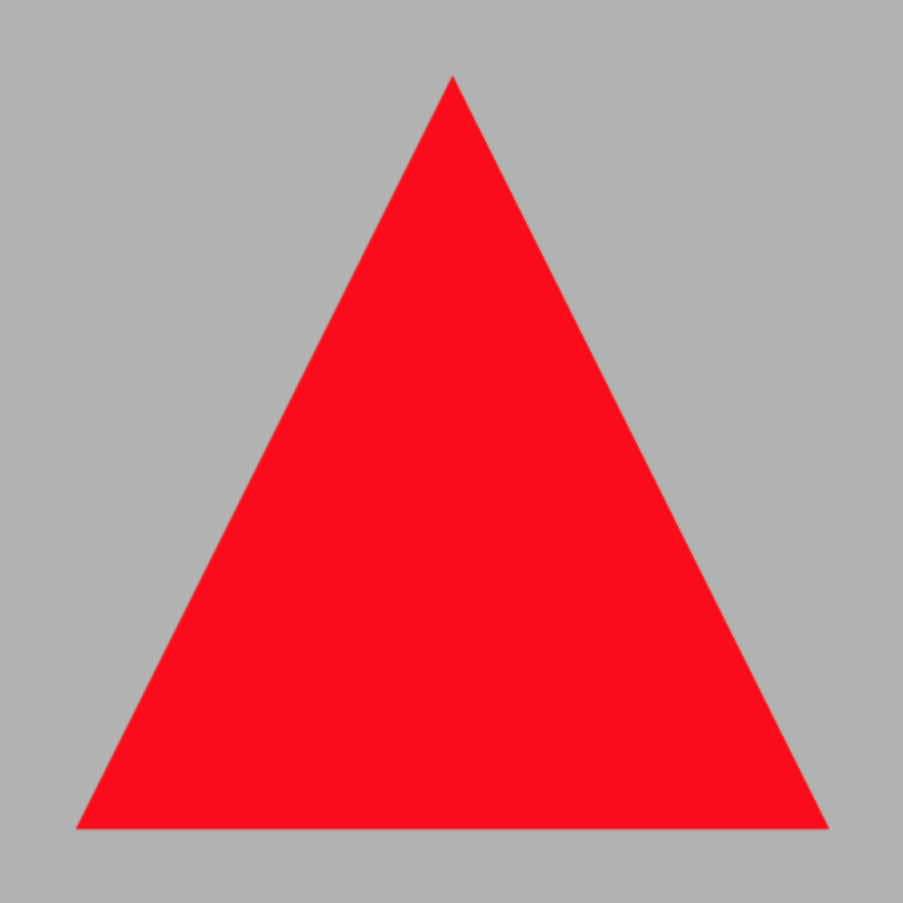
]

--
.right-even[

* WebGL requires a lot of code for setting up a scene

> three.js takes care of many steps for us!

]


???
.task[COMMENT:]  

As you can see it it's quite **a lot** of code for a simple red triangle. This is where Three.js comes in to simplify the creation of 3D graphics with WebGL.

---
.header[three.js]

## Alternatives


---
.header[three.js | Alternatives]

## [babylon.js](https://www.babylonjs.com/)

<video height="480" controls="controls">
<source src="../02_scripts/img/space/babylon_01.mp4" type="video/mp4">
</video>

---
.header[three.js | Alternatives | babylon.js]

[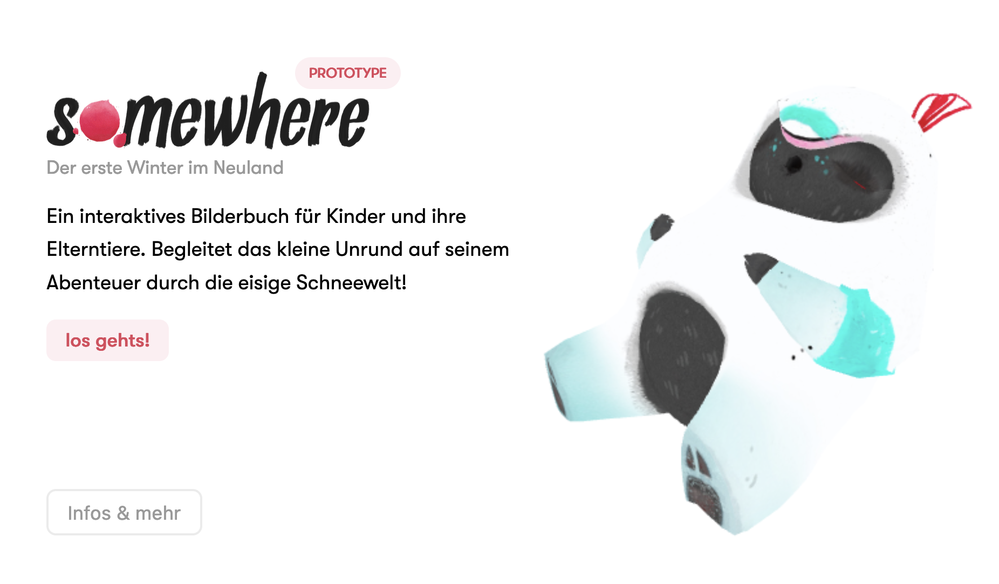](https://somewhere.gl/index.html)


---
.header[three.js | Alternatives]

## [p5.js](https://p5js.org/)

`createCanvas(windowWidth, windowHeight, WEBGL);`
  
.left-even[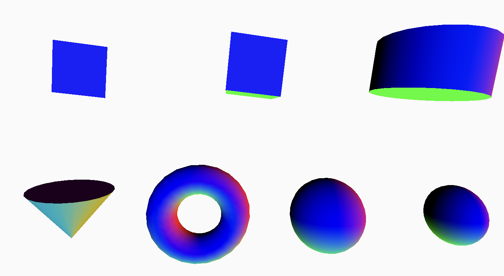]

--

.right-even[

* Quite clumsy implementation

> Don't do 3D projects with p5.
]

---
template:inverse

### three.js

# Examples


---
.header[three.js | Examples]

## [Cat](https://codepen.io/Yakudoo/pen/oXJYxy)

  


---
.header[three.js | Examples]

## [Blue Marine Foundation](https://www.bluemarinefoundation.com/the-sea-we-breathe/)
  


---
.header[three.js | Examples]

## [Helios](http://unseen-music.com/yume/)


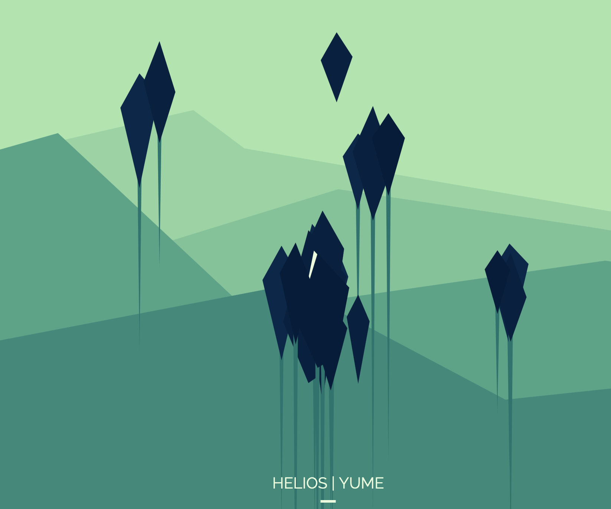


???
.task[COMMENT:]  

[Pola](https://www.pola.co.jp/wecaremore/mothersday/)
  


---
.header[three.js | Examples]

## [Swiss Army Man](https://swissarmyman.com/)
  


???
.task[COMMENT:]  

## [Chartongne-Taillet Winery](https://chartogne-taillet.com/en)


---
.header[three.js | Examples]

## [VR Dust](https://vrdust.org.uk/)


---
.header[three.js | Examples]

## [Woodkid Robot](https://experiment-woodkid-volcano-robot.vercel.app/)

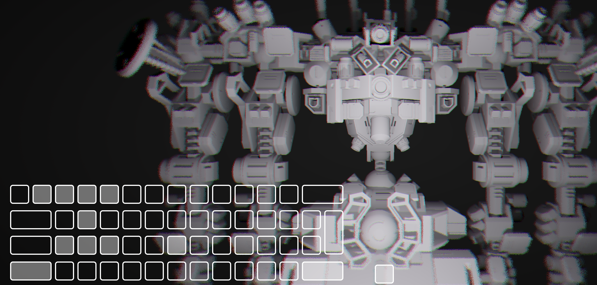


---
.header[three.js | Examples]

## [Thump Thump](http://www.larsberg.net/#/thumpThump)

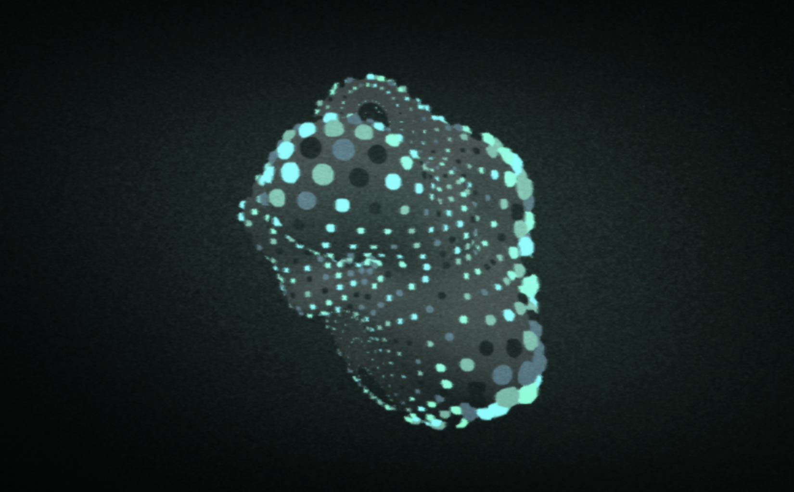


---
.header[three.js | Examples]

## [Aquarium](https://www.aquarium.ru/en)

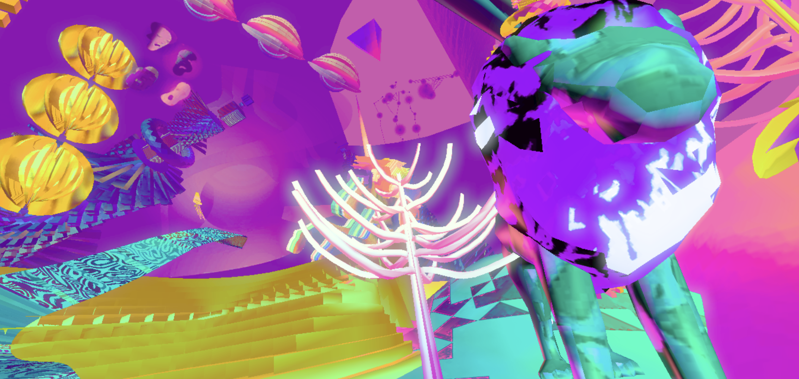

---
.header[three.js | Examples]

## Anna Eschenbach's 1st Term Project

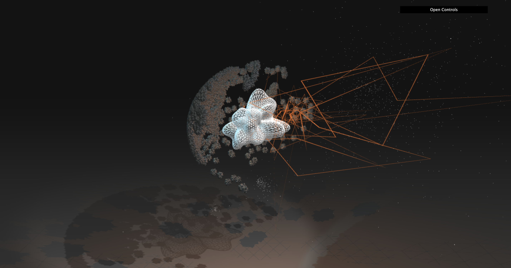

---
.header[three.js | Examples]

## Anna Eschenbach's 1st Term Project

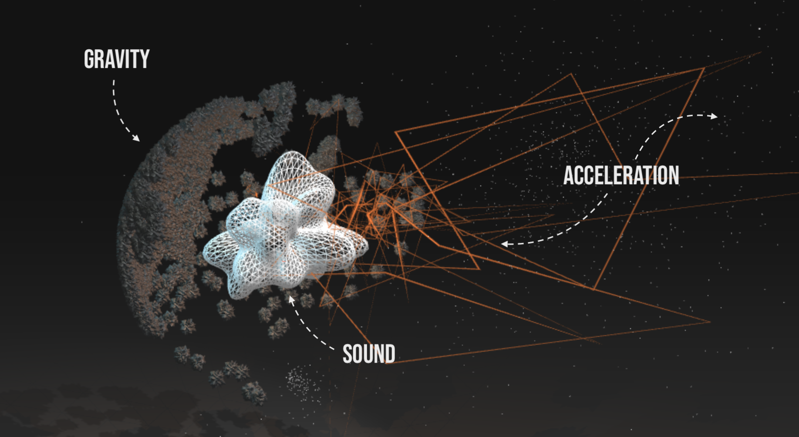


---
.header[three.js | Examples]

## Collections

* [three.js examples](https://threejs.org/examples/#webgl_animation_keyframes)
* [Featured projects on the three.js](https://threejs.org/)
* [Awarded Three.js projects](https://www.awwwards.com/websites/three-js/?ads=1&page=1)


---
template:inverse

### three.js

# Installation


---
.header[three.js]

## Installation

* Local or online
  
--
  
For a complex library such as three.js the local installation is a bit more complicated.


???
.task[COMMENT:]  

* As with all libraries, we can access local or online versions of the library. For a proper local installation there are steps involved, we don't know yet. We will have a look at that next week.

For getting the coding started, we will simply work with links to online library files.
  
--
  

> For now we use the online version to get the coding started!

---
.header[three.js | Installation]

## Online Library Files

three.js is a well constructed library, which is broken into different *modules*.


???
.task[COMMENT:]  


We need the above code due to the way the three.js library is constructed. Roughly speaking, the library is broken into different *modules*, which make it easier to maintain the code-base. The three.js library exports (meaning, *gives to us*) the module `three`. The script type [`importmap`](https://developer.mozilla.org/en-US/docs/Web/HTML/Element/script/type/importmap#import_map_json_representation) allows to specify, which module(s) to import.  The imported library module will replace the text when the module URL is resolved.

--
* A module specifies what it exports


???
.task[COMMENT:]  

* export = (meaning, *gives to us*)


--
* three.js's main functionality is inside of the `three` module

--

> What to import how is given by the library. Ideally, we follow the installation guide.

---
.header[three.js | Installation]

## Online Library Files

three.js specifies to use an `importmap` in the `index.html`:

--

```html
    <script type="importmap">
        {
            "imports": {
                "three": "https://unpkg.com/three@0.158.0/build/three.module.js"
            }
        }
    </script>
```


???
.task[COMMENT:]  

* https://kentcdodds.com/blog/unpkg-an-open-source-cdn-for-npm
* https://stackoverflow.com/questions/59182642/how-to-choose-a-cdn-to-load-javascript-css-libraries

To make an import from three.js online library files, we will use a slightly more sophisticated script call:


--
* `importmap` allows us to specify, which module(s) to import


???
.task[COMMENT:]  

Out of the box, three.js includes the fundamentals of a 3D engine. Other three.js components, such as controls, loaders, and post-processing effects, are part of the addons/ directory. [[7]](https://threejs.org/docs/#manual/en/introduction/Installation)


--
* Importing modules only work with the HTTP(s) protocol 

???
.task[COMMENT:]  
A web-page opened via the file:// protocol cannot use import / export.

---
.header[three.js | Installation]

## Online Library Files

Eventually, we are going to import multiple modules

```html
    <script type="importmap">
    {
        "imports": {
            "three": "https://unpkg.com/three@0.158.0/build/three.module.js",
            "three/addons/": "https://unpkg.com/three@0.158.0/examples/jsm/"
        }
    }
    </script>
```

---
.header[three.js]

## The Html Canvas and JavaScript File

--

```html
  <body>
    <canvas id="canvasThree"></canvas>
    <script type="module" src="./scene.js"></script>
  </body>
```

--
* We specify the canvas element that we use for rendering three.js


???
.task[COMMENT:]  

* To define the canvas element (here with the id `canvasThree`), in which three.js is going to be rendered is not strictly necessary (similar to p5, where we didn't specify it), but I find it a well-structured setup.

--
* The script type for a three.js scene must be set to `module`

???
.task[COMMENT:]  

* The three.js scene will be implemented in `scene.js` (often also called `main.js`). Please note, that the script type for a three.js scene must be set to `module`. If you do not specify the type as module, you will get an error, most likely. The type `module` causes the loaded source code to be treated as a JavaScript module, which is needed for three.js to work.

---
.header[three.js]

## CSS

For now, we are going to work with a full-window browser and for that we only need basic css:

```css
body {
  margin: 0;
}
```

For such minimal code, we could also just add the code within a script tag within our `.html` file directly.

---

```html
<!DOCTYPE html>
<html>
  <head>
    <meta charset="UTF-8" />
    <title>Hello three.js!</title>

    <style>
        body { margin: 0; }
    </style>

    <script type="importmap">
        {
            "imports": {
                "three": "https://unpkg.com/three@0.158.0/build/three.module.js"
            }
        }
    </script>
  </head>
  <body>
    <canvas id="canvasThree"></canvas>
    <script type="module" src="./scene.js"></script>
  </body>
</html>
```


---
.header[three.js]

## Webserver

To run this project we will use the same extensions as before - the [live server](https://marketplace.visualstudio.com/items?itemName=ritwickdey.LiveServer) for VSCode. 

---
template:inverse

### three.js
# Basic Scene


---
.header[three.js]

## Basic Scene

To display something with three.js, we need at least three components: 

--
1. Scene 

--
2. Camera

--
3. Renderer


???
.task[COMMENT:]  


Now the fun part begins - let's get started with our first three.js scene, which we will implement in th `scene.js` file. 

<!-- A basic three.js project consists of the following elements and we will go through them one by one: <br> [[3]](https://threejs.org/manual/resources/images/threejs-structure.svg) -->

To display something with three.js, such as the beautiful cube below, we need at the very least three components: 

1. a scene, 
2. a camera and 
3. a renderer.

The code below creates a basic scene, displaying a cube. Worry not, in the following script, I will explain each component.

---


---
.header[three.js]

## Basic Scene

```js
import * as THREE from 'three';

// SCENE

// CAMERA

// RENDERER

// GEOMETRY
```


???
.task[COMMENT:]  


```js
import * as THREE from 'three';

// SCENE
const scene = new THREE.Scene();

// CAMERA
const fov = 70;
const aspect = window.innerWidth / window.innerHeight;
const near = 0.1;
const far = 10;
const camera = new THREE.PerspectiveCamera(fov, aspect, near, far);
camera.position.z = 1;

// RENDERER
const canvas = document.querySelector("#canvasThree");
const renderer = new THREE.WebGLRenderer({canvas, antialias: true});
renderer.setSize( window.innerWidth, window.innerHeight);

// GEOMETRY
const geometry = new THREE.BoxGeometry(0.5, 0.5, 0.5);
const material = new THREE.MeshNormalMaterial();
const cube = new THREE.Mesh( geometry, material );

cube.rotation.x = 100;
cube.rotation.y = 180;
scene.add(cube);

renderer.render(scene, camera);
```

---
.header[three.js | Basic Scene]

## The THREE Object 

```js
import * as THREE from 'three';
```

???
.task[COMMENT:]  

As above for the library loading already mentioned, three.js is a well-structured library, separated into different modules (and classes, see the section below). Such a setup requires us to specify for our JavaScript file, what to import from which module.

--
* import everything (`*`)

???
.task[COMMENT:]  

The following line indicates to import everything (`*`) from the library's module `three` (the same value as in the `"imports"` call in `index.html`) and save it in an object, which is called `THREE` (in theory, you could change this name, but `THREE` is a convention):


--
* from the library's module `three`

--
* save it in an object, called `THREE`

--

Now we work with the object `THREE` and access its properties, functions, and classes.

--

We do that with the `.`-notation, 

--
e.g., `THREE.Scene();`. 

---
.header[three.js | Basic Scene]

## THREE Classes

--

* Many components are encapsulated into classes

--
* E.g., there is a [`Scene`](https://threejs.org/docs/#api/en/scenes/Scene) class, a [`PerspectiveCamera`](https://threejs.org/docs/#api/en/cameras/PerspectiveCamera) class, a [`BoxGeometry`](https://threejs.org/docs/#api/en/geometries/BoxGeometry) and so on.


--
Short story: **create an instance from a class** in order to work with that component.  

--
We do so with the `new` key word:

--
```js
const camera = new PerspectiveCamera();
```


???
.task[COMMENT:]  

* The short story for working with three.js is that you have to **create instances from the given classes** in order to work with that component and to, e.g., use that component's functionalities. To create an instance of a class, we have to use the keyword **`new`**. The following code creates an instance of the [`PerspectiveCamera`](https://threejs.org/docs/#api/en/cameras/PerspectiveCamera) class (let's ignore its arguments for now) and we have to access that class through the `THREE` object:


---
.header[three.js | Basic Scene]

## THREE Classes

* Many components are encapsulated into classes
* E.g., there is a [`Scene`](https://threejs.org/docs/#api/en/scenes/Scene) class, a [`PerspectiveCamera`](https://threejs.org/docs/#api/en/cameras/PerspectiveCamera) class, a [`BoxGeometry`](https://threejs.org/docs/#api/en/geometries/BoxGeometry) and so on.
  
Short story: **create an instance from a class** in order to work with that component.  
  
We do so with the `new` key word:

```js
const camera = new THREE.PerspectiveCamera();
```

--

> Don't forget: To access these classes, we always have to use the `THREE` object, which we have imported in the previous step.

---
.header[three.js | Basic Scene]

## THREE Classes

* Many components are encapsulated into classes
* E.g., there is a [`Scene`](https://threejs.org/docs/#api/en/scenes/Scene) class, a [`PerspectiveCamera`](https://threejs.org/docs/#api/en/cameras/PerspectiveCamera) class, a [`BoxGeometry`](https://threejs.org/docs/#api/en/geometries/BoxGeometry) and so on.
  
Short story: **create an instance from a class** in order to work with that component.  
  
We do so with the `new` key word:

```js
const camera = new THREE.PerspectiveCamera();
```

```js
camera.position.z = 1;
```


???
.task[COMMENT:]  

* Once we have created an instance of the [`PerspectiveCamera`](https://threejs.org/docs/#api/en/cameras/PerspectiveCamera) class, we can work with that object:


---
.header[three.js | Basic Scene]

## THREE Classes

Long story:

--

* A class is a common data structure in many programming languages (also see [Script 04 - Javascript - Classes](./cc1_ws2324_04_javascript_script.md#classes))
  
--
  
> Define a template for "a type of object" with properties and functions.

???
.task[COMMENT:]  

* (conceptually this can be anything)
It let's programmers define their own templates for "a type of object" (conceptually this can be anything) and define which properties and function that object should have. For example, if I am working on a game about cats, I might want to have a data structure for cats, meaning a template for the properties and functions of a cat. Once I have that template -which in computer science lingo is the class- I can derive instances from that template/class, and all instances have certain cat properties and functions.

--
  
.blockquote[>Classes are the core part of the **object-oriented programming paradigm**.]

---
.header[three.js | Basic Scene]

## JavaScript Classes

```js
// The template
class Cat
{
    constructor(name, age) {
        this.name = name;
        this.age = age;
    }
    makeSound() { console.log('meow') }
    getName() { console.log('My name is', this.name) }
}
```
--
```js
// The instance
let ernie = new Cat('Ernie', 3);
ernie.makeSound();  // -> meow
```
--
```js
const camera = new THREE.PerspectiveCamera();
```


---
.header[three.js | Basic Scene]

## JavaScript Objects

--

* Group multiple values into a single value


???
.task[COMMENT:]  

* Similar to an array
  
--
  
```js
let object_name = {
   key1: value1,
   key2: value2
}
```

--
```js
let user = {        // an object
  name: "Sully",    // the key "name" stores the value "Sully"
  age: 30           // the key "age" stores the value 30
};
```
  
--
* Key-value pairs as elements
  
--
* Often used in three.js, e.g. as arguments for functions


???
.task[COMMENT:]  

When working with three.js, we often have to use objects as data structure (also see [Script 04 - Javascript - Classes](./cc1_ws2324_04_javascript_script.md#objects)). 


---
.header[three.js | Basic Scene]

## JavaScript Objects

```js
let user = { name: 'Sully', age: 30 };
```

--

To access a property:  

`obj.property`  
  
e.g.,

`user.name;`


---
.header[three.js | Basic Scene]

## JavaScript Objects

There is a short-cut for the case that key and value are the same


???
.task[COMMENT:]  

Which might be confusing, an which might happen, when working with three.js: When defining an object, there is a short-cut for the case that key and value are the same.

Let's say we have a variable `name` that we want to save in a key called `name`:

--

```js
let name = 'Sully';
let age_sully = 30;

let user = { name: name, age: age_sully };
```

--

The expresseion `name: name,` within an object can be shortend to just `name`:

```js
let name = 'Sully';
let age_sully = 30;

let user = { name, age: age_sully };
```


---
.header[three.js | Basic Scene]

## JavaScript Objects

```js
const canvas = document.querySelector("#canvasThree");
const renderer = new THREE.WebGLRenderer({canvas: canvas, antialias: true});
```

--

```js
const canvas = document.querySelector("#canvasThree");
const renderer = new THREE.WebGLRenderer({canvas, antialias: true});
```


???
.task[COMMENT:]  
For example, when creating an instance of three.js's [WebGLRenderer](https://threejs.org/docs/?q=WebGLRenderer#api/en/renderers/WebGLRenderer) class, it takes as an argument an object. That object has, among other keys, the key `canvas`. The long version of the object as argument would be

--

```js
const myCanvas = document.querySelector("#canvasThree");
const renderer = new THREE.WebGLRenderer({canvas: myCanvas, antialias: true});
```


---
.header[three.js | Basic Scene]

## Scene

Three.js uses the concept of a *scene*.

```js
const scene = new THREE.Scene();
```

--

* Holds everything together, which belongs to a scene, such as geometry and lights

--
* Is then given to the renderer (together with a camera).


???
.task[COMMENT:]  

* You can think of a scene as the object, which holds everyhting together, which belongs to a scene, such as geometry and lights, and which is then given to the renderer (together with a camera).

Under the hood, a `Scene` object defines the root of a [scenegrap](https://threejs.org/manual/#en/scenegraph). A scene graph in a 3D engine is a hierarchy of nodes in a tree-like structure, where each node represents a local space:

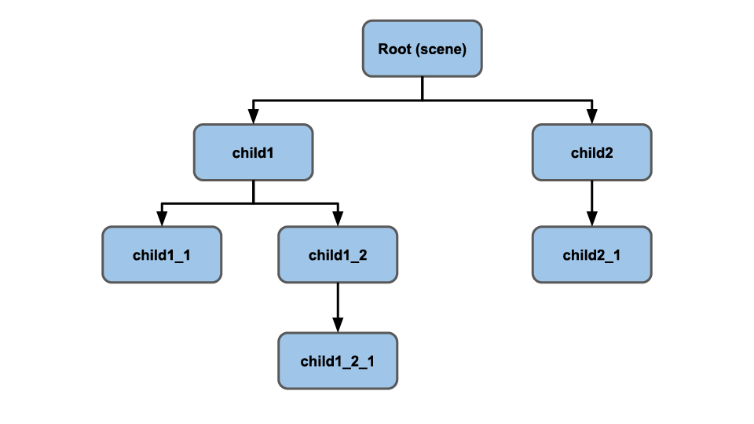


---
.header[three.js | Basic Scene]

## Camera

There are a few different camera types in three.js. 

--

<br >

**PerspectiveCamera( fov : Number, aspect : Number, near : Number, far : Number )**


???
.task[COMMENT:]  

* We will use a [PerspectiveCamera](https://threejs.org/manual/#en/cameras) since its projection mode is designed to mimic the way the human eye sees. 

--

```js
const fov = 70;
const aspect = window.innerWidth / window.innerHeight;
const near = 0.1;
const far = 10;
const camera = new THREE.PerspectiveCamera(fov, aspect, near, far);
```

???
.task[COMMENT:]  
  
* fov — Camera frustum vertical field of view.
* aspect — Camera frustum aspect ratio.
* near — Camera frustum near plane.
* far — Camera frustum far plane.

---
.header[three.js | Camera]

## Field of View

.center[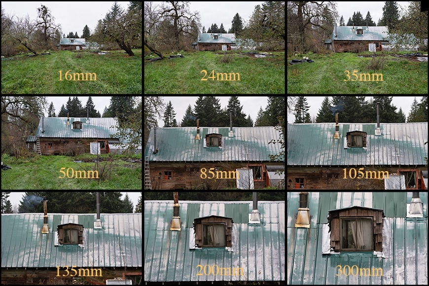[[shotkit]](https://shotkit.com/field-of-view/)]  


???
.task[COMMENT:]  

The first attribute is the **field of view**. FOV is the extent of the scene that is seen on the display at any given moment. The value is in degrees.

For example, this image shows different field of views taken from the same camera position (with real cameras, this is done with changing the focal length of the lens used):

 [[shotkit]](https://shotkit.com/field-of-view/)

---
.header[three.js | Camera]

## Aspect Ratio
  
You almost always want to use the width of the element divided by the height,otherwise you'll get a distorted image.  

---
.header[three.js | Camera]

## Clipping Planes
  
Anything beyond **far** and closer than **near** will not be rendered.


---
.header[three.js | Camera]

## The View Frustum

.center[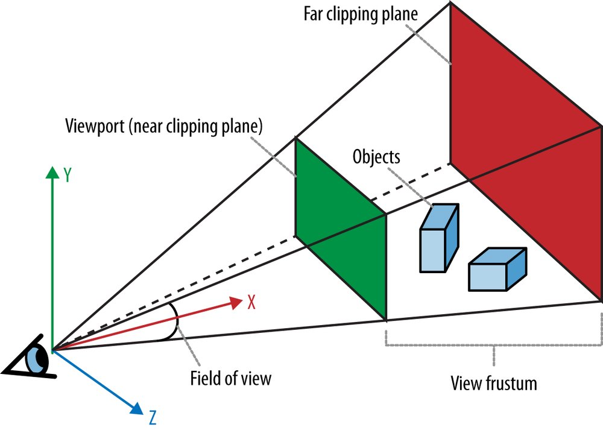]

[[5]](https://pbs.twimg.com/media/Di2Z3InU8AAd3bm.jpg)


???
.task[COMMENT:]  

* By defining these attributes, we constrain the rendered area to the *view frustum*, which is the space between the green and red planes in this image:

---
.header[three.js | Basic Scene]

## Renderer

--

```js
const canvas = document.querySelector("#canvasThree");
const renderer = new THREE.WebGLRenderer({canvas, antialias: true});
```

The standard renderer is the [WebGLRenderer](https://threejs.org/docs/?q=WebGLRenderer#api/en/renderers/WebGLRenderer).


???
.task[COMMENT:]  


Next up is the **renderer**.  Three.js comes with a few other renderers, often used as fallbacks for users with older browsers or for those who don't have WebGL support for some reason.  

In the first line we are accessing with plain, old JavaScript the element in the DOM with the id `canvasThree`. This is the canvas element to which we want to render to. This canvas we pass as argument when creating an instance from the [WebGLRenderer](https://threejs.org/docs/?q=WebGLRenderer#api/en/renderers/WebGLRenderer) class.


--

* Define which DOM element are we rendering to
* Setup the renderer

--

```js
renderer.setSize( window.innerWidth, window.innerHeight);
```


???
.task[COMMENT:]  

We also need to **set a size** for the renderer. You can understand this as the "image size", we are rendering to. It is best to use the width and height of the area we want to fill - in this case, the width and height of the browser window.

--
* Imagine this as image size of the renderer


---
.header[three.js | Basic Scene]

## Renderer

To actually see a rendering, we have to activate the rendering with a scene and a camera:

--

```js
renderer.render(scene, camera);
```

???
.task[COMMENT:]  

(probably somewhere at the end of our file, once the scene is put together)

Now we have a **scene**, a **camera**, and **renderer** and with that a fully functioning rendering pipeline. Let's put something into our scene.


---

```js
import * as THREE from 'three';

// SCENE
const scene = new THREE.Scene();

// CAMERA
const fov = 70;
const aspect = window.innerWidth / window.innerHeight;
const near = 0.1;
const far = 10;
const camera = new THREE.PerspectiveCamera(fov, aspect, near, far);
camera.position.z = 1;

// RENDERER
const canvas = document.querySelector("#canvasThree");
const renderer = new THREE.WebGLRenderer({canvas, antialias: true});
renderer.setSize( window.innerWidth, window.innerHeight);

// GEOMETRY

renderer.render(scene, camera);
```

---
template:inverse

### three.js

# Filling The Scene

---
.header[three.js | Filling The Scene]

## Coordinate System

We are now in 3 dimensions!

--

.center[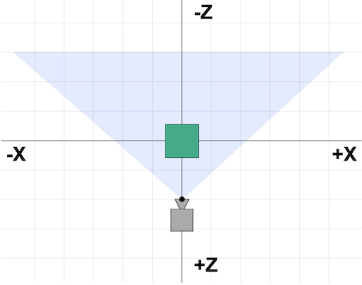  [[6]](https://threejs.org/manual/resources/scene-down.svg)]


???
.task[COMMENT:]  

* Before we add any geometry, we have to take a quick look at the coordinate system. We need to clarify the coordingate system of every new environement that we use, as these differ from enviornment to environment. 
As we are now in 3D, next to x, and y we have to consider a thrid dimension, namely z. As default, the camera is looking down the -z axis:


---
.header[three.js | Filling The Scene]

## Creating 3D Elements

There are many shapes available in three.js.


???
.task[COMMENT:]  

To create a cube (fear not, there are many other shapes available in three.js), we create an instance of the [`BoxGeometry`](https://threejs.org/docs/#api/en/geometries/BoxGeometry) class with its sizes as arguments:

--

<br >
**BoxGeometry(width : Float, height : Float, depth : Float)**

```js
const geometry = new THREE.BoxGeometry(0.5, 0.5, 0.5);
```


???
.task[COMMENT:]  

* width — Width; that is, the length of the edges parallel to the X axis. Optional; defaults to 1.
* height — Height; that is, the length of the edges parallel to the Y axis. Optional; defaults to 1.
* depth — Depth; that is, the length of the edges parallel to the Z axis. Optional; defaults to 1.

---
.header[three.js | Filling The Scene]

## Geometry


```js
const geometry = new THREE.BoxGeometry(0.5, 0.5, 0.5);
```


???
.task[COMMENT:]  


* This node is "empty" by default

The above code only defines cube geometry. However, to render that cube, we also must create a material to make it visible (the [MeshNormalMaterial](https://threejs.org/docs/?q=MeshNormalMaterial#api/en/materials/MeshNormalMaterial) material is just an example here - it takes the colors from the orientation of the surfaces)

--
For rendering that geometry, it needs **material**

--
```js
const material = new THREE.MeshNormalMaterial();
```


???
.task[COMMENT:]  

* Three.js comes with [several materials](https://threejs.org/manual/#en/materials). All materials can be filled with certain attributes to change the look. This can be color, roughness, as well as a texture. Here, e.g., are all attributes listed for the oldy but goody [MeshPhongMaterial](https://threejs.org/docs/#api/en/materials/MeshPhongMaterial). A Phong material mimics how real-world surfaces reflect light in a very limited but still useful fashion.

--
Both, geometry and material, need to be added to a **mesh**:

```js
const mesh = new THREE.Mesh( geometry, material );
```
--

> That is just how three.js wants it.

???
.task[COMMENT:]  

That is just how three.js wants it. Live with it. Hence, in total we have for creating a geometry, or in three.js lingo a *mesh*:

---
.header[three.js | Filling The Scene]

## Mesh

.center[]


---
.header[three.js | Filling The Scene]

## Mesh

```js
const geometry = new THREE.BoxGeometry(0.5, 0.5, 0.5);
const material = new THREE.MeshNormalMaterial();
const mesh = new THREE.Mesh( geometry, material );
```

--

```js
scene.add(mesh);
```


--
  


By default, the object will be added to the coordinates (0,0,0). 


---
## three.js

### Our basic scene is now completed. 💫


???
.task[COMMENT:]  


```js
import * as THREE from 'three';


// SCENE
const scene = new THREE.Scene();

// CAMERA
const fov = 70;
const aspect = window.innerWidth / window.innerHeight;
const near = 0.1;
const far = 10;
const camera = new THREE.PerspectiveCamera(fov, aspect, near, far);
camera.position.z = 1;

// RENDERER
const canvas = document.querySelector("#canvasThree");
const renderer = new THREE.WebGLRenderer({ canvas, antialias: true });
renderer.setSize( window.innerWidth, window.innerHeight);

// GEOMETRY
const geometry = new THREE.BoxGeometry( 0.5, 0.5, 0.5 );
const material = new THREE.MeshStandardMaterial({ color: 0x50ffc0 });

const cube = new THREE.Mesh( geometry, material );
cube.rotation.x = 100;
cube.rotation.y = 180;
scene.add(cube);

renderer.render(scene, camera);
```

Notice, how [MeshStandardMaterial](https://threejs.org/docs/#api/en/materials/MeshStandardMaterial) takes as argument an object with the key-value pair color - value.

---
.header[three.js]

## Materials

--

Let's change the material to a standard material:

```js
const material = new THREE.MeshStandardMaterial({ color: 0x50ffc0 });
```

--

* Colors are usually defined as a hexadecimal triplet in the format of `0x...`
* There is also the [color class](https://threejs.org/docs/#api/en/math/Color.set), which gives you many different options to work with color.

---
.header[three.js]

## The Rendering


--
* The standard material reacts to light

--
* We need light to be reflected


---
.header[three.js]

### Lighting

There are a few different [lights](https://threejs.org/examples/?q=light#webgl_lights_hemisphere) like ambient light, directional light, point light, spot light. 

--


```js
// LIGHTING
// AMBIENT
const ambientLight = new THREE.AmbientLight(0xffffff, 1);
scene.add(ambientLight);
```

---
.header[three.js]

## The Rendering

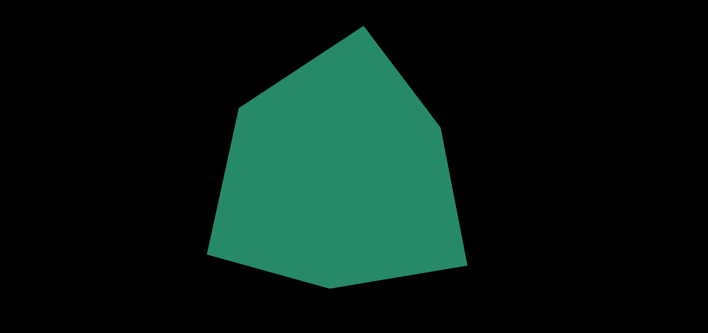


???
.task[COMMENT:]  

Also not too exciting. An ambient light simply makes the whole scene evenly brighter.

---
.header[three.js]

## Lighting

```js
// LIGHTING
// AMBIENT
const ambientLight = new THREE.AmbientLight(0xffffff, 0.1);
scene.add(ambientLight);
```

--

```js
// POINTLIGHT
const pointLight = new THREE.PointLight(0xffffff, 0.5);
pointLight.position.set(2, 2, 2);
scene.add(pointLight);
```

Decrease the intensity of the ambient light to have a reasonable sum of the two light intensities (e.g., 0.1 for ambient and 0.8 for the point light).

---
.header[three.js]

## The Rendering

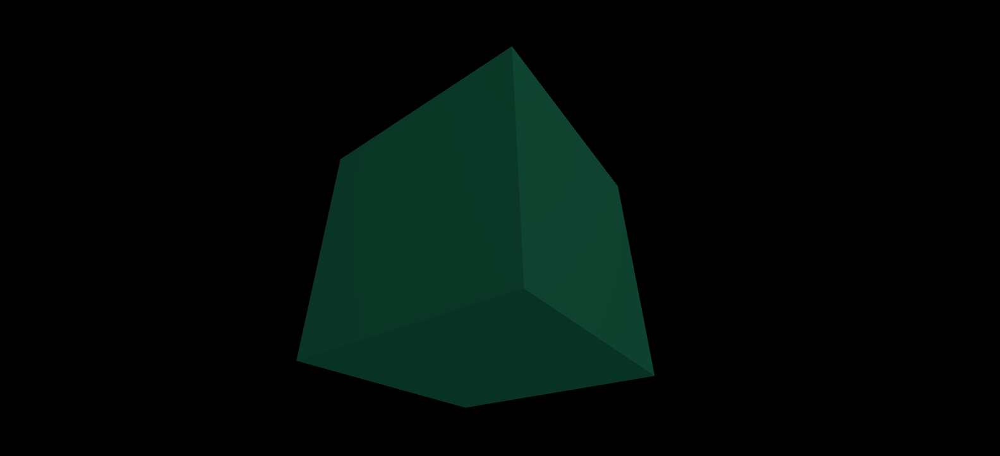
  

### Stunning 🤩

---
template:inverse

### three.js
# A Render Loop


???
.task[COMMENT:]  

* Wouldn't it be nice though, if we could navigate in the scene? For enabling any type of interaction or also, e.g., animation we are still a fundamental property missing in our scene: a render loop. As of now, we are rendering the scene exactly once. But we need a functionality such as the `draw` function in p5, which is called multiple times per second.

---
.header[three.js]

## A Render Loop

* Currently our scene is rendered once

--
* We need a render loop for interaction and animation

--

JavaScript's [`requestAnimationFrame`](https://developer.mozilla.org/en-US/docs/Web/API/window/requestAnimationFrame) function requests a refresh from the browser window. 


???
.task[COMMENT:]  

* Standard function for creating an animation in a browser
* We can easily create a render loop similar to the `draw()`-loop in p5.js. For that we are using JavaScript's [`requestAnimationFrame`](https://developer.mozilla.org/en-US/docs/Web/API/window/requestAnimationFrame) function, which requests the browser to refresh its window. 

<!-- The frequency of calls to the callback function will generally match the display refresh rate. The most common refresh rate is 60hz, (60 cycles/frames per second), though 75hz, 120hz, and 144hz are also widely used. [[8]](https://developer.mozilla.org/en-US/docs/Web/API/window/requestAnimationFrame) You can also control the refresh rate but there is no need for us to do so. -->

--
* `requestAnimationFrame` takes as argument a function to call

--
* `requestAnimationFrame(callback)`


???
.task[COMMENT:]  

* This is the typical function to for creating an animation in a browser. `requestAnimationFrame` refreshes the current window and takes as argument another function that should be called from `requestAnimationFrame`. Such a function as an argument is a *callback* function.


--
  
> In this case the callback function is the function to call when it's time to update our animation or better our scene for the next repaint.


---
.header[three.js]

## A Render Loop


```js
function animate() {
    
    ...
}

requestAnimationFrame(animate);
```


???
.task[COMMENT:]  

*Wait, what? A function takes another function as argument??* Welcome to JavaScript, my friends! 

These type of functions are called higher order functions and they are part of the *functional programming* paradigm. With that they are not JavaScript specific but to my knowledge most prominently used in JavaScript. At a different time you will hear everything about those functions. For now, just accept the fact that functions are just objects that can be passed as argument to functions.


--
Yes, functions can take other functions as arguments! 


--
  
> Higher order functions are the core part of the **functional programming paradigm**.]

---
.header[three.js]

## A Render Loop


```js
function animate() {
    
    ...
}

requestAnimationFrame(animate);
```

* We refresh exactly once!


???
.task[COMMENT:]  

* The above does not create a loop yet. We request a window refresh exactly once. But the callback function could be the function that also calls `requestAnimationFrame(animate);` - and with that we have our loop!

--
> How to create a loop?

---
.header[three.js]

## A Render Loop


```js
// RENDER LOOP
function animate() {
    
    ...
    requestAnimationFrame(animate);
}

animate();
```


???
.task[COMMENT:]  

As we want to re-render our scene with each refresh window call, we add the rendering to this animation function:

---
.header[three.js]

## A Render Loop

```js
// RENDER LOOP
function animate() {
    
    renderer.render(scene, camera);
    requestAnimationFrame(animate);
}

animate();
```


???
.task[COMMENT:]  

This function is typically called animate even though in the above example it is more of a render function. We could also call it `draw` if our hearts are still with p5. Eventually, we will add animation behavior to the function that is why I introduce the name `animate` here already.

Now, that we have a render loop, we can also add interaction. Let's start with simple scene navigation.

---
.header[three.js]

## A Render Loop

```js
// RENDER LOOP
function animate() {
    
    cube.rotation.x += 0.004;
    cube.rotation.y += 0.007;

    renderer.render(scene, camera);
    requestAnimationFrame(animate);
}
animate();
```


---
template:inverse

### three.js
# Orbit Control

---
.header[three.js]

## Orbit Control

[OrbitControls](https://threejs.org/docs/index.html#examples/en/controls/OrbitControls) enable a simple navigation setting that allows us to move around a target.

--
* This module is not part of the main three module


???
.task[COMMENT:]  


The Orbit Control functionality is not part of the main library but we need to load an additional module for it. three.js calls these *Addons*. 

--
* We need to import it

--

```html
    <script type="importmap">
        {
            "imports": {
                "three": "https://unpkg.com/three@0.158.0/build/three.module.js",
                "three/addons/": "https://unpkg.com/three@0.158.0/examples/jsm/"
            }
        }
    </script>
```


???
.task[COMMENT:]  

* Once again, for knowing [how to install an addon](https://threejs.org/docs/#manual/en/introduction/Installation) you must look into the installation guide of the library that you are using. There is no *just knowing it*.

---
.header[three.js]

## Orbit Control

OrbitControls gives us a named export and we can use that name for the import:

```js
import {OrbitControls} from 'three/addons/controls/OrbitControls.js';
```

--

```js
// CONTROLS FOR NAVIGATION
const controls = new OrbitControls(camera, renderer.domElement);
```

---
.header[three.js]

## Orbit Control

```js
import * as ORBIT from 'three/addons/controls/OrbitControls.js';
```

```js
// CONTROLS FOR NAVIGATION
const controls = new ORBIT.OrbitControls(camera, renderer.domElement);
```

* Would also work
* I recommend to always go with the instructions from the official documentation


???
.task[COMMENT:]  

* https://github.com/mrdoob/three.js/blob/dev/examples/jsm/controls/OrbitControls.js


---
.header[three.js]

## Orbit Control

```js
import { OrbitControls } from 'three/addons/controls/OrbitControls.js';
```

```js
// CONTROLS FOR NAVIGATION
const controls = new OrbitControls(camera, renderer.domElement);
```


???
.task[COMMENT:]  

* Now, we can add those controls to the scene with

**OrbitControls( object : Camera, domElement : HTMLDOMElement )**

* object: (required) The camera to be controlled. The camera must not be a child of another object, unless that object is the scene itself.
* domElement: The HTML element used for event listeners (*where to detect user input?*). 


---
.header[three.js]

## Orbit Control

```js
import { OrbitControls } from 'three/addons/controls/OrbitControls.js';
```

```js
// CONTROLS FOR NAVIGATION
const controls = new OrbitControls(camera, canvas);
```


---
.header[three.js]

## Orbit Control

```js
import { OrbitControls } from 'three/addons/controls/OrbitControls.js';
```

```js
// CONTROLS FOR NAVIGATION
const controls = new OrbitControls(camera, renderer.domElement);
```

```js
// RENDER LOOP
function animate() {
    
    controls.update();
    renderer.render(scene, camera);
    requestAnimationFrame(animate);
}

animate();
```

---
template:inverse

# Next

---
## Next

.left-even[
CC1
* Local installation
* Higher Order Functions
* Simple Gui Controls
* Employment
]

--
.right-even[

TBAG
* The rendering process
* Transformations / Animations
* Object loading
* Audio
]


---
template: inverse

## The End  

💻 💫 🔺


