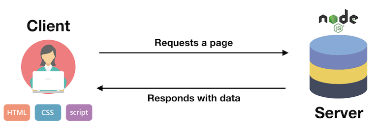

name: inverse
layout: true
class: center, middle, inverse
---


# Creative Coding I


### Prof. Dr. Lena Gieseke | l.gieseke@filmuniversitaet.de  

#### Film University Babelsberg KONRAD WOLF


---
layout:false

.header[Ansynchronism]

## Today

--
* Local Package Installation

--
* Gui Controls

--
* Higher Order Functions

---
template:inverse

# Local Installation


---
.header[Local Installation]


## Why Should We Care?

--

CDN

* No installation / manager software needed
* Files may be pre-cached
* Always use the latest version

--

Local Installation 

* Closed ecosystem, all the files are stored on your server
* More control over dependencies, versions, requirements
* Might include services for bundling
* Server-side libraries do not work with CDN 


???
.task[COMMENT:]  

*  Content Delivery Network (CDN)
*  https://stackoverflow.com/questions/43605215/using-cdn-vs-installing-library-by-npm

Files may be pre-cached
jQuery is ubiquitous on the web. There’s a high probability that someone visiting your pages has already visited a site using the Google CDN. Therefore, the file has already been cached by your browser and won’t need to be downloaded again.

---

## Local Installation

We need to know about

--

* Modules

--
* Packages

--
* Package management

--
* Build tools


---
.header[Local Installation]

## Modules

.footnote[[[Eloquent JavaScript - Modules]](https://eloquentjavascript.net/10_modules.html#h_zWTXAU93DC)]


???
.task[COMMENT:]  

* Modules provide structure to bigger programs by separating the code into pieces with clear interfaces and dependencies. The interface is the part of the module that’s visible from other modules, and the dependencies are the other modules that it makes use of.

--
* Provide certain functionality to include


???
.task[COMMENT:]  

* Structuring programs is one of the subtler aspects of programming. Any nontrivial piece of functionality can be modeled in various ways.

--
* Might be dependent on other modules

--
  
> The relationships between modules are called **dependencies**.

--

* Parts of a modules are for the outside world to use, the rest is private

--

> Modules interact through well-defined connectors, namely `import` and `export`.


???
.task[COMMENT:]  

* By restricting the ways in which modules interact with each other, the system becomes more like LEGO, where

https://dev.to/hamza/framework-vs-library-vs-package-vs-module-the-debate-3jpp
  

Module

Is the smallest piece of software. A module is a set of methods or functions ready to be used somewhere else.  
  
Package

Is a collection of modules. This may sound funny, but usually what a package does, is gather a number of modules holding in general the same functional purpose. Making it easier to include all the related modules at once.  
  
Library

Well library at it's core, is a collections of packages. It's purpose is to offer a set of functionalities ready to use without worrying about the subsequent packages. So a library is what you include when you want to add some functionality to your code. It does not force any coding style on you either.  
  
Framework

It's a set of libraries. But this time, the framework does not just offer functionalities, but it also provides an architecture for the development work. In other words you don't include a framework. You integrate you code into it. He is the wire frame of the project. That's why a framework forces its coding style on you.

---
.header[Local Installation]
## Packages


.footnote[[[Eloquent JavaScript - Modules]](https://eloquentjavascript.net/10_modules.html#h_zWTXAU93DC)]

--
* Contain module(s)

--
* Contain all information about dependencies

--
* Documented

--
* Can be distributed, meaning copied and installed

--
* Versioned

--

> Packages require special infrastructure.

--
  
* Store, find, install, upgrade, etc.

---
.header[Local Installation]

## Node.js & npm

.footnote[[[Eloquent JavaScript - Modules]](https://eloquentjavascript.net/10_modules.html#h_zWTXAU93DC)]

--


* Online repository for JavaScript packages
* An installation and management program
* Comes with useful command line tools, e.g. to run your app
* npm is part of Node.js

--


* An open-source, cross-platform JavaScript runtime environment

---
## Node.js

--

  

--

* The back-end, meaning the 'engine' of an application in contrast to its front-end interface and interactions.  

--
* Powerful for scalable, data-intensive and real-time apps

???

* As homework you have to install node. This might lead to problems, do it early.
* https://nodejs.org/en/download/

---
## Node.js

The *Hello World* of Node.js is a web server:

```js
const http = require('node:http');

const hostname = '127.0.0.1';
const port = 3000;

const server = http.createServer((req, res) => {
  res.statusCode = 200;
  res.setHeader('Content-Type', 'text/plain');
  res.end('Hello World\n');
});

server.listen(port, hostname, () => {
  console.log(`Server running at http://${hostname}:${port}/`);
});
```

.footnote[[[nodejs.org]](https://nodejs.org/en/learn/getting-started/introduction-to-nodejs)]


???
.task[COMMENT:]  

* 2324/code/node/server.js

---
.header[Node.js]

## Version Managing (Optional)

The node.js version you are using matters a lot! 

--

* Different projects may require different versions of Node.js

--
* Use a tool to manage different versions for Node.js

--

> Yes, we need a package manager for installing an environment that gives us then a package manger...


--

There are [several package manager](https://nodejs.org/en/download/package-manager/) that help you with organizing node versions.
  

???
.task[COMMENT:]  
  
I personally like nvm as it is simple and straight-forward to use (it is actually just a bash script).


.footnote[[freecodecamp](https://www.freecodecamp.org/news/node-version-manager-nvm-install-guide/)]


---
.header[Node.js]

## NVM

[NVM](https://github.com/nvm-sh/nvm/blob/master/README.md) allows you to **install different versions** of Node, **and switch** between these versions depending on the project that you're working on via the command line.

--

<br >

Hence, for getting Node.js, we 

1. Install NVM (or any node version manager of your choice)
2. With NVM install node


???

nvm install --lts

For now, we are just going to work with the latest Node.js version. But keep in mind that if you are ever running into version issues with Node.js, you can switch versions with nvm.
  
https://heynode.com/tutorial/install-nodejs-locally-nvm/

---
## Node.js

### *Or simply download the latest version of [Node.js](https://nodejs.org/en/download)* 😎


---
## Node.js

You can use node to run JavaScript code. 

--

<br >

To execute the JavaScript file, run in a terminal for example:

```bash
node cc1_ws2324_test_01.js
```

???

* For programming a server in JavaScript we need now the web specific functionality of JavaScript, which I introduce in the following.


---
.header[Node.js] 

## npm

--

* The *node package manager* for JavaScript

--
* Comes with node

--
* The world’s largest software registry with more than two million packages


???
.task[COMMENT:]  

* https://www.npmjs.com/

--
### npm CLI

* Command-line interface
* Toolkit for building apps

--

```
npm run X
```

---
.header[Local Installation]

## Node.js & npm

You can check a proper installation with the flag `-v`, which should return the installed version:

```
node -v         // v20.10.0
```

  
```
npm -v          // 10.2.3
```

---
.header[Node.js | npm] 

## Package Installations

For using packages and frameworks, for each project you have 

--
1. to initialize the npm environment and 

--
2. install the packages you want to use.

---
.header[Node.js | npm] 

## 1. Initializing the Node Environment


```node
npm init
```

* Configure the development environment in the current folder

???

.task[TASK:]  

* Show
* mkdir moo
* cd moo
* npm init

rm -r testing

--

* Creates a `package.json` file

--
    * Dependencies: tracks which packages we install 

--
    * Script commands to run your package in different states, e.g. development vs. deployment

--
    * Description, license, etc.

---
.header[Node.js | npm] 

## 1. Initializing the Node Environment


If you know that you are going with a standard setup (which is usually the case for now), you can also set default values with:

```node
npm init -y
```

???

.task[COMMENT:]  

* The `-y` flag means that npm will use default values instead of going through the interactive process asking questions in regard to the configuration settings.


---
.header[Node.js | npm] 

## 2. Packages

`npm install packagename` 

* Installs a package locally (inside of your project folder)

???

.task[COMMENT:]  


--

E.g., we need the three.js module:

```
npm install three
```


???

.task[COMMENT:]  

* Show package.json 

---
.header[Node.js | npm] 

## 2. Packages

After installing a package, we track in

--
* `package.json`: name and version with tolerance

--
* `package-lock.json`: the exact name and version

--

The actual code is in the folder

* `node_modules/`
    * Do not touch this folder
    * Do not commit this folder

--

To re-install you project you can use `npm install package.json`!


???
.task[COMMENT:]  

* No need for the `node_modules/` files.
To use a package within node use `require` and the package name, e.g.

```js
const cowsay = require('cowsay');
```

* `require` is the node version of `import`


```js
let cowsay = require("cowsay");

console.log(cowsay.say({
    text : "Hello, my name is Henry. I am cow. Love me!",
    e : "oo",
    T : "u"
}));
```


---
.header[Local Installation]

## Summary

Install once

* Node.js
* npm

--
  
For each project do

```
npm init -y
```

--
  
For each package do

```
npm install packagename
```

---
.header[Local Installation]

## three.js

```
npm install three
```

--

```
npm install vite
```

--
* Recommended by three.js as development environment

--
* Optimizes the development experience (quick server updates, etc.)

--
* Helps us later to bundle and employ a project (vite is a **build tool**)

--

  
You could also install multiple packages at once:

```
npm install three vite
```


???
.task[COMMENT:]  

* https://gsap.com/


---
.header[Local Installation | three.js]

## How To Run

--
  
In `package.json` we define how to run our app:

```js
{
  // ...
  "scripts": {
    "dev": "vite",
    "build": "vite build"
  },
  // ...
}
```

--
* **`npm run dev`** to start the development server

.footnote[[[three.js Journey]](https://threejs-journey.com/lessons/first-threejs-project#basic-website)]

???
.task[COMMENT:]  

We are using the vite package to run our code.
* `dev` executes `vite`, and `build` executes `vite build` by using the vite/ dependency from the node_modules/ folder.

--
* `npm run X` runs the command under the key X inside scripts object

---
.header[Local Installation | three.js]

## How To Run

`npm run dev`

* You are now running a web server
    * If the page doesn’t open, the terminal should display a local URL such as http://localhost:5173/
    * Open that URL manually

--
* Detects file changes

--
* `CTRL + C` to stop the server


---
template:inverse

## GUIs

---
## GUIs

While you can create your own debug UI using HTML / CSS / JS, there are already multiple libraries:

.footnote[[[three.js Journey]](https://threejs-journey.com/lessons/debug-ui#introduction)]

.left-even[
* [dat.GUI](https://github.com/dataarts/dat.gui)
* [lil-gui](https://lil-gui.georgealways.com/)
* [control-panel](https://github.com/freeman-lab/control-panel)
* [ControlKit](https://github.com/automat/controlkit.js)
* [Uil](https://github.com/lo-th/uil)
* [Tweakpane](https://cocopon.github.io/tweakpane/)
* [Guify](https://github.com/colejd/guify)
* [Oui](https://github.com/wearekuva/oui)
]


--
.right-even[
* Not three.js specific
* Possibly *debug UIs*
]


???
.task[COMMENT:]  

* https://bruno-simon.com/#debug

---
.header[GUIs]

## `lil-gui`

--
* Often used in combination with three.js

--
* Replacement for dat.GUI

--
* [Various of features and styles](https://lil-gui.georgealways.com/examples/kitchen-sink/)
    * Numbers and Sliders
    * Dropdowns
    * Color
    * Text
    * Checkbox
    * Select
    * Button


???
.task[COMMENT:]  

* https://threejs.org/examples/#webgl_animation_skinning_morph
* https://filters.pixijs.download/main/demo/index.html

    * Range —for numbers with minimum and maximum value
    * Color —for colors with various formats
    * Text —for simple texts
    * Checkbox —for booleans (true or false)
    * Select —for a choice from a list of values
    * Button —to trigger functions

---
.header[GUIs]

## `lil-gui`

* Install the package:  

`npm install lil-gui`  
  
--

* Import the code

```js
import { GUI } from 'lil-gui';
```

--
* Create an instance

```js
const gui = new GUI();
```

---
.header[GUIs | `lil-gui`]

## Adding Controllers

--

We always need to **modify an object's property**:
  
<br >
`gui.add(object, property)`

--

```
gui.add(mesh.position, 'y')
```

--

You can specify the minimum value, the maximum value, the precision and give a name:

```
gui.add(mesh.position, 'y', - 10, 10, 0.01, 'Elevation');
```


.footnote[[[three.js Journey]](https://threejs-journey.com/lessons/debug-ui#introduction)]

---
.header[GUIs | `lil-gui`]

## Adding Controllers

For better readability, you can chain the parameter properties:

```
gui.add(mesh.position, 'y').min(- 10).max(10).step(0.01).name('Elevation');
```

.footnote[[[three.js Journey]](https://threejs-journey.com/lessons/debug-ui#introduction)]

--

```
gui
    .add(mesh.position, 'y')
    .min(- 10)
    .max(10)
    .step(0.01)
    .name('Elevation');
```

--

[https://lil-gui.georgealways.com/#Guide#Numbers-and-Sliders](https://lil-gui.georgealways.com/#Guide#Numbers-and-Sliders)

---
.header[GUIs | `lil-gui` | Adding Controllers]

## Property Types

```
gui.add(material, 'wireframe')
```

--

<br >

**lil-gui will choose an appropriate controller based on the property's data type.** 

.footnote[[[lil-gui Documentation]](https://lil-gui.georgealways.com/#Guide)]

--

<br >

Since 'wireframe' is a boolean, a checkbox is created.

---
.header[GUIs | `lil-gui` | Adding Controllers]

## Property Types

```
gui.add( obj, 'boolean property' );      // checkbox
gui.add( obj, 'string property' );       // text field
gui.add( obj, 'number property' );       // number field
gui.add( obj, 'function property' );     // button
```


---
.header[GUIs | `lil-gui`]

## Non-Property Controls

--

```
let myValue = 24;
gui.add(myValue, ?);
```

--

For adjusting your own variable, wrap them in a JavaScript object:

```
const myObject = { myValue: 24 };
gui.add(myObject, 'myValue');
```

---
.header[GUIs | `lil-gui`]

## Buttons

By default, if we pass a function as property, a button is created.

--

```
function myCallbackFunc()
{
    console.log('Do stuff');
}
```

--

```
const guiParams = {doStuff: myCallbackFunc};
gui.add(guiParams, 'doStuff');
```

---
.header[GUIs | `lil-gui`]

## Change Events

If you want to call a function every time a controller is changed, you can pass it to the controller's `onChange` method.  

--

<br >
The new value will be passed to your function after every change.

.footnote[[[lil-gui Documentation]](https://lil-gui.georgealways.com/#Guide)]


???
.task[COMMENT:]  

* So long as it originates from that controller and not from code elsewhere

---
.header[GUIs | `lil-gui`]

## Change Events

```js
const guiParams = { elevate: 3 };
```
--
```js
function elevateFunc(value)
{
    mesh1.position.y = value;
    mesh2.position.y = value;
}
```
--
```js
gui
    .add(guiParams, 'elevate')
    .min(-10)
    .max(10)
    .step(0.1)
    .onChange(elevateFunc);
```


---
.header[GUIs | `lil-gui` | Change Events]

## Different Notation

```js
const guiParams = { elevate: 3 };

gui
    .add(guiParams, 'elevate')
    .min(-10)
    .max(10)
    .step(0.1)
    .onChange(value =>
    {
        icosa.position.y = value;
        icosaWire.position.y = value;
    })
```


---
template: inverse

# Asynchronism


???
.task[COMMENT:]  

* What does it mean?
    * Occurring at different times
    * Allowing the client to continue during processing
    * Having many actions occurring at a time, in any order, without waiting for each other.
* Do you have examples for asynchronity in every day life?
    * Recorded communication
    * Personal plans alla "when I have done this, I will..."
    * Promises
    * Thinking in general?
* How does the digital transformation re-shape time for us?
* Which role does asynchronism play in regard to web development?


---

## Asynchronism

With this chapter you will

--
* understand and be be able to work with JavaScript functions
    * higher order functions 
    * modern (> ECMAScript 2015) syntax
    * asynchronous functionality
--
* and with that **practice your algorithmic thinking**!


---

## Asynchronism

--

In a *synchronous* programming model, things happen one at a time.  
  
--
<br >
  
A **single thread** of control:

.center[]

.footnote[[[Eloquent Javascript]](../02_scripts/https6//eloquentjavascript.net/11_async.html)]

???

*synchronous*: When you call a function that performs a long-running action, it returns only when the action has finished and it can return the result. This stops your program for the time the action takes.

--
  
**Parallel threads** of control:

.center[]

.footnote[[[Eloquent Javascript]](../02_scripts/https6//eloquentjavascript.net/11_async.html)]


---

## Asynchronism

An *asynchronous* model allows multiple things to happen at the same time.  

???

*asynchronous*: When you start an action, your program continues to run. When the action finishes, the program is informed and gets access to the result (for example, the data read from disk).


--
<br >
  
**Async threads** of control:  
  
.center[]


---
.header[Asynchronism]

## Callbacks

--
Give functions that perform a slow action as argument the next function that should be executed when the action is finished.  
<br >
  
Such a function is called a *callback* function. 


???
.task[COMMENT:]  

* One approach to asynchronous programming is to make functions that perform a slow action take an extra argument, called a *callback* function. 

--

<br >

The action is started, and when it finishes, the callback function is called *with the result* from the action.

---
.header[Asynchronism]

## Callbacks

```js
myFunc(myCallbackFunc, arg1, ...);
```


???
.task[COMMENT:]  

`myFunc` is implemented so that `myCallbackFunc` is called, once `myFunc` is done.

--

> Callbacks are the veins of a web application. They enable a balanced, non-blocking flow of asynchronous control going back and forth between parts of the application.

[[Fred Schott]](../02_scripts/http:6/fredkschott.com/post/2014/03/understanding-error-first-callbacks-in-node-js/)

---
.header[Asynchronism]

## Callbacks

```js
setTimeout(print, 500, "Time is up");

function print(strData)
{
    console.log(strData);
}
```

???

The `setTimeout` function, available both in Node.js and in browsers, waits a given number of milliseconds (a second is a thousand milliseconds) and then calls a function.
* https://developer.mozilla.org/en-US/docs/Web/API/setTimeout

* Show in browser
* https://p5js.org/reference/#/p5/createCanvas
* https://p5js.org/reference/#/p5.Element/doubleClicked

---
.header[Asynchronism]

## Callbacks

Callback functions enable the creation of **dependencies** and **follow-up functionality** if a certain event happened.

--

```js
function setup()
{
    let canvas = createCanvas(512, 512);
    canvas.doubleClicked(changeColor);

    background(240);
}

function changeColor()
{
    background(random(255), random(255), random(255));
}
```

---
.header[Asynchronism]

## Callbacks

```js
function elevateFunc(value){
    mesh1.position.y = value;
    mesh2.position.y = value;
}

const guiParams = { elevate: 3 };

gui
    .add(guiParams, 'elevate')
    .min(-10)
    .max(10)
    .step(0.1)
    .onChange(elevateFunc);
```

---
.header[Asynchronism]

## Callbacks

The callback functionality and the option to pass a function as an argument is based on the principle of *higher order functions*.

---
template: inverse

# Higher Order Functions


???
.task[COMMENT:]  

* What are higher order functions?
* Higher-order functions allow us to abstract over *actions*, not just *values*. They come in several forms. For example, we can have functions that create new functions.
* We have already used higher order function by adding a function as callback to an event listeners.  

---

## Higher Order Functions

In mathematics and computer science, a higher-order function is a function that does at least one of the following:

* it takes one or more functions as arguments
* it returns a function as its result

--

Functions are regular objects in JavaScript and they can be handled almost the same as objects.  


???

This means that functions operate on other functions, either by taking them as arguments or by returning them. 

Higher-order functions allow us to abstract over *actions*, not just *values*. They come in several forms. For example, we can have functions that create new functions.

We have already used higher order function by adding a function as callback to an event listeners.  

[[Wikipedia: Higher-order function]](https://en.wikipedia.org/wiki/Higher-order_function)

---

## Higher Order Functions

Three exemplary higher-order functions, taking another function as argument, are `map`, `filter`, and `reduce` for working with arrays. 

--

* `map` applies a function to each element of its list

--
* `filter` removes all elements of a list not satisfying a condition

--
* `reduce` successively applies a binary operation to pairs of the list and therefore reduces the list to a value

???

Each programming language supporting programming in the functional style supports at least the three functions map, filter, and reduce. The names of the three functions have variations in the different programming languages. 

---
.header[Higher Order Functions]

## `map`

```js
let lengths = ["Bilbo", "Gandalf", "Nazgul"].map(getLength);

function getLength(item)
{
    return item.length;
}
console.log(lengths); 
```

--

```
// 5,7,6
```

---
.header[Higher Order Functions]

## `reduce`


`array.reduce(function(total, currentValue, currentIndex, arr), initialValue)`

--

```js
let sum = [15.5, 2.3, 1.1, 4.7].reduce(getSum, 0);

function getSum(total, num) 
{
    return total + Math.round(num);
}
console.log(sum); 
```

--

```
// 24
```


---

.center[[[Modernes Cpp]](https://www.modernescpp.com/index.php/higher-order-functions)]


---

## Higher Order Functions

JavaScript offers two ways to write the code for higher order functions more compactly:

--

* ***Anonymous*** functions

--
* ***Arrow*** functions 
  
--
    * The modern and preferred way

---
template:inverse

# Anonymous Functions

???

TASK: Does anyone know what these are?

* anonymous functions are functions that are dynamically declared at runtime.

---
.header[Higher Order Functions]

## Anonymous Functions


They are called *anonymous* functions because they aren’t given a name in the same way as normal functions.  

--

```js
function() {
    // Function Body
}
```

--

*An anonymous function is a function without a name.*

--

Hence, anonymous functions are 

--
* directly placed, where they are needed, or 

--
* stored in a variable.

---
.header[Higher Order Functions | Anonymous Functions]

## Separate Function Definition

```js
function setup()
{
    let canvas = createCanvas(512, 512);
    canvas.doubleClicked(changeColor);

    background(240);
}

function changeColor()
{
    background(random(255), random(255), random(255));
}
```

---
.header[Higher Order Functions | Anonymous Functions]

## Directly Placed

```js
function setup()
{
    let canvas = createCanvas(512, 512);

    // The callback as anonymous function
    canvas.doubleClicked(function()
    {
        background(random(255), random(255), random(255));
    });

    background(240);
}
```

--
  
The value of the first argument of the `.doubleClicked()` event is a function without a name.


???
.task[COMMENT:]  

* The above makes use of the principle of higher order functions. 

---
.header[Higher Order Functions | Anonymous Functions]

## Directly Placed


```js
let lengths = ["Bilbo", "Gandalf", "Nazgul"].map(getLength);

function getLength(item)
{
    return item.length;
}

console.log(lengths); // 5,7,6
```
  
--

```js
let lengths = ["Bilbo", "Gandalf", "Nazgul"].map(function (item)
{
    return item.length;
});

console.log(lengths); // 5,7,6
```

---
.header[Higher Order Functions | Anonymous Functions]

## Stored In a Variable

Anonymous function can also be stored in and invoked (called) using a variable name.

```js
const greatMath = function (a, b) {return a * b};

let result = greatMath(4, 3);

console.log(result);
```

--

This is also called a *function expression*. 

--

<br >
Function expressions stored in variables do not need function names. They are always invoked using the variable name.


???
.task[COMMENT:]  

* What is the difference between a functions declaration and a function expression?
* https://stackoverflow.com/questions/1013385/what-is-the-difference-between-a-function-expression-vs-declaration-in-javascrip
    * Function declarations load before any code is executed.
    * Function expressions load only when the interpreter reaches that line of code.


---
.header[Higher Order Functions]

## Function Expressions

The subtle difference between a functions declaration and a function expression is *when* a function is created by the JavaScript engine:

--

* A function expression is created when the execution reaches it and is usable only from that moment on.

--

* A function declaration can be called earlier than it is defined.

???

For example, a global Function Declaration is visible in the whole script, no matter where it is.  

That’s due to internal algorithms. When JavaScript prepares to run the script, it first looks for global Function Declarations in it and creates the functions. We can think of it as an “initialization stage”.  

And after all Function Declarations are processed, the code is executed. So it has access to these functions.


---
.header[Higher Order Functions]

## Function Expressions

For example, this works:

```js
//Function Declaration

sayHi("Hans"); // Hello, Hans

function sayHi(name)
{
    console.log("Hello " + name);
}
```
--

The function declaration `sayHi` is created when JavaScript is preparing to start the script and is visible everywhere in it.

---
.header[Higher Order Functions]

## Function Expressions

If it were a function expression, then it wouldn’t work:

```js
//Function Expression

sayHi("Hans"); // error!

const sayHi = function(name)
{
    console.log("Hello " + name);
};
```

---
.header[Higher Order Functions]

## Anonymous Functions

All this is possible because functions in Javascript are just a special type of object. 

--

<br >

This means they can be used in the same way as any other object. 

--
* Stored in variables
* Passed to other functions
* Be returned from functions

[[javaScript.info]](../02_scripts/https6//www.w3schools.com/js/js_function_definition.asp)

???
.task[COMMENT:]  

* text
They can be stored in variables, passed to other functions as parameters or be returned from a function using the return statement. Functions are always objects, no matter how they are created.


---
template: inverse

# Arrow Functions

--
### *(this is only different syntax!)*


???
.task[COMMENT:]  

Arrow functions were added in 2015, mostly to make it possible to write function expressions more compactly.

[[javaScript.info]](../02_scripts/https6//www.w3schools.com/js/js_function_definition.asp) [[Eloquent JavaScript]](../02_scripts/https6//eloquentjavascript.net/03_functions.html)


---
.header[Higher Order Functions]

## Arrow Functions

Arrow functions allow an even shorter syntax for writing function expressions (starting with ECMAScript 2015).

???

* In certain cases you don't need the function keyword, the return keyword, nor the curly brackets.

--

```js
// ES5
const myFunction = function (param1, param2)
{
    // do something
}
```

--

```js
// ECMAScript 2015
const myFunction = (param1, param2) =>
{
    // do something
}
```

---
.header[Higher Order Functions]

## Arrow Functions

```js
const myFunction = (param1, param2) =>
{
    // do something
}
```

An arrow comes after the list of parameters and is followed by the function’s body. It expresses something like  

--
<br >

> This input (the parameters) produces this result (the body).
  

--

`this input => this result`


---
.header[Higher Order Functions]

## Arrow Functions


If there are no parameters, the `()` just stay empty:

--

```js
// ES5
const myFunction = function ()
{
    // do something
}

--

// ECMAScript 2015
const myFunction = () =>
{
    // do something
}
```

---
.header[Higher Order Functions]

## Arrow Functions


With this, we can make the anonymous function for changing the canvas color in a p5 sketch even more compact:

```js
// ES5 Anonymous syntax
canvas.doubleClicked(function ()
{
    background(random(255), random(255), random(255));
});
```

--

```js
// ECMAScript 2015 Arrow syntax
canvas.doubleClicked(() => background(random(255), random(255), random(255)));
```

---
.header[Higher Order Functions]

## Arrow Functions


If there is only one parameter, we can omit the `()`.

```js
// ES5
const myFunction = function (param1)
{
    // do something
}

// ECMAScript 2015
const myFunction = param1 =>
{
    // do something
}
```

---
.header[Higher Order Functions]

## Arrow Functions


Also, when there is only one line of code, you can omit the return and the {}.

```js
// ES5
const result = function(x, y) 
{
    return x * y;
}

// ECMAScript 2015
const result = (x, y) => x * y;
```

---
.header[Higher Order Functions]

## Arrow Functions


Once again, when there is only one parameter, you can also omit the parentheses around the parameter list.

```js
// ES5
const result = function(x) 
{
    return x * x;
}

// ECMAScript 2015
const result = x => x * x;
```


---
template:inverse

# 🤯

---
.header[GUIs | `lil-gui` | Change Events]

## Different Notation

```js
const guiParams = { elevate: 3 };

gui
    .add(guiParams, 'elevate')
    .min(-10)
    .max(10)
    .step(0.1)
    .onChange(value =>
    {
        icosa.position.y = value;
        icosaWire.position.y = value;
    })
```

---
.header[Higher Order Functions | three.js]

## Window Resizing

```
window.addEventListener('resize', () => 
{
    renderer.setSize(window.innerWidth, window.innerHeight);
    camera.aspect = window.innerWidth / window.innerHeight;
    camera.updateProjectionMatrix();
});
```


???
.task[COMMENT:]  

* .updateProjectionMatrix () : undefined

Updates the camera projection matrix. Must be called after any change of parameters. 

TODO: more three.js examples


---
.header[Higher Order Functions]

## Exercise

[Exercise File ↗︎](../../../2324/code/class07/cc1_ws2324_functions_START.js)


---
.header[Higher Order Functions]

## Arrow Functions


For now you can remember that functions, anonymous functions, function expression and arrow functions do the same thing.  

--
  
  <br >
They do have slight differences but nothing we need to be bothered about at this point.


???
.task[COMMENT:]  


When Is The Arrow Function Helpful?

Arrow functions do not have their own this. They are not well suited for defining object methods.

Arrow functions are not hoisted. They must be defined before they are used.

Using `const` is safer than using `let`, because a function expression is always constant value.

You can only omit the return keyword and the curly brackets if the function is a *single statement*. Because of this, it might be a good habit to always keep them: 

---
.header[Higher Order Functions]

## Arrow Functions

No matter what your programming level is, you **must understand higher order functions**, meaning that functions can be input and return arguments.  

--

<br >

With that we can build functionality chains with callbacks in order to enable asynchron execution.

--

<br >

The best syntax for higher order functions is the **arrow syntax**.

--

<br >

*But wait, there is more...* 😱

---

## Asynchronism

We just saw the tip of the iceberg! More asynchron functionality syntax:

* Error First Functions
* Promises
* then..catch
* Async / Await

--

For proper web development you would need to understand the above concepts.


???
.task[COMMENT:]  

You must **understand promises** but not necessarily write them from scratch yourself.


---
.header[Asynchronism]

## Error-First Functions

--

Functions have not only the option to hand data back and forth but also **errors**.  

--

This means that callback functions get both, an error and data as input arguments.

--

```js
function myCallbackFunc(error, arg1, ...){}
```

---
.header[Asynchronism]

## Error-First Functions

Functions have not only the option to hand data back and forth but also **errors**.  
This means that callback functions get both, an error and data as input arguments.

```js
mySetTimeout(print, 500, "Time is up");

function print(error, strData)
{
    console.log(strData);
}
```

--

* Convention common to many JavaScript libraries  


???
.task[COMMENT:]  

Error first callbacks is a convention common to many JavaScript libraries.  
  
--
* Asynchronous methods in the Node.js core API follow the error-first callback pattern

???
.task[COMMENT:]  

For example, most asynchronous methods exposed by the open-source server environment Node.js core API follow the error-first callback pattern. 

--
* However, JavaScript itself does not enforce this pattern

???
.task[COMMENT:]  

However, the language JavaScript itself does not enforce this pattern.


---
.header[Asynchronism]

## Error-First Callbacks

```js
const fs = require('fs');

function errorFirstCallback(err, data)
{
    if (err)
    {
        console.error('There was an error', err);
        return;
    }
    console.log(data);
}

fs.readFile('./does_not_exist', 'utf8', errorFirstCallback);
fs.readFile('./does_exist', 'utf8', errorFirstCallback);
```

Keep in mind that the above is not a client side function but server side NodeJS code.


???
.task[COMMENT:]  

* require() is not part of the standard JavaScript API. But in Node.js, it's a built-in function with a special purpose: to load modules.


---
.header[Asynchronism]

## Error-First Callbacks

1. The first argument of the callback is reserved for an error object. If an error occurred, it will be returned by the `err` argument.

--
2. The second argument of the callback is reserved for any successful response data.   

--

If no error occurred, err will be set to null and any successful data will be returned in the second argument.

.footnote[[[Fred Schott]](http://fredkschott.com/post/2014/03/understanding-error-first-callbacks-in-node-js/), [[nodejs.org]](../02_scripts/https6//nodejs.org/api/errors.html#errors_error_first_callbacks)]


.footnote[[[Fred Schott]](../02_scripts/http:6/fredkschott.com/post/2014/03/understanding-error-first-callbacks-in-node-js/)]

???

Keep in mind that most ml5.js methods and functions are asynchronous (machine learning models can take significant amounts of time to process inputs and generate outputs!).  

--

> The documentation of a library functions tells you, whether it is an error-first function.


---
template: inverse

## The End

# 💪🏼  🗓  🔎


???
.task[COMMENT:]  

* Show tasks

