name: inverse
layout: true
class: center, middle, inverse
---


# Creative Coding I


### Prof. Dr. Lena Gieseke | l.gieseke@filmuniversitaet.de  

#### Film University Babelsberg KONRAD WOLF


---
layout:false

## Today

--

* Re-cap
    * Higher Order Functions
    * Local Package Installation


--
* Deployment

--
* React

--
* Software Development

--
* Wrap-Up

---
## Three.js

.left-even[

]

.footnote[[by Malte Hillebrand]]

.right-even[
* [Deployed on Vercel](https://threejs-tutorial-vercel-deploy.vercel.app/)
* [As part of a webpage](https://threejs-tutorial-react-vercel-deploy.vercel.app/)
]


  
---
template:inverse

# Re-cap


---
template: inverse

# Asynchronism


???
.task[COMMENT:]  

* What does it mean?
    * Occurring at different times
    * Allowing the client to continue during processing
    * Having many actions occurring at a time, in any order, without waiting for each other.
* Do you have examples for asynchronity in every day life?
    * Recorded communication
    * Personal plans alla "when I have done this, I will..."
    * Promises
    * Thinking in general?
* How does the digital transformation re-shape time for us?
* Which role does asynchronism play in regard to web development?


---

## Asynchronism

An *asynchronous* model allows multiple things to happen at the same time.  

???

*asynchronous*: When you start an action, your program continues to run. When the action finishes, the program is informed and gets access to the result (for example, the data read from disk).
  
Asynchronous means they are totally independent and neither one must consider the other in any way, either in the initiation or in execution.

> You are in a restaurant with many other people. You order your food. Other people can also order their food, they don't have to wait for your food to be cooked and served to you before they can order. In the kitchen restaurant workers are continuously cooking, serving, and taking orders. People will get their food served as soon as it is cooked.

  
In the asynchronous model, starting a network action conceptually causes a split in the timeline. The program that initiated the action continues running, and the action happens alongside it, notifying the program when it is finished.
  
Another way to describe the difference is that waiting for actions to finish is **implicit** in the synchronous model, while it is **explicit**, under our control, in the asynchronous one.
  
Asynchronicity cuts both ways. It makes expressing programs that do not fit the straight-line model of control easier, but it can also make expressing programs that do follow a straight line more awkward. We’ll see some ways to address this awkwardness later in the chapter.

Both of the important JavaScript programming platforms—browsers and Node.js—make operations that might take a while asynchronous, rather than relying on threads. Since programming with threads is notoriously hard (understanding what a program does is much more difficult when it’s doing multiple things at once), this is generally considered a good thing.


--
<br >
  
**Async threads** of control:  
  
```
         A-Start ------------------------------------------ A-End   
           | B-Start -----------------------------------------|--- B-End   
           |    |      C-Start ------------------- C-End      |      |   
           |    |       |                           |         |      |
           V    V       V                           V         V      V      
1 thread->|<-A-|<--B---|<-C-|-A-|-C-|--A--|-B-|--C-->|---A---->|--B-->| 
```

.footnote[[[Eloquent Javascript]](https://eloquentjavascript.net/11_async.html), [[stackoverflow]](https://stackoverflow.com/questions/748175/asynchronous-vs-synchronous-execution-what-is-the-difference)]


---

## Asynchronism

In a *synchronous* programming model, things happen one at a time.  
  
<br >
  
A **single thread** of control:

```
1 thread ->   |<---A---->||<----B---------->||<------C----->|
```

.footnote[[[Eloquent Javascript]](https://eloquentjavascript.net/11_async.html), [[stackoverflow]](https://stackoverflow.com/questions/748175/asynchronous-vs-synchronous-execution-what-is-the-difference)]

**Parallel threads** of control:

```
thread A -> |<---A---->|   
                        \  
thread B ------------>   ->|<----B---------->|   
                                              \   
thread C ---------------------------------->   ->|<------C----->| 
```


???
.task[COMMENT:]  

*synchronous*: When you call a function that performs a long-running action, it returns only when the action has finished and it can return the result. This stops your program for the time the action takes.
  
Synchronous or Synchronized means "connected", or "dependent" in some way. In other words, two synchronous tasks must be aware of one another, and one task must execute in some way that is dependent on the other, such as wait to start until the other task has completed.
  
> You are in a queue to get a movie ticket. You cannot get one until everybody in front of you gets one, and the same applies to the people queued behind you.

  

* The thick lines represent time the program spends running normally, and the thin lines represent time spent waiting for the network. 
* In the synchronous model, the time taken by the network is part of the timeline for a given thread of control.

https://stackoverflow.com/questions/748175/asynchronous-vs-synchronous-execution-what-is-the-difference


A thread is another running program whose execution may be interleaved with other programs by the operating system—since most modern computers contain multiple processors, multiple threads may even run at the same time, on different processors. A second thread could start the second request, and then both threads wait for their results to come back, after which they resynchronize to combine their results.


---
template: inverse

# Higher Order Functions


???
.task[COMMENT:]  

* What are higher order functions?
* Higher-order functions allow us to abstract over *actions*, not just *values*. They come in several forms. For example, we can have functions that create new functions.
* We have already used higher order function by adding a function as callback to an event listeners.  

---

## Higher Order Functions

A function that can

* takes one or more functions as arguments
* return a function as its result


???

Functions are regular objects in JavaScript and they can be handled almost the same as objects.  


This means that functions operate on other functions, either by taking them as arguments or by returning them. 

Higher-order functions allow us to abstract over *actions*, not just *values*. They come in several forms. For example, we can have functions that create new functions.

We have already used higher order function by adding a function as callback to an event listeners.  

[[Wikipedia: Higher-order function]](https://en.wikipedia.org/wiki/Higher-order_function)


---

## Higher Order Functions

JavaScript offers two ways to write the code for higher order functions more compactly:

--

* ***Anonymous*** functions
* ***Arrow*** functions 
  
--

> Arrow functions are the modern and preferred way


---
.header[Higher Order Functions | Anonymous Functions]

## Separate Function Definition

```js
function setup()
{
    let canvas = createCanvas(512, 512);
    canvas.doubleClicked(changeColor);

    background(240);
}

function changeColor()
{
    background(random(255), random(255), random(255));
}
```

---
.header[Higher Order Functions]

## Anonymous Function

```js
function setup()
{
    let canvas = createCanvas(512, 512);

    // The callback as anonymous function
    canvas.doubleClicked(function()
    {
        background(random(255), random(255), random(255));
    });

    background(240);
}
```


???
.task[COMMENT:]  

The value of the first argument of the `.doubleClicked()` event is a function without a name.


* The above makes use of the principle of higher order functions. 


---
.header[Higher Order Functions]

## Arrow Function

```js
function setup()
{
    let canvas = createCanvas(512, 512);

    // The callback as arrow function
    canvas.doubleClicked(() => background(random(255), random(255), random(255)));
      
    background(240);
}
```


---
.header[Higher Order Functions]

## Arrow Functions

```js
const myFunction = (param1, param2) =>
{
    // do something
}
```


???
.task[COMMENT:]  

* An arrow comes after the list of parameters and is followed by the function’s body. 

--
  

> This input (the parameters) produces this result (the body).
  


`this input => this result`


---
.header[Higher Order Functions | three.js]

## Window Resizing

```
window.addEventListener('resize', () => 
{
    renderer.setSize(window.innerWidth, window.innerHeight);
    camera.aspect = window.innerWidth / window.innerHeight;
    camera.updateProjectionMatrix();
});
```


???
.task[COMMENT:]  

* .updateProjectionMatrix () : undefined

Updates the camera projection matrix. Must be called after any change of parameters. 


---
.header[Higher Order Functions]

## Exercise

[Exercise File ↗︎](../../../2324/code/class07/cc1_ws2324_functions_START.js)


---
.header[Higher Order Functions]

## Arrow Functions


* Functions, anonymous functions, function expression and arrow functions do (almost) the same


???
.task[COMMENT:]  

They do have slight differences but nothing we need to be bothered about at this point.

When Is The Arrow Function Helpful?

Arrow functions do not have their own this. They are not well suited for defining object methods.

Arrow functions are not hoisted. They must be defined before they are used.

Using `const` is safer than using `let`, because a function expression is always constant value.

You can only omit the return keyword and the curly brackets if the function is a *single statement*. Because of this, it might be a good habit to always keep them: 

--

* When working in a web context, you **must understand higher order functions**, meaning that functions can be input and return arguments.  

--

<br >

> The best syntax for higher order functions is the **arrow syntax**.

---

## Asynchronism


*But wait, there is more...* 😱


* Promises
* then..catch
* Async / Await


???
.task[COMMENT:]  

For proper web development you would need to understand the above concepts.


You must **understand promises** but not necessarily write them from scratch yourself.


---
## Three.js


.footnote[[by Malte Hillebrand]]


---
template:inverse

# Local Installation


???
.task[COMMENT:]  

* Means what?


---
## Local Installation 

--
* Closed ecosystem, all the files are stored on your server

--
* More control over dependencies, versions, requirements

--
* Might include services for bundling

--
* Server-side libraries do not work with CDN 


???
.task[COMMENT:]  


CDN

* No installation / manager software needed
* Files may be pre-cached
* Always use the latest version


*  Content Delivery Network (CDN)
*  https://stackoverflow.com/questions/43605215/using-cdn-vs-installing-library-by-npm

Files may be pre-cached
jQuery is ubiquitous on the web. There’s a high probability that someone visiting your pages has already visited a site using the Google CDN. Therefore, the file has already been cached by your browser and won’t need to be downloaded again.


---
## Local Installation 


Install once

* Node.js
* npm

--
  
For each project do

```
npm init -y
```

--

  
For each package do

```
npm install packagename
```


---
.header[Local Installation]

## Node.js & npm

.footnote[[[Eloquent JavaScript - Modules]](https://eloquentjavascript.net/10_modules.html#h_zWTXAU93DC)]

--


* Online repository for JavaScript packages
* An installation and management program
* Comes with useful command line tools, e.g. to run your app
* npm is part of Node.js

--


* An open-source, cross-platform JavaScript runtime environment


???
.task[COMMENT:]  

*  *Or simply download the latest version of [Node.js](https://nodejs.org/en/download)* 😎
* You can use node to run JavaScript code. 

  
To execute the JavaScript file, run in a terminal for example:

```bash
node cc1_ws2324_test_01.js
```

* For programming a server in JavaScript we need now the web specific functionality of JavaScript, which I introduce in the following.


---
.header[Node.js | npm] 

## 1. Initializing the Node Environment

Fr each project 

```
npm init -y
```


---
.header[Node.js | npm] 

## `package.json`


* Dependencies: tracks which packages we install 

--
* Script commands to run your package in different states, e.g. development vs. deployment

--
* Description, license, etc.


---
.header[Node.js | npm] 

## 2. Package Installations

```
npm install packagename
``` 
  
  
???

.task[COMMENT:]  

* Installs a package locally (inside of your project folder)


* Show package.json 


After installing a package, we track in

* `package.json`: name and version with tolerance
* `package-lock.json`: the exact name and version

The actual code is in the folder

* `node_modules/`
    * Do not touch this folder
    * Do not commit this folder


To re-install you project you can use `npm install package.json`!

 

* No need for the `node_modules/` files.
To use a package within node use `require` and the package name, e.g.

```js
const cowsay = require('cowsay');
```

* `require` is the node version of `import`


```js
let cowsay = require("cowsay");

console.log(cowsay.say({
    text : "Hello, my name is Henry. I am cow. Love me!",
    e : "oo",
    T : "u"
}));
```


---
.header[Local Installation]

## three.js

```
npm install three
```

--

```
npm install vite
```

--
* Recommended by three.js as development environment
* Optimizes the development experience (quick server updates, etc.)
* Helps us later to bundle and employ a project (vite is a **build tool**)

--

  
You could also install multiple packages at once:

```
npm install three vite
```


???
.task[COMMENT:]  

* https://gsap.com/


---
.header[Local Installation | three.js]

## How To Run

--
  
In `package.json` we define how to run our app:

```js
{
  // ...
  "scripts": {
    "dev": "vite",
    "build": "vite build"
  },
  // ...
}
```

* **`npm run dev`** to start the development server

.footnote[[[three.js Journey]](https://threejs-journey.com/lessons/first-threejs-project#basic-website)]

???
.task[COMMENT:]  

We are using the vite package to run our code.
* `dev` executes `vite`, and `build` executes `vite build` by using the vite/ dependency from the node_modules/ folder.
* `npm run X` runs the command under the key X inside scripts object


---
.header[Local Installation | three.js]

## How To Run

`npm run dev`

* You are now running a web server
    * If the page doesn’t open, the terminal should display a local URL such as http://localhost:5173/
    * Open that URL manually
* Detects file changes
* `CTRL + C` to stop the server


---
## Three.js

.left-even[

]

.footnote[[by Malte Hillebrand]]

.right-even[
* [Deployed on Vercel](https://threejs-tutorial-vercel-deploy.vercel.app/)

]


---
template:inverse

# Online Deployment

---

## Online Deployment

To discuss all the options and requirements for hosting a website professionally is out of scope. 

--
  
<br >
  
Use a hosting platform
* Upload your code
* The platform runs it for you

---

## Online Deployment

--
* [Vercel](https://vercel.com/)
    * Great for three.js
    * Frontend only

--
* [Heroku](https://www.heroku.com/)
    * Powerful, no free plans since 2022
* [Netlify](https://www.netlify.com/)
    * Backend a bit tricky at times
* [Render](https://render.com/)
    * Front- and backend, works like a charm


???
.task[COMMENT:]  

* It has a free *hobbyists, students, and indie hackers* hosting option.
* Render is a unified cloud to build and run all your apps and websites [...] and auto deploys from Git.


---

## Online Deployment

The general idea (this is the same for Vercel, Heroku, Netlify, Render):


--
* Connect hosting platform with your GitHub repository

--
* Manage project through GitHub

--

### That is it 🎉


---
.header[Online Deployment]

## Vercel

> Vercel builds a frontend-as-a-service product—they make it easy for engineers to deploy and run the user-facing parts of their applications.


.footnote[[[What does Vercel do?]](https://vercel.com/blog/what-is-vercel)]

--

Frontend vs. Backend?


---
template:inverse

# Fontend vs. Backend

???

TASK: What is the difference?
There is - as far as I know it - no common and clear definition of font- and backend development. I agree with the following.

.center[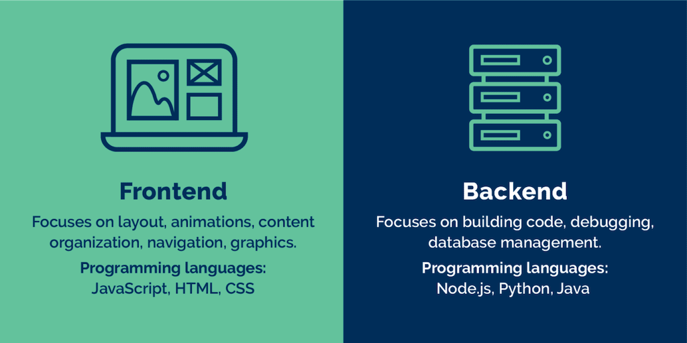[[ref]]()]

---
## Fontend vs. Backend

> Client/server or better bowser/server model

  
* Frontend: client
* Backend: server

???
.task[COMMENT:]  

This means that we have changed programmatically only what the client, in our case a browser, can computer and execute. Specifically, we have done DOM-manipulations (e.g., we created and changed elements from a website) - but that is about it.

The most common frontend and back-end scenario is based on a client-server model, which describes the relationship of cooperating programs in an application. In such a relationship, the server provides a function or service to one or many clients, which initiate requests for such services [[1]](https://en.wikipedia.org/wiki/Client%E2%80%93server_model). The client-server model is not limited to the context of web development but has many different application scenarios.

In the web development context, the client is usually considered the frontend and the server the backend [[9]](https://en.wikipedia.org/wiki/Frontend_and_backend). For a bit more information on servers and web server, read the section [A Dynamic Web Application - Server](#server).

<!-- Here, client and servers talk to each other through the World Wide Web, most often via Http requests. The client will, for example, send to the server (or better *requests from the server*) a character string called uniform resource locator (URL), which identifies specific data, e.g. .html & .css, which the server sends back to the client as response. The data is transferred using the Hypertext Transfer Protocol (HTTP).  -->


---
  
[[evertop]](https://www.evertop.pl/en/frontend-vs-backend/) 


---
.header[Fontend vs. Backend Development]

## Frontend

> What the user sees and interacts with.


???
.task[COMMENT:]  

* Manages everything that users visually see in their browser or application
* Responsible for the look and feel of a site

.footnote[[[Team Tree House]](https://blog.teamtreehouse.com/i-dont-speak-your-language-frontend-vs-backend) [[Course Report]]([#4-front-end-vs-back-end-development](https://www.coursereport.com/blog/front-end-development-vs-back-end-development-where-to-start)]


The “frontend” of the web is the part of the web that you can see and interact with. The frontend usually consists of two parts: the web design and front end web development. Hence, the task can range from work done in Photoshop to coding using HTML, CSS, JavaScript.

Definition: Front end development manages everything that users visually see first in their browser or application. Front end developers are responsible for the look and feel of a site. 

* If you book a flight or buy concert tickets, you usually open a website and interact with the frontend. Once you’ve entered that information, the application stores it in a database that was created on a server. 

--

Frontend development can mean two aspects:


--
1. The design of a webpage

--
2. The development of what you see of a webpage

--
  
...or both!

---
.header[Fontend vs. Backend Development]

## Frontend


- Markup and web languages such as HTML, CSS, JavaScript
- Asynchronous request handling and AJAX
- Responsive web design
- Cross-browser compatibility
- Search engine optimization
- Accessibility


---
.header[Fontend vs. Backend Development]

## Backend

> Serves the data to the user and is the system architecture

--


???
.task[COMMENT:]  


* The server side of an application 
* Everything that communicates, e.g., between a database and the browser

.footnote[[[Team Tree House]](https://blog.teamtreehouse.com/i-dont-speak-your-language-frontend-vs-backend) [[Course Report]]([#4-front-end-vs-back-end-development](https://www.coursereport.com/blog/front-end-development-vs-back-end-development-where-to-start)]


Backend technologies usually consist of languages like PHP, Ruby, Python, etc but you can also used pure JavaScript. Frameworks make backend development easier and faster. 

Definition: Back end development refers to the server side of an application and everything that communicates between the database and the browser.

[[Team Tree House]](https://blog.teamtreehouse.com/i-dont-speak-your-language-frontend-vs-backend) [[Course Report]]([#4-front-end-vs-back-end-development](https://www.coursereport.com/blog/front-end-development-vs-back-end-development-where-to-start)

--

The backend usually consists of three parts:

* Server 
* Application 
* Database 


???

* If you book a flight or buy concert tickets, you usually open a website and interact with the frontend. Once you’ve entered that information, the application stores it in a database that was created on a server. 
* Many web professionals that are just getting into the field may have heard a lot of people talking about WordPress. WordPress is a good example of the frontend and backend working together because WordPress is an open-sourced framework built on PHP that you have to install on your server with a database.


Turns out, the internet has quite some fun describing visually the differences between front- and back-end...


---
.header[Fontend vs. Backend Development]

## Backend


- Scripting languages like PHP, Python, Ruby, Perl, Node.js
- Compiled languages like C#, Java or Go
- Automated testing frameworks 
- Application Data Access
- Databases
- User management
- Scalability
- Availability
- Security, authentication and authorization
- Backups

---

.center[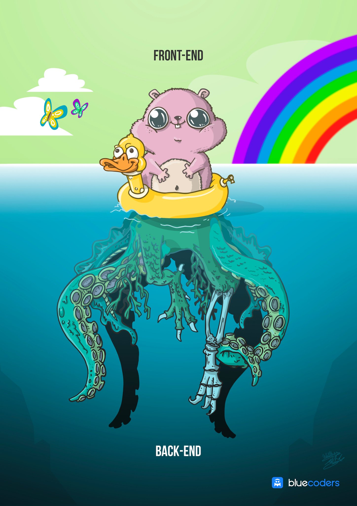 [[bluecoders]](https://twitter.com/bluecoders/status/966624401172123649)]
  

???
.task[COMMENT:]  

* Keep in mind that this frontend vs. backend structure is highly dynamic and it is constantly changing where what is done by whom...


---

.center[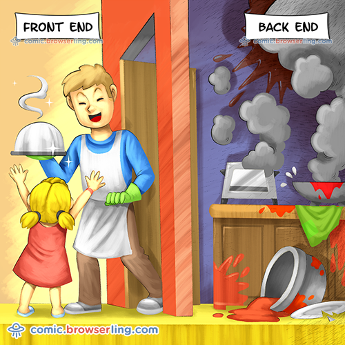 [[bluecoders]](https://twitter.com/bluecoders/status/966624401172123649)]
  


---
.header[Online Deployment]

## Vercel

> Vercel handles all of the backend.

--

- Automated testing, checks for errors 

--
- Optimized production code to be served faster

--
- Distribution of code on CDNs around the world so everybody has fast access

--
- Automatic redeployment when repo changes

--
- Messages interface

???
.task[COMMENT:]  

* text
- It abstracts a lot of backend features that involve digging through logs etc.
  - Analytics
  - Error messages
  - DNS handling


# Traditional Way of Deployment

## Using FTP Client for Static Hosting

- You can't just upload the Node project folder structure
  - They are made for real-time execution via a (local) Node server
- To create files made for static web hosting you need to **build your project**
  - Execute `npm run build` to build a static folder
    - Make sure to use Webpack or something similar to build!
- Once the build is done, you have a new folder in your project folder: `dist`
  - This folder is made for static web hosting, you can upload them to your FTP server


---
.header[Online Deployment]

## Vercel


Vercel creates and maintains Next.js

- Next.js is a popular framework for React
  - Open-source and free
  - Other Frameworks are Create React App, Gatsby, etc.
- Integration and Deployment of Next.js projects on Vercel are native, fast and easy


???
.task[COMMENT:]  

* Next.js is a React framework that allows you to build supercharged, SEO-friendly, and extremely user-facing static websites and web applications using the React framework. Next.js is known for the best developer experience when building production-ready applications with all the features you need.

It has hybrid static and server rendering, TypeScript support, smart bundling, route prefetching, and more, with no extra configuration needed.

* With Next.js termed the React framework for production, it’s become clear that you can quickly build and deploy large-scale and enterprise-ready applications to production with Next.js.

Next.js comes with features that are guaranteed to take your application from zero to production in no time while providing an easy to learn curve, simplicity, and powerful tooling at your disposal.

Next.js extends the original Facebook React library and the create-react-app package to provide an extensible, easy-to-use, and production-proof React framework.

https://kinsta.com/knowledgebase/next-js/


---
.header[Online Deployment]

## Vercel

Is is free?

- [Yes and No](https://vercel.com/pricing)

--

- No commercial intent? Deploy on Vercel for free!
    - Hobby Plan
    - As many projects as you want
    - Limited bandwidth and build time limitations


---
.header[Online Deployment]

## Vercel

--

### 1. Create an account on vercel.com

--
- Connect your GitHub account

--

### 2. Import your repository

--
* Vercel fetches the whole code automatically

--
* Vercel deploys is to an generic URL

--
* Webpage is re-build any time you push an update to your repository


---
.header[Online Deployment]

## Vercel

### 3. Add Vercel to your project

- Vercel is available as an NPM module  
    `npm install vercel`


???
.task[COMMENT:]  

  - Remember the differences between global and local installations!

--

- In `package.json` add a new script in the `scripts` property  
    `"deploy": "vercel --prod"`

--
    - Using `vercel` without prod means the code will be published to a preview URL, not the live Vercel site

---
.header[Online Deployment]

## Vercel

### 4. Deploying your project on Vercel

* If there are no build errors, then your project is live now!


???
.task[COMMENT:]  

- Run `npm run deploy`
  - At this point, Vercel should invite you to log in. If you get an error regarding an invalid token, you need to run `npx vercel login`
- Follow the instructed steps according to your account setup on Vercel
  - Make sure the directories and commands are the same as you used when building!
- Now your project is live!

---
.header[Online Deployment]

## The Vercel Dashboard

- Analytics
- Deployment preferences
- Information about the latest builds
  - See potential errors
- Add a custom domain


---
## Three.js

.left-even[

]

.footnote[[by Malte Hillebrand]]

.right-even[
* [Deployed on Vercel](https://threejs-tutorial-vercel-deploy.vercel.app/)
* [As part of a webpage](https://threejs-tutorial-react-vercel-deploy.vercel.app/)
]


---
template: inverse

# React


???
.task[COMMENT:]  

* What is it?
* Do you like it?
  
  
* https://blog.ishandeveloper.com/react-intro
* https://www.w3schools.com/react/default.asp
* https://www.slideshare.net/AustinGarrod/introduction-to-react-72988798
* https://btholt.github.io/complete-intro-to-react-v6/
* https://btholt.github.io/complete-intro-to-react-v7

---
## React

> React is a tool for building user interfaces.
  
--
  
* JavaScript library built by Facebook / Meta

--
* Front-end!

--
* Modular UIs by dividing an interface into components

--
* Makes large-scale web applications efficiently manageable

.footnote[[[1]](https://blog.ishandeveloper.com/react-intro)]

???
.task[COMMENT:]  

* React has literally changed the way we think about web applications and user interface development and made it possible to build and manage large-scale web applications such as Facebook, Netflix and many more in a more-efficient and modular way.


---

## React

### The Problem

--
* DOM manipulation is the heart of the interactive web. Unfortunately, it is also quite slow.

--
* Most JavaScript frameworks update the DOM much more than they have to.

.center[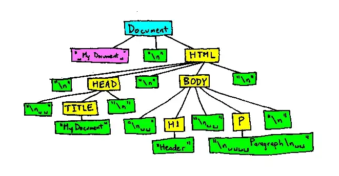]


.footnote[[[2] Codecademy Team. React: The Virtual DOM](https://www.codecademy.com/article/react-virtual-dom), [[javascript.plainenglish]](https://javascript.plainenglish.io/dom-manipulation-985995eb858a)]


???
.task[COMMENT:]  

* As an example, let’s say that you have a list that contains ten items. You check off the first item. Most JavaScript frameworks would rebuild the entire list. That’s ten times more work than necessary! Only one item changed, but the remaining nine get rebuilt exactly how they were before.

Rebuilding a list is no big deal to a web browser, but modern websites can use huge amounts of DOM manipulation. Inefficient updating has become a serious problem.

---

## React

### The Problem

* DOM manipulation is the heart of the interactive web. Unfortunately, it is also quite slow.
* Most JavaScript frameworks update the DOM much more than they have to.


### React's Solution

--
* A *Virtual DOM*, which is a lightweight copy of the actual DOM object

--
* All manipulations are done on the Virtual DOM in memory 

--
* Examination of the changes and efficient updating of the real DOM


???
.task[COMMENT:]  

In summary, here’s what happens when you try to update the DOM in React:

* The entire virtual DOM gets updated.
* The virtual DOM gets compared to what it looked like before you updated it. React figures out which objects have changed.
* The changed objects, and the changed objects only, get updated on the real DOM.
* Changes on the real DOM cause the screen to change.


Once the virtual DOM has updated, then React compares the virtual DOM with a virtual DOM snapshot that was taken right before the update.

By comparing the new virtual DOM with a pre-update version, React figures out exactly which virtual DOM objects have changed. This process is called “diffing.”

Once React knows which virtual DOM objects have changed, then React updates those objects, and only those objects, on the real DOM. In our example from earlier, React would be smart enough to rebuild your one checked-off list-item, and leave the rest of your list alone.

This makes a big difference! React can update only the necessary parts of the DOM. React’s reputation for performance comes largely from this innovation.

https://reactkungfu.com/2015/10/the-difference-between-virtual-dom-and-dom/

--

*This makes react efficient and performant!*

  

<!-- 
## React

```js
import React from 'react';
import ReactDOM from 'react-dom/client';

function Hello(props) {
  return <h1>Hello World!</h1>;
}

const root = ReactDOM.createRoot(document.getElementById("root"));
root.render(<Hello />);
```

-->


---
.header[React]

## React Mantra

> DRY - Don't repeat yourself!  
  

.footnote[[[desaihetvi]](https://medium.com/@desaihetvi/components-in-react-5d72887cc51d)]

--

.left-even[  
Work with (UI) building blocks that are independent and reusable!
]

--

.right-even[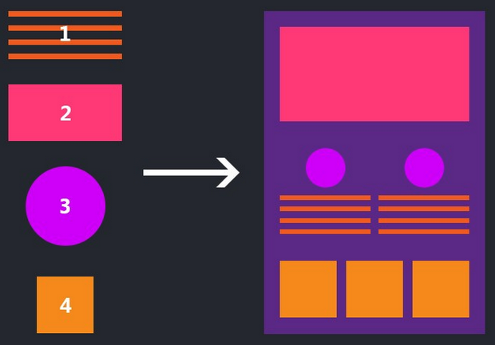]
  

---
.header[React]

## Use Cases


* Anything from Meta
* AirBnb
* eBay
* Imdb
* ...

---
.header[React]

## Why Should You Care?

* Once figured out, very powerful and flexible
* Industry standard
* Job security


???
.task[COMMENT:]  

New Concepts

* Components
* Rendering
* The Root Node
* JSX
* Properties

---
.header[React]

## Components

> Components are like functions that return HTML elements.
  
--
  
* The fundamental building blocks of a react application
* Independent and reusable bits of code
* Responsible for both visual appearances and interaction

---
.header[React]

## Components

> Components are like functions that return HTML elements.
  
.center[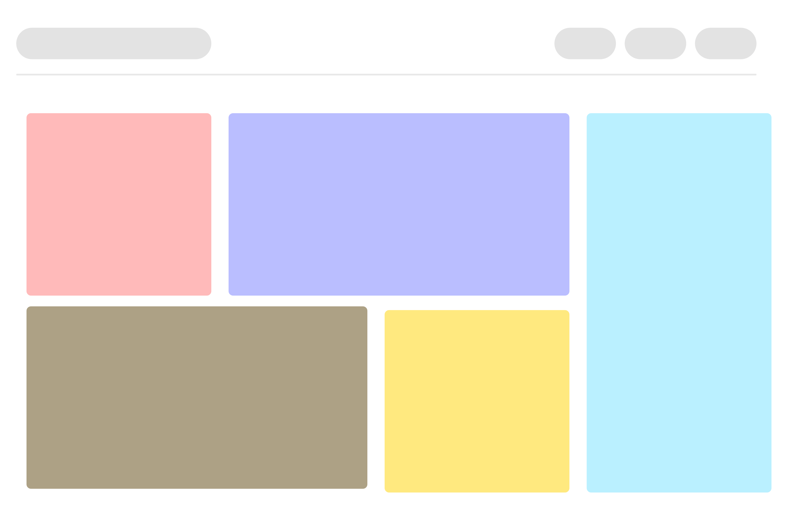 [[1]](https://blog.ishandeveloper.com/react-intro)  

Every colored box represents a different component!
]


???
.task[COMMENT:]  

* Components are the most fundamental building blocks of a react application. In React, a single web page can be divided into small blocks that represent a different part of the screen. Consider the layout below for an example.

Here every colored box that you can see, represents a different component. Each individual component is independent of one another and responsible both for it’s visual appearances and its interaction

In layman terms, a component is basically just a file that contains all the html, styling and js logic in one group.

---
.header[React]

## Adjust The Frontend

```js
...
let header = document.createElement("h2");
header.innerHTML = "Hi, I am a Hero Text!";
...
```

--
```js
function HeroText() {
  return <h2>Hi, I am a Hero Text!</h2>;
}
```

---
.header[React]

## Function Components

```js
import React from 'react';
import ReactDOM from 'react-dom/client';

function HeroText() {
  return <h2>Hi, I am a Hero Text!</h2>;
}

ReactDOM.render(<HeroText />, document.getElementById('root'));
```

.footnote[[[3]](https://www.w3schools.com/react/default.asp)]

???
.task[COMMENT:]  

- React components are JavaScript functions
  - These functions return DOM elements
    - `return <h1>Hello World!</h1>`
  - Because they are functions, they can be classes that extend other components!
- Components can have properties and states, the latter can change throughout the lifecycle of a component
  - For example: the total price for items in a shopping cart
- Components are written in JSX (JavaScript XML)
  - JSX is not JavaScript nor HTML
  - JSX is a XML syntax extension to JavaScript that also comes with the full power of ES6 
  - like HTML, JSX tags can have tag names, attributes, and children
    - If an attribute is wrapped in curly braces, the value is a JavaScript expression
- 

When creating a React component, the component's name MUST start with an upper case letter.


* In older React code bases, you may find Class components primarily used. It is now suggested to use Function components along with Hooks, which were added in React 16.8. There is an optional section on Class components for your reference.
* https://www.w3schools.com/react/showreact.asp?filename=demo2_react_component_function


---
template:inverse

# Systems


---
## Software

???

.task[ASK:]  

* What is software?
* Difference between software and algorithms?
* What are important aspects of software development?
    * Planning, user test, error checking

--

> Software is a set of programs or sequence of instructions that allows the users to perform a well-defined function or some specified task


.footnote[[[javatpoint]](https://www.javatpoint.com/what-is-software)]


---
## Software

> Software is a set of programs or sequence of instructions that allows the users to perform a well-defined function or some specified task.
  
<br >
  
  
> Software is a set of programmed instructions stored in the memory of stored-program digital computers for execution by the processor. Software is a recent development in human history and is fundamental to the Information Age. 


.footnote[[[javatpoint](https://www.javatpoint.com/what-is-software), [wiki](https://en.wikipedia.org/wiki/History_of_software)]]


---
## Software

.left-even[
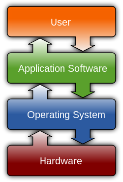 

]

--

<br >

* Application software

???
.task[COMMENT:]  

* uses the computer system to perform special functions beyond the basic operation of the computer itself. There are many different types of application software because the range of tasks that can be performed with 

--

* System software 


???
.task[COMMENT:]  

* manages hardware behaviour, as to provide basic functionalities that are required by users, or for other software to run properly, if at all. System software is also designed for providing a platform for running application software,[15] and it includes the following:
    * Operating systems are essential collections of software that manage resources and provide common services for other software that runs "on top" of them. Supervisory programs, boot loaders, shells and window systems are core parts of operating systems. In practice, an operating system comes bundled with additional software (including application software) so that a user can potentially do some work with a computer that only has one operating system.
    * Device drivers operate or control a particular type of device that is attached to a computer. Each device needs at least one corresponding device driver; because a computer typically has at minimum at least one input device and at least one output device, a computer typically needs more than one device driver.
    * Utilities are computer programs designed to assist users in the maintenance and care of their computers.

--
* Malicious software


???
.task[COMMENT:]  

* or malware, is software that is developed to harm or disrupt computers. Malware is closely associated with computer-related crimes, though some malicious programs may have been designed as practical jokes.


???
.task[COMMENT:]  

https://www.javatpoint.com/what-is-software

* Software's are broadly classified into two types, i.e., System Software and Application Software.
    * System software is a computer program that helps the user to run computer hardware or software and manages the interaction between them. Essentially, it is software that constantly runs in the computer background, maintaining the computer hardware and computer's basic functionalities, including the operating system, utility software, and interface. In simple terms, you can say that the system acts as a middle man that checks and facilitates the operations flowing between the user and the computer hardware.
    * Application programs or software applications are end-user computer programs developed primarily to provide specific functionality to the user. The applications programs assist the user in accomplishing numerous tasks such as doing online research, completing notes, designing graphics, managing the finances, watching a movie, writing documents, playing games, and many more. Therefore, many software applications are designed and developed every year by companies as per the demand and requirements of the potential users. The application software can either be designed for a general-purpose or specially coded as per the requirements of business cooperation.

---

## Software Architecture

> The architecture of a software system is a metaphor, analogous to the architecture of a building.

.footnote[[[wiki](https://en.wikipedia.org/wiki/Software_architecture)]]

--
* Structure needed to create a software system and to reason about it

--
* Elements, relationships, and their properties


???
.task[COMMENT:]  

There are also concerns that software architecture leads to too much big design up front, especially among proponents of agile software development. A number of methods have been developed to balance the trade-offs of up-front design and agility,[36] including the agile method DSDM which mandates a "Foundations" phase during which "just enough" architectural foundations are laid. IEEE Software devoted a special issue to the interaction between agility and architecture. 


https://en.wikipedia.org/wiki/Software_architecture

Software architecture is the set of structures needed to reason about a software system and the discipline of creating such structures and systems. Each structure comprises software elements, relations among them, and properties of both elements and relations.[1][2]

The architecture of a software system is a metaphor, analogous to the architecture of a building.[3] It functions as the blueprints for the system and the development project, which project management can later use to extrapolate the tasks necessary to be executed by the teams and people involved. 


https://www.codementor.io/learn-development/what-makes-good-software-architecture-101


---

## Software Architecture

There are various formal descriptions possibilities for software architecture and larger systems, e.g. with the Unified Modeling Language (UML).

<br >

UML is a standard notation for many types of diagrams, roughly divided into three groups:

* Behavior diagrams
* Interaction diagrams
* Structure diagrams 

.footnote[[[wiki](https://en.wikipedia.org/wiki/Unified_Modeling_Language)]]


???
.task[COMMENT:]  

* Structure diagrams represent the static aspects of the system. It emphasizes the things that must be present in the system being modeled. Since structure diagrams represent the structure, they are used extensively in documenting the software architecture of software systems. For example, the component diagram describes how a software system is split up into components and shows the dependencies among these components. 
* Behavior diagrams represent the dynamic aspect of the system. It emphasizes what must happen in the system being modeled. Since behavior diagrams illustrate the behavior of a system, they are used extensively to describe the functionality of software systems. As an example, the activity diagram describes the business and operational step-by-step activities of the components in a system. 
* Interaction diagrams, a subset of behavior diagrams, emphasize the flow of control and data among the things in the system being modeled. For example, the sequence diagram shows how objects communicate with each other regarding a sequence of messages.

---
.header[Software Architecture]

## UML Activity Diagram

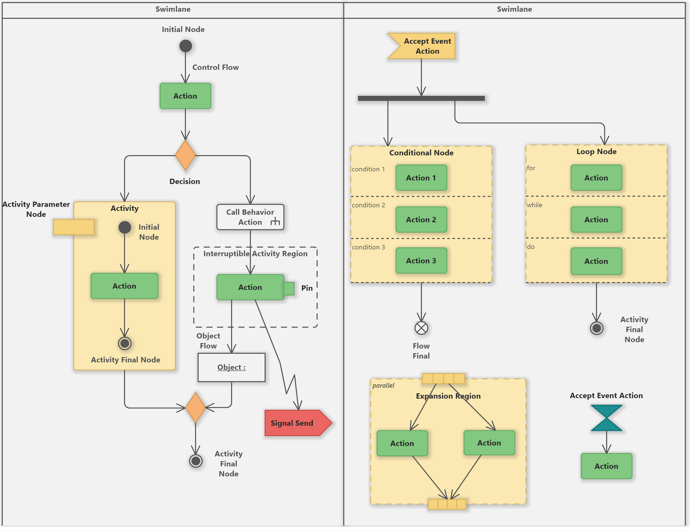 

.footnote[[[edrawsoft](https://www.edrawsoft.com/what-is-uml-diagram.html)]]

---

## Diagrams

Get in the habit of "drawing" your algorithms and systems!

* Don't worry about using a standard notation
* Just be consistent within your diagram 

---

## "Diagrams"

.center[]

.footnote[[[Julia Dufek]]]


---

## Software

In totfal, software development is the process of 

--

* conceiving,
* specifying,
* designing,
* programming,
* documenting,
* testing, and
* bug fixing 
  
--
  
for creating and maintaining useful software.

.footnote[[[Wiki: Software development]](https://www.wikiwand.com/en/Software_development)]

--
Programming is really only a small part of software development


---
## Software

Characteristics of good software

* Functionality
* Usability
* Reliability
* Performance
* Security
* Maintainability
* Reusability
* Scalability
* Testability


.footnote[[[geeksforgeeks]](https://www.geeksforgeeks.org/software-engineering-characteristics-of-good-software/)]


???
.task[COMMENT:]  

* Functionality: The software meets the requirements and specifications that it was designed for, and it behaves as expected when it is used in its intended environment.
Usability: The software is easy to use and understand, and it provides a positive user experience.
* Reliability: The software is free of defects and it performs consistently and accurately under different conditions and scenarios.
* Performance: The software runs efficiently and quickly, and it can handle large amounts of data or traffic.
* Security: The software is protected against unauthorized access and it keeps the data and functions safe from malicious attacks.
* Maintainability: The software is easy to change and update, and it is well-documented, so that it can be understood and modified by other developers.
* Reusability: The software can be reused in other projects or applications, and it is designed in a way that promotes code reuse.
* Scalability: The software can handle an increasing workload and it can be easily extended to meet the changing requirements.
* Testability: The software is designed in a way that makes it easy to test and validate, and it has a comprehensive test coverage.


 Dieter Ram’s principles for good design, tailored for software?

    Good design is innovative.
    Good design makes a product useful.
    Good design is aesthetic.
    Good design makes a product understandable.
    Good design is unobtrusive.
    Good design is honest.
    Good design is long-lasting.
    Good design is thorough down to the last detail.
    Good design is environmentally-friendly.
    Good design is as little design as possible.
https://medium.com/@mbostock/what-makes-software-good-943557f8a488


---
.header[Software]

## Development

### Incremental vs. Iterative?

---
.header[Software | Development]


## Incremental 

.center[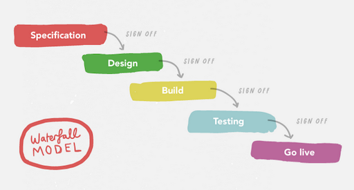]  
.footnote[[[The Agile Mona Lisa]](https://medium.com/yoomee/the-agile-mona-lisa-3313d4b6dc59)]
???

.task[COMMENT:]  

* With traditional (waterfall) projects it’s very difficult to make changes to the software after the specification has been signed off at the beginning of the project. Unfortunately, it’s at the end of the project that users get to use the software and give the most useful feedback.

---
.header[Software | Development]


## [Iterative](https://www.wikiwand.com/en/Agile_software_development)

.center[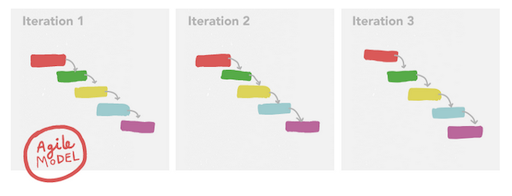]

.footnote[[[The Agile Mona Lisa]](https://medium.com/yoomee/the-agile-mona-lisa-3313d4b6dc59)]

???
Agile is not incremental

The Agile Manifesto summarises this philosophy by emphasising four core values:

* Individuals and interactions over processes and tools
* Working software over comprehensive documentation
* Customer collaboration over contract negotiation
* Responding to change over following a plan


In software development, agile practices (sometimes written "Agile")[1] include requirements, discovery and solutions improvement through the collaborative effort of self-organizing and cross-functional teams with their customer(s)/end user(s).[2][3] Popularized in the 2001 Manifesto for Agile Software Development,[4] these values and principles were derived from, and underpin, a broad range of software development frameworks, including Scrum and Kanban.[5][6]


---
.header[Software | Development]


## Incremental vs. Iterative

--

.center[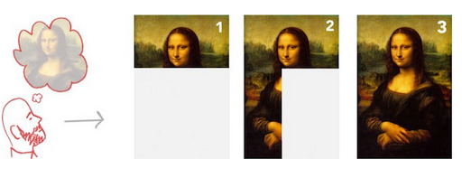]

.footnote[[[The Agile Mona Lisa]](https://medium.com/yoomee/the-agile-mona-lisa-3313d4b6dc59)]

???


The old waterfall approach is akin to painting by numbers, as it calls for a fully formed idea at the start, which is delivered piece by piece without flexibility. This is called an incremental approach because the product is built piece by piece from a fully formed initial design. It’s difficult to change the project’s direction once the design’s been determined at the beginning of the project. This approach doesn’t welcome change, and isn’t Agile in the slightest.


---
.header[Software | Development]


## Incremental vs. Iterative

.center[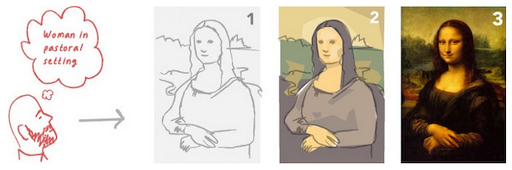]

.footnote[[[The Agile Mona Lisa]](https://medium.com/yoomee/the-agile-mona-lisa-3313d4b6dc59)]

<!-- [[The Agile Mona Lisa]](https://medium.com/yoomee/the-agile-mona-lisa-3313d4b6dc59) -->

???

Agile is not incremental

The old waterfall approach is akin to painting by numbers, as it calls for a fully formed idea at the start, which is delivered piece by piece without flexibility. This is called an incremental approach because the product is built piece by piece from a fully formed initial design. It’s difficult to change the project’s direction once the design’s been determined at the beginning of the project. This approach doesn’t welcome change, and isn’t Agile in the slightest.


The Agile Mona Lisa

An Agile, iterative process allows you to move from a vague idea to concrete realisations. You can also iterate to find the ideal solution for users, and iterate to improve it, once you’ve found it. Oh, what a dream come true!

One of the best ways of visualising this contrasting approach I’ve seen is an explanation by Jeff Patton illustrating what Agile development of the Mona Lisa would look like. You can see that three iterations, starting with a concept, which is firmed up into the final deliverable. Iterating builds a rough version, validates it, then slowly builds up quality.

---
.header[Software | Development]


## Agile As Often Practiced

.center[]  
[[pinimg]](https://i.pinimg.com/originals/3e/8c/8d/3e8c8dac53ea2ef31f8dbc7257dd9a2d.jpg)


---
.header[Software | Development]


## Incremental vs. Iterative


> While there is much anecdotal evidence that adopting agile practices and values improves the effectiveness of software professionals, teams and organizations, the empirical evidence is mixed and hard to find.

.footnote[[[wiki]](https://en.wikipedia.org/wiki/Agile_software_development)]

---
template:inverse


# Creative Coding I ✔️

--

### Well, almost...

---
.header[Creative Coding I | Summary]

| Session | Topic      | Subtopics       | Tech                | Libraries / Tools  |
| ------- | ---------- | --------------- | ------------------- | ------------------ |
| 1       | Motivation | Creative Coding |                     |                    |
|         |            | Setup           | Material management | Git, GitHub        |
|         |            |                 | Markdown            | Visual Studio Code |

---
.header[Creative Coding I | Summary]

| Session | Topic      | Subtopics         | Tech                     | Libraries / Tools  |
| ------- | ---------- | ----------------- | ------------------------ | ------------------ |
| 1       | Motivation | Creative Coding   |                          |                    |
|         |            | Setup             | Material management      | Git, GitHub        |
|         |            |                   | Markdown                 | Visual Studio Code |
| 2       | Emergence  | 2D Design         | Development environments | p5                 |
|         |            | Basic Interaction |                          |                    |


---
.header[Creative Coding I | Summary]

| Session | Topic        | Subtopics            | Tech                     | Libraries / Tools  |
| ------- | ------------ | -------------------- | ------------------------ | ------------------ |
| 1       | Motivation   | Creative Coding      |                          |                    |
|         |              | Setup                | Material management      | Git, GitHub        |
|         |              |                      | Markdown                 | Visual Studio Code |
| 2       | Emergence    | 2D Design            | Development environments | p5                 |
|         |              | Basic Interaction    |                          |                    |
| 3       | Instructions | Algorithmic Thinking | Programming overview     | p5                 |

---
.header[Creative Coding I | Summary]

| Session | Topic        | Subtopics            | Tech                     | Libraries / Tools  |
| ------- | ------------ | -------------------- | ------------------------ | ------------------ |
| 1       | Motivation   | Creative Coding      |                          |                    |
|         |              | Setup                | Material management      | Git, GitHub        |
|         |              |                      | Markdown                 | Visual Studio Code |
| 2       | Emergence    | 2D Design            | Development environments | p5                 |
|         |              | Basic Interaction    |                          |                    |
| 3       | Instructions | Algorithmic Thinking | Programming overview     | p5                 |
| 4       | Connection   | The Web              | html, css, js            |                    |
|         |              | Going Online         |                          |                    |


---
.header[Creative Coding I | Summary]

| Session | Topic            | Subtopics            | Tech                     | Libraries / Tools  |
| ------- | ---------------- | -------------------- | ------------------------ | ------------------ |
| 1       | Motivation       | Creative Coding      |                          |                    |
|         |                  | Setup                | Material management      | Git, GitHub        |
|         |                  |                      | Markdown                 | Visual Studio Code |
| 2       | Emergence        | 2D Design            | Development environments | p5                 |
|         |                  | Basic Interaction    |                          |                    |
| 3       | Instructions     | Algorithmic Thinking | Programming overview     | p5                 |
| 4       | Connection       | The Web              | html, css, js            |                    |
|         |                  | Going Online         |                          |                    |
| 5       | Still Connecting | Algorithms           | Local Webserver          |                    |
|         |                  |                      | Development workflow     |                    |


---
.header[Creative Coding I | Summary]

| Session | Topic            | Subtopics            | Tech                     | Libraries / Tools  |
| ------- | ---------------- | -------------------- | ------------------------ | ------------------ |
| 1       | Motivation       | Creative Coding      |                          |                    |
|         |                  | Setup                | Material management      | Git, GitHub        |
|         |                  |                      | Markdown                 | Visual Studio Code |
| 2       | Emergence        | 2D Design            | Development environments | p5                 |
|         |                  | Basic Interaction    |                          |                    |
| 3       | Instructions     | Algorithmic Thinking | Programming overview     | p5                 |
| 4       | Connection       | The Web              | html, css, js            |                    |
|         |                  | Going Online         |                          |                    |
| 5       | Still Connecting |                      | Local Webserver          |                    |
|         |                  |                      | Development workflow     |                    |
| 6       | Space            | 3D                   | Gui                      | three.js           |


---
.header[Creative Coding I | Summary]

| Session | Topic            | Subtopics              | Tech                       | Libraries / Tools  |
| ------- | ---------------- | ---------------------- | -------------------------- | ------------------ |
| 1       | Motivation       | Creative Coding        |                            |                    |
|         |                  | Setup                  | Material management        | Git, GitHub        |
|         |                  |                        | Markdown                   | Visual Studio Code |
| 2       | Emergence        | 2D Design              | Development environments   | p5                 |
|         |                  | Basic Interaction      |                            |                    |
| 3       | Instructions     | Algorithmic Thinking   | Programming overview       | p5                 |
| 4       | Connection       | The Web                | html, css, js              |                    |
|         |                  | Going Online           |                            |                    |
| 5       | Still Connecting |                        | Local Webserver            |                    |
|         |                  |                        | Development workflow       |                    |
| 6       | Space            | 3D                     | Gui                        | three.js           |
| 7       | Asynchronism     | Higher Order Functions | Function notations         |                    |
|         |                  |                        | Local Package Installation | Node, npm, vite    |

---
.header[Creative Coding I | Summary]

| Session | Topic            | Subtopics              | Tech                       | Libraries / Tools  |
| ------- | ---------------- | ---------------------- | -------------------------- | ------------------ |
| 1       | Motivation       | Creative Coding        |                            |                    |
|         |                  | Setup                  | Material management        | Git, GitHub        |
|         |                  |                        | Markdown                   | Visual Studio Code |
| 2       | Emergence        | 2D Design              | Development environments   | p5                 |
|         |                  | Basic Interaction      |                            |                    |
| 3       | Instructions     | Algorithmic Thinking   | Programming overview       | p5                 |
| 4       | Connection       | The Web                | html, css, js              |                    |
|         |                  | Going Online           |                            |                    |
| 5       | Still Connecting |                        | Local Webserver            |                    |
|         |                  |                        | Development workflow       |                    |
| 6       | Space            | 3D                     | Gui                        | three.js           |
| 7       | Asynchronism     | Higher Order Functions | Function notations         |                    |
|         |                  |                        | Local Package Installation | Node, npm, vite    |
| 8       | Systems          | Software               | Deployment                 | Vercel             |
|         |                  | Usefulness             |                            | React              |


---
.header[Creative Coding I | Summary]

| Session | Topic            | Subtopics              | Tech                       | Libraries / Tools  |
| ------- | ---------------- | ---------------------- | -------------------------- | ------------------ |
| 1       | Motivation       | Creative Coding        |                            |                    |
|         |                  | Setup                  | Material management        | Git, GitHub        |
|         |                  |                        | Markdown                   | Visual Studio Code |
| 2       | Emergence        | 2D Design              | Development environments   | p5                 |
|         |                  | Basic Interaction      |                            |                    |
| 3       | Instructions     | Algorithmic Thinking   | Programming overview       | p5                 |
| 4       | Connection       | The Web                | html, css, js              |                    |
|         |                  | Going Online           |                            |                    |
| 5       | Still Connecting |                        | Local Webserver            |                    |
|         |                  |                        | Development workflow       |                    |
| 6       | Space            | 3D                     | Gui                        | three.js           |
| 7       | Asynchronism     | Higher Order Functions | Function notations         |                    |
|         |                  |                        | Local Package Installation | Node, npm, vite    |
| 8       | Systems          | Software               | Deployment                 | Vercel             |
|         |                  | Usefulness             |                            | React              |
| ~~9~~   | ~~Liveness~~     | ~~Performance Spaces~~ |                            | ~~Modzilla Hubs~~  |


---
## Final Project

--

The final project is an individually chosen project.  
  

???
.task[COMMENT:]  
  
You can do whatever you want but your project must make use of text-based programming. It can also be an experiment, work in progress, or a learning path. Ideally it should be something online, but this is not a hard requirement. You don't need to submit a project plan beforehand. However, it might help to discuss your plan with me in advance. The project should not take longer than ~24h.

--
* It must be text-based programming

--
* Ideally it should be something online, but this is not a hard requirement


--
* It can be an experiment, part of another project, work in progress, or a learning path

  

--
* The official work period: Jan. 16th - Feb. 29th.  
  
--
  
* The time dedicated to the final project: ~24h.  
  
--
  
* Deadline: **February, 29th**.
  


???
.task[COMMENT:]  
* The deadline for the final project is strict and for a late submission, I reduce **15% of the total points**.
* If you are sick within the official work period, you can get a deadline extension based on a doctor's note ("Attest").

---
## Final Project

You need to submit

* a description
* the source code
* a link to the build / online deployment or such, and
* at least one representative image.

--
 
Submit your code in your assignment folder as assignment `08` or add a link there to where to find the code.


---
template: inverse

## And Now What? 
# 🤔

---


# *Keep on coding!* 💃🏻🕺

--
* Algorithmic thinking

--
* Build systems and software


---
template:inverse

# Usefulness

---

.center[]

???

https://www.ted.com/talks/lucy_cooke_sloths_the_strange_life_of_the_world_s_slowest_mammal#t-278839

* [sloths](https://www.ted.com/talks/lucy_cooke_sloths_the_strange_life_of_the_world_s_slowest_mammal#t-278839),   
* [Simone Giertz's work](https://www.ted.com/talks/simone_giertz_why_you_should_make_useless_things#t-697827)   
* https://www.simonegiertz.com/  
* https://www.youtube.com/c/simonegiertz  
* [Make Everything Ok Button](http://make-everything-ok.com/)   
* Vi: https://www.youtube.com/watch?v=ott_0kDkCyg

---


* What do we consider as useful?

--
* What else should we consider as "useful"?

--
* What do we commonly judge out of context?


---
template:inverse

## The End   

# 🐥 🦋 🦉  

