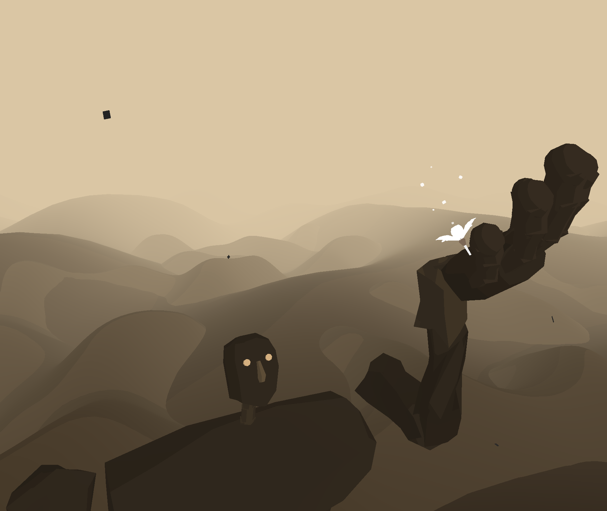
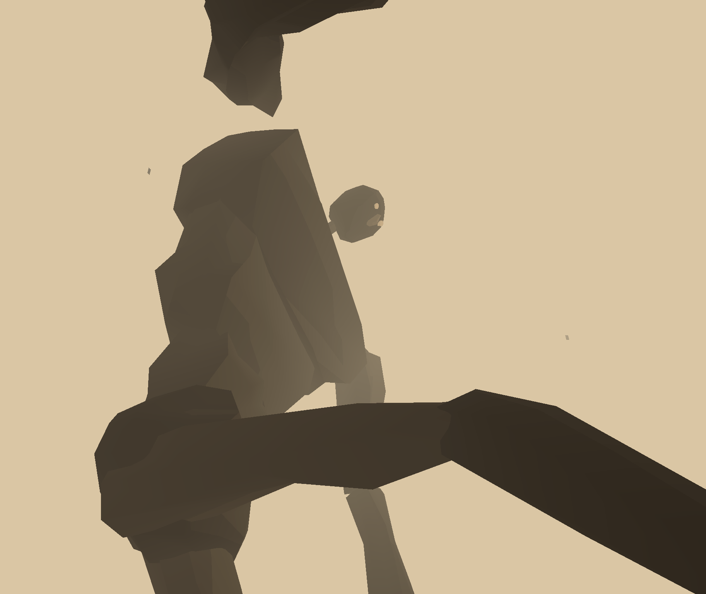
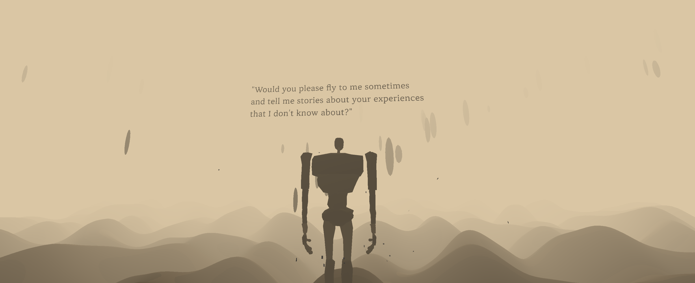

# Creative Coding I

Prof. Dr. Lena Gieseke \| l.gieseke@filmuniversitaet.de \| Film University
Babelsberg KONRAD WOLF

# Session 01 (10 points)

Please complete this session by October 24. Going through the scripts and
answering the questions should take < 4h.

This session is all about diving into the topic of creative coding and getting
ready for action 😊.

-   [Creative Coding I](#creative-coding-i)
-   [Session 01 (10 points)](#session-01-10-points)
    -   [Syllabus and Administration](#syllabus-and-administration)
        -   [Task 01.01](#task-0101)
    -   [Topics](#topics)
        -   [Task 01.02](#task-0102)
    -   [Introduction](#introduction)
        -   [Task 01.02](#task-0102-1)
        -   [Task 01.03](#task-0103)
        -   [Task 01.04](#task-0104)
            -   [Option A](#option-a)
            -   [Option B](#option-b)
    -   [Setup](#setup)
        -   [Task 01.05](#task-0105)
        -   [Task 01.06](#task-0106)
            -   [Level 1](#level-1)
            -   [Level 2](#level-2)
    -   [Learnings](#learnings)

## Syllabus and Administration

Read the [Syllabus](../../index.md) carefully and know how this class works and
what I expect of you.

### Task 01.01

Are there any open questions regarding the syllabus and the administration of
this course? If so, please mention them next class.

## Topics

### Task 01.02

Please answer the following questions truthfully so that I can setup the lecture
accordingly.

-   Overall, how would you rate your skill level of programming?
    -   [ ] Never done it
    -   [ ] Novice
    -   [x] Intermediate
    -   [ ] Advanced
    -   [ ] God-like
-   Have you used object oriented programming before?
    -   [ ] I don't know what that is
    -   [ ] I know the concept but I have never implemented it
    -   [x] Yes
-   Overall, how would you rate your skill level of using web technologies, such
    as JavaScript?
    -   [ ] Never done it
    -   [ ] Novice
    -   [ ] Intermediate
    -   [x] Advanced
    -   [ ] God-like
-   How would you rate your skill level of working with Git and GitHub?
    -   [ ] Never done it
    -   [ ] Novice
    -   [x] Intermediate
    -   [ ] Advanced
    -   [ ] God-like

## Introduction

Recapture
[Script 01 - Introduction](../../02_scripts/cc1_ws2324_01_intro_script.md).

### Task 01.02

Are there any languages, tools or environments for creative coding that you know
of and which are not included in the script? _If not, you can skip this
question._

Currently, I cannot think of any.

### Task 01.03

#### Personal motivation to learn creative coding

For me, creative coding is a medium for artistic expression, just like the traditional graphite pencils or watercolors are. Since initially coding was not invented to serve this particular purpose, I believe that it has developed to do so, because we as people are constantly looking for different ways to express ourselves, and this need has driven coding into a new artistic direction. With that being said, currently I am mostly interested in broadening my horizons and understanding in the field of visual development, incorporating code, and being challenged with ideas and projects, inspired both by the digital and the traditional art. However, dimensionality and versatility are two main aspects of coding, thus I believe that my interests in creative coding can develop, hence change very quickly. But presently, interactive visual storytelling (if I could describe it like this) is a direction that I would like to go into.

### Task 01.04

#### Option A - Creative coding project that I like

One of my biggest passions ever has been illustration, both traditional and
digital. More specifically, I love the calming and cozy atmosphere that
children's book illustrations and storytelling can create. I am always looking
for projects that incorporate these into another medium. One such example is the
web browser. Therefore, I believe that the following project
[GIANT 105](https://giant105.com/), which has an honorable mention on the
[AWWWARDS](https://www.awwwards.com/) website, achieves this with simplicity in
the utilized shapes and color palette, and clean and fluid navigation. I like
the idea of recreating the traditional flipping through a book as a web
application, while fulfilling the usability requirements, which often get
neglected within web creative projects. As a front-end developer, I always
appreciate the craftsmanship of telling a story, direct or indirect, within a
website. Moreover, I am also a huge fan of _three.js_ and really enjoy seeing
the library’s potential in different use cases. In addition, I just want to
point out the amazing and aesthetically pleasing _lighting_ of the scene,
combined with the rough geometry.

 

*All images are screenshots from the original projects's
[website](https://giant105.com/).*

## Setup

In summary, for the lecture you will need to be able to work with:

-   a development environment, e.g. Visual Studio Code, ✅
-   GitHub, ✅
-   the console ✅

### Task 01.06

#### Level 2

-   What is your setup and why does it work well for you?

    - My typical workflow is a mixture between the bash shell and the integrated terminal in my IDE. There is no particular technical or efficiency-related reasons for that. I believe that it is just a habit that has developed unconsciously in time. I find some kind of satisfaction in
    working with commands. Thus, I do not use any additional GUI for git. The only type of graphical interface that I use is the integrated source control management in VS Code, as well as a Git Pull Requests extension, which helps me at work.

-   Investigate something for your environment or GitHub that you haven't used
    before. Describe it briefly.

    - **git cherry-pick** - this is a workflow that I recently had to apply for the first time and had some difficulties with, therefore, I created a small test project, where I played around with two branches, *main* and *feature*, and cherry-picked specific commits from the feature branch into the main branch, using their hash, in order to get more comfortable with this type of commiting.

-   Do you have any aspects, experiences, tips, etc. for working with GitHub
    that could be helpful to know for beginners?

    -   Currently, I cannot think of anything specific. I would just recommend
        the [official documentation](https://git-scm.com/docs), because I find
        it very comprehensive. Moreover, I would recommend this nicely written
        [blog post](https://nfarina.com/post/9868516270/git-is-simpler).
        Although it is already very old, I think it is a great and entertaining
        explanation, and gives an intuition about how git works.

-   Check with your classmates who do not have any experiences with GitHub yet
    and support them, if needed.

    -   Done. ✅

-   Are there any open questions for working with the course material and
    GitHub?
    -   Currently, I do not have any open questions.

## Learnings

I liked the broad overview of the field of creative coding and the diversity of the examples shown in the lecture. Personally, this helps me to think outside the box of my own ideas. Moreover, trying to answer the question *What is creative coding?* turns out to be a challenging task on its own, but I believe that as a result, I am able to find more directions one can go into - directions which I would usually not consider or which would not even occur to me. One mentioned aspect, which I find to be a personal weakness, is my ability to conceptualize. Therefore, I would be happy to tackle this point.

---
