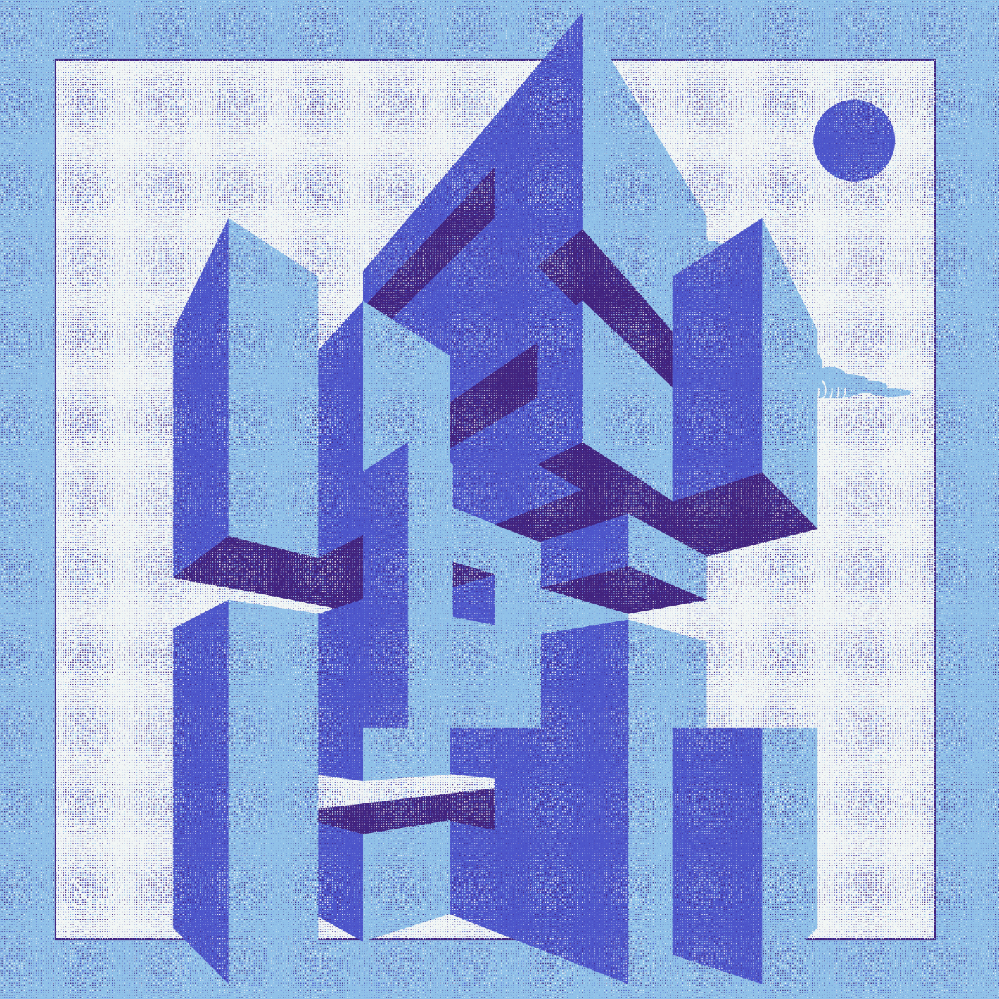
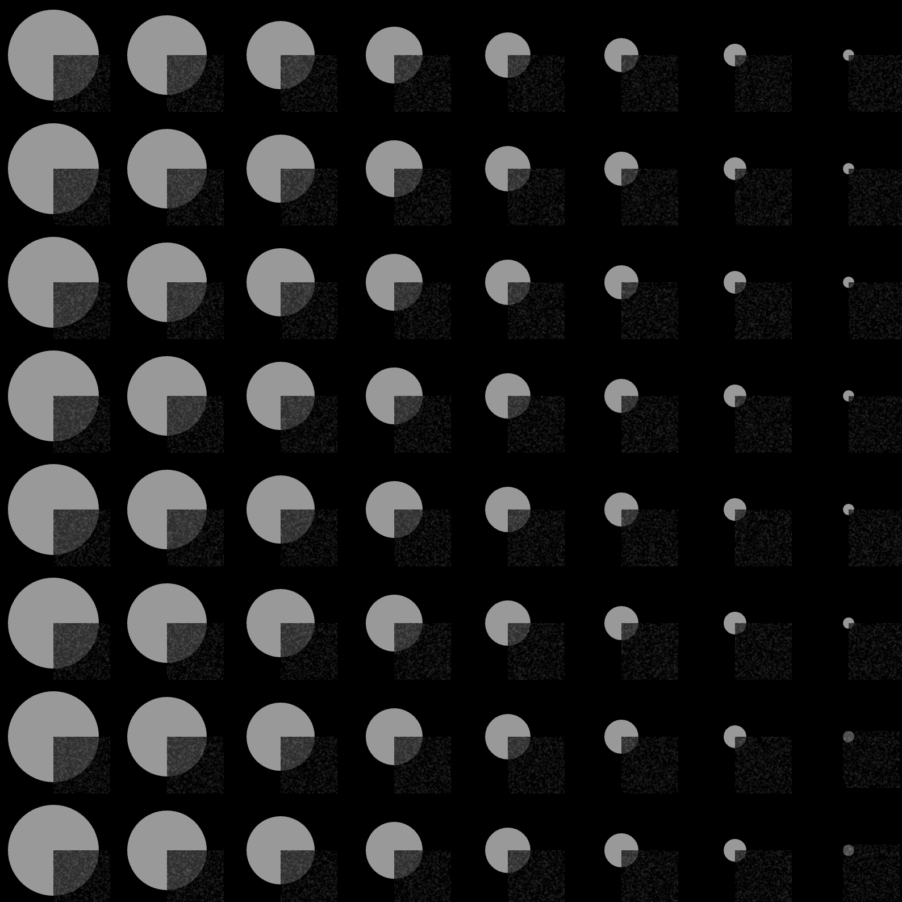
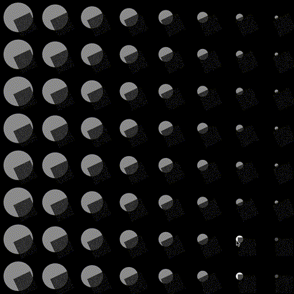

CC1: Session 2 
---
layout: default
title: Session
nav_exclude: true
---

# Creative Coding I

Prof. Dr. Lena Gieseke \| l.gieseke@filmuniversitaet.de  \| Film University Babelsberg KONRAD WOLF
  

# Session 02 - Emergence (10 points)

Please complete this session by November 7th. Completing the session should take < 4h.

In this session we are going to think about the topic of *emergence* and what it means to create an aesthetic output with code. In terms of tech this session is all about getting into coding and doing a practical exercise with p5.

* [Creative Coding I](#creative-coding-i)
* [Session 02 - Emergence (10 points)](#session-02---emergence-10-points)
        * [Task 02.01 -  Motivation](#task-0201----motivation)
        * [Task 02.02 - *p5 With The Online Editor*](#task-0202---p5-with-the-online-editor)
        * [Task 02.03 - The 10 PRINT pattern](#task-0203---the-10-print-pattern)
    * [Emergence](#emergence)
        * [Task 02.04 - Conceptualization](#task-0204---conceptualization)
    * [Learnings](#learnings)

### Task 02.01 -  Motivation

The following examples are two *p5 sketches* that I find very inspiring. 
The first one, titled [*Herbarium*](https://www.fxhash.xyz/generative/13480), is from [Aleksandra Jovanić](http://aleksandrajovanic.com/), artist and programmer, who I absolutely admire. In the majority of her work, she is utilizing math in order to achieve fascinating visual forms. Moreover, she always has a nice background story to each piece she creates. This one here, as mentioned by the author, is inspired by two female pioneers in the field of science. [Maria Sibylla Merian](https://en.wikipedia.org/wiki/Maria_Sibylla_Merian), a pioneer in the scientific illustration, and [Anna Atkins](https://en.wikipedia.org/wiki/Anna_Atkins), considered to be the first person to publish a book illustrated with photographic images (botanical cyanotypes).

The second piece is titled [*BRUTALISM*](https://www.fxhash.xyz/generative/22522) and is an example of illustrating with code, which I am very passionate about. Moreover, I am usually weirdly inspired by Brutalist architecture. I find something very appealing in the simple geometric shapes and the unpainted concrete.

</img> </img>

### Task 02.02 - *p5 With The Online Editor*

I have created an account, but I mostly prefer to work with *p5.js* locally in my IDE, and use the *live server* extension for *VS Code* to preview my results in the browser.

### Task 02.03 - The 10 PRINT pattern

#### Pattern #05

Inspired by graphic design posters with mainly geometric shapes, clean and minimalist design, and grainy/noisy textures.

</img> </img>

</img> </img>

#### Some other experiments

</img> </img>

## Emergence

### Task 02.04 - Conceptualization

This is still a very rough concept that I have, so I cannot combine all the ideas and details, in order for them to fully make sense.

A collaborative online game, based on the traditional jigsaw puzzle assembling. However, initially no visuals are shown on the single pieces, therefore they have to be matched only based on their shape - if it is fitting or not. Moreover, there is no predefined picture to be assembled, but players start with some grid that have to be filled, and an initial random *one piece per person*. Following pieces emerge. Some ideas how to emerge are, for instance, kind of randomly generated, based on an algorithm generation, depending on some rules, etc.

Further, only after a certain area of the grid is filled, some visuals (probably pattern-like) start to emerge. The main idea is that the final piece is only fully visible and considered done (cannot change anymore), when the whole initial grid has been filled.

In a nutshell, it should be based on jigsaw puzzles, collaborative problem solving, generative algorithms, math and patterns.

## Learnings

During this session I challenged myself by learning how one can create *granulated/noisy* look in *p5.js*. To my surprise, there are many different ways to achieve this, and for *Pattern #05* I applied the easiest one. It is simply a modification of the 1D pixels array, which is accessed with the `loadPixels()` command. I also found a nice explanation of how to modify the pixels with the help of shaders, therefore this is something which I would like to further investigate and try on my own. Moreover, I played around with the geometric transformations in *p5.js*, with which I often struggle, and as a result, I believe that now I have a better understanding of how they function.

---
