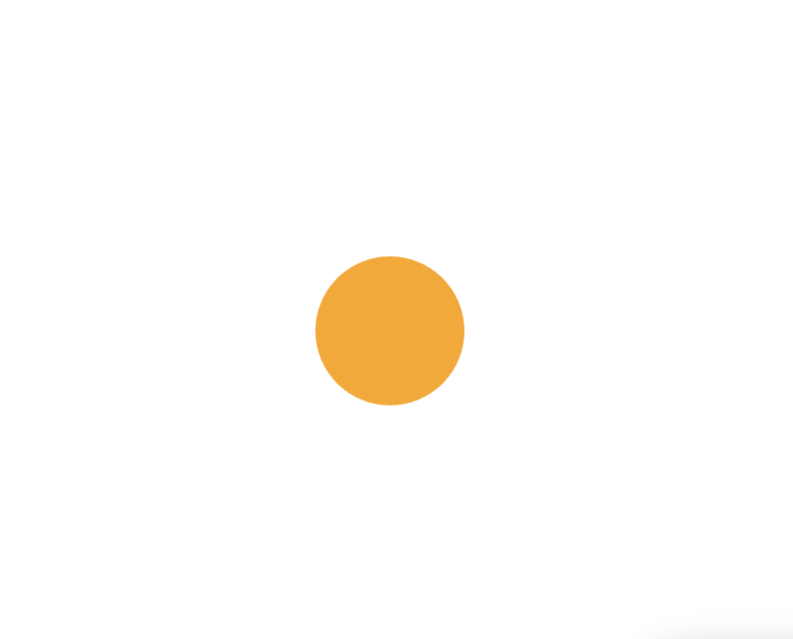

# Creative Coding I

Prof. Dr. Lena Gieseke \| l.gieseke@filmuniversitaet.de  \| Film University Babelsberg KONRAD WOLF

# Session 03 - Instructions (10 points)

Please complete this session by November 14th. Completing the session should take < 4h.

In this session we are going to think about the topic of *instructions* and what the different forms in which instructions can be given. In terms of tech this session is about continuing programming with p5 and getting some coding done!

* [Creative Coding I](#creative-coding-i)
* [Session 03 - Instructions (10 points)](#session-03---instructions-10-points)
    * [Instructions](#instructions)
        * [Task 03.01 - *Coding*](#task-0301---coding)
        * [Task 03.02 - *Coding*](#task-0302---coding)
        * [Task 03.03 - *Creative Instructions*](#task-0303---creative-instructions)
    * [Learnings](#learnings)

## Introduction

When I first read the instructions for *task 03.02*, I immediately had this specific visual idea in my mind, which was a simple interactive illustration. I decided that this was the perfect moment to create some css art, which I love and haven't done in a while. Working on the task, I thought that I could organize the whole assignment under one topic - *birds*! I suggest that every single sub-task is best experienced when tried out in a local browser, but if this should not be the case, I have attached GIFs, screenshots and short explanations for each one.

### Task 03.01 - *Circles*

In the `./src/circle` folder, there is a small mystery for a start. The instructions are very simple - just open the `circle.html` file in your local browser and start *hovering* with the mouse on the canvas. Your goal is to find the hidden circle.

If you do this and are further interested in discovering the hidden easter egg, you have to find out the *instruction* for its appearance on your own... what could this *instruction* be, having in mind the **b**irds topic of my assignment...

Of course, you can also simply see the <i>instructions</i> and results in the hidden section below.

The special <i>instruction</i> for the easter egg is, of course, pressing key <b>B</b>! 🐤 As a result, your circle will transform into a bird's head! If you want to do it again, you can either refresh your browser with the reload button, or click key <b>R</b> to refresh.

</img> </img>

</img>

### Task 03.02 - *When I see you, it makes me happy.*

This task, as I mentioned in the [Introduction](#introduction), gave me the idea for the whole *birds* topic. I wanted to create a simple css illustration of a seagull, because the bird family *Laridae*, to which gulls (or seagulls) belong, is one of my favorite bird families, and in general, I love birds! 

If you want to bother the gull on your own, you can open the `seagull-fren.html` file in the `./src/seagull-fren` folder, and hover over its head. It is not used to many visitors, so don't mind the surprise. However, if you don't feel like it, here are some visuals.

</img>

### Task 03.03 - *Creative Instructions*

I believe that this task is best experienced first hand, because it is a pretty simple one, and if there is any *wow* or at least *a slight smile* effect, it can be experienced only once - after that it could get boring. But you should not worry - it is not much work! I have prepared it all in the `./src/jumpy-robin` folder. Just open the `jumpy-robin.html` file and all you have to do is follow the *instructions* and let your imagination *create* for you. As a next step, just click the button to see what you have created!

Unfortunately, I cannot provide visuals of the whole task, because it is a long one. But at least I can give you the main character below for you to enjoy.

See who the main character is.

</img>

## Learnings

I really enjoyed this whole session - its content, the presentation of the lecture as well as the creative tasks in the assignment! I found the given examples of the work of Sol LeWitt and Yoko Ono very interesting and, personally, thought-provoking in a way that I was able to broaden my understanding of the concepts of *algorithmic thinking* and *instructions*, which both go far beyond the context of programming. Moreover, the overview of *p5.js* and some fundamental *programming principals* was useful to me, because it helped me to refresh my knowledge. In addition to that, I used the tasks as small personal projects, where I could give some *instructions* to basic shapes in order to create more complex ones and use them for *css illustrations*. I am very passionate about the idea of *css art*, but I haven't done it in a while, so it was fun working on my birds. Last but not least, since I mentioned birds - I was happy to choose this topic, because I love birds, therefore, *they make me smile*.

---
