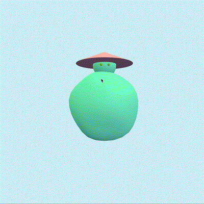
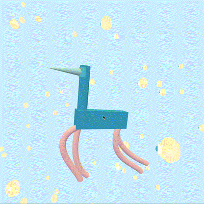
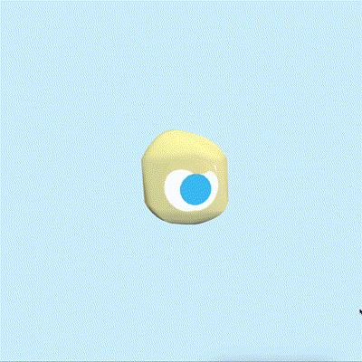

# Creative Coding I

Prof. Dr. Lena Gieseke \| l.gieseke@filmuniversitaet.de  \| Film University Babelsberg KONRAD WOLF

# Session 06 - Space

Please complete this session by Dec. 5. Completing the session should take < 8h (4h CC1 + 4h TABG). Your results will be discussed in TBAG on Dec. 6.

* [Creative Coding I](#creative-coding-i)
* [Session 06 - Space](#session-06---space)
    * [⭐️ BREAKING NEWS ⭐️](#️-breaking-news-️)
    * [three.js](#threejs)
        * [Task 06.01 - Space Travellers](#task-0601---space-travellers)
    * [Learnings](#learnings)

## ⭐️ BREAKING NEWS ⭐️ 
For now, the coding tasks will be the same for CC1 and TBAG. Meaning, you only have to work on one practical exercise for both classes. You do not need to separate parts for each class but can submit one coherent project for both classes. If you enjoyed working in teams for the last session, you can also do these tasks in teams. But then, of course, the outcome has to be larger.

Please note that there might be additional tasks for each class individually.

---

In this session we are dealing with the topic of _space_ and what types of virtual spaces we are working with. In terms of tech, this session introduces you to the JavaScript library [`Threejs`](https://threejs.org/), which is a good choice if you want to build 3D scenes in a browser.

## three.js

### Task 06.01 - Space Travellers

The two very adventurous and *geometrical* space travellers are the *spirit* and the *bird*. They are currently passing through the territory of the *space eggs* (not to be mistaken with SpaceX). But, do not worry! The space eggs are very nice, and they guide the travellers in the right direction.

*The spirit* is a courageous little guy, who has been travelling around different *spaces* in different universes for quite some time now. Therefore, he is a well-known visitor almost everywhere he goes. Although he met *the bird* not so long ago, and although the bird cannot really be described as someone experienced at going a lot here and there, they almost immediately got along very well. Since then, they have been adventuring together. 

And the *space eggs*? Well, they are pretty interesting creatures themselves, and definitely deserve a longer introduction, but this is now a task for another time.

#### Meet each of the creatures.

  

If you would like to *dive* into this universe, all you need is in the `./src` folder.

## Learnings

During this session I realized that the last time I was working with *three.js* was such a long time ago, and this is a shame, because I enjoy it so much! This library is *exactly what* brings me the most joy - it allows me to create 3D characters and sceneries by writing *code*. I used the session not only to refresh my knowledge of the basics, but to also dive deeper into the functionalities which the library offers. More specifically, I tried out different geometries, apart from the box and sphere ones. For examples, in my project, I used *CapsuleGeometry* for the bodies of the space eggs, *ConeGeometry* for the spirit's hat and the bird's beak, and the coolest one, *TubeGeometry*, for the bird's legs. I researched a lot about the different possibilities that *TubeGeometry* offers, and loved the fact that you can give it different parametric curves as path, in order to construct the forms. For this task, due to the scope and time constraints, I applied very basic curves while constructing the legs. However, my goal is to learn more about *Bézier curves*, and start utilizing them in my projects. Unfortunately, I have been telling myself this for a long time, therefore, they have been on my *TODO* list for a while now. Let's hope I get to them soon. Furthermore, I used a noise function to modify the geometry of the spirit's body and the bodies of the space eggs, for the purpose of getting the nice blob effect and animating it.

`Note:` I am aware that this scene is probably not exactly a *geometric scene*, but I really wanted to build some creatures, which are utilizing different geometric shapes, in order to have this small world and its story as a final result. Moreover, while working on this task, I was developing the story in my head, and decided that I would probably like to use the characters for my final TBAG audiovisual sketch.

---
