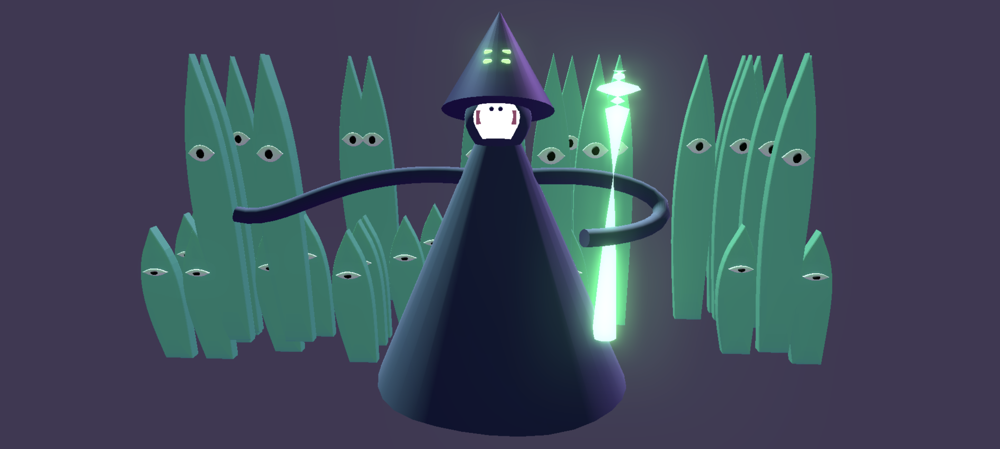
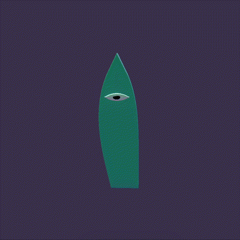

# Creative Coding I

Prof. Dr. Lena Gieseke \| l.gieseke@filmuniversitaet.de  \| Film University Babelsberg KONRAD WOLF

# Session 07 - Asynchronism

Please complete this session by Jan. 16. Completing the session should take < 8h (4h CC1 + 4h TABG).


* [Creative Coding I](#creative-coding-i)
* [Session 07 - Asynchronism](#session-07---asynchronism)
    * [JavaScript Functions \& Asynchronism](#javascript-functions--asynchronism)
        * [Task 07.01](#task-0701)
        * [Task 07.02 - Practice Higher Order Functions and Using the Browser Console](#task-0702---practice-higher-order-functions-and-using-the-browser-console)
    * [Debugging](#debugging)
        * [Task 07.03 - Reading](#task-0703---reading)
        * [Task 07.04 - Level 2](#task-0704---level-2)
    * [Three.js](#threejs)
        * [Task 07.06 - Local Installation](#task-0706---local-installation)
        * [Task 07.07 - The Whisperer](#task-0707---the-whisperer)
    * [Learnings](#learnings)

In this session we are dealing with the topic of *asynchronism*, where we encounter it in every day life and what it means for us as humans. In terms of tech, this session introduces you to some web-specific JavaScript functionality and syntax, which we will need in the upcoming sessions.

## JavaScript Functions & Asynchronism

### Task 07.01

Re-cap the sections in the script regarding higher order functions and their different syntax formats:

* [Higher Order Functions](../../02_scripts/cc1_ws2324_04_javascript_script.md#higher-order-functions) ✅
* [Anonymous Functions](../../02_scripts/cc1_ws2324_04_javascript_script.md#anonymous-functions) ✅
* [Arrow Functions](../../02_scripts/cc1_ws2324_04_javascript_script.md#arrow-functions) ✅
* [Asynchronism](../../02_scripts/cc1_ws2324_04_javascript_script.md#asynchronism) ✅

### Task 07.02 - Practice Higher Order Functions and Using the Browser Console

#### (1) TODO:

`spellChecker` is a higher order function and we are passing another function `wrong = () => console.log('This is not a proper spell.')` as an _argument_ to it.

#### (2) TODO:

In this case the map function if iterating through all strings in the array we give as the `terms` argument, and we are checking if the current string that we give as the `str` argument is containing any of the strings the `terms` array. E.g. with `hasTerm("This a better example.", termsGood)` we check if in the sentence `This is a better example.` we have a term that is part of the `termsGood`.

#### (3) TODO: Arguments as anonymous functions

```
spellChecker(
    'Make everything nice!', 
    function (spell) {
        console.log('Doing the magic:', spell);
    },
    function () {
        console.log('This spell is against the rules. Please evaluate your moral');
    }
);
```

#### (4) TODO: Arguments as arrow functions
```
spellChecker(
    'Make everything nice!', 
    (spell) => {
        console.log('Doing the magic:', spell);
    },
    () => {
        console.log('This spell is against the rules. Please evaluate your moral');
    }
);
```

## Debugging

### Task 07.03 - Reading

Read through the debugging script:

* [Debugging](../../02_scripts/cc1_ws2324_07_debugging_script.md)

Done ✅

### Task 07.04 - Level 2

Currently, I could think only of the [React Developer Tools](https://chromewebstore.google.com/detail/fmkadmapgofadopljbjfkapdkoienihi?hl=en-US&utm_source=ext_sidebar), which is a nice Chrome extension if you are working with `React`.
If something else comes to my mind, will share it here.

## Three.js

### Task 07.06 - Local Installation

See `.src/package.json`.

_Note: I have `npm` installed, and also `three.js` installed with npm, but the code uploaded here runs using `three.js` as import map script due to convenience. I also use it like this for personal projects, which run only locally and do not need build tools._

### Task 07.07 - The Whisperer

</img>

This scene is part of the universe that I have created in my [previous homework](https://github.com/ctechfilmuniversity/lecture_ws2324_creative_coding_1/blob/main/docs/04_submissions/angelova/06/cc1_ws2324_06_angelova.md). I would like to use all the creatures for the visual part of my final _TBAG_ submission, therefore I continued working on a new character - the Whisperer - for the story. This is a very powerful inhabitant of the same planet where the space eggs come from. His abilities are to tame all kinds of "_animals_" and "_plants_", ​for example, the space eggs or the monster plants, that I am introducing in this scene. His Magic Wand is his most powerful weapon. Moreover, the magical power that every whisperer possesses, has a distinct color, which can be seen on the Magic Wand, and the special Magic Eyes on his hat, which serve as a power source.

#### Meet the Whisperer and one not so happy monster plant
</img> </img>

## Learnings

For the theoretical part of this session, I refreshed my knowledge of higher order functions and asynchronous programming in JavaScript. For the practical part, I tried out a couple of new things with `three.js`. I made sure that I understood how `LatheGeometry` works, because it is a powerful tool for creating interesting forms. In my case, I used it to create the shape of the head and the face of the Whisperer. I further used `TubeGeometry` with cubic Bézier curve functions to construct the hands (I did a similar thing for the legs of the Bird from my previous scene). However, this time I researched how I could close the ends of the tube, and added a function in my code, which does this by adding the geometry at the beginning and at the end of a given tube. Moreover, I read how one can easily achieve a simple glowing effect for a particular mesh in the scene, because I wanted it only for the Magic Wand and the Magic Eyes of the Whisperer. Therefore, I achieved it with `UnrealBloomPass` and `EffectComposer` as suggested in a thread in the `three.js` forum.

---
