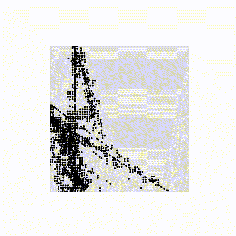
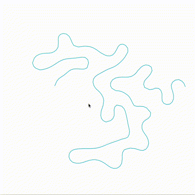
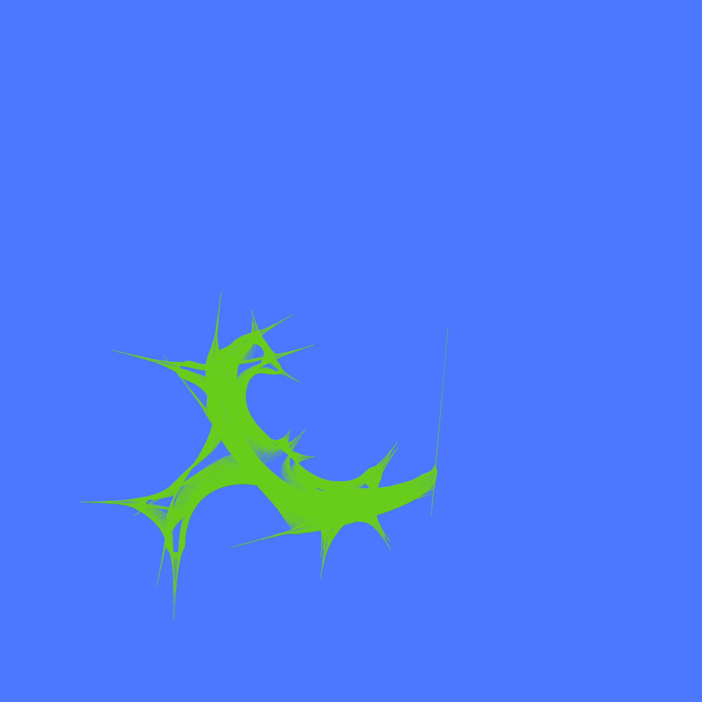

# Creative Coding I

Prof. Dr. Lena Gieseke \| l.gieseke@filmuniversitaet.de  \| Film University Babelsberg KONRAD WOLF

# Session 08 - Systems

Our last topic is *systems*. We are done with the class and hopefully from here on you have enough coding competencies and algorithmic thinking developed that you can build more complex systems - by using code, nodes, hardware... Also, hopefully you, yourself, can further evolve with what you have learned from this class (🐛 -> 🦋).

## Task 08.01 - The Final Project

Since this is the final project in _Creative Coding I_, I decided to challenge myself and do something different than my previous submissions, which is also quite outside of my comfort zone. Even though I am most interested in creating characters and stories with code, be it _CSS_ or _three.js_, I have actually always been keen on algorithms that model natural processes, forms or behaviors. Therefore, I have starred [this github repo](https://github.com/jasonwebb/morphogenesis-resources?tab=readme-ov-file#differential-growth) long time ago. However, I have never really came to try anything from it. Thus, I decided that now is a great opportunity to try and implement an algorithm from this collection and aim for more abstract visual results.

### Differential Growth Algorithm

I picked this one, because I have seen a lot of creative projects, implementing some form of the algorithm and they always have very stunning and visually pleasing results.

## The Journey

### Day 1

As I said, this was challenging for me. I have realized that I find it hard to think algorithmically, especially for problems that are a bit more than trivial. Therefore, the first day of working on my project was a bit of a disaster as one can see in the following examples:

</img> </img>

I mean, I could fake it, and say that the result, see here, is actually intended, but come on, it is not even close to some kind of _growth_. And the first image... yeah, nice squares.

### Day 2

The first _aha_ moment came on the second day, when I decided to read a bit more, in order to try and understand what is going on in this algorithm. And here we go:

</img> </img>

Here we have some differential lines as well:

</img> </img>

After I managed to have a visual result which seemed to be similar to what I have seen in other projects, I spent some time playing around with different parameters. For example, the different distances - `MIN_DIST_OTHERS_CONNECTED` is the minimal distance between a node and its previous or next direct neighbor. If the distance between one of these pairs gets smaller than `MIN_DIST_OTHERS_CONNECTED`, the current node should move further from its neighbor (repulsion). `MAX_DIST_CONNECTED`, on the other hand, is the maximum allowed distance between two neighboring nodes and if their distance gets bigger than `MAX_DIST_CONNECTED`, a new node should be inserted between them. Moreover, there are also `ATTRACT_FORCE` and `REPULSE_FORCE`, which have the opposite signs, and are used as the amount of interpolation in the LERP function, to determine the new position of the node, when moving closer or further away, respectively.

### Day 3

Having already more or less a working system, on this day I, firstly, cleaned up the code by creating two classes - `Node.js`, which creates a basic Node in the system with `position` property, and `GrowthSystem.js`, where all system rules and functionalities are implemented. Then, I decided to make it interactive and add nodes on mouse click. As a result, one can play around inserting random nodes at different positions and see the results. I also added `colors` array with some predefined shades of green, and a dark green background. They can be modified, in order to use your own preferred palette. To see only the differential growth line, you can uncomment `clear()` in the `draw()` function. One further development would definitely be to use `kNN`, when iterating the nodes in the systems, so that at each step only the relevant ones (only those in some radius) are considered.

💡 If there is a specific state which you like, and would want to save it as an image, just press the `F` key, and the system will freeze.

### The project in a context

Since this is just a small prototype, I thought about different possibilities to use it. One idea would be to have a projection on a big wall and sensors to detect the movement and position of people standing in front of the wall to use this information for inserting new nodes in the system. As a result, if for a period of time nobody stays and moves in front of the wall, the system will slowly disappear, because the repulsion force has a bigger influence than the attraction force and the rate at which the system adds nodes on its own. Therefore, to compensate for this, there should be additional mechanism to make sure new nodes are inserted. In my prototype this is the mouse click event, and in a possible interactive installation, this would be the movement of the viewers.

### More visuals 💚

_The dog_ & _The oil figure_

</img> </img>

_Growth #1_ & _#2_

</img> </img>

_Green bird_ & _Red bird_

</img> </img>

Code can be found in the `./src` folder.

---

## Task 08.02 - Feedback

* How would you rate the difficulty of this lecture from 1 (far too easy) to 5 (far too difficult)?
    * I would say __2__, because I already have experience with web development, but if I hadn't, I would go for __3__ or __3.5__, because the amount of topics and technologies, introduced in the lecture, is not small, and each one has its specifics.
* How would you rate the amount of work you had to put into this lecture so far from 1 (no work at all) to 5 (far too much work)?
    * I believe __3__, but I personally put more time in the homeworks than needed, just because I was really enjoying it. So, let's say, __4__.
* How much did you enjoy working with p5 from 1 (hate it) to 5 (love it)?
    * Let's say, around __4__.
* How useful do you consider p5 for you from 1 (don't need it) to 5 (will use it all the time)?
    * Probably __3.5__.
* How much did you enjoy working with tree.js from 1 (hate it) to 5 (love it)?
    * I love _three.js_ 💚, so solid __5__.
* How useful do you consider tree.js for you from 1 (don't need it) to 5 (will use it all the time)?
    * Definitely another solid __5__.
* What do you think about the context expansions, e.g., the brief general discussions of certain topics?
    * For me, they are an important part of a topic, giving it either an introduction or context, or both.
* Which one was your favorite topic, which one your least favorite?
    * Let's say, _Connection_, because there we introduced _CSS_ 💚, and also _Space_. I am not sure about my least favorite, because I cannot remember a session, which I found either very boring or not interesting at all.
* Was there a topic missing and if so which one?
    * I don't think this should be a whole session or a topic on its own, but I thought that a brief introduction to _Object-Oriented Programming_ as paradigm would be helpful. I know that, of course, it is not the only one existing programming paradigm, and I know that in _creative coding_ the emphasis is rather on the _creative_ part, and on the _visual outcome_, not on _how_ you have done it. However, I believe that having a basic understanding of how you could write better code is just making your work more organized, faster, and easier to follow or get back to it - both for you, and _especially for the others_, if you are working in a team.

## Task 08.03 - Learnings

My approach to each session was to try and do at least one new thing in the current assignment. This could be something very small, like using a _CSS_ property I have not used before, or it could be bigger - like understanding how a specific type of Geometry in _three.js_ works, and implementing it in my scene.

For example, I remember that for the second submission - _Emergence_, I spent some time finding out and understanding how one can create _grainy_ texture effect with _JavaScript/ p5.js_ by manipulating the pixel array, without using image texture. Before that, I didn't know about the `loadPixels()` function. For the third assignment - _Instructions_, which I absolutely loved, I decided to not only refresh my _CSS_ knowledge, because at that point it was beginning to get rusty, but also to really figure out what some properties like `clip-path()` do.

For the _three.js_ assignments, as I mentioned with the example above, I was always trying to learn and use a new functionality of the library. Additionally, I had this mission from the beginning, to really focus on creating nice creatures, which one would usually sculpt in other softwares, because I just love to find ways to use any tools, in order to, in a way, _"draw"_ with them. It could be a 2D illustration, like the ones I made with _CSS_, or 3D characters, like the ones I created for my scenes.

And for this final submission, I decided to be more abstract than usual, and also to learn a new algorithm, but all of this I already mentioned in the project description.

Long story short, I really enjoyed the lecture!

---
