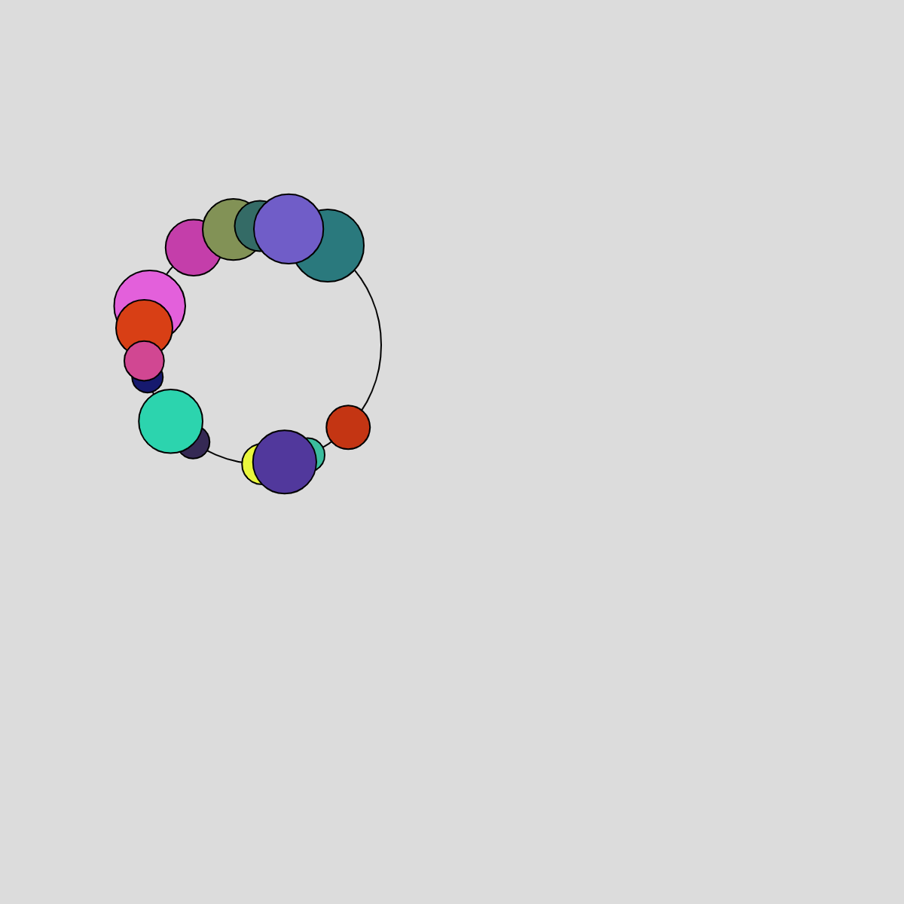

# Creative Coding I

Prof. Dr. Lena Gieseke \| l.gieseke@filmuniversitaet.de  \| Film University Babelsberg KONRAD WOLF
  

# Session 03 - Instructions (10 points)

Please complete this session by November 14th. Completing the session should take < 4h.  

In this session we are going to think about the topic of *instructions* and what the different forms in which instructions can be given. In terms of tech this session is about continuing programming with p5 and getting some coding done!

- [Creative Coding I](#creative-coding-i)
- [Session 03 - Instructions (10 points)](#session-03---instructions-10-points)
  - [Instructions](#instructions)
    - [Task 03.01 - *Coding*](#task-0301---coding)
      - [Results](#results)
    - [Task 03.02 - *Coding*](#task-0302---coding)
    - [Task 03.03 - *Creative Instructions*](#task-0303---creative-instructions)
      - [Answer](#answer)
      - [Results](#results-1)
  - [Learnings](#learnings)

## Instructions

Submit a text-based program and its result for each of the following instruction. Submit a link to your sketch and add or link results in your submission file.
  
*Note*: If you are using the p5 online editor, also submit your source code.

### Task 03.01 - *Coding*

> Circles!

[Source Code](circles.js)

[p5_webEditor](https://editor.p5js.org/tanz.ania/full/yMUkh6mqG)

#### Results

[Circles_01](img/circles_01.png)

[Circle_02](img/circles_02.png)

### Task 03.02 - *Coding*

> When I see you, it makes me happy.

<!-- 
Seeing you makes me happy.
It makes me happy to see you.
Seeing you is happiness.
 -->

[Source Code](happy.js)

[p5_webEditor](https://editor.p5js.org/tanz.ania/full/jQhik6_-O)

####Results

[happy_01](img/happy_01.png)

[happy_02](img/happy_02.png)

### Task 03.03 - *Creative Instructions*

Write instructions that are in themselves a creative output.

#### Answer
* pick a color
* draw a shape on a paper
* fold the paper in half facing the colored size
* pick another color
* draw a shape on the paper
* fold the paper in half facing the colored size
* pick another color
* go on as much as you can fold

#### Results

[instruction_01](img/instructions_01.jpg)

[instruction_02](img/instructions_02.jpg)

## Learnings

Please summarize your personal learnings (text or bullet points - whatever you prefer). What was challenging for you in this session? How did you challenge yourself?

* Working with camera input interaction
* deeper understanding of coding starting from tutorials/sketches
* starting from an idea, I tried to write instructions to then write the code to achieve the initial idea
* I used ChatGPT to try to make something more elaborate. It was helpful because I had to have a precise idea of the instructions so that it could write the correct code. 
*programming is still a challange. I find it hard to work on big projects because I'm easily stuck on something. Instead I'm trying to have a deeper understanding on the smaller projects I work on. 

---

Answer all questions directly in a copy of this file and also link and display your images in that file. Submit your copy as `cc1_ws2324_XX_lastname.md` in your assignments folder.

---

**Happy Instructing!**
