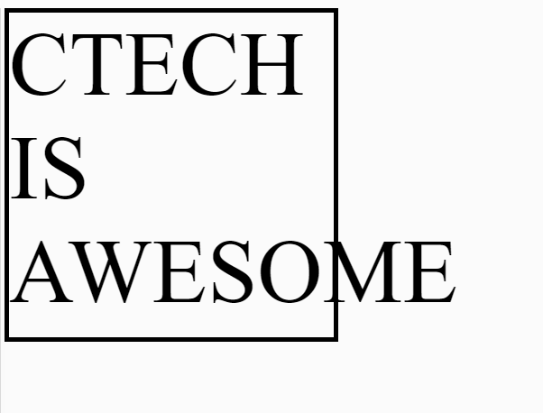

# Creative Coding I

Prof. Dr. Lena Gieseke \| l.gieseke@filmuniversitaet.de  \| Film University Babelsberg KONRAD WOLF
  

# Session 04 - Connection (10 points)

Please complete this session by November 23rd, 10:00 (just before class). Completing the session should take < 4h.  

In this session we are dealing with the topic of *connection* and what the web means. In terms of tech, this session introduces you to p5 libraries and the different components a website is made of. Also, this will be the last exercise with p5 and in 2D. 

- [Creative Coding I](#creative-coding-i)
- [Session 04 - Connection (10 points)](#session-04---connection-10-points)
  - [The Web](#the-web)
    - [Task 04.01 - Ingredient of the Web](#task-0401---ingredient-of-the-web)
      - [Answer](#answer)
  - [Connection](#connection)
    - [Task 04.02 - Connection to the Outside](#task-0402---connection-to-the-outside)
      - [Answer](#answer-1)
  - [Learnings](#learnings)
      - [Answer](#answer-2)

## The Web 

Re-capture [Script 06 - The Web](../../02_scripts/cc1_ws2324_06_web_script.md).

### Task 04.01 - Ingredient of the Web

Investigate and adjust the `.html` and `.css` of a p5 sketch of your choice. You need to make changes to both files and the changes need to be visible on the web page. Changes can be experimental, the outcome doesn't need to look good.

#### Answer

I worked on a blank project because I wanted to recreate a graphic content that was on the slide and make it a "CTECH" meme. 
To do that I worked on both the HTML file and CSS file on p5. 

[Here](https://editor.p5js.org/tanz.ania/full/RFwGcJbo6) is the result

## Connection

### Task 04.02 - Connection to the Outside

Let's start with connecting to each other. This task has to be done in pairs 🥳. I will try to dedicate some time to work on this task during next week's class (16.11.).

Create a sketch that uses some form of input live-stream. The easiest input is to use a webcam and it would be totally fine to simply do so. Creating a webcam feed can be done with [`createCapture()`](https://p5js.org/reference/#/p5/createCapture). For working with video, the [ml5 library](https://learn.ml5js.org/#/tutorials/hello-ml5) offers many interesting functionality extensions based on machine learning.

Submit a link to your sketch (or submit all source files) and add or link results in your submission file.

*On a side note*: Each team member should make a submission. However, those submissions can be identical (or one links to the other).

#### Answer 
In collaboration with Max Rueth

For this task we decided to take a different path and created a gui instead. By using the touchgui library we came up with a small application where you can build your own pizza!

Try it yourself [here](https://editor.p5js.org/mxrueth/full/LrKJdmV3c)!

## Learnings

Please summarize your personal learnings (text or bullet points - whatever you prefer). What was challenging for you in this session? How did you challenge yourself?

#### Answer
- It was hard but helpful to work with the gui library. Firstly, I learned how to add and use a library inside of my own project. Moreover, it was challenging to change the settings of the items given by the library to have the result we wanted. We spent a lot of times trying to figure out a way to do what we wanted but in the end we decided to do it differently. We submitted the end result, but in the end we tried to figure out how to do our initial idea and we figured it out! It just took us way more time than expected for the homework but it helped me better understanding the tools and I think it also gave me some more ground knowledge on programming with JavaScript. 

- CSS was a pain :) but a nice pain. I would like to learn more about it. HTML was better, but still a lot to learn.
---

Answer all questions directly in a copy of this file and also link and display your images in that file. Submit your copy as `cc1_ws2324_XX_lastname.md` in your assignments folder.

---

**Happy Connecting!**
