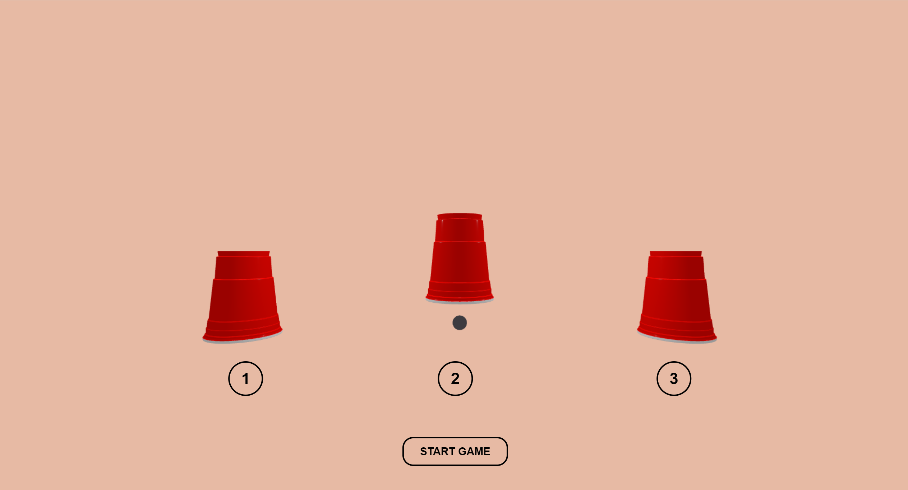
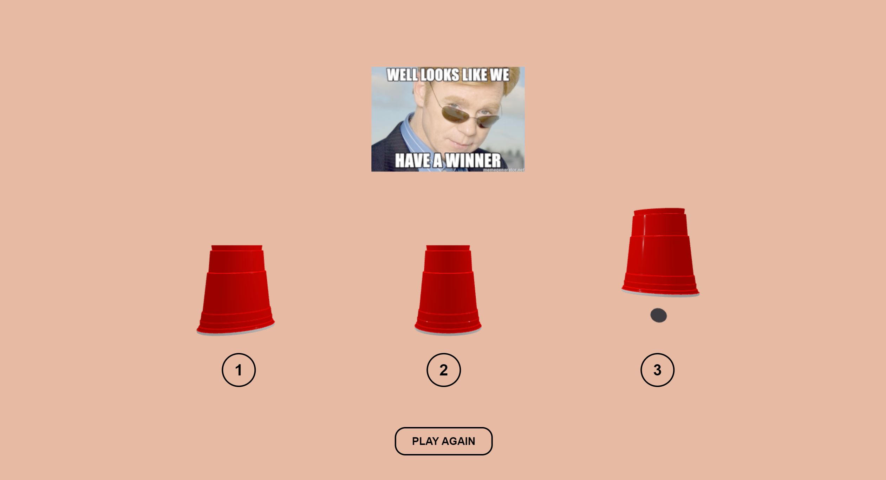
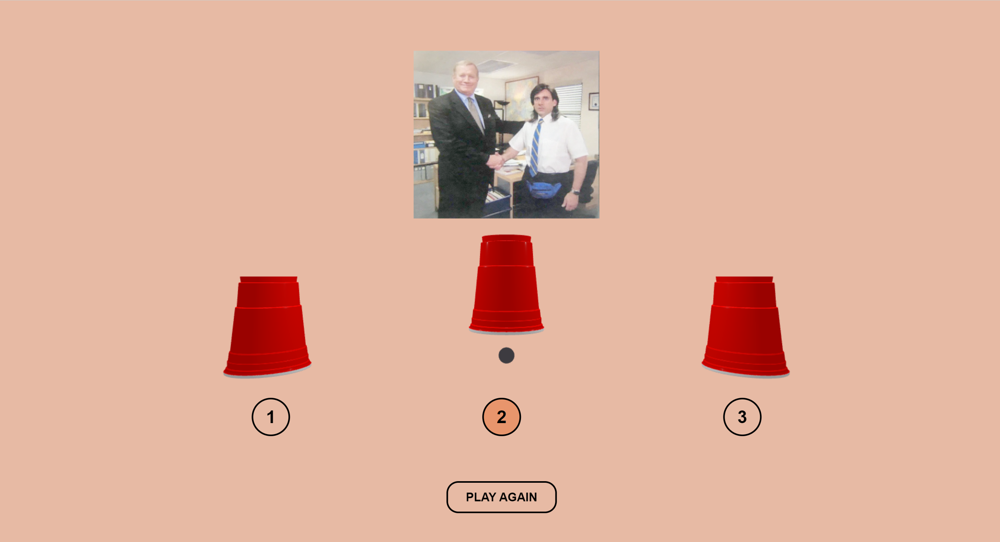

# Creative Coding I

Prof. Dr. Lena Gieseke \| l.gieseke@filmuniversitaet.de  \| Film University Babelsberg KONRAD WOLF
  

# Session 08 - Systems

Our last topic is *systems*. We are done with the class and hopefully from here on you have enough coding competencies and algorithmic thinking developed that you can build more complex systems - by using code, nodes, hardware... Also, hopefully you, yourself, can further evolve with what you have learned from this class (🐛 -> 🦋). 

## Task 08.01 - The Final Project 

The final project is an individually chosen project. 
  
*Maybe something useless?* 😁  
  
You can do whatever you want but your project must make use of text-based programming. It can also be an experiment, part of a larger project, work in progress, or a learning path. Ideally it should be something online, but this is not a hard requirement. You don't need to submit a project plan beforehand. However, it might help to discuss your plan with me in advance.  

The time dedicated to the final project is ~24h.

The official work period for the final assignment is Jan. 16th - Feb. 29th. The deadline for the final project is February, 29th.

* The deadline for the final project is strict and for a late submission, I reduce **15% of the total points**.
* If you are sick within the official work period, you can get a deadline extension based on a doctor's note ("Attest").

As submission, I require

* a description
* the source code
* a link to the build / online deployment or such, and
* at least one representative image.

Submit your code in your assignment folder as assignment `08` or add a link there to where to find the code.

### Description: 

My final project is a reproduction of the famous "Shell Game", a gambling game. A ball is placed under one of the three identical cups. Once the game is started, the cups start moving randomly to another position for an equally random number of times. Once the displacement is completed, the user can try to guess which cup the ball is under. The user  only has one chance to guess. 

I've set up a simple game environment using Three.js. I've created a button to start the game and three other buttons representing the cups. As for the cups, I've used a 3d model that I've found online. Although the game is in the end 2d (I removed the possibility to move around the scene, for obvious reasons), I liked that you could see some sort of 3d environment looking at the cups. The move cups logic was the hardest part. To achieve it, I've asked ChatGPT. The selection logic is based on the position of the cup; the one selected using the button is lifted to reveal if the ball is underneath or not. In both cases, a meme is shown. After that, the user can play again. 

As for the user experience, I've decided to color the background of the button differently when the mouse is over. This also means that the user can actually click the button. If the background doesn't change color, the click will not do anything. The start button can not be clicked during the animation and the guessing. After the guess it changes text and can be clicked to play again and the page will reload. The icons button can be clicked only once the animation is over and after one guess are disactivated.  

### Source code:

[scene.js](scene.js)

### Video Showcase:

<video controls src="showcase/CupsGame_ferro_example.mp4" title="CupsGame"></video>

### Problems

Here are some things I wanted to achieve, but didn't manage (both as a matter of time and knowledge):

* I wanted to let the user click with the mouse directly on the cups

* Fixed position of the icon's button (using two monitors I've noticed that they slightly change position from a monitor to the other)

* Image color of the memes: they look desaturated. 

* I haven't managed to deploy the scene. I got a blank page and errors regarding the 3d models and the images that I couldn't fixed 

## Task 08.02 - Feedback

* How would you rate the difficulty of this lecture from 1 (far too easy) to 5 (far too difficult)? --- 3
* How would you rate the amount of work you had to put into this lecture so far from 1 (no work at all) to 5 (far too much work)? --- 4
* How much did you enjoy working with p5 from 1 (hate it) to 5 (love it)? --- 3
* How useful do you consider p5 for you from 1 (don't need it) to 5 (will use it all the time)? --- 2
* How much did you enjoy working with tree.js from 1 (hate it) to 5 (love it)? --- 4
* How useful do you consider tree.js for you from 1 (don't need it) to 5 (will use it all the time)? --- 5
* What do you think about the context expansions, e.g., the brief general discussions of certain topics? --- It was always very interesting, but sometimes I thought it took precious time from learning coding
* Which one was your favorite topic, which one your least favorite? --- My favorite topic was instructions. The least favorite was Space. 
* Was there a topic missing and if so which one? --- Can't think of anything
* Please feel free to add any feedback you want to give! --- Coming from a zero knowledge background of coding, I think I have learned a lot in this course. It gave me the basics to go deeper into this world and I hope I will work more with Three.js in the future.

## Task 08.03 - Learnings

Please summarize your personal learnings **in regard to the whole course** (text or bullet points - whatever you prefer). What was challenging for you in this session? How did you challenge yourself?

* Starting with zero notion of Java Script, it was from the very beginning very challenging. I always felt "slow" while doing the homework and it always took me way more than expected to achieve what I wanted. 

* I think I've learned a lot of new things thanks to this course, both in programming, concept idealisation and problem solving

* I've worked on my projects with the heelp of ChatGPT. I wanted to have a final good result of my projects, moreover with this last one, and I couldn0t have done it on time without it. It helped me a lot with the code writing, but it was also very fulfilling to see how sometimes, as it didn't gave me a working solution to my idea, I had to come up with a procedure, a different way of doing it that could maybe be right, and in fact it was! So I had to explain very carefully what I wanted and how I wanted it to work to have the working code. It helped me a lot to achieve the results I was looking for, but it also gave me the possibility to learn new approaches and ways of coding. 

* I liked both p5 and Three.js. I've felt a little bit overwhelmed when we chhanged to Three.js, but in the end I appreciated it the most. It was challenging but it was this that gave me the motivation to get better at it. 

  
Thank you! 

---

Answer all questions directly in a copy of this file and also link and display your images in that file. Submit your copy as `cc1_ws2324_XX_lastname.md` in your assignments folder.

---

**Happy Evolving!**