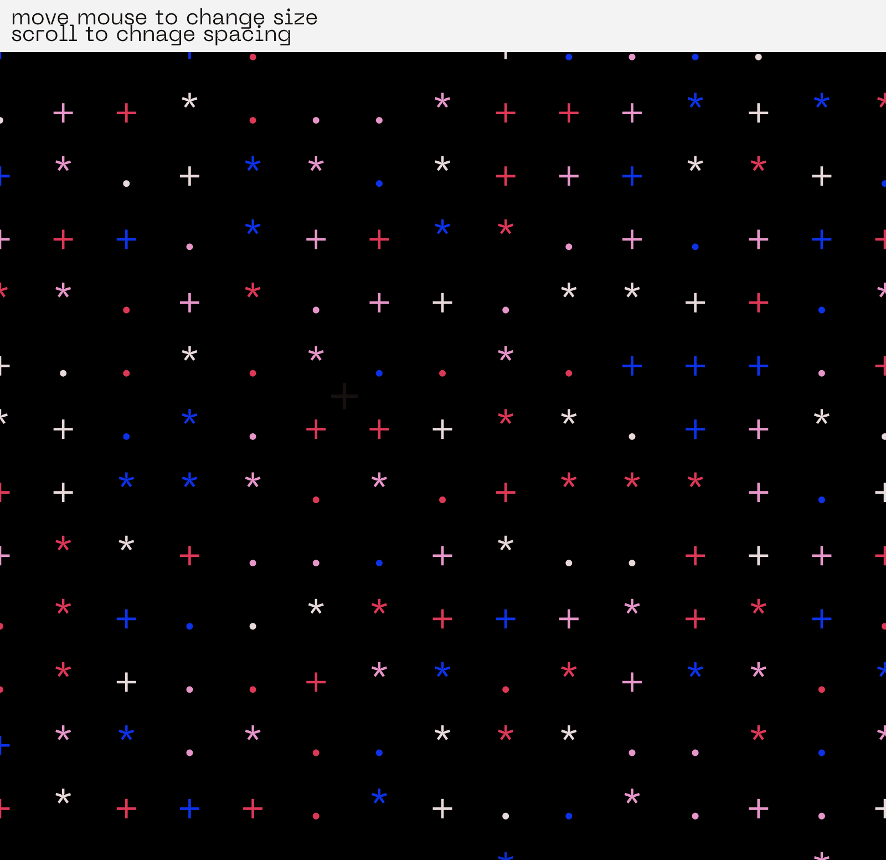

# Creative Coding I

Prof. Dr. Lena Gieseke \| l.gieseke@filmuniversitaet.de  \| Film University Babelsberg KONRAD WOLF
  

# Session 02 - Emergence (10 points)

Please complete this session by November 7th. Completing the session should take < 4h.  

In this session we are going to think about the topic of *emergence* and what it means to create an aesthetic output with code. In terms of tech this session is all about getting into coding and doing a practical exercise with p5.

- [Creative Coding I](#creative-coding-i)
- [Session 02 - Emergence (10 points)](#session-02---emergence-10-points)
  - [JavaScript](#javascript)
  - [p5](#p5)
    - [Task 02.01 -  Motivation](#task-0201----motivation)
    - [Task 02.02 - *p5 With The Online Editor*](#task-0202---p5-with-the-online-editor)
    - [Task 02.03 - The 10 PRINT pattern](#task-0203---the-10-print-pattern)
  - [Link https://editor.p5js.org/Linmaas/full/FSR8qdRFo](#link-httpseditorp5jsorglinmaasfullfsr8qdrfo)
  - [Emergence](#emergence)
    - [Task 02.04 - Conceptualization](#task-0204---conceptualization)
  - [Learnings](#learnings)
  - [Please summarize your personal learnings (text or bullet points - whatever you prefer). What was challenging for you in this session? How did you challenge yourself?](#please-summarize-your-personal-learnings-text-or-bullet-points---whatever-you-prefer-what-was-challenging-for-you-in-this-session-how-did-you-challenge-yourself)

## JavaScript

In this lecture, we are going to work with JavaScript. JavaScript is as language quite easy. It only becomes complicated in the context of web development. For now, we don't care about web development specifics.

As of now, you should have a working understanding of variables and basic program structures such as if, loops and functions in JavaScript. You do not need to memorize the theory of any of these topics, all I care about is that you know how to use them in the coding exercise.

As a reference there is [Script 04 - Javascript](../../02_scripts/cc1_ws2223_04_javascript_script.md). This script gets for certain topics quite into detail and it is meant as interesting reference for all, beginners to experts. I will later add to the scripts with further topics.

If you are a beginner you might want to look into these basics:

* [JavaScript.info: Variables](https://javascript.info/variables)
* [JavaScript.info: if](https://javascript.info/ifelse)
* [JavaScript.info: loops](https://javascript.info/while-for)

Or you can use any resources you like. 

## p5

If you are a beginner you can find detailed and slowly explained information in the scripts of my [*Creative Coding for Beginners Course*](https://ctechfilmuniversity.github.io/lecture_ss23_creative_coding_for_beginners/02_scripts/).

Also, please refer to [p5's reference](https://p5js.org/reference/). It is well-made.

### Task 02.01 -  Motivation

Find two p5 sketches that you like from two different sources, e.g., on [p5 examples](https://p5js.org/examples/) (btw., you can also directly access the examples in the online editor under `File -> Examples`), [OpenProcessing](https://www.openprocessing.org/), [Generative Design](http://www.generative-gestaltung.de/2/). 
  
Submit the links and a brief explanation for each why you like the sketch.

---
https://openprocessing.org/sketch/1961876 by user newyellow. I like this sketch very much because of the analog look. By generating the outlines again and again, a variability is created that can also be found in real clouds. I also think it's very cool that you can watch the creation of the picture, it feels a bit like magic! 

https://openprocessing.org/sketch/1297448 by user aeon. I find this sketch extremely fascinating as it is reminiscent of the organic growth of roots. The creative process is not entirely clear, how the lines grow seems to be random. The size of the line network branching with a mouse click also seems to be random. However, underlying rules can also be recognized: The lines grow from the x/y coordinate of the mouse in one direction, with many (but not all) running at a 45 degree angle. There also seems to be a preference for vertical lines. 

---

### Task 02.02 - *p5 With The Online Editor*

Create a account for the [p5 online editor](https://editor.p5js.org/) and work with the online editor (we will move on from this environment soon though).  
  
*Tipp*: Right click on the canvas in the p5 editor and chose `Save image as...` to save an image of your canvas.

### Task 02.03 - The 10 PRINT pattern

1. Write a p5 sketch that generates a pattern with a similar logic as the 10 PRINT example. Your pattern should follow an element-by-element and row-by-row iterative creation process. If you are a beginner, you can use [the code from the slides](https://editor.p5js.org/legie/sketches/nrfQTzxMI) as basis (fully understand it first though!). The overall goal is to create a visual pleasing or interesting pattern. 
2. Make the pattern interactive by mapping at least two changeable visual characteristics to the mouse and / or keys and / or any type of user interaction you want. Look at p5's references for the different interaction possibilities.

You can find information about p5's basic interaction capabilities in [*Creative Coding for Beginners Course: Program Flow*](https://ctechfilmuniversity.github.io/lecture_ss23_creative_coding_for_beginners/02_scripts/ccfb_ss23_04_flow_script.html#interaction).

If you have further ideas about how to design the pattern and interactions but do not manage to implement them, also submit your ideas in text or image form.

Submit the sketch file as `cc1_ws2324_02_04_lastname.js` and at least one png preview image of your pattern as `cc1_ws2324_02_04_lastname_01.png` in your assignments folder `lastname/02`. Also link the image in your questions file.

---
Link https://editor.p5js.org/Linmaas/full/FSR8qdRFo
---

* Images:    

  
[Credits to be added]

## Emergence

### Task 02.04 - Conceptualization

Come up with an idea for a creation that includes emergent behavior, where the sum of its parts creates the overall piece. This can be a visual concept, e.g., once more a repetitive visual pattern, but doesn't have to. You can go beyond visual pattern and you could also consider music, language, performance, social scenarios, etc..

Submit a short description and ideally, if possible, a preview image (this can be drawn by hand).

---
The arteries of Berlin
The movement data of the individual is stored by GPS via the cell phone over the course of a day. These are plotted on a blank map together with the data of as many users as possible. The chaos of the individual routes results in traffic arteries that map the city's roads and public transport. An image of the city results from the movement pattern of the individual. Important hotspots of the city get highlighted in midst of the chaos.

---

## Learnings

Please summarize your personal learnings (text or bullet points - whatever you prefer). What was challenging for you in this session? How did you challenge yourself?
---

-getting used to the syntax of P5 
-finding an interesting approach to the limitations of the for-loop system
-experimenting with may different ideas
-learning how to implement fonts, sounds, different interactions, randomize color
-I challenged myself by doing two sketches -> https://editor.p5js.org/Linmaas/full/WaqjAQMpG
-I learned that most of the time there is an easy, build in soulution instead of doing the math yourself, after I tried to clamp the mousX value manually, I found out about the map function in P5, that does it for you.

---
---

Answer all questions directly in a copy of this file and also link and display your images in that file. Submit your copy as `cc1_ws2324_XX_lastname.md` in your assignments folder.

---

**Happy Emerging!**
