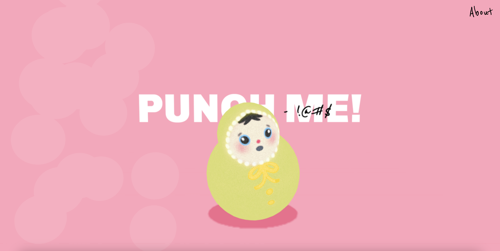
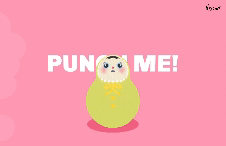

# Creative Coding I

Prof. Dr. Lena Gieseke \| l.gieseke@filmuniversitaet.de  \| Film University Babelsberg KONRAD WOLF
  

# Session 08 - Systems

Our last topic is *systems*. We are done with the class and hopefully from here on you have enough coding competencies and algorithmic thinking developed that you can build more complex systems - by using code, nodes, hardware... Also, hopefully you, yourself, can further evolve with what you have learned from this class (🐛 -> 🦋). 

## Task 08.01 - The Final Project 

The final project is an individually chosen project. 
  
*Maybe something useless?* 😁  
  
You can do whatever you want but your project must make use of text-based programming. It can also be an experiment, part of a larger project, work in progress, or a learning path. Ideally it should be something online, but this is not a hard requirement. You don't need to submit a project plan beforehand. However, it might help to discuss your plan with me in advance.  

The time dedicated to the final project is ~24h.

The official work period for the final assignment is Jan. 16th - Feb. 29th. The deadline for the final project is February, 29th.

* The deadline for the final project is strict and for a late submission, I reduce **15% of the total points**.
* If you are sick within the official work period, you can get a deadline extension based on a doctor's note ("Attest").

As submission, I require

* a description
* the source code
* a link to the build / online deployment or such, and
* at least one representative image.

* Description: Punch me! is a fun little experiment that combines the media.pipe hand tracking and the CANNON physics library. If you knock the little toy guy down, he will try to get up again - inspired by the famous children's toy "Roly-Poly". I started the project with hand tracking and physics in mind and stumbled upon the toy in a vintage shop in Prenzlauer Berg. I modelled and hand painted the roly-poly figure inspired by the toy from the vintage store. Technically, the setup works by adding CANNON spheres to each hand landmark, as well as to a large sphere, so that they can interact. In the animate function, the position of the Roly-Poly FBX follows the position of the big sphere. Using the CANNON library's spring feature, the sphere is attached to the ground and tries to return to its original position when knocked over - a working roly-poly 👍!  

Link to online deployment: https://roly-poly.netlify.app/

Link to image: 
Link to gif: 
 
Submit your code in your assignment folder as assignment `08` or add a link there to where to find the code.

## Task 08.02 - Feedback

* How would you rate the difficulty of this lecture from 1 (far too easy) to 5 (far too difficult)? --- 3
* How would you rate the amount of work you had to put into this lecture so far from 1 (no work at all) to 5 (far too much work)? --- 3
* How much did you enjoy working with p5 from 1 (hate it) to 5 (love it)? --- 3
* How useful do you consider p5 for you from 1 (don't need it) to 5 (will use it all the time)? --- 1
* How much did you enjoy working with tree.js from 1 (hate it) to 5 (love it)? --- 6!
* How useful do you consider tree.js for you from 1 (don't need it) to 5 (will use it all the time)? --- 5
* What do you think about the context expansions, e.g., the brief general discussions of certain topics? --- 5
* Which one was your favorite topic, which one your least favorite? --- My favorite topic was emergence, can't say I had a least favorite topic. 
* Was there a topic missing and if so which one? --- Maybe a bit about server structures and how they work (I know you canceled that on purpose), might be useful later in "the real world"
* Please feel free to add any feedback you want to give! --- overall I feel like I have learned a lot in this course and I found it really useful for later projects/commercial work 😄

## Task 08.03 - Learnings

Please summarize your personal learnings **in regard to the whole course** (text or bullet points - whatever you prefer). What was challenging for you in this session? How did you challenge yourself?
* I rarely used java script before, so getting started was quite a challenge. I really tried to spent as much time as needed to get an outcome that I am happy with for every exercise. I think I learned a lot that way! Also I sometimes found it challenging to grasp how everything works together, for example what node does, why to use vite, etc. 
* I really enjoyed working with three.js because the principles (loading textures, setting up materials, using 3D objects) were really similar to 3D programs out there.
  
* I struggled a bit with finding a topic/style for each project and stick with it, because the exercises were so open. On the one hand I really enjoyed that, on the other hand I spent way to much time browsing the internet for inspiration, watching tutorials and changing the project over and over again.But I think this will get better, after knowing what is possible with js and what to expect from my own skills.   
  
* My background as a graphic/3D designer made it sometimes hard for me to except the unpolished/gamey look of three.js . But with the final project I worked toward a style that is more fitting with the graphical output that three.js can provide. 

* I want to expand on the skills learned in this course and make it part of my work/commercial work! 
  
Thank you! 😺

---

Answer all questions directly in a copy of this file and also link and display your images in that file. Submit your copy as `cc1_ws2324_XX_lastname.md` in your assignments folder.

---

**Happy Evolving!**