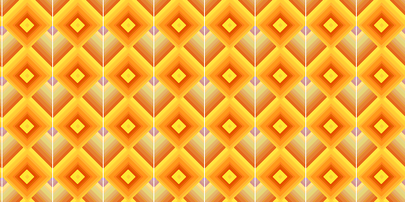

# Creative Coding I

Prof. Dr. Lena Gieseke \| l.gieseke@filmuniversitaet.de \| Film University Babelsberg KONRAD WOLF

# Session 02 - Emergence (10 points)

Please complete this session by November 7th. Completing the session should take < 4h.

In this session we are going to think about the topic of *emergence* and what it means to create an aesthetic output
with code. In terms of tech this session is all about getting into coding and doing a practical exercise with p5.

* [Creative Coding I](#creative-coding-i)
* [Session 02 - Emergence (10 points)](#session-02---emergence-10-points)
    * [JavaScript](#javascript)
    * [p5](#p5)
        * [Task 02.01 - Motivation](#task-0201----motivation)
        * [Task 02.02 - *p5 With The Online Editor*](#task-0202---p5-with-the-online-editor)
        * [Task 02.03 - The 10 PRINT pattern](#task-0203---the-10-print-pattern)
    * [Emergence](#emergence)
        * [Task 02.04 - Conceptualization](#task-0204---conceptualization)
    * [Learnings](#learnings)

## JavaScript

In this lecture, we are going to work with JavaScript. JavaScript is as language quite easy. It only becomes complicated
in the context of web development. For now, we don't care about web development specifics.

As of now, you should have a working understanding of variables and basic program structures such as if, loops and
functions in JavaScript. You do not need to memorize the theory of any of these topics, all I care about is that you
know how to use them in the coding exercise.

As a reference there is [Script 04 - Javascript]()(*TO BE UPLOADED*). This script gets for certain topics quite into
detail and it is meant as interesting reference for all, beginners to experts. I will later add to the scripts with
further topics.

If you are a beginner you might want to look into these basics:

* [JavaScript.info: Variables](https://javascript.info/variables)
* [JavaScript.info: if](https://javascript.info/ifelse)
* [JavaScript.info: loops](https://javascript.info/while-for)

Or you can use any resources you like.

## p5

If you are a beginner you can find detailed information in the scripts of my [*Creative Coding for Beginners
Course*](https://ctechfilmuniversity.github.io/lecture_ss23_creative_coding_for_beginners/02_scripts/).

### Task 02.01 - Motivation

Find two p5 sketches that you like from two different sources, e.g., on [p5 examples](https://p5js.org/examples/) (btw.,
you can also directly access the examples in the online editor
under `File -> Examples`), [OpenProcessing](https://www.openprocessing.org/), [Generative Design](http://www.generative-gestaltung.de/2/).

Submit the links and a brief explanation for each why you like the sketch.

**Sketch 1**

I found this one after I did my 10 Print Pattern. I am saying this because it seems related to my sketch
https://openprocessing.org/sketch/1956769
I like it because of the smooth animated fade ins and outs and of course because it creates a nice optical illusion of a hexagon based grid with fractions of circles (or arcs). On top of that the multilayered circles flow into each other and when the the different circles colors are close enough to each other they visually override the hexagon pattern and form a wave pattern. I really like this back and forth of weight in the elements    

**Sketch 2**

https://p5js.org/examples/motion-morph.html
I like this one because it is visually pleasing to look at but not very difficult to understand conceptually. After watching it twice or three times my brain was bored. It is just an example after all and not meant to be watched for long. But although it didn't look complex I had no idea how to tackle this in code before I looked at the code. I find it interesting how sometimes things seem tremendous complex but are actually easy in code and vice versa, like in this case.  

### Task 02.02 - *p5 With The Online Editor*

Create a account for the [p5 online editor](https://editor.p5js.org/) and work with the online editor (we will move on
from this environment soon though).

*Tipp*: Right click on the canvas in the p5 editor and chose `Save image as...` to save an image of your canvas.

### Task 02.03 - The 10 PRINT pattern

1. Write a p5 sketch that generates a pattern with a similar logic as the 10 PRINT example. Your pattern should follow
   an element-by-element and row-by-row iterative creation process. If you are a beginner, you can
   use [the code from the slides](https://editor.p5js.org/legie/sketches/nrfQTzxMI) as basis (fully understand it first
   though!). The overall goal is to create a visual pleasing or interesting pattern.
2. Make the pattern interactive by mapping at least two changeable visual characteristics to the mouse and / or keys
   and / or any type of user interaction you want. Look at p5's references for the different interaction possibilities.

<!-- TODO: You can find information about p5's basic interaction capabilities in [Script 05 - p5](../../02_scripts/cc1_ws2324_05_p5_script.md#basic-interaction) -->

If you have further ideas about how to design the pattern and interactions but do not manage to implement them, also
submit your ideas in text or image form.

Submit the sketch file as `cc1_ws2324_02_04_lastname.js` and at least one png preview image of your pattern
as `cc1_ws2324_02_04_lastname_01.png` in your assignments folder `lastname/02`. Also link the image in your questions
file.

  
[Credits to be added]

## Emergence

### Task 02.04 - Conceptualization

Come up with an idea for a creation that includes emergent behavior, where the sum of its parts creates the overall
piece. This can be a visual concept, e.g., once more a repetitive visual pattern, but doesn't have to. You can go beyond
visual pattern and you could also consider music, language, performance, social scenarios, etc..

Submit a short description and ideally, if possible, a preview image (this can be drawn by hand).

**Copy Cats Dance Performance:**

9 groups of 20 dancers per group are evenly arranged in a large circle (the diameter of a football field). They dance towards a pole in the middle. They dance only accoring to these rules

1. if you are dancer #1, dance towards the pole while respecting the rules below
2. if you are any other dancer just respect the rules below
3. you are assigned two random other dancers, one is `friend`, one is `foe`.
4. keep a max distance to `foe`, but keep as close distance as possible to `friend`. No other dancer can be closer to your `friend` than you
5. Never stay in the same dance position twice in a row (for more than 1 sec)

While Dancing:
Keep improvising dance moves and:
1. Copy the height of your hip of your `friend`
2. Copy the amount of extremities touching the ground of your `foe`
3. Increase the speed of your movements when the distance to the group closest to you is closer to the pole than your group
4. Increase stiff and jittery movements while you broke any rule above for more than 1 sec

## Learnings

Please summarize your personal learnings (text or bullet points - whatever you prefer). What was challenging for you in
this session? How did you challenge yourself?

**Setting up P5 Library in Jetbrains Webstorm**
* 2 ways: either through Em Modules or Node.Js
* Em Modules require instancing of P5 library which is annoying to work with IMO as you always have to write a `p` before every keyword like `p.background`. But it allows for importing classes directly inside another javascript class. Using Node.js has the disadvantage that one needs to put every class in the html file, which will be cumbersome once a project grows.
* For autocompletion to work one can use `npm install --save @types/p5`
*Learned that Webstorm and Visual Studio Code (which has a better out-of-the box P5 plugin) both run a local webserver to run javascript in the browser. You can even setup Live Editing and the browser updates automatically

**P5**
* first time I used P5 but it's familiar from Processing
* Learned about some syntax, general rules and especially `Arc()` and `PI` values to control them 
* Learned that it is probably better to start using the `draw()` loop right away instead of first sketching out in the `setup()` even if just want to draw a static graphic. That is because mitigating my code from static to dynamic was tedious work once it grew bigger.  
* Learned that P5 gets `mouseX` coordinates even passed the `canvas`, (which was unexpected)
* Made tons of logical mistakes and learned from them
---

Answer all questions directly in a copy of this file and also link and display your images in that file. Submit your
copy as `cc1_ws2324_XX_lastname.md` in your assignments folder.

---

**Happy Emerging!**
