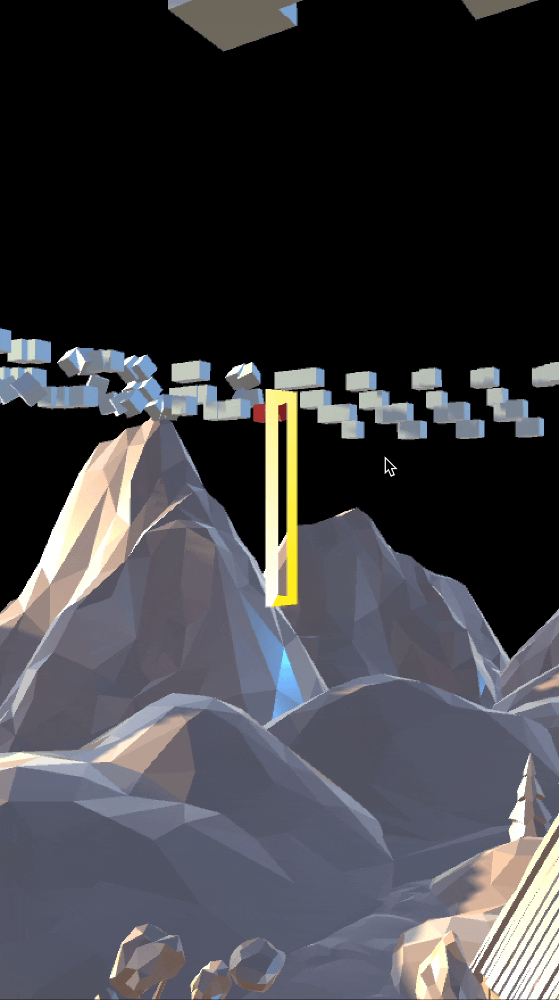

# Creative Coding I

Prof. Dr. Lena Gieseke \| l.gieseke@filmuniversitaet.de  \| Film University Babelsberg KONRAD WOLF
  

# Session 08 - Systems

Our last topic is *systems*. We are done with the class and hopefully from here on you have enough coding competencies and algorithmic thinking developed that you can build more complex systems - by using code, nodes, hardware... Also, hopefully you, yourself, can further evolve with what you have learned from this class (🐛 -> 🦋). 

## Task 08.01 - The Final Project 

The final project is an individually chosen project. 
  
*Maybe something useless?* 😁  
  
You can do whatever you want but your project must make use of text-based programming. It can also be an experiment, part of a larger project, work in progress, or a learning path. Ideally it should be something online, but this is not a hard requirement. You don't need to submit a project plan beforehand. However, it might help to discuss your plan with me in advance.  

The time dedicated to the final project is ~24h.

The official work period for the final assignment is Jan. 16th - Feb. 29th. The deadline for the final project is February, 29th.

* The deadline for the final project is strict and for a late submission, I reduce **15% of the total points**.
* If you are sick within the official work period, you can get a deadline extension based on a doctor's note ("Attest").

As submission, I require

* a description
* the source code
* a link to the build / online deployment or such, and
* at least one representative image.

### Description:
My idea was to create a virtual "directional microphone" in AR that allows the user to pick up 1 sec fragments of a song I composed. Scanning all fragments the user can decide to either listen to the whole song in its' original linear fashion or dive into a small segment and deconstruct its elements in a non-linear way.

The sound fragments are distributed evenly in the form of simple cubes that each carry a small layer of the song at that second. It needs an average of 5-15 cubes per second to hear all elements of the song at a particular second. This means the song consists of hundreds of cubes.

The layout of the cubes in 3D space follows the structure of the song that I projected on a grid. The grid spaces itself in instruments, frequencies and time.

The AR aspect allows the user to hear the sounds spatially as each fragment will be louder/quieter depending on the distance. The directional microphone allows to scan the cubes from any distance and group them together into new clusters in a non-linear way.

The user can also find some "natural" sounds hidden in the village below the floating cubes. 

#### What I did for CC for this project.
As discussed earlier the project had its roots in the TBAG class. There the project underwent a few iterations and experiments. The final version is missing some of the features that I kicked out again to stay for the time being in a manageable scope.

My main focus for CC was to implement the looping behaviour of the sounds when they are selected. I spent most of my time, more or less 3 days, just figuring out problems with the design of my code. My looping system didn't behave like I hoped it would. While this was very frustrating I learned a lot about how to approach implementing what was a larger and complicated feature to me. Next time I would go very different about it and I wish to learn more about planing the structure of a code ahead of time.

Another feature I implemented was to align the cubes in a circle while maintaining their original grid layout. I failed here but I think I understood the problem in the end, but ran out of time to implement it. 
I recorded a [video to explain the features I implemented in more detail](https://www.notion.so/artbymarek/Playhead-900159110863482b8344ccd50d9a4f9a?pvs=4
):

### Images

[Videos and progress](https://www.notion.so/artbymarek/Playhead-900159110863482b8344ccd50d9a4f9a?pvs=4)

 
Submit your code in your assignment folder as assignment `08` or add a link there to where to find the code.
* I put mine in 07 to keep continuity.

## Task 08.02 - Feedback

* How would you rate the difficulty of this lecture from 1 (far too easy) to 5 (far too difficult)? --- 2
* How would you rate the amount of work you had to put into this lecture so far from 1 (no work at all) to 5 (far too much work)? --- 4 
* How much did you enjoy working with p5 from 1 (hate it) to 5 (love it)? --- 4
* How useful do you consider p5 for you from 1 (don't need it) to 5 (will use it all the time)? --- 3
* How much did you enjoy working with tree.js from 1 (hate it) to 5 (love it)? --- 3!
* How useful do you consider tree.js for you from 1 (don't need it) to 5 (will use it all the time)? --- 3
* What do you think about the context expansions, e.g., the brief general discussions of certain topics? --- not sure what you mean exactly atm
* Which one was your favorite topic, which one your least favorite? --- My favorite topic was asynchronism, my least favorite the intro as learned the least in there. 
* Was there a topic missing and if so which one? --- simply building a webpage 
* Please feel free to add any feedback you want to give! --- I enjoyed learning to code a lot and was happy to get an intro to some web tech. I wished the homework to be less fragmented so we could build more polished projects if a student wants that. 

## Task 08.03 - Learnings

Please summarize your personal learnings **in regard to the whole course** (text or bullet points - whatever you prefer). What was challenging for you in this session? How did you challenge yourself?

learned a bit about how to 
- use P5
- program in C#
- use Unity in combination with C#
- use Rider, Webstorm and Visual Studio Code
- use GIT in Terminal and Github and Git in the IDEs
- code for 3D applications
- use libraries and nodes
- learned a lot of details how to structure code/classes with every project
- debug better (breakpoints!)

Thanks a lot! 

---

Answer all questions directly in a copy of this file and also link and display your images in that file. Submit your copy as `cc1_ws2324_XX_lastname.md` in your assignments folder.

---

**Happy Evolving!**