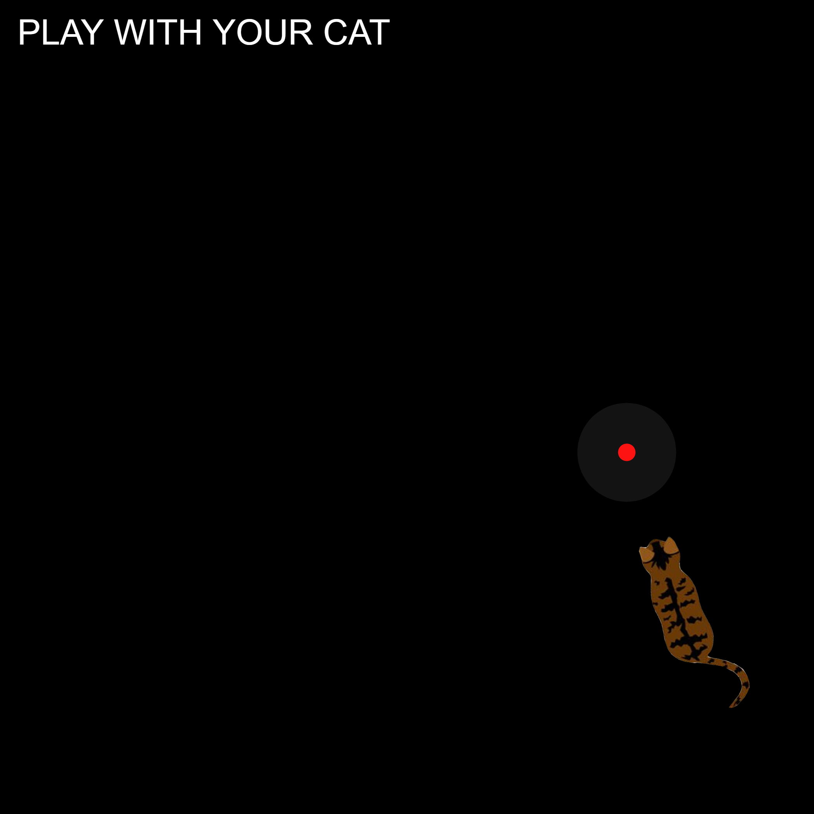

# Creative Coding I

Prof. Dr. Lena Gieseke \| l.gieseke@filmuniversitaet.de  \| Film University Babelsberg KONRAD WOLF
  

# Session 03 - Instructions (10 points)

Please complete this session by November 14th. Completing the session should take < 4h.  

In this session we are going to think about the topic of *instructions* and what the different forms in which instructions can be given. In terms of tech this session is about continuing programming with p5 and getting some coding done!

* [Creative Coding I](#creative-coding-i)
* [Session 03 - Instructions (10 points)](#session-03---instructions-10-points)
    * [Instructions](#instructions)
        * [Task 03.01 - *Coding*](#task-0301---coding)
        * [Task 03.02 - *Coding*](#task-0302---coding)
        * [Task 03.03 - *Creative Instructions*](#task-0303---creative-instructions)
    * [Learnings](#learnings)

## Instructions

Submit a text-based program and its result for each of the following instruction. Submit a link to your sketch and add or link results in your submission file.
  
*Note*: If you are using the p5 online editor, also submit your source code.

### Task 03.01 - *Coding*

> Circles!

---
### Random-Atomic-Planetary-Thingy

The approach here was a bit experimental. I really wanted to work with rotating elements in this task, simply because I haven't done this before. I let 8 circles rotate around the center of the canvas and thought they looked like a small solar system. I added a circle with a gradient as the sun in the middle of the canvas and removed the color of the rotating circles and thought that it now looks like an atom. So it's up to you to decide what it is!

sketch: https://editor.p5js.org/mxrueth/full/3vwlPP9I7

--- 
### Task 03.02 - *Coding*

> When I see you, it makes me happy.

<!-- 
Seeing you makes me happy.
It makes me happy to see you.
Seeing you is happiness.
 -->

 ---
### Laser-Pointer Cat

Since I'm a huge cat lover, I thought it would be fun to play with cats through code! I wanted to create a situation where you play with your cat by using a small laser pointer which can be super funny. It was really interesting to figure out how to implement an image in p5js and make the rotation follow the cursor.

sketch: https://editor.p5js.org/mxrueth/full/ALUTMT1Bx

--- 

### Task 03.03 - *Creative Instructions*

Write instructions that are in themselves a creative output

---
### New Fashion Choice

1. Choose your favourite piece of clothing.
2. Choose 2 colors.
3. If the combient colors result in a third one, choose your first color.
4. Choose the head of one of the following animals: a lion, a frog or a sheep.
5. Use your choice as a pattern for the piece of clothing.
6. If not more then 8 heads are fitting on that piece, choose a different animal.
7. Wrap the piece of clothing you have created in wrapping paper and give it to a friend.

---

## Learnings

Please summarize your personal learnings (text or bullet points - whatever you prefer). What was challenging for you in this session? How did you challenge yourself?

#### Personal Learnings:

* getting a bit more familiar with p5js
* realized it's quite handy to have an idea of a concept before actually start to code 
* learning about roations, adding images and make "delayed" elements that follow the cursor

#### Challenges:

* making the image rotation follow the cursor was not easy
* adding gradients to an element is actually not that straight forward
* make the "function segment" work was challenging
* understanding Task 03.03
* time management

---

Answer all questions directly in a copy of this file and also link and display your images in that file. Submit your copy as `cc1_ws2324_XX_lastname.md` in your assignments folder.

---

**Happy Instructing!**
