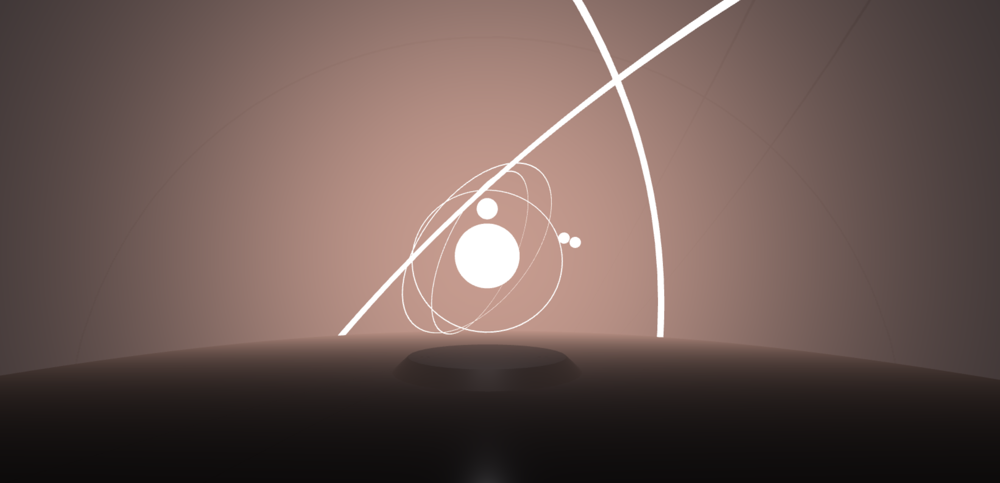
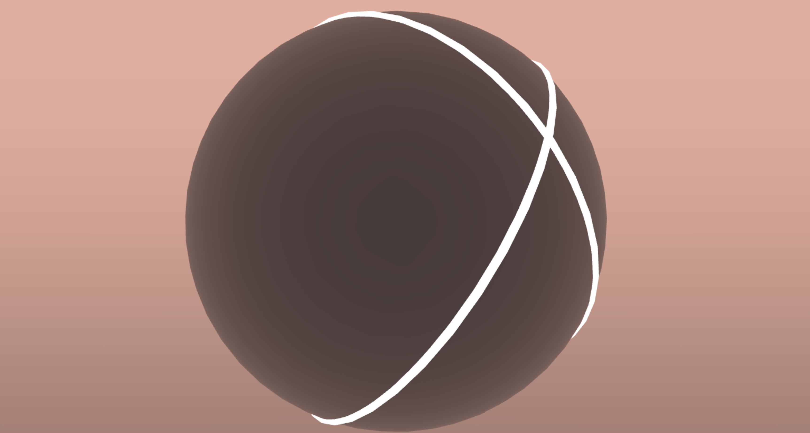
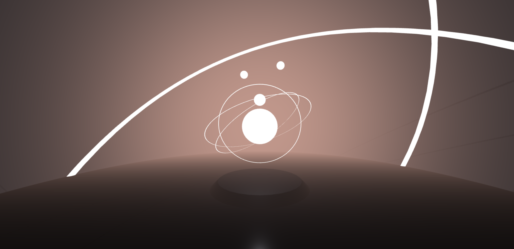
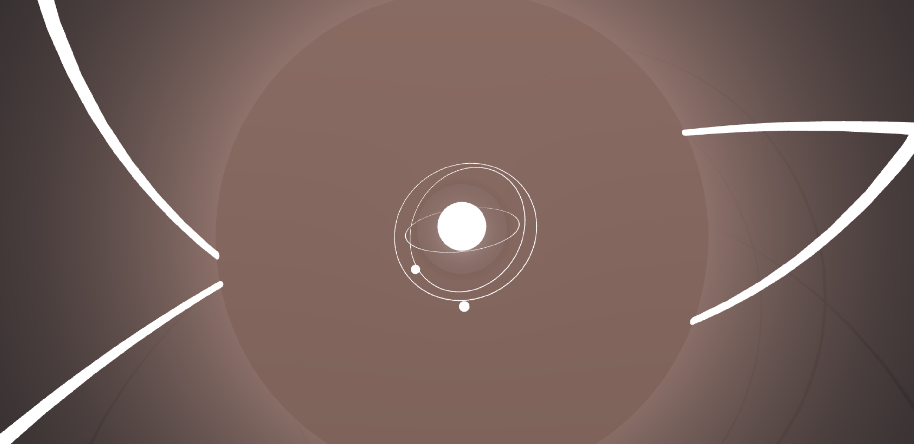
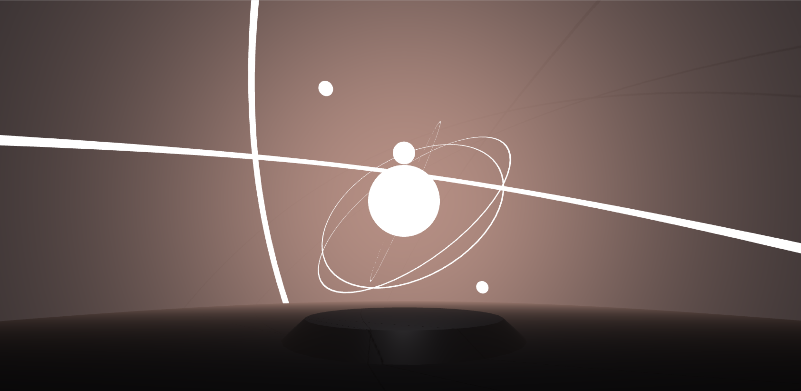

# Creative Coding I

Prof. Dr. Lena Gieseke \| l.gieseke@filmuniversitaet.de  \| Film University Babelsberg KONRAD WOLF
  

# Session 06 - Space

Please complete this session by Dec. 5. Completing the session should take < 8h (4h CC1 + 4h TABG). Your results will be discussed in TBAG on Dec. 6.

* [Creative Coding I](#creative-coding-i)
* [Session 06 - Space](#session-06---space)
    * [⭐️ BREAKING NEWS ⭐️](#️-breaking-news-️)
    * [three.js](#threejs)
        * [Task 06.01 - Your First Scene](#task-0601---your-first-scene)
            * [How to translate the above concepts and aesthetics into 3D space?](#how-to-translate-the-above-concepts-and-aesthetics-into-3d-space)
    * [Learnings](#learnings)

## ⭐️ BREAKING NEWS ⭐️ 
For now, the coding tasks will be the same for CC1 and TBAG. Meaning, you only have to work on one practical exercise for both classes. You do not need to separate parts for each class but can submit one coherent project for both classes. If you enjoyed working in teams for the last session, you can also do these tasks in teams. But then, of course, the outcome has to be larger.

Please note that there might be additional tasks for each class individually.

---

In this session we are dealing with the topic of _space_ and what types of virtual spaces we are working with. In terms of tech, this session introduces you to the JavaScript library [`Threejs`](https://threejs.org/), which is a good choice if you want to build 3D scenes in a browser.

## three.js

### Task 06.01 - Your First Scene

*This is the task that will count for both, CC1 and TBAG.*

Build a three dimensional, geometric scene. With geometric we mean that the scene should focus on abstract geometry. You could (but don't have to) find inspiration in the following art work.

  
[[Composition A, Piet Mondriaan, 1923]](https://www.wikiart.org/de/piet-mondrian/composition-a-1923) 

  
[[Several Circles, Wassily Kandinsky, 1926]](https://en.wikipedia.org/wiki/File:Vassily_Kandinsky,_1926_-_Several_Circles,_Gugg_0910_25.jpg)

  
[[Hadia geometria 36 – Alphabet 1, Mária Balážová, 1956]](https://www.1stdibs.com/art/prints-works-on-paper/abstract-prints-works-on-paper/yaacov-agam-thanksgiving/id-a_13123922/) 

  
[[ Drawing #220, Zanis Waldheims, 1969]](https://post.moma.org/zanis-waldheims/) 

  
[[Thanksgiving, Yaacov Agam, 1980]](https://www.1stdibs.com/art/prints-works-on-paper/abstract-prints-works-on-paper/yaacov-agam-thanksgiving/id-a_13123922/) 

  
[[Wall Drawing #564, Sol LeWitt, 1988]](https://www.nytimes.com/2013/09/06/arts/design/sol-lewitt.html) 

 

#### How to translate the above concepts and aesthetics into 3D space?

 

  
[[The Moving Moment When I Went To The Universe, Yayoi Kusama, 2018]](https://ocula.com/art-galleries/victoria-miro-gallery/exhibitions/yayoi-kusama/)  

---

For this task there is no need to go beyond the three.js basic elements that we have discussed in class. The scene should be navigable with (e.g., a simple orbit control but feel free to do something different) but other than that the scene should not include any interactions.
  
The result should be polished and will be graded on concept, form / design and implementation quality.

Submit your JavaScript file and add or link result images in your submission file.

### Result:

For this tasked I focused on getting to know the basic functions of three.js which was a lot of fun. I decided to work mainly with sphere, ring and torus shapes and added a small animation as well. By accident the scene turned into this "orbit planetary ring" setup where the rings are rotating around the center of the scene. I also added a large sphere as a dome to implement the shadows of the rings more and create the illusion that there are even more rings present.

I also made a small recording of the scene which you can check out [here](https://youtu.be/5KiV13Wa-Qg).

## Learnings

Please summarize your personal learnings (text or bullet points - whatever you prefer). What was challenging for you in this session? How did you challenge yourself?

#### Answer:

Although it took me a bit of time to understand the basic functions of it, I really enjoyed working with three.js a lot! Maybe it's because of my 3D Animation background, but it was really fun to finally work in a 3D space with code. Of course it's not so easy, but I liked to explore the different possiblities of it!

#### Personal Learnings:

* working with three.js for the first time
* understanding how shapes and materials work in there 
* creating some simple animations
* learning to keep in mind the "structure" of an object, for example I had to add "DoubleSide" to the code of the Rings to make them visible from each side which of course makes total sense after you think about it, but it was a fun process
* concepting a scene for three.js

#### Challenges:

* getting to know who basic lighting and shades work in three.js
* I wanted to add a bloom effect to the material of the center sphere, but sadly it didn't work
* still have to get used to work with the .js, .html and .css structure for three.js
* I actually wanted to experiment more with the bloom effect or maybe some displacements, but after more than 10+ hours I had to stop working on it to also have the time for other projects. But I definitely want to have a look at it!

---

Answer all questions directly in a copy of this file and also link and display your images in that file. Submit your copy as `cc1_ws2324_XX_lastname.md` in your assignments folder.

---

**Happy Three Dimensioning!**
