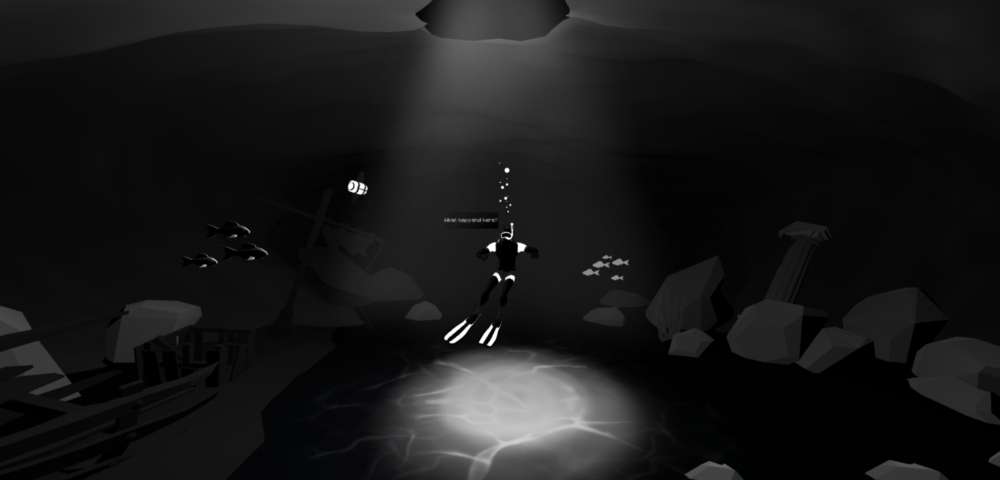
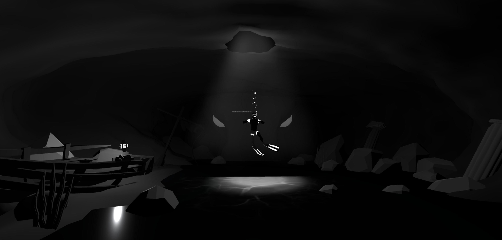
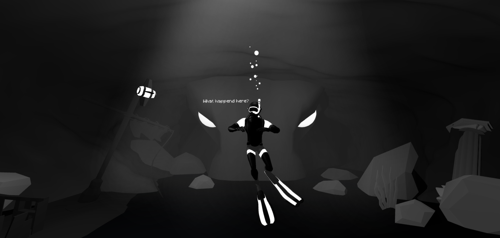

# Creative Coding I

Prof. Dr. Lena Gieseke \| l.gieseke@filmuniversitaet.de  \| Film University Babelsberg KONRAD WOLF
  

# Session 08 - Systems

Our last topic is *systems*. We are done with the class and hopefully from here on you have enough coding competencies and algorithmic thinking developed that you can build more complex systems - by using code, nodes, hardware... Also, hopefully you, yourself, can further evolve with what you have learned from this class (🐛 -> 🦋). 

## Task 08.01 - The Final Project 

The final project is an individually chosen project. 
  
*Maybe something useless?* 😁  
  
You can do whatever you want but your project must make use of text-based programming. It can also be an experiment, part of a larger project, work in progress, or a learning path. Ideally it should be something online, but this is not a hard requirement. You don't need to submit a project plan beforehand. However, it might help to discuss your plan with me in advance.  

The time dedicated to the final project is ~24h.

The official work period for the final assignment is Jan. 16th - Feb. 29th. The deadline for the final project is February, 29th.

* The deadline for the final project is strict and for a late submission, I reduce **15% of the total points**.
* If you are sick within the official work period, you can get a deadline extension based on a doctor's note ("Attest").

As submission, I require

* a description
* the source code
* a link to the build / online deployment or such, and
* at least one representative image.
 
Submit your code in your assignment folder as assignment `08` or add a link there to where to find the code.

### Final Project - Description:

"Underwater" is a small prototype for a thriller/ horror story about a cave diver who tries to solve a mystery in a dark cave. However, there is something evil in these caves, which is why the diver must not venture too far and therefore lets his little robot companion explore the area. But he shouldn't stay too long or the kraken will find him!

As already mentioned, this project is intended to be a prototype for a concept which (should someone fancy it later) could be turned into a larger project. For example in a kind of "Scroll Story"
The style of this concept is inspired by games like "Abzu" and "Limbo". This actually resulted in the look of my prototype. The noir style is intended to emphasise the dark and threatening atmosphere of the setting.

For me, it was particularly important with this concept to convey the right atmosphere and try out a few basic functions. In a more advanced version, you could possibly interact with individual interesting objects or even control the diver himself instead of just shining through the cave with the robot. Though I really like this exploration vibe!

Although there were a few starting difficulties, I had a lot of fun working on this concept. I'm especially happy to finally be able to integrate an FBX animation into my scene, which I wasn't able to do before with the other exercises. I had problems with creating volumetric lights in my scene, which forced me to rethink, but then I found a suitable alternative by inserting the godrays as transparent PNGs (which I had never done before) into the scene, which created another cool effect and significantly improved the atmosphere. The event timers for the animation of the fish and kraken were also something new for me. Although the scene probably works best from a single camera perspective, the orbital camera also has a certain charm.

But otherwise I'm happy with the project.

There were still a few problems that I wasn't able to solve in time:

- better control of the robot with the mouse (maybe 360 degrees)

- interactive rotation of the diver (it worked for a model hidden in the code, but not for the one with the FBX animation)

- Implementation of volumetric lights

- online deployment

Link to source code and project folder (just in case): https://drive.google.com/drive/folders/1mDW3UWZRrk7vsYsyEa93RB91YzVDwNG1?usp=sharing
### Sources:

I modelled many things myself or altered models that i got from these sources:

* https://sketchfab.com/3d-models/nanando-diver-underwater-0073b3e5348640fbbaf73278726400fb

* https://sketchfab.com/3d-models/diver-9ee9b8b722ed457da424869cd8d08b1a

* https://sketchfab.com/3d-models/octopus-rigged-0b19839c8d4b49c39f3f3fb6a4380803

* https://sketchfab.com/3d-models/shipwreck-low-poly-dc14bf79a89042b097f04ab83102e856#download

* https://sketchfab.com/3d-models/greek-underwater-column-5-d6d71552d2cc4a17aa2d2f5fc1e49dca#download

## Task 08.02 - Feedback

* How would you rate the difficulty of this lecture from 1 (far too easy) to 5 (far too difficult)? -- *"4"*
* How would you rate the amount of work you had to put into this lecture so far from 1 (no work at all) to 5 (far too much work)? -- *"4"*
* How much did you enjoy working with p5 from 1 (hate it) to 5 (love it)? -- *"3"*
* How useful do you consider p5 for you from 1 (don't need it) to 5 (will use it all the time)? -- *"2"*
* How much did you enjoy working with tree.js from 1 (hate it) to 5 (love it)? -- *"4"*
* How useful do you consider tree.js for you from 1 (don't need it) to 5 (will use it all the time)? --*"4"*
* What do you think about the context expansions, e.g., the brief general discussions of certain topics? -- *I liked them!*
* Which one was your favorite topic, which one your least favorite? -- *I think my favorite topic was "space", my least one was maybe "asynchronism"? Simply because I was overwhelmed at first*
* Was there a topic missing and if so which one? -- *I don't know if its really missing, but I would have liked maybe a brief look at interactive elements, such as handtracking and using the microphone, in three.js. Of course that knowledge is available online and we can look it up ourselves, but I think it would have been nice to a have an implementation of it in a task (just like with p5)*
* Please feel free to add any feedback you want to give!-- *It really was an interesting lecture. Even though I'm still a complete beginner in terms of coding, I feel like I learned quite a lot this past semester!*

## Task 08.03 - Learnings

Please summarize your personal learnings **in regard to the whole course** (text or bullet points - whatever you prefer). What was challenging for you in this session? How did you challenge yourself?

* basically starting to learn JavaScript as a compeletly beginner
* worked for the first time on projects with code, working for the first time with p5js and three.js
* especially working with three.js was really fun, because as a 3D Designer I was always interest in implementing 3D model on websites for example
* sometimes the workload was quite a lot for me and it was hard to not get left behind, because sometimes I need a bit more time to understand a new topic or something, especially when it feels a bit overwhelming at first. But I think I got better with that!
* I feel like I finally got a chance to look behind the curtain of the "magic" of code and starting to understand it (even though with small step-by-steps)
* even though it was quite a lot, I feel like I leveled up my skills and looking forward to future projects! 
  

Bye-bye  

---

Answer all questions directly in a copy of this file and also link and display your images in that file. Submit your copy as `cc1_ws2324_XX_lastname.md` in your assignments folder.

---

**Happy Evolving!**

