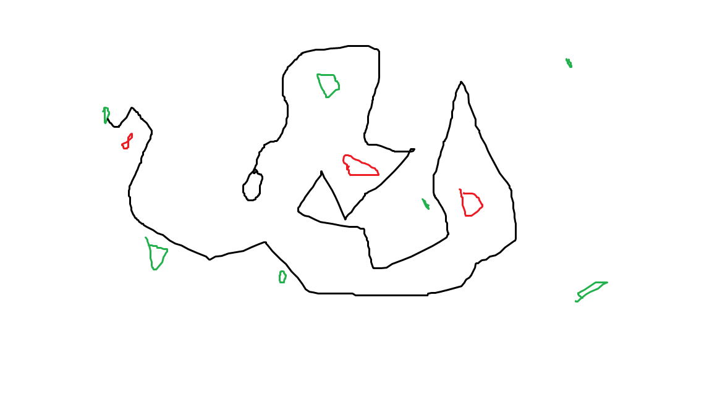

# Creative Coding I

Prof. Dr. Lena Gieseke \| l.gieseke@filmuniversitaet.de  \| Film University Babelsberg KONRAD WOLF
  
05.11.2023

# Session 02 - Emergence (10 points)

Please complete this session by November 7th. Completing the session should take < 4h.  

In this session we are going to think about the topic of *emergence* and what it means to create an aesthetic output with code. In terms of tech this session is all about getting into coding and doing a practical exercise with p5.

- [Creative Coding I](#creative-coding-i)
- [Session 02 - Emergence (10 points)](#session-02---emergence-10-points)
  - [JavaScript](#javascript)
  - [p5](#p5)
    - [Task 02.01 -  Motivation](#task-0201----motivation)
    - [Answer](#answer)
    - [Task 02.02 - *p5 With The Online Editor*](#task-0202---p5-with-the-online-editor)
    - [Task 02.03 - The 10 PRINT pattern](#task-0203---the-10-print-pattern)
    - [Answer](#answer-1)
  - [Emergence](#emergence)
    - [Task 02.04 - Conceptualization](#task-0204---conceptualization)
    - [Answer](#answer-2)
  - [Learnings](#learnings)
    - [Answer](#answer-3)

## JavaScript

In this lecture, we are going to work with JavaScript. JavaScript is as language quite easy. It only becomes complicated in the context of web development. For now, we don't care about web development specifics.

As of now, you should have a working understanding of variables and basic program structures such as if, loops and functions in JavaScript. You do not need to memorize the theory of any of these topics, all I care about is that you know how to use them in the coding exercise.

As a reference there is [Script 04 - Javascript]()(*TO BE UPLOADED*). This script gets for certain topics quite into detail and it is meant as interesting reference for all, beginners to experts. I will later add to the scripts with further topics.

If you are a beginner you might want to look into these basics:

* [JavaScript.info: Variables](https://javascript.info/variables)
* [JavaScript.info: if](https://javascript.info/ifelse)
* [JavaScript.info: loops](https://javascript.info/while-for)

Or you can use any resources you like. 

## p5

If you are a beginner you can find detailed information in the scripts of my [*Creative Coding for Beginners Course*](https://ctechfilmuniversity.github.io/lecture_ss23_creative_coding_for_beginners/02_scripts/).

### Task 02.01 -  Motivation

Find two p5 sketches that you like from two different sources, e.g., on [p5 examples](https://p5js.org/examples/) (btw., you can also directly access the examples in the online editor under `File -> Examples`), [OpenProcessing](https://www.openprocessing.org/), [Generative Design](http://www.generative-gestaltung.de/2/). 
  
Submit the links and a brief explanation for each why you like the sketch.

### Answer

[Link1:](https://p5js.org/examples/simulate-particles.html)
Classic Plexus Style Particle System, i just like the aesthetics of points flowing through space and connecting each other with a line when close enough. 

[Link2:](https://github.com/stihilus/Generated-p5js-Portraits/tree/master)
Really Interesting Patterns emerging from Image Data / Structure. 

### Task 02.02 - *p5 With The Online Editor*

Create a account for the [p5 online editor](https://editor.p5js.org/) and work with the online editor (we will move on from this environment soon though).  
  
*Tipp*: Right click on the canvas in the p5 editor and chose `Save image as...` to save an image of your canvas.

### Task 02.03 - The 10 PRINT pattern

1. Write a p5 sketch that generates a pattern with a similar logic as the 10 PRINT example. Your pattern should follow an element-by-element and row-by-row iterative creation process. If you are a beginner, you can use [the code from the slides](https://editor.p5js.org/legie/sketches/nrfQTzxMI) as basis (fully understand it first though!). The overall goal is to create a visual pleasing or interesting pattern. 
2. Make the pattern interactive by mapping at least two changeable visual characteristics to the mouse and / or keys and / or any type of user interaction you want. Look at p5's references for the different interaction possibilities.

<!-- TODO: You can find information about p5's basic interaction capabilities in [Script 05 - p5](../../02_scripts/cc1_ws2324_05_p5_script.md#basic-interaction) -->

If you have further ideas about how to design the pattern and interactions but do not manage to implement them, also submit your ideas in text or image form.

Submit the sketch file as `cc1_ws2324_02_04_lastname.js` and at least one png preview image of your pattern as `cc1_ws2324_02_04_lastname_01.png` in your assignments folder `lastname/02`. Also link the image in your questions file.

### Answer

[-> Sketch File](main/sketch.js)

### 1.

### 2.

## Emergence

### Task 02.04 - Conceptualization

Come up with an idea for a creation that includes emergent behavior, where the sum of its parts creates the overall piece. This can be a visual concept, e.g., once more a repetitive visual pattern, but doesn't have to. You can go beyond visual pattern and you could also consider music, language, performance, social scenarios, etc..

Submit a short description and ideally, if possible, a preview image (this can be drawn by hand).

### Answer

A User entering a website. The IP is read and passed to the javascript. The IP is represented as set of numbers. These build the DNA for a entity that gets spawned shortly after user entered website. The visual appeareance (size, strokeWeight, Colors) get their value from the DNA (so from the ip), same goes for attributes that determine the behaviour of the entity (Speed, Agility, Life Expectancy). User can give it a name and watch it "grow" / develop through navigating through the environment and gathering food. It paints a path by doing so which creates final, individual pattern. The longer it lives, the more complex the pattern will be. So the complexity of the final pattern is partly determined by the users ip adress with which he/she is entering the website.  

- Food = Green
- Danger = Red
- Entity = Black

## Learnings

Please summarize your personal learnings (text or bullet points - whatever you prefer). What was challenging for you in this session? How did you challenge yourself?

I got back to an old p5.js project of mine and reimplemented a particle class from that one. (took over some functions, looked up the general class syntax in p5) Ground structure is new tho and the whole sketch.js is newly written code too. I looked into some ml5.js examples and took over the code for face & body landmark detection model and used the spatial positions of the nose as point to connect the particles to (via lines). I tried to colorize the particles from the image colors, did that with img.get(). Kind of worked, but overall extremly slowing down the sketch so it happens only on mouseclick now and also it samples color from an image in the asset folder instead of the webcam stream because their was weird issues when is sampled the webcam(frozen webstream afterwards). Next step propably to take a look into loadPixel() / Pixel functions to do stuff like that in a fast way.

### Answer

Learnings:
- got somewhat comfortable with basic p5js funtions
- nesting for-loops and if/else
- geometry manipulation with push & pop
- modulus integration

Challenges:
- going through about two hours of the "coding train p5js training"
- designing a logic where a random decision for each individual element is made once while keeping loop in draw

---

Answer all questions directly in a copy of this file and also link and display your images in that file. Submit your copy as `cc1_ws2324_XX_lastname.md` in your assignments folder.

---

**Happy Emerging!**
