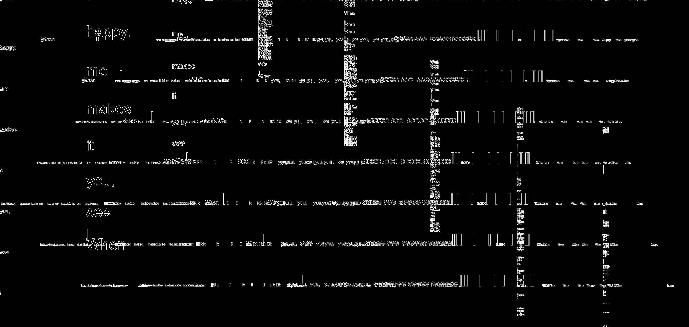
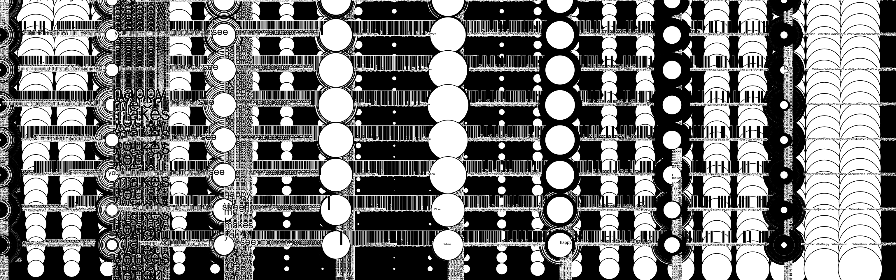
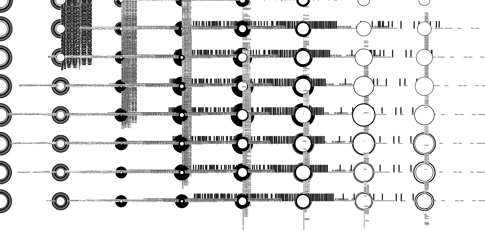

# Creative Coding I

Prof. Dr. Lena Gieseke \| l.gieseke@filmuniversitaet.de  \| Film University Babelsberg KONRAD WOLF
  

# Session 03 - Instructions (10 points)

Please complete this session by November 14th. Completing the session should take < 4h.  

In this session we are going to think about the topic of *instructions* and what the different forms in which instructions can be given. In terms of tech this session is about continuing programming with p5 and getting some coding done!

* [Creative Coding I](#creative-coding-i)
* [Session 03 - Instructions (10 points)](#session-03---instructions-10-points)
    * [Instructions](#instructions)
        * [Task 03.01 - *Coding*](#task-0301---coding)
        * [Task 03.02 - *Coding*](#task-0302---coding)
        * [Task 03.03 - *Creative Instructions*](#task-0303---creative-instructions)
    * [Learnings](#learnings)

## Instructions

Submit a text-based program and its result for each of the following instruction. Submit a link to your sketch and add or link results in your submission file.
  
*Note*: If you are using the p5 online editor, also submit your source code.

### Task 03.01 - *Coding*

> Circles!

### Answer

[-> Sketch File](main/sketch.js)

### 1.

### Task 03.02 - *Coding*

> When I see you, it makes me happy.

<!-- 
Seeing you makes me happy.
It makes me happy to see you.
Seeing you is happiness.
 -->

 ### Answer

[-> Sketch File](main/sketch.js)

### 1.
 
 
 

### Task 03.03 - *Creative Instructions*

Write instructions that are in themselves a creative output.

1. Look Around
2. Choose an Object that looks interesting regarding its shape.
3. Choose another Object thats intersting regarding its color. 
4. Choose another Object thats interesting regarding its materiality.
5. Choose another object that interesting regarding its surface texture / bumps.
6. Combine them into one imaginary object and describe it. 

- I'm in CTech Room 6119. A Pipe connector shape, with flashy, green color, a cotton material and a surface texture like woodchip wallpaper is the imaginary object i came up with.

## Learnings

Please summarize your personal learnings (text or bullet points - whatever you prefer). What was challenging for you in this session? How did you challenge yourself?

- Task 03.02. come up with creative use of text was challenging
---

Answer all questions directly in a copy of this file and also link and display your images in that file. Submit your copy as `cc1_ws2324_XX_lastname.md` in your assignments folder.

---

**Happy Instructing!**
