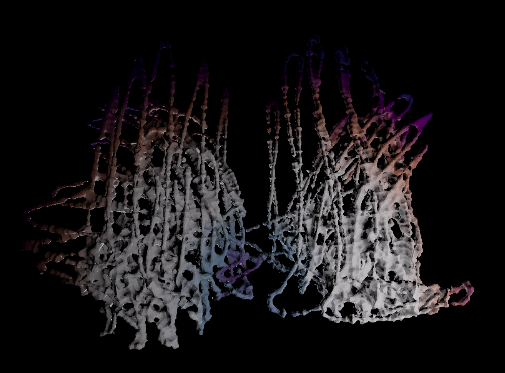

# Creative Coding I

Prof. Dr. Lena Gieseke \| l.gieseke@filmuniversitaet.de  \| Film University Babelsberg KONRAD WOLF
  

# Session 06 - Space

Please complete this session by Dec. 5. Completing the session should take < 8h (4h CC1 + 4h TABG). Your results will be discussed in TBAG on Dec. 6.

* [Creative Coding I](#creative-coding-i)
* [Session 06 - Space](#session-06---space)
    * [⭐️ BREAKING NEWS ⭐️](#️-breaking-news-️)
    * [three.js](#threejs)
        * [Task 06.01 - Your First Scene](#task-0601---your-first-scene)
            * [How to translate the above concepts and aesthetics into 3D space?](#how-to-translate-the-above-concepts-and-aesthetics-into-3d-space)
    * [Learnings](#learnings)

## ⭐️ BREAKING NEWS ⭐️ 
For now, the coding tasks will be the same for CC1 and TBAG. Meaning, you only have to work on one practical exercise for both classes. You do not need to separate parts for each class but can submit one coherent project for both classes. If you enjoyed working in teams for the last session, you can also do these tasks in teams. But then, of course, the outcome has to be larger.

Please note that there might be additional tasks for each class individually.

---

In this session we are dealing with the topic of _space_ and what types of virtual spaces we are working with. In terms of tech, this session introduces you to the JavaScript library [`Threejs`](https://threejs.org/), which is a good choice if you want to build 3D scenes in a browser.

## three.js

### Task 06.01 - Your First Scene

*This is the task that will count for both, CC1 and TBAG.*

Build a three dimensional, geometric scene. With geometric we mean that the scene should focus on abstract geometry. You could (but don't have to) find inspiration in the following art work.

  
[[Composition A, Piet Mondriaan, 1923]](https://www.wikiart.org/de/piet-mondrian/composition-a-1923) 

  
[[Several Circles, Wassily Kandinsky, 1926]](https://en.wikipedia.org/wiki/File:Vassily_Kandinsky,_1926_-_Several_Circles,_Gugg_0910_25.jpg)

  
[[Hadia geometria 36 – Alphabet 1, Mária Balážová, 1956]](https://www.1stdibs.com/art/prints-works-on-paper/abstract-prints-works-on-paper/yaacov-agam-thanksgiving/id-a_13123922/) 

  
[[ Drawing #220, Zanis Waldheims, 1969]](https://post.moma.org/zanis-waldheims/) 

  
[[Thanksgiving, Yaacov Agam, 1980]](https://www.1stdibs.com/art/prints-works-on-paper/abstract-prints-works-on-paper/yaacov-agam-thanksgiving/id-a_13123922/) 

  
[[Wall Drawing #564, Sol LeWitt, 1988]](https://www.nytimes.com/2013/09/06/arts/design/sol-lewitt.html) 

 

#### How to translate the above concepts and aesthetics into 3D space?

 

  
[[The Moving Moment When I Went To The Universe, Yayoi Kusama, 2018]](https://ocula.com/art-galleries/victoria-miro-gallery/exhibitions/yayoi-kusama/)  

---

For this task there is no need to go beyond the three.js basic elements that we have discussed in class. The scene should be navigable with (e.g., a simple orbit control but feel free to do something different) but other than that the scene should not include any interactions.
  
The result should be polished and will be graded on concept, form / design and implementation quality.

Submit your JavaScript file and add or link result images in your submission file.

## Learnings

Please summarize your personal learnings (text or bullet points - whatever you prefer). What was challenging for you in this session? How did you challenge yourself?

---
First i looked into the syntax of the basic setup (scene, light, cam, mesh, materials), then i tried around with the materials and lights, following by looking into how to import 3d object & textures. I then imported a 3D model from my handtracking ti project (you may still se the movement paths of the 2 hands that were the base element of creating the 3d structure) from houdini as obj, baked the ambient occlusion & vertex color into textures and imported and applied everythign in three.js. As the orignal model had around 1.8 million points/prims, i created 2 low poly version for trying out and ended up with a version thats polycount is reduced to 10% of the orignal mesh, which worked really good/fast.

Next thing i wanted to try out with the three,js materials was the displacement function, i created some hi-res grid in threejs & imported some physarum texture (which I made at Josef Pelz GLSL TouchDesigner Workshop), looked cool, so i wanted to try to have the displacement texture animated. I exported some short clip from td, rearranged it in davinci so its seamless loop (cheap back&forth loop) and imported in the html with a tag "video" so that i could getElementById within the javascript & then was pretty straightforward to apply the videotexture as maps in the material.

Most challenging was the beginning (getting into the syntax of setting up scene in three.js). In the ende of this session i was able to make things work quite fast / i foudn the things i was searching for in the documentation much faster and was able to implement them faster aswell, so i got the feeling i learned a lot in this session. 

Answer all questions directly in a copy of this file and also link and display your images in that file. Submit your copy as `cc1_ws2324_XX_lastname.md` in your assignments folder.

---

**Happy Three Dimensioning!**
