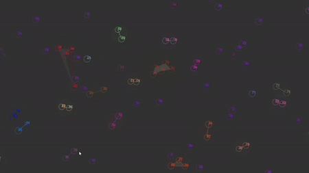
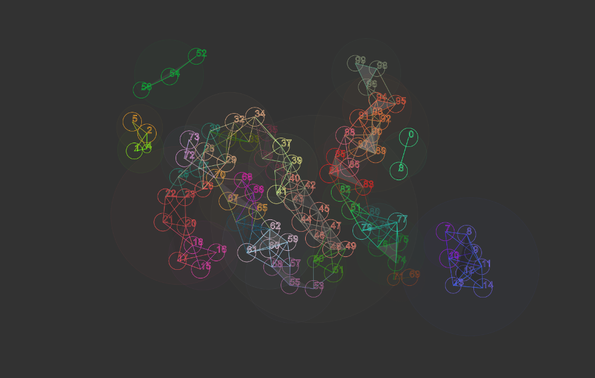
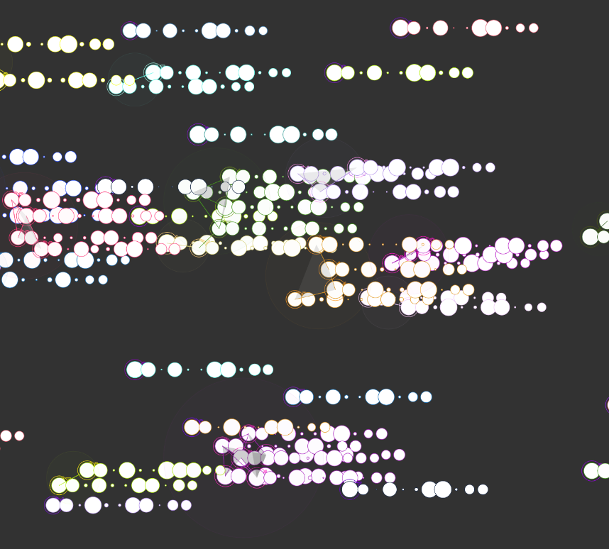

# Creative Coding I

Prof. Dr. Lena Gieseke \| l.gieseke@filmuniversitaet.de  \| Film University Babelsberg KONRAD WOLF
  

# Session 08 - Systems

Our last topic is *systems*. We are done with the class and hopefully from here on you have enough coding competencies and algorithmic thinking developed that you can build more complex systems - by using code, nodes, hardware... Also, hopefully you, yourself, can further evolve with what you have learned from this class (🐛 -> 🦋). 

## Task 08.01 - The Final Project 

The final project is an individually chosen project. 
  
*Maybe something useless?* 😁  
  
You can do whatever you want but your project must make use of text-based programming. It can also be an experiment, part of a larger project, work in progress, or a learning path. Ideally it should be something online, but this is not a hard requirement. You don't need to submit a project plan beforehand. However, it might help to discuss your plan with me in advance.  

The time dedicated to the final project is ~24h.

The official work period for the final assignment is Jan. 16th - Feb. 29th. The deadline for the final project is February, 29th.

* The deadline for the final project is strict and for a late submission, I reduce **15% of the total points**.
* If you are sick within the official work period, you can get a deadline extension based on a doctor's note ("Attest").

As submission, I require

* a description
* the source code
* a link to the build / online deployment or such, and
* at least one representative image.

Submit your code in your assignment folder as assignment `08` or add a link there to where to find the code.

### Description: 

#### "The social life of the Numbers 0 to 100"

This project is a particle/blob simulation in P5.js. The idea is that, when visiting this as a website the viewer enters a initial value to the simulation which sets the initial values of the particles attributes. I thought, the IP Address could be an interesting information input. So its about seeing what emerges from your IP Address in form of 100 number blobs that build relations & structures through their movement. 

The attributes of each Particle like Size or Maximum Speed, derive from an array in the DNA Object called "Genes". Each Particle has an own DNA Object. The individual genes can be viewed by clicking the left mouse button. 

The IP Adress is passing it's numbers as the base values to each of the DNAs, there is a little random offset and a mutation rate. So each particles DNA is unique but all derive from the "mother" number, the IP Address. 

Each Particle is represented by a blob and a unique number. The rules of the simulation are as follows:

Numbers that are close to each other (eg. 3 and 5 or 50 and 51) are attracted to each other, but only when they are also physically close enough. When two Numbers meet that way they might create a group together.

Numbers that float through space still alone are happy to join an existing group if one of the members is close enough to him. However in most simulations there are still a few numbers left that haven't been able to join a group. Once a number joined the group its behaviour is changing slightly. It's not  any more only driven by the attraction towards close numbers, but also by the "will of the group", some random point around the center which got chosen when the group was formed & also towards the center of the group.

But the group itself is just a construct, not a physical property, the force towards the groups target position is only executed by its single members forces. The group is represented by a circle, thats gets its position from the centroid point of its members positions, so it really has no internal movement for itself. The radius of the circle is detemrined by amount of members it has.

Strictly speaking, a blob can only be member of 1 group, however if two numbers meet that are close to each other but both already have a differing group, they still got the attraction force to each other. Through single digits that function as "Bindeglied" multiple groups create connection to each other aswell. Therefore the movement influences of the differing groups also mix up together so that each individuals movement is also influenced by the movement of another groups member that is far away. Thorugh that behaviour interesting structures emerge after some minutes.

### Web Version:

https://vivacious-flaxen-donkey.glitch.me/

### Future Ideas

* Lifecycle

* The Will of the Individual, Individual Targets
 
* Reproduction, Passing of Genes -> Evolving of Group Structure over Generations

* Multi Group Membership

* Survival ? Food ? 

## Task 08.02 - Feedback

* How would you rate the difficulty of this lecture from 1 (far too easy) to 5 (far too difficult)? --- 3
* How would you rate the amount of work you had to put into this lecture so far from 1 (no work at all) to 5 (far too much work)? --- 4
* How much did you enjoy working with p5 from 1 (hate it) to 5 (love it)? --- 5
* How useful do you consider p5 for you from 1 (don't need it) to 5 (will use it all the time)? --- 3
* How much did you enjoy working with tree.js from 1 (hate it) to 5 (love it)? --- 3
* How useful do you consider tree.js for you from 1 (don't need it) to 5 (will use it all the time)? --- 2
* What do you think about the context expansions, e.g., the brief general discussions of certain topics? --- 
* Which one was your favorite topic, which one your least favorite? --- My favorite topic was Space. The least favorite was Asnychronism. 
* Was there a topic missing and if so which one? --- No, was really complete imo
* Please feel free to add any feedback you want to give! --- 

## Task 08.03 - Learnings

Please summarize your personal learnings **in regard to the whole course** (text or bullet points - whatever you prefer). What was challenging for you in this session? How did you challenge yourself?

Coming with some background in creative coding, i think a knew some of the basics of programming already but nevertheless i feel like I have learned a lot in this course. In depth knowledge about javascript, but Also my knowledge of the web & general programming understanding + problem solving increased significantly in this course. 

Thank you! 

---

Answer all questions directly in a copy of this file and also link and display your images in that file. Submit your copy as `cc1_ws2324_XX_lastname.md` in your assignments folder.

---

**Happy Evolving!**