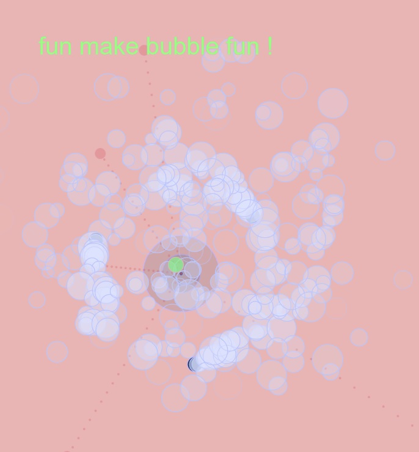

# Creative Coding I

Prof. Dr. Lena Gieseke \| l.gieseke@filmuniversitaet.de  \| Film University Babelsberg KONRAD WOLF
  

# Session 03 - Instructions (10 points)

Please complete this session by November 14th. Completing the session should take < 4h.  

In this session we are going to think about the topic of *instructions* and what the different forms in which instructions can be given. In terms of tech this session is about continuing programming with p5 and getting some coding done!

- [Creative Coding I](#creative-coding-i)
- [Session 03 - Instructions (10 points)](#session-03---instructions-10-points)
  - [Instructions](#instructions)
    - [Task 03.01 - *Coding*](#task-0301---coding)
    - [Task 03.02 - *Coding*](#task-0302---coding)
    - [Task 03.03 - *Creative Instructions*](#task-0303---creative-instructions)
  - [Learnings](#learnings)
      - [Answer:](#answer)

## Instructions

Submit a text-based program and its result for each of the following instruction. Submit a link to you sketch and add or link results in your submission file.
  
*Note*: If you are using the p5 online editor, also submit your source code.

### Task 03.01 - *Coding*

> Circles!

### Task 03.02 - *Coding*

> When I see you, it makes me happy.

<!-- 
Seeing you makes me happy.
It makes me happy to see you.
Seeing you is happiness.
 -->

### Task 03.03 - *Creative Instructions*

Write instructions that are in themselves a creative output.

#### Answer:

For all three tasks I created one [-> sketch](https://editor.p5js.org/adamtgarde/full/oI-LQYeqU).

This is how it might look like:

## Learnings

Please summarize your personal learnings (text or bullet points - whatever you prefer). What was challenging for you in this session? How did you challenge yourself?

#### Answer:

Learnings:
- bounce on screen walls by inverting speed (I suspect we might talk about this in our next class)
- calculating middle between points with basic vector math
- smoothing movement through lerp function
- circular movement with sin and cos angle (+offset)
- syntactic sugar through arrays in for loops
- particle system classes
- preloading sound

Challenges:
- syntax (implementation of all the above brought errors at first)
- approx. 3 hours of coding train p5js lessons
- this is by far the most complex code I've ever written

---

Answer all questions directly in a copy of this file and also link and display your images in that file. Submit your copy as `cc1_ws2324_XX_lastname.md` in your assignments folder.

---

**Happy Instructing!**
