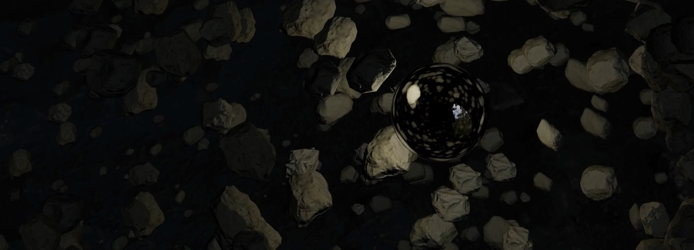
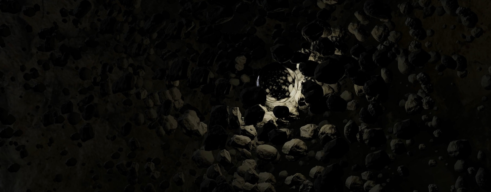

# Creative Coding I

Prof. Dr. Lena Gieseke \| l.gieseke@filmuniversitaet.de  \| Film University Babelsberg KONRAD WOLF
  

# Session 08 - Systems

Our last topic is *systems*. We are done with the class and hopefully from here on you have enough coding competencies and algorithmic thinking developed that you can build more complex systems - by using code, nodes, hardware... Also, hopefully you, yourself, can further evolve with what you have learned from this class (🐛 -> 🦋). 

## Task 08.01 - The Final Project 

The final project is an individually chosen project. 
  
*Maybe something useless?* 😁  
  
You can do whatever you want but your project must make use of text-based programming. It can also be an experiment, part of a larger project, work in progress, or a learning path. Ideally it should be something online, but this is not a hard requirement. You don't need to submit a project plan beforehand. However, it might help to discuss your plan with me in advance.  

The time dedicated to the final project is ~24h.

The official work period for the final assignment is Jan. 16th - Feb. 29th. The deadline for the final project is February, 29th.

* The deadline for the final project is strict and for a late submission, I reduce **15% of the total points**.
* If you are sick within the official work period, you can get a deadline extension based on a doctor's note ("Attest").

As submission, I require

* a description
* the source code
* a link to the build / online deployment or such, and
* at least one representative image.
 
Submit your code in your assignment folder as assignment `08` or add a link there to where to find the code.

### Final Project - Description:

The Dark Side of Rock and Roll

In this project, I explore many, many things through the creation of a dynamic three js scene. Will tell about some down here. In the set of a dark cave a shiny glass sphere follows the rhythm and character of a dramatic and percussive experimental music track. Sound and motion are synchronized through differt volumetric fields of influence. Within certain spectrums of frequency non-trivial systems are pushing and pulling floating rocks around and create on louder sounds captivating impulses.

This well-polished project is also my final submission for TBAG. The TBAG part of my evaluation is limited to how I process and decode the audio to have them work as well-managable imputs to drive the visual systems of the code. This I documented in my TBAG hand in. Every other part (except the audio track) of the three js scene I made belongs to CC1. 😄 

I'll be quick!
My original plan was to make everythin as performant as possible. I know!!! Led by the soundscape of my TBAG audio track I thought of visually ratteling through floating rocks and started to bake Megascan rocks into low poly models (with nice normals of course) BUT after I exported the super performant .gltf files from Blender I couldn't get the mesh to shade smooth in any three js material or render setting. - Turned out that this is a bug on Blenders side. Well, now I know the three js materials veeeeery well. 😅

I was mostly challenged getting the audio play back work through on the vite server (there it respects the chrome audio autoplay regulations). This forced me to add that play button at the beginning and smoothly led me into higher-order-refactoring. 🙌

The project does not include any other interaction but my hunger for a very polished project made me combine CC1 and TBAG. Slightly altering it for more interactive inputs seemed unneccessary to me.

I learned a lot bending my mind to get my vision into math, refactoring my whole code, cleaning it up and even adding some syntactic sugar. I now have multiple arrow functions and even got a ternery operator. ✨

The source code / npm build is here in the source folder.

### Sources:

[LookAt Three Example](https://threejs.org/examples/misc_lookat.html) as a starting point

[Microsoft Copilot](https://copilot.microsoft.com/) for help in debugging

[Megascan Rocks](https://quixel.com/megascans/home?search=rock)

[Cave HDRI](https://polyhaven.com/a/small_cave)

[Cubemap Generator](https://matheowis.github.io/HDRI-to-CubeMap/) to convert the HDRI

1000 times the [Three Documentation](https://threejs.org/docs/)

## Task 08.02 - Feedback

* How would you rate the difficulty of this lecture from 1 (far too easy) to 5 (far too difficult)? -- *"4"*
* How would you rate the amount of work you had to put into this lecture so far from 1 (no work at all) to 5 (far too much work)? -- *"4"*
* How much did you enjoy working with p5 from 1 (hate it) to 5 (love it)? -- *"3"*
* How useful do you consider p5 for you from 1 (don't need it) to 5 (will use it all the time)? -- *"2"*
* How much did you enjoy working with tree.js from 1 (hate it) to 5 (love it)? -- *"4"*
* How useful do you consider tree.js for you from 1 (don't need it) to 5 (will use it all the time)? --*"4"*
* What do you think about the context expansions, e.g., the brief general discussions of certain topics? -- *I liked them!*
* Which one was your favorite topic, which one your least favorite? -- *I think my favorite topic was "space", my least one was maybe "asynchronism"? Simply because I was overwhelmed at first*
* Was there a topic missing and if so which one? -- *I don't know if its really missing, but I would have liked maybe a brief look at interactive elements, such as handtracking and using the microphone, in three.js. Of course that knowledge is available online and we can look it up ourselves, but I think it would have been nice to a have an implementation of it in a task (just like with p5)*
* Please feel free to add any feedback you want to give!-- *It really was an interesting lecture. Even though I'm still a complete beginner in terms of coding, I feel like I learned quite a lot this past semester!*

## Task 08.03 - Learnings

Please summarize your personal learnings **in regard to the whole course** (text or bullet points - whatever you prefer). What was challenging for you in this session? How did you challenge yourself?

* basically starting to learn JavaScript as a compeletly beginner
* worked for the first time on projects with code, working for the first time with p5js and three.js
* especially working with three.js was really fun, because as a 3D Designer I was always interest in implementing 3D model on websites for example
* sometimes the workload was quite a lot for me and it was hard to not get left behind, because sometimes I need a bit more time to understand a new topic or something, especially when it feels a bit overwhelming at first. But I think I got better with that!
* I feel like I finally got a chance to look behind the curtain of the "magic" of code and starting to understand it (even though with small step-by-steps)
* even though it was quite a lot, I feel like I leveled up my skills and looking forward to future projects! 
  

Bye-bye  

---

Answer all questions directly in a copy of this file and also link and display your images in that file. Submit your copy as `cc1_ws2324_XX_lastname.md` in your assignments folder.

---

**Happy Evolving!**

